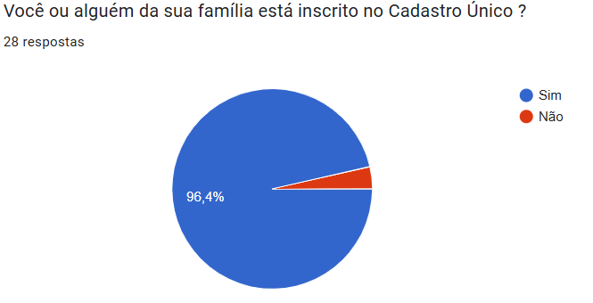

# Perfil de Usuário

## Introdução

Este artefato tem por fim traçar um **perfil de usuário**, com o objetivo de compreender as características e necessidades dos indivíduos para os quais o sistema está sendo projetado. Segundo **Barbosa e Silva** (2021), o perfil de usuário é construído a partir de dados como cargo, função, faixa etária e nível de instrução, com a finalidade de agrupar usuários com características semelhantes. Além disso, **Hackos e Redish** (1998) destacam que o perfil inclui informações sobre a relação do usuário com a tecnologia e o conhecimento sobre as tarefas a serem realizadas, facilitando a criação de sistemas mais eficientes e alinhados às necessidades reais dos usuários.

## Metodologia

A construção do perfil de usuário foi realizada com base em dois métodos principais: o [questionário](./tecnicas/questionario.md) e as [entrevistas](./entrevista.md). Ambos os métodos contribuíram para a definição das características dos usuários e ajudam a garantir que o sistema seja projetado de acordo com suas necessidades, sendo as entrevistas uma forma de validar os dados obtidos no questionário e aprofundar os conhecimentos qualitativos.

## Questionário
O questionário realizado obteve o total de 40 respostas. Com isso, todas as informações obtidas a partir desta técnica tiveram **autorização dos usuários no que se refere a coleta** das mesmas, como mostra a Figura 1, e seus devidos gráficos com as respostas relevantes para o artefato estão presentes nas Figuras 2 a 10.

<b>Figura 1:</b> Consentimento do Usuário
 

 Autor(a): <a href="https://github.com/JuliaGabP" target = "_blank">Julia Gabriela</a></h6>

--- 
De acordo com a Figura 2, ficaram claras aspectos relacionados ao gênero, em que 60.7% dos usuários são mulheres, formando sua maioria, e os 39% restantes são do gênero masculino ou neutro.

<b>Figura 2:</b> Pergunta 1
 
 

 Autor(a): <a href="https://github.com/JuliaGabP" target = "_blank">Julia Gabriela</a></h6>

---

Na Figura 3, os resultados em relação a faixa etária dos usuários demonstraram que 60.7% possui entre 20 e 30 anos, destacando que a maior parte tem a idade entre 20 e 25 anos. Sua minoria foi composta por pessoas entre 30 e 40 anos ou mais.

<b>Figura 3:</b> Pergunta 2
 

 Autor(a): <a href="https://github.com/JuliaGabP" target = "_blank">Julia Gabriela</a></h6>

---
A Figura 4 demonstra o nível de escolaridade dos que utilizam o aplicativo. De acordo com o gráfico, 32.1% estão possui o Ensino Superior Incompleto, 32.1% com o Ensino Médio Incompleto, 25% possui apenas o Ensino Médio completo, evidenciando uma divergência não tão grande entre os usuários neste aspecto. O restante é composto por pessoas com o Ensino Superior completo.

<b>Figura 4:</b> Pergunta 3
 

 Autor(a): <a href="https://github.com/JuliaGabP" target = "_blank">Julia Gabriela</a></h6>

---

De acordo com o gráfico da Figura 5, foi possível identificar que 78.6% moram no Distrito Federal e 21.4% moram no Goiás.

<b>Figura 5:</b> Pergunta 4
 
  

 Autor(a): <a href="https://github.com/JuliaGabP" target = "_blank">Julia Gabriela</a></h6>

--- 
Entre os usuários, percebe-se, pelo gráfico da Figura 6, que 60.7% dos usuários possuem entre 3 a 4 pessoas morando em sua residência e 14.3% possuem 5 indivíduos. Os 25% faltantes, possuem 1, 5 ou mais.

<b>Figura 6:</b> Pergunta 5
 

 Autor(a): <a href="https://github.com/JuliaGabP" target = "_blank">Julia Gabriela</a></h6>

---
No que se refere ao gráfico da Figura 7, evidencia-se que mais de 95% dos usuários estão ou possui alguém da família inscrito no Cadastro Único.

<b>Figura 7:</b> Pergunta 6
 
  

 Autor(a): <a href="https://github.com/JuliaGabP" target = "_blank">Julia Gabriela</a></h6>

---
Sobre a frequência da utilização de aplicativos de celular, conforme gráfico da Figura 8, 46.4% dos usuários afirmaram usar todos os dias, 28.6% com uma frequência baixa, 17.9% e 7.1% disseram utilizar de maneira mediana ou nunca/raramente, respectivamente.

<b>Figura 8:</b> Pergunta 7
 

 Autor(a): <a href="https://github.com/JuliaGabP" target = "_blank">Julia Gabriela</a></h6>

---
Na Figura 9, o gráfico mostra que 53.6% utiliza mais o aplicativo com o intuito de consultar benefícios, 21.4% para atualizar informações, 14.3% para emitir comprovantes e 7.1% para consultar os dados pessoais. Menos de 4% disseram que usam a trabalho.

<b>Figura 9:</b> Pergunta 8
 

 Autor(a): <a href="https://github.com/JuliaGabP" target = "_blank">Julia Gabriela</a></h6>

---
A Figura 10 salienta, em uma escala de 1 a 5, a frequência em que o usuário precisa de orientações de terceiros ao usar o aplicativo. Com maior número de usuários, ficou a escala 1, com 39.5%. Em relação aos outros dados obtidos, em ordem, a escala 5, com 21.4%, escala 2 e 4, empatadas com 14.3% e a 3, com 10.7%. 

<b>Figura 10:</b> Pergunta 9
 

 Autor(a): <a href="https://github.com/JuliaGabP" target = "_blank">Julia Gabriela</a></h6>

## Entrevistas

As entrevistas permitiram aprofundar as informações obtidas e validar as conclusões. A análise das entrevistas destacou que:

- Todos os participantes são inscritos no Cadastro Único.
- A faixa etária predominante foi de 19 a 24 anos.
- Todos são estudantes.
- Todos os participantes possuem facilidade de uso de tecnologia, com poucas dificuldades ao utilizar o aplicativo.
- A principal utilização do aplicativo é para consulta de benefícios e atualizações cadastrais, conforme relatado pela maioria dos entrevistados.

## Definição do Perfil 

É importante atentar-se ao fato de que o questionário foi conduzido com base nos que **utilizam ou já utilizaram o aplicativo**, assim como a entrevista. As demais respostas não foram consideradas para a definição.
Com base nisso, foi elaborado o seguinte perfil de usuários do Cadastro Único.

- Gênero: Predominantemente feminino.
- Idade: Adultos entre 20 e 30 anos.
- Escolaridade: Ensino Médio Incompleto ou Ensino Superior Incompleto.
- Ocupação: Estudantes.
- Localidade: Em maioria no Distrito Federal.
- Condição Familiar: 3 a 4 pessoas por residência.
- Situação: Inscritos ou possuem alguém da família inscrito.
- Atitudes perante tecnologia: Tecnófilos.
- Experiência com tecnologia: Moderada.
- Tarefas Primárias: Consulta de benefícios e atualização de informações.

## Conclusão

A combinação dos dados do questionário e das entrevistas permitiu construir um perfil de usuário mais completo e preciso. Com isso, foi possível entender melhor o público-alvo do aplicativo e identificar suas necessidades, garantindo que o sistema atenda de forma mais eficaz às expectativas de seus usuários.

## Referências

> Barbosa, S. D. J.; Silva, B. S. da; Silveira, M. S.; Gasparini, I.; Darin, T.; Barbosa, G. D. J. (2021). Interação Humano-Computador e Experiência do usuário. Autopublicação. ISBN: 978-65-00-19677-1.

## Histórico de Versão
| Versão |    Data    |    Descrição     |         Autor         |       Revisor      |
| :----: | :--------: | :--------------: | :-------------------: | :----------------: |
|  1.0   | 03/05/2025 | Criação do Documento | [Amanda Cruz](https://github.com/mandicrz) | [Julia Gabriela](https://github.com/JuliaGabP) | 