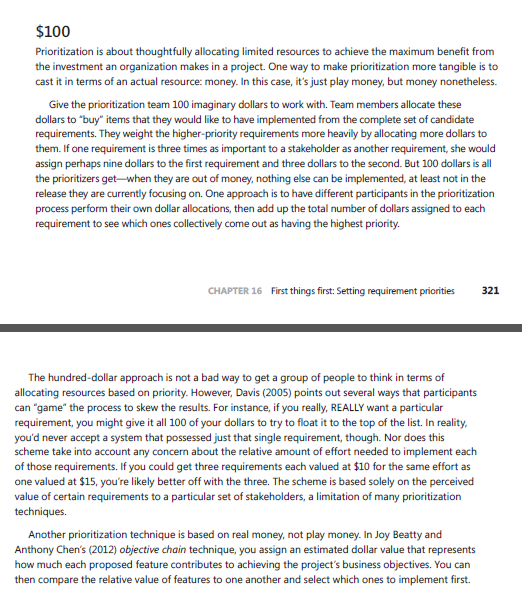

# $100

## Funções dos autores

| Nome                                              | Função                                                             | 
|---------------------------------------------------|--------------------------------------------------------------------|
|[Amanda Cruz](https://github.com/mandicrz)         | Criação do documento para requisitos da introspecção               | 
|[Gabriel Flores](https://github.com/Gabrielfcoelho)| Criação do documento para requisitos da introspecção               | 
|[João Pedro](https://github.com/johnaopedro)       | Revisão geral                                                      |
|[Julia Gabriela](https://github.com/JuliaGabP)     | Correção total do documento, refazendo a técnica                   | 
|[Ryan Salles](https://github.com/RA-Salles)        | Formatação de tabelas, auxílio na correção, execução da técnica    | 

    Autor(es): 
    <a href="https://github.com/JuliaGabP" target="_blank">Julia Gabriela</a>

## Introdução

Neste artefato, será aplicada a técnica de priorização de requisitos utilizando os $100 fictícios. Este método permite avaliar quais devem ser implementadas primeiro, garantindo que os recursos sejam distribuídos de forma estratégica, levando em conta as funcionalidades mais críticas para o sucesso do sistema.

## Metodologia

A técnica foi aplicada de forma remota, em duplo, com Julia, e outro membro do grupo, Ryan, realizando a distribuição dos $100 imaginários entre os requisitos elicitados pelas técnicas de [Elicitados](../elicitacao/requisitos_elicitados.md). A atividade foi conduzida de forma colaborativa, onde a Julia foi responsável por coordenar o processo.

No início da atividade, foi explicado ao participante o objetivo da técnica e como os dólares seriam distribuídos. Cada um, teve a responsabilidade de alocar o dinheiro imaginário entre os requisitos de acordo com sua percepção sobre a importância e o impacto de cada um no sucesso do sistema. Os mesmos receberam valores dependendo da sua prioridade e a distribuição foi feita com o objetivo de refletir as necessidades reais do projeto, focando nas funcionalidades mais essenciais.

Ao final, os que receberam maior alocação de dólares foram classificados como mais prioritários e, dessa forma, selecionamos as funcionalidades que deveriam ser implementadas primeiro no projeto.

## Priorização

A partir da tabela de [Requisitos Elicitados](../requisitos_elicitados.md), a técnica foi realizada para Requisitos Funcionais
e não Funcionais. Os resultados são apresentados por meio das Tabels 1 e 2.

Legenda:
- ID: apresenta um link para o requisito priorizado
- Nome: apresenta o nome do requisito priorizado
- Implementado: identifica se o requisito está presente ou não no aplicativo
- Valor X: Apresenta o valor colocado no requisito pelo priorizador
- TOTAL: apresenta a soma dos valores

### Requisitos Funcionais 

Essa seção apresenta os resultados da priorização dos requisitos funcionais por meio da tabela 1.

    <b>Tabela 1:</b> Requisitos Funcionais Elicitados

| ID                                             | Nome                                        | Implementado | Valor Julia | Valor Ryan | TOTAL   |
| :--------------------------------------------: | :-----------------------------------------: | :----------: | :---------: | :--------: | :----:  |
| [RF01](../requisitos_elicitados.md#rf01)       | Cadastro de Famílias                        | Sim          | US$2.20     | US$2.50    | US$4.70 |
| [RF02-v2](../requisitos_elicitados.md#rf02-v2) | Cadastro de Pessoas                         | Sim          | US$2.20     | US$2.00    | US$4.20 |
| [RF03](../requisitos_elicitados.md#rf03)       | Cadastro de Domicílios                      | Sim          | US$2.20     | US$2.00    | US$4.20 |
| [RF04](../requisitos_elicitados.md#rf04)       | Cadastro de Agricultores Familiares         | Sim          | US$2.20     | US$2.00    | US$4.20 |
| [RF05](../requisitos_elicitados.md#rf05)       | Atualização de Dados de família             | Sim          | US$2.20     | US$2.00    | US$4.20 |
| [RF06](../requisitos_elicitados.md#rf06)       | Processamento de Dados                      | Sim          | US$2.20     | US$2.00    | US$4.20 |
| [RF07](../requisitos_elicitados.md#rf07)       | Correção de Inconsistências                 | Sim          | US$2.20     | US$2.00    | US$4.20 |
| [RF08](../requisitos_elicitados.md#rf08)       | Consulta de Dados                           | Sim          | US$2.20     | US$2.00    | US$4.20 |
| [RF09](../requisitos_elicitados.md#rf09)       | Relatórios e Divulgação                     | Sim          | US$2.20     | US$2.00    | US$4.20 |
| [RF10](../requisitos_elicitados.md#rf10)       | Formulários de Coleta                       | Sim          | US$2.20     | US$2.00    | US$4.20 |
| [RF11](../requisitos_elicitados.md#rf11)       | Cadastro MEI                                | Não          | US$1.10     | US$0.00    | US$1.10 |
| [RF12](../requisitos_elicitados.md#rf12)       | Informações MEI                             | Não          | US$1.10     | US$1.00    | US$2.10 |
| [RF13](../requisitos_elicitados.md#rf13)       | Personalização MEI                          | Não          | US$1.10     | US$0.00    | US$1.10 |
| [RF14](../requisitos_elicitados.md#rf14)       | Consultar dados cadastrais                  | Sim          | US$2.20     | US$2.00    | US$4.20 |
| [RF15](../requisitos_elicitados.md#rf15)       | Pré-cadastrar família                       | Sim          | US$2.20     | US$2.00    | US$4.20 |
| [RF16](../requisitos_elicitados.md#rf16)       | Localizar postos de atendimento             | Sim          | US$2.20     | US$1.50    | US$3.70 |
| [RF17](../requisitos_elicitados.md#rf17)       | Enviar notificações                         | Sim          | US$2.20     | US$1.00    | US$3.20 |
| [RF19](../requisitos_elicitados.md#rf19)       | Cadastro de Usuário                         | Sim          | US$2.20     | US$2.00    | US$4.20 |
| [RF20](../requisitos_elicitados.md#rf20)       | Atualização de Dados do Usuário             | Sim          | US$2.20     | US$2.00    | US$4.20 |
| [RF21](../requisitos_elicitados.md#rf21)       | Consultar Situação Cadastral                | Sim          | US$2.20     | US$2.00    | US$4.20 |
| [RF22](../requisitos_elicitados.md#rf22)       | Emissão de Comprovante de Cadastro          | Sim          | US$2.20     | US$2.00    | US$4.20 |
| [RF23](../requisitos_elicitados.md#rf23)       | Filtragem de Benefícios                     | Não          | US$1.10     | US$1.50    | US$2.60 |
| [RF24-v2](../requisitos_elicitados.md#rf24-v2) | Consulta de status de Benefícios            | Sim          | US$2.20     | US$1.50    | US$3.70 |
| [RF25](../requisitos_elicitados.md#rf25)       | Informações Cadastrais                      | Sim          | US$2.20     | US$1.50    | US$3.70 |
| [RF26](../requisitos_elicitados.md#rf26)       | Chatbot de atendimento automatizado         | Não          | US$1.10     | US$1.00    | US$2.10 |
| [RF27](../requisitos_elicitados.md#rf27)       | Notificação de pendências ou atualizações   | Não          | US$1.10     | US$1.50    | US$2.60 |
| [RF28-v2](../requisitos_elicitados.md#rf28-v2) | Simulador de benefícios sociais             | Não          | US$1.10     | US$1.50    | US$2.60 |
| [RF29](../requisitos_elicitados.md#rf29)       | Upload de documentos                        | Não          | US$1.10     | US$4.00    | US$5.10 |
| [RF30](../requisitos_elicitados.md#rf30)       | Agendamento de atendimento no CRAS          | Não          | US$1.10     | US$2.00    | US$1.10 |
| [RF31](../requisitos_elicitados.md#rf31)       | Notificações Personalizadas                 | Não          | US$1.10     | US$1.50    | US$2.60 |
| [RF32](../requisitos_elicitados.md#rf32-v2)    | Guia de Atualização Cadastral               | Não          | US$1.10     | US$2.00    | US$3.10 |
| [RF33](../requisitos_elicitados.md#rf33)       | Simulador de Benefícios                     | Não          | US$1.10     | US$1.50    | US$2.60 |
| [RF34](../requisitos_elicitados.md#rf34)       | Chat de Atendimento                         | Não          | US$1.10     | US$2.00    | US$3.10 |
| [RF35](../requisitos_elicitados.md#rf35)       | Tutoriais Interativos                       | Não          | US$1.10     | US$1.50    | US$2.60 |
| [RF36](../requisitos_elicitados.md#rf36)       | Vídeos Explicativos                         | Não          | US$1.10     | US$1.50    | US$2.60 |
| [RF37](../requisitos_elicitados.md#rf37)       | Assistência por Voz                         | Não          | US$1.10     | US$0.00    | US$1.10 |
| [RF38](../requisitos_elicitados.md#rf38)       | Modo escuro                                 | Não          | US$1.10     | US$0.00    | US$1.10 |
| [RF40-v2](../requisitos_elicitados.md#rf40-v2) | Login                                       | Sim          | US$2.20     | US$3.00    | US$5.20 |

    Autor(es): 
    <a href="https://github.com/JuliaGabP" target="_blank">Julia Gabriela</a>,
    <a href="https://github.com/RA-Salles" target="_blank">Ryan Salles</a> 

## Requisitos Não Funcionais
Essa seção apresenta os resultados da priorização dos requisitos não funcionais elicitados por meio da Tabela 2.

    <b>Tabela 2:</b> Requisitos Não Funcionais elicitados

| ID                                         | Nome                                               | Implementado | Valor Julia | Valor Ryan | TOTAL   |
| :----------------------------------------: | :------------------------------------------------: | :----------: | :---------: | :--------: | :-----: |
| [RNF01](../requisitos_elicitados.md#rnf01) | Desempenho                                         | Não          | US$1.10     | US$3.00    | US$4.10 |
| [RNF02](../requisitos_elicitados.md#rnf02) | Segurança                                          | Sim          | US$2.20     | US$3.00    | US$5.20 |
| [RNF03](../requisitos_elicitados.md#rnf03) | Escalabilidade                                     | Sim          | US$2.20     | US$2.00    | US$4.20 |
| [RNF04](../requisitos_elicitados.md#rnf04) | Conformidade Legal                                 | Sim          | US$2.20     | US$3.00    | US$5.20 |
| [RNF05](../requisitos_elicitados.md#rnf05) | Acessibilidade                                     | Não          | US$1.10     | US$2.00    | US$3.10 |
| [RNF06](../requisitos_elicitados.md#rnf06) | Disponibilidade                                    | Sim          | US$2.20     | US$3.00    | US$5.20 |
| [RNF07](../requisitos_elicitados.md#rnf07) | Compatibilidade com Aplicativo Off-line            | Não          | US$1.10     | US$1.00    | US$2.10 |
| [RNF08](../requisitos_elicitados.md#rnf08) | Transmissão via Conectividade Social               | Não          | US$1.10     | US$3.00    | US$4.10 |
| [RNF09](../requisitos_elicitados.md#rnf09) | Acesso Restrito                                    | Sim          | US$2.20     | US$1.50    | US$3.70 |
| [RNF10](../requisitos_elicitados.md#rnf10) | Interface intuitiva e amigável                     | Sim          | US$2.20     | US$1.00    | US$3.20 |
| [RNF11](../requisitos_elicitados.md#rnf11) | Suporte a grande base de usuários                  | Sim          | US$2.20     | US$3.00    | US$5.20 |
| [RNF12](../requisitos_elicitados.md#rnf12) | Integração com sistemas oficiais                   | Sim          | US$2.20     | US$3.00    | US$5.20 |
| [RNF13](../requisitos_elicitados.md#rnf13) | Usabilidade                                        | Não          | US$1.10     | US$1.00    | US$2.10 |
| [RNF14](../requisitos_elicitados.md#rnf14) | Compatibilidade com Dispositivos                   | Sim          | US$2.20     | US$1.00    | US$3.20 |
| [RNF15](../requisitos_elicitados.md#rnf15) | Acessibilidade para pessoas com deficiência visual | Não          | US$1.10     | US$1.00    | US$2.10 |
| [RNF16](../requisitos_elicitados.md#rnf16) | Backup e restauração de sessão                     | Não          | US$1.10     | US$1.00    | US$2.10 |
| [RNF17](../requisitos_elicitados.md#rnf17) | Alta disponibilidade e recuperação de desastres    | Não          | US$1.10     | US$2.00    | US$3.10 |
| [RNF18](../requisitos_elicitados.md#rnf18) | Possibilidade de outros idiomas                    | Não          | US$1.10     | US$0.00    | US$1.10 |
| [RNF19](../requisitos_elicitados.md#rnf19) | Integração MEI                                     | Não          | US$1.10     | US$0.00    | US$1.10 |

    Autor(es): 
    <a href="https://github.com/JuliaGabP" target="_blank">Julia Gabriela</a>,
    <a href="https://github.com/RA-Salles" target="_blank">Ryan Salles</a> 

### Análise dos Requisitos Priorizados

A análise da técnica dos $100 feita pela desenvolvedora Julia pode ser entendida como uma priorização em requisitos implementados, pois essas possuem maior valor para ela.

Os requisitos priorizados pelo desenvolvedor Ryan Salles dão prioridade para requisitos básicos e de qualidade de vida, colocando em primeiro lugar requisitos base para o funcionamento e facilidade de uso.

## Conclusão

A aplicação da técnica dos $100 revelou-se eficaz para priorizar os requisitos do sistema permitindo uma distribuição clara e estratégica dos recursos,
todavia permitindo que qualquer usuário influêncie o resultado final do que deve ser implementado primeiro. 

## Bibliografia

> WIEGERS, Karl; BEATTY, Joy. Software Requirements. 3. ed. Seattle: Microsoft Press, 2013. p. 321-322.

A Figura 1 apresenta a especificação da técnica segundo WIEGERS e BEATTY (2013).

    <b>Figura 1:</b> Especificação da técnica dos 100 dólares segundo WIEGERS e BEATTY (2013).

    

    <b>Fonte:</b> Adaptado de WIEGERS e BEATTY (2013).

## Histórico de Versão

| Versão |    Data    |      Descrição                                                                                                                    |          Autor                                                                                   |       Revisor                                |
| :----: | :--------: | :------------------:                                                                                                              | :----------------------------------------------------------------------------------------------: | :------------------------------------------: |
|  1.0   | 04/05/2025 | Criação do Documento                                                                                                              | [Amanda Cruz](https://github.com/mandicrz), [Gabriel Flores](https://github.com/Gabrielfcoelho)  | [João Pedro](https://github.com/johnaopedro) |
|  2.0   | 25/06/2025 | Correção total do documento, refazendo a técnica                                                                                  | [Julia Gabriela](https://github.com/JuliaGabP)                                                   | [João Pedro](https://github.com/johnaopedro) |
|  2.1   | 25/06/2026 | Atualização da rastreabilidade, exclusão de tabela de descrição, adição da coluna "Valor Ryan" e adicionando imagem de referência | [Ryan Salles](https://github.com/RA-Salles)                                                      | [João Pedro](https://github.com/johnaopedro) |