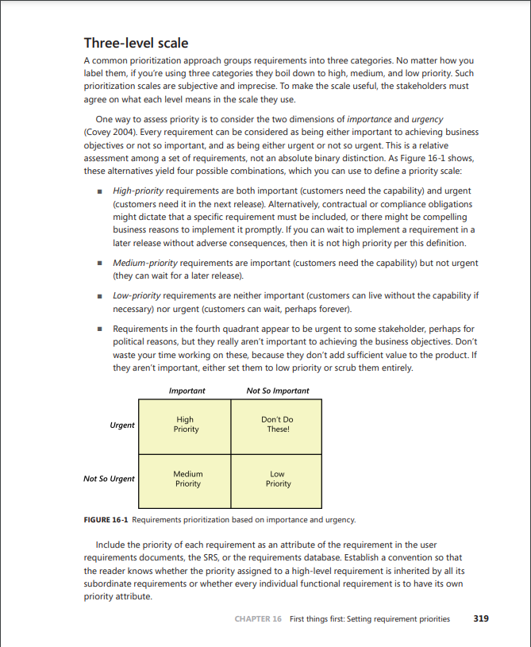
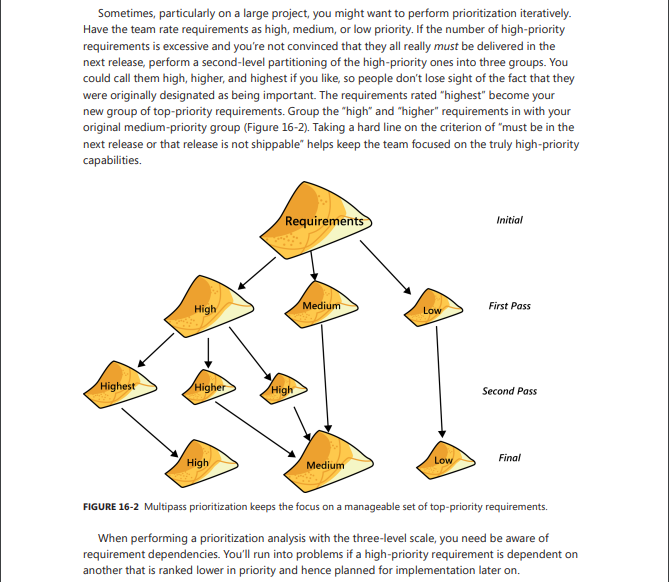

# Three-Level Scale

## Funções dos autores

| Nome                 | Função                                                            | 
|----------------------|----------------------------------------------------------------   |
|[João Pedro Costa](https://github.com/johnaopedro)| Criação do documento e ajustes| 
|[Julia Gabriela](https://github.com/JuliaGabP)|Revisão geral.| 
|[Ryan Salles](https://github.com/RA-Salles)|Criação do documento e ajustes| 

    Autor(es): 
    <a href="https://github.com/JuliaGabP" target="_blank">Julia Gabriela</a>

## Introdução

O Three-Level Scale é um método utilizado para priorizar requisitos em projetos de software, classificando-os em três categorias: alta prioridade, prioridade média e baixa prioridade. Esse método, embora seja subjetivo, é eficaz quando os stakeholders concordam sobre os critérios de cada nível. A avaliação é feita com base em duas dimensões principais:

- Importância: Relevância do requisito para os objetivos do negócio.
- Urgência: Necessidade imediata de implementação do requisito.

As categorias são definidas da seguinte forma:

- Alta Prioridade: Requisitos importantes e urgentes, necessários para alcançar os objetivos do negócio na próxima versão. Incluem obrigações contratuais ou requisitos de conformidade que não podem ser adiados.
- Prioridade Média: Requisitos importantes, mas não urgentes, que podem ser adiados para versões futuras sem grandes prejuízos.
- Baixa Prioridade: Requisitos que não são críticos para o negócio e podem ser adiados ou descartados sem impacto significativo.

Requisitos percebidos como urgentes, mas que não são importantes para os objetivos de negócio, devem ser evitados ou removidos, pois não agregam valor suficiente ao produto. Além disso, é recomendável incluir a prioridade de cada requisito como um atributo nos documentos de requisitos para garantir clareza e alinhamento entre os envolvidos.

## Aplicação no App Cadastro Único

No contexto do aplicativo Cadastro Único, o método pode ser aplicado para organizar e priorizar os requisitos de forma eficiente. A seguir, apresentamos os requisitos funcionais e não funcionais identificados, categorizados de acordo com a técnica Three-Level Scale. A partir dos requisitos obtidos pelas tecnicas de elicitação, que são [questionário](../tecnicas/questionario.md), [entrevista](../tecnicas/entrevista.md) e [análise de documentos](../tecnicas/analise_documentacao.md) e [introspecção](../tecnicas/introspecção.md), foram definidos os requisitos funcionais e não funcionais do sistema. Os requisitos foram organizados em tabelas, com suas respectivas descrições, rastreabilidade e prioridades.
Os requisitos foram classificados em três níveis de prioridade, com base na importância e urgência de cada um deles.

Note que alguns requisitos podem se repetir por conta de serem identificados em mais de uma técnica de elicitação. Além disso, alguns foram renomeados para melhorar a clareza. Os requisitos foram organizados em duas tabelas 1 e 2, uma para os requisitos funcionais e outra para os não funcionais. A seguir, apresentamos as tabelas com os requisitos priorizados. 

### Requisitos Priorizados

#### Tabela 1: Requisitos Funcionais

| ID      | Nome do Requisito                     | Descrição                                                          | Rastreabilidade                   | Prioridade |
| ------- | ------------------------------------- | ------------------------------------------------------------------ | --------------------------------- | ---------- |
| RF01    | Cadastro de Famílias                  | Cadastro de famílias com renda até meio salário mínimo ou programas sociais. | Questionário / Análise de documentos | Alta       |
| RF02    | Cadastro de Pessoas                   | Registro de identificação, escolaridade etc.                       | Questionário / Análise de documentos | Alta       |
| RF03    | Cadastro de Domicílios                | Registro de tipo de construção, saneamento, etc.                   | Questionário / Análise de documentos | Média      |
| RF04    | Cadastro de Agricultores Familiares   | Registro de posse de terra, renda e trabalho.                      | Questionário / Análise de documentos | Média      |
| RF05    | Atualização de Dados                  | Atualização dos dados cadastrais.                                  | Questionário / Introspecção       | Alta       |
| RF06    | Processamento de Dados                | Envio à CAIXA e geração de NIS.                                    | Questionário / Análise de documentos | Alta       |
| RF07    | Correção de Inconsistências           | Correção e retransmissão de dados.                                 | Análise de Documentos             | Média      |
| RF08    | Consulta de Dados                     | Consulta cadastral e benefícios.                                   | Questionário / Introspecção       | Alta       |
| RF09    | Relatórios e Divulgação               | Geração de relatórios e compartilhamento com órgãos.               | Análise de Documentos             | Média      |
| RF10    | Formulários de Coleta                 | Formulários principais e suplementares.                            | Análise de Documentos             | Alta       |
| RF11    | Cadastro MEI                          | Cadastro de usuário como MEI.                                      | Análise de Documentos             | Baixa       |
| RF12    | Informações MEI                       | Seção sobre MEI.                                                   | Análise de Documentos             | Média      |
| RF13    | Personalização MEI                    | Conteúdos personalizados conforme setor e região.                  | Análise de Documentos             | Baixa      |
| RF14  | Consultar dados cadastrais            | Visualização dos dados do Cadastro Único.                          | Introspecção                      | Alta       |
| RF15  | Pré-cadastrar família                 | Início de pré-cadastro de unidade familiar.                        | Introspecção                      | Alta       |
| RF16  | Localizar postos de atendimento       | Localiza CRAS com base na localização do usuário.                  | Introspecção                      | Média      |
| RF17  | Enviar notificações                   | Envio de mensagens importantes via app.                            | Introspecção                      | Média      |
| RF18  | Integrar com o CNIS                   | Integração automática com CNIS.                                    | Introspecção                      | Alta       |
| RF19  | Cadastro de Usuário                   | Coleta de dados pessoais.                                          | Introspecção                      | Alta       |
| RF20  | Atualização de Dados                  | Atualização dos dados cadastrais.                                  | Introspecção                      | Alta       |
| RF21  | Consultar Situação Cadastral          | Verificação do status do cadastro.                                 | Introspecção                      | Alta       |
| RF22  | Emissão de Comprovante de Cadastro    | Geração de comprovante de cadastro.                                | Introspecção                      | Média      |
| RF23  | Filtragem de Benefícios               | Filtro de benefícios conforme dados cadastrados.                   | Introspecção                      | Média      |
| RF24  | Consulta de Benefícios              | Consulta de status de benefícios.          | Entrevista                        | Alta       |
| RF25  | Informações Cadastrais                       | Visualização de informações cadastrais.         | Entrevista                        | Alta       |

Autor(es): <a href="https://github.com/johnaopedro" target="_blank">João Pedro</a>

#### Tabela 2: Requisitos Não Funcionais  
| ID      | Nome do Requisito                     | Descrição                                                          | Rastreabilidade                   | Prioridade |
| ------- | ------------------------------------- | ------------------------------------------------------------------ | --------------------------------- | ---------- |
| RNF01   | Desempenho                            | Processamento de dados em até 48h.                                 | Análise de documentos                | Alta       |
| RNF02   | Segurança                             | Confidencialidade e autenticação.                                  | Análise de documentos / Introspecção | Alta       |
| RNF03   | Escalabilidade                        | Suportar até 19,5 milhões de famílias.                             | Análise de documentos                | Alta       |
| RNF04   | Conformidade Legal                    | Atender portarias e regras da Senarc.                              | Análise de documentos                | Alta       |
| RNF05   | Acessibilidade                        | Acessível para operadores estaduais e municipais.                  | Análise de documentos                | Alta       |
| RNF06   | Disponibilidade                       | Sistema disponível diariamente.                                    | Análise de documentos / Introspecção | Alta       |
| RNF07   | Compatibilidade com Aplicativo Off-line | Compatível com app offline dos municípios.                         | Análise de documentos                | Alta       |
| RNF08   | Transmissão via Conectividade Social  | Uso exclusivo da ferramenta da CAIXA.                              | Análise de documentos                | Alta       |
| RNF09   | Acesso Restrito                       | Acesso restrito a instituições autorizadas.                        | Análise de documentos                | Alta       |
| RNF10   | Integração MEI                        | Comunicação com sistemas voltados ao MEI.                          | Análise de documentos                | Baixa    |
| RNF11 | Interface intuitiva e amigável        | Interface simples e de fácil navegação.                            | Introspecção                      | Alta       |
| RNF12 | Suporte a grande base de usuários     | Suporte a muitos acessos simultâneos.                              | Introspecção                      | Alta       |
| RNF13 | Integração com sistemas oficiais      | Integração com sistemas como CNIS.                                 | Introspecção                      | Alta       |
| RNF14 | Usabilidade                           | Navegação intuitiva.                                               | Introspecção                      | Alta       |
| RNF15 | Segurança                             | Criptografia e proteção de dados sensíveis.                        | Introspecção                      | Alta       |
| RNF16 | Performance                           | Respostas em até 3 segundos.                                       | Introspecção                      | Alta       |
| RNF17 | Compatibilidade com Dispositivos      | Compatível com Android e iOS.                                      | Introspecção                      | Alta       |
| RNF18 | Disponibilidade                       | 99% de disponibilidade.                                            | Introspecção                      | Alta       |
| RNF19 | Interface Intuitiva                     | Interface intuitiva e de fácil navegação.  | Entrevista                        | Alta       |
| RNF20 | Tela Inicial Organizada            | Organização clara da tela inicial.                               | Entrevista                        | Alta       |

Autor(es): <a href="https://github.com/johnaopedro" target="_blank">João Pedro</a>

## Validação 

A priorização foi realizada presencialmente. As informações da reunião presencial são apresentadas por meio da tabela 1 e 2

    <b> Tabela 1:</b> Informações da Entrevista

| Campo   | Informação                                               |
| :-----: | :------------------------------------------------------: |
| Local   | [UnB - FCTE](https://maps.app.goo.gl/f8bxb23JLZJpw7REA)  |
| Data    | 05/06/2025                                               |
| Horário | 9:00                                                     |
| Duração | Cerca de 20 minutos                                      |

    <b>Autor(es)</b><a href="https://github.com/RA-Salles" target="_blank">Ryan Salles</a>

    <b> Tabela 2:</b> Participantes da Entrevista

| Nome                                         | Função                   |
| :------------------------------------------: | :----------------------: |
| Artur                                        | Usuário/ Project Owner   |
| [João Pedro](https://github.com/johnaopedro) | Entrevistador            |
| [Ryan Salles]()                              |                          |
| [João Igor]()                                |                          |
| [Gabriel Flores]()                           |                          |

    <b>Autor(es)</b><a href="https://github.com/RA-Salles" target="_blank">Ryan Salles</a>

<iframe width="560" height="315" src="https://www.youtube.com/embed/HV6II_-XTVc?si=EM-kqJggTzlJKyXO" title="YouTube video player" frameborder="0" allow="accelerometer; autoplay; clipboard-write; encrypted-media; gyroscope; picture-in-picture; web-share" referrerpolicy="strict-origin-when-cross-origin" allowfullscreen></iframe>

## Conclusão

A aplicação do método Three-Level Scale neste estudo permitiu organizar e priorizar os requisitos funcionais e não funcionais do sistema Cadastro Único, considerando sua importância e urgência. Essa priorização é essencial para garantir que os esforços sejam direcionados aos aspectos mais críticos do sistema.

## Referências

> Three level scale: Setting requirement priorities. In: WIEGERS, Karl E.; BEATTY, Joy. Software Requirements. 3. ed. [S. l.]: Microsoft Press, 2013. cap. 16, p. 319-320. ISBN 0735679665.

##### Imagem 1: Three Level Scale

    

**Fonte:** Adaptado de WIEGERS, Karl E.; BEATTY, Joy. *Software Requirements*. 3. ed. [S. l.]: Microsoft Press, 2013. cap. 16, p. 319-320.

##### Imagem 2: Three Level Scale

    

**Fonte:** Adaptado de WIEGERS, Karl E.; BEATTY, Joy. *Software Requirements*. 3. ed. [S. l.]: Microsoft Press, 2013. cap. 16, p. 319-320.

## Histórico de Versões

| Versão | Data | Descrição  | Autor        | Revisor |
| :-----: | :----: | :----------: | :------------: | :--------: |
| 1.0    | 28/04/2025 | Criação da página da técnica Three Level Scale| [João Pedro Costa](https://github.com/johnaopedro)                   | [Ryan Salles](https://github.com/RA-Salles) |
| 1.1    | 03/05/2025 | Atualização da aplicação da técnica | [João Pedro Costa](https://github.com/johnaopedro)                   | [Ryan Salles](https://github.com/RA-Salles) |
| 1.2    | 04/05/2025 | Alteração nas prioridades do MEI | [Ryan Salles](https://github.com/RA-Salles) | [João Pedro Costa](https://github.com/johnaopedro) |
| 1.3 | 04/05/2025 | Adicionando links e corrigindo tabelas | [João Pedro Costa](https://github.com/johnaopedro)                   | [Ryan Salles](https://github.com/RA-Salles)                      |
| 1.4 | 06/05/2025 | Ajustando conteúdo, adicionando imagens, o video e referências | [João Pedro Costa](https://github.com/johnaopedro)                   | [Julia Gabriela](https://github.com/JuliaGabP)                      |
