# Análise de documentação

## Introdução
Esse documento apresenta a análise de documentação realizada pelo grupo 4 com o propósito de compreender e elicitar os requisitos do aplicativo
cadastro único. 

## Metodologia
Para cada documento examinado, serão buscadas informações novas sobre o usuário, a situação onde o sistema deverá operar e quais operações ele deveria realizar. Os documentos serão resumidos e, com base nas principais informações obtidas, serão elicitados requisitos seguindo o modelo da Tabela 1.

 <b>Tabela 1:</b> Requisitos de exemplo 

  
| **ID** | **Requisito Exemplo** | **Descrição** |
|:------:|:-----------------------:|:-------------:|
| RE1    | Realizar uma determinada operação | O usuário é capaz de realizar a operação dentro do sistema |

 Autor(a): <a href="https://github.com/RA-Salles" target="_blank">Ryan Salles</a>

Com base em cada requisito elicitado, os autores separarão os requisitos em funcionais e não funcionais. Caso o documento observado elicite um requisito que já existe na lista, ele será desconsiderado por redundância, dado que múltiplos documentos podem tratar de um mesmo assunto ou revelar as mesmas informações. 

## Documentos analisados
Essa seção contém resumos dos documentos examinados para os fins de subsequente elicitação. 

<!--done!-->
### [Cadastro Único dos Programas Sociais - CadÚnico](https://ces.ibge.gov.br/base-de-dados/metadados/mds/cadastro-unico-dos-programas-sociais-cadunico.html)

O Cadastro Único dos Programas Sociais (CadÚnico) é um sistema de cadastro de famílias de baixa renda no Brasil, gerido pelo Ministério do Desenvolvimento Social e Combate à Fome, com suporte técnico da CAIXA. Criado em julho de 2001 pelo Decreto nº 3.877, o CadÚnico tem como objetivo identificar famílias com renda mensal de até meio salário mínimo por pessoa para subsidiar o planejamento de políticas públicas, podendo incluir famílias com renda superior caso estejam vinculadas a programas sociais. Ele abrange todos os municípios brasileiros e opera diariamente. A coleta de dados é realizada pelos municípios por meio de formulários preenchidos e digitados no Aplicativo de Entrada e Manutenção de Dados (off-line), sendo transmitidos à CAIXA via Conectividade Social.

A CAIXA processa os dados, atribui um Número de Identificação Social (NIS) único para cada pessoa cadastrada e devolve os resultados aos municípios em até 48 horas. Caso haja inconsistências, os dados são corrigidos e retransmitidos pelos municípios. As principais variáveis incluem informações sobre domicílio, pessoas e agricultores familiares. A documentação operacional é composta por formulários principais e suplementares, abrangendo diferentes situações, como vinculação a programas e pessoas em situação de rua. A divulgação ocorre em níveis nacional, regional, estadual e municipal, com relatórios anuais e acesso à base de dados mediante aprovação de projetos e acordos de cooperação técnica. Desde sua criação, o CadÚnico integrou-se a programas como o Bolsa Escola e o Bolsa Família, e, a partir de 2005, iniciou um processo contínuo de atualização cadastral com a adesão formal de estados e municípios. Trata-se de uma ferramenta essencial para identificar e atender famílias de baixa renda, permitindo a formulação de políticas públicas e a gestão de programas sociais.

<!--done!-->
### [IBGE: 4 milhões de inscritos no CadÚnico buscaram microempreendedorismo em 2022](https://agenciagov.ebc.com.br/noticias/202408/ibge-4-milhoes-de-inscritos-no-cadunico-buscaram-microempreendedorismo-em-2022#:~:text=IBGE:%204%20milh%C3%B5es%20de%20inscritos%20no%20Cad%C3%9Anico%20buscaram%20microempreendedorismo%20em%202022,-Dados%20s%C3%A3o%20da&text=As%20Estat%C3%ADsticas%20dos%20Cadastros%20de,individuais%20(MEIs)%20no%20Brasil.)

Em 2022, dos 14,6 milhões de MEIs no Brasil, 4,1 milhões (28,4%) estavam inscritos no CadÚnico. Desses, aproximadamente 2,1 milhões (49,8%) eram beneficiários do Programa Bolsa Família. Esses dados evidenciam que o microempreendedorismo se apresenta como alternativa de renda para famílias de baixa renda.

53,6% dos MEIs eram homens e 46,4% mulheres. A faixa etária predominante era de 30 a 39 anos (29,9%), seguida por 40 a 49 anos (25,5%). A maioria dos MEIs (86,5%) não tinha ensino superior completo, sendo que 63,4% tinham ensino médio completo ou superior incompleto. Em termos de raça/cor, 44,7% se declararam brancos, 29,8% pardos e 4,7% pretos. 

51,5% dos MEIs estavam no setor de serviços, com destaque para atividades de beleza (9,0%). Outras áreas relevantes incluem o comércio de vestuário (6,8%) e alimentação (6,0%). Cerca de 17,3% dos MEIs também possuíam vínculo empregatício formal, o que representa aumento em relação a 2021 (15%).

<!--done!-->
### [Relatório de Programas e Ações](https://aplicacoes.mds.gov.br/sagi/ri/relatorios/cidadania/)

>Pelos dados do IBGE de 2022 a população brasileira é composta por cerca de 212.583.750 pessoas, sendo 13% residente em zonas rurais e 87% em zonas urbanas.
Agora referente aos dados sobre o Cadastro Único, com base na análise do mês de março de 2025, 40.820.923 famílias cadastradas, sendo que desse total, 20.083.895 em situação de pobreza, 7.952.578 em situação de baixa renda e 12.784.450 com renda per capita mensal acima de meio salário-mínimo.

Os dados de pessoas cadastradas apontam 93.716.836 pessoas no total, sendo 48.492.845 em situação de pobreza, 22.446.387 baixa renda e 22.777.604 com renda per capita mensal acima de ½ salário-mínimo. Dos grupos populacionais tradicionais específicos, os que representam uma maioria são os agricultores familiares, com 2.742.185 famílias cadastradas e 1.928.059 pessoas beneficiárias do programa Bolsa Família.

Analisando famílias e pessoas em situação de trabalho infantil, temos, 7.156 inscritas no Cadastro Único, 8.717 pessoas, sendo 5.784 famílias e 7.243 pessoas beneficiárias do Bolsa Família. Todos os dados do Cadastro Único são referentes ao ano de 2025, mês de março.
Alguns dos principais benefícios do Cadastro Único são, Bolsa Família, Pé de Meia, Tarifa Social de Energia, Auxílio Gás, Programa Minha Casa Minha Vida, entre outros.

## Requisitos Elicitados
Essa seção contém os requisitos elicitados por consequência da análise da documentação. Os requisitos serão apresentados por meio das Tabelas 2 e 3, que contêm os requisitos funcionais e não-funcionais, respectivamente.
Cada requisito apresentado possui um código interno de elicitação e um código geral, permitindo rastreabilidade. Os códigos internos ao documento não possuirão diferenciação entre funcional ou não-funcional.

Legenda - Tabela 2:
 
- RFx: Requisitos Funcionais nºx.
- ADx: Requisito elicitado pela análise de documentação nºX 

 <b>Tabela 2:</b> Requisitos Funcionais 

| **ID** | **RF** | **Requisito Funcional**             | **Descrição**                                                                                                                                                                              |
| :----: | :----: | :---------------------------------: | :----------------------------------------------------------------------------------------------------------------------------------------------------------------------------------------: |
| AD01   | RF01   | Cadastro de Famílias                | Permitir o cadastro de famílias com renda mensal de até meio salário mínimo por pessoa ou vinculadas a programas sociais.                                                                  |
| AD02   | RF02   | Cadastro de Pessoas                 | Registrar informações pessoais, como dados de identificação, documentação, frequência escolar, grau de instrução, entre outros.                                                            |
| AD03   | RF03   | Cadastro de Domicílios              | Registrar características do domicílio, como tipo de construção, abastecimento de água, iluminação, escoamento sanitário, entre outros.                                                    |
| AD04   | RF04   | Cadastro de Agricultores Familiares | Registrar informações sobre posse de terra, atividade primária, contratação de mão de obra e composição da renda.                                                                          |
| AD05   | RF05   | Atualização de Dados                | Permitir a atualização diária dos dados das famílias cadastradas.                                                                                                                          |
| AD06   | RF06   | Processamento de Dados              | Transmitir os dados coletados para a CAIXA, processá-los e atribuir um Número de Identificação Social (NIS) único para cada pessoa cadastrada.                                             |
| AD07   | RF07   | Correção de Inconsistências         | Permitir a correção de inconsistências detectadas no processamento e retransmissão dos dados.                                                                                              |
| AD08   | RF08   | Consulta de Dados                   | Permitir a consulta de dados cadastrais, situação de benefícios e ações de gestão de benefícios por meio do NIS.                                                                           |
| AD09   | RF09   | Relatórios e Divulgação             | Gerar relatórios anuais com o perfil das famílias beneficiárias e disponibilizar dados para instituições de pesquisa e órgãos de governo mediante acordos e termos de responsabilidade.    |
| AD10   | RF10   | Formulários de Coleta               | Implementar formulários principais e suplementares para coleta de dados, abrangendo características de domicílios, famílias, pessoas, vinculação a programas e pessoas em situação de rua. |
| AD11   | RF11   | Cadastro MEI                        | Permitir que, ao cadastrar um usuário, o cadastro possa especificar que o usuário é um MEI.                                                                                                |
| AD12   | RF12   | Informações MEI                     | Conter seção de informações sobre microempreendedorismo individual.                                                                                                                        |
| AD13   | RF13   | Personalização MEI                  | Personalização de conteúdos da seção MEI de acordo com o setor de atuação do usuário registrado e/ou região do território brasileiro onde atua.                                            |
| AD14   | RF40   | Integração MEI                      | Permitir que o sistema converse com demais sistemas para MEIs                                                                                                                              |

    Autor(es): <a href="https://github.com/johnaopedro" target="_blank">João Pedro</a>, <a href="https://github.com/jvopBR" target="_blank">João Merlin</a>, <a href="https://github.com/JuliaGabP" target="_blank">Julia Gabriela</a>

<!--these are to keep the tables farther away!-->
 
 

Legenda - Tabela 3:

- RNFx : Requisitos Não-Funcional nºx.
- ADx: Requisito elicitado pela análise de documentação nºX 

 <b>Tabela 3:</b> Requisitos Não Funcionais 

| **ID**| **RF** | **Requisito Não Funcional**              | **Descrição**                                                                                                                                                                        |
| :---: | :----: |:---------------------------------------: | :----------------------------------------------------------------------------------------------------------------------------------------------------------------------------------: |
| AD15  | RNF01  | Desempenho                               | Garantir o processamento dos dados e retorno aos municípios em até 48 horas.                                                                                                         |
| AD16  | RNF02  | Segurança                                | Garantir a confidencialidade dos dados por meio de termos de responsabilidade e acordos de cooperação técnica, além de implementar mecanismos de autenticação para acesso aos dados. |
| AD17  | RNF03  | Escalabilidade                           | Suportar o cadastro e atualização de dados de até 19,5 milhões de famílias.                                                                                                          |
| AD18  | RNF04  | Conformidade Legal                       | Atender às regulamentações definidas pela Senarc e portarias relacionadas.                                                                                                           |
| AD19  | RNF05  | Acessibilidade                           | Garantir que o sistema seja acessível para operadores municipais e estaduais.                                                                                                        |
| AD20  | RNF06  | Disponibilidade                          | Garantir que o sistema esteja disponível para uso diário.                                                                                                                            |
| AD21  | RNF07  | Compatibilidade com Aplicativo Off-line  | O sistema deve ser compatível com o aplicativo off-line utilizado pelos municípios para coleta e digitação de dados.                                                                 |
| AD22  | RNF08  | Transmissão via Conectividade Social     | A transmissão de dados deve ser realizada exclusivamente por meio da ferramenta Conectividade Social da CAIXA.                                                                       |
| AD23  | RNF09  | Acesso Restrito                          | O acesso à base de dados deve ser restrito a instituições autorizadas e mediante assinatura de termos específicos.                                                                   |

    Autor(es): <a href="https://github.com/johnaopedro" target="_blank">João Pedro</a>, <a href="https://github.com/jvopBR" target="_blank">João Merlin</a>, <a href="https://github.com/JuliaGabP" target="_blank">Julia Gabriela</a>

## Video

<iframe width="560" height="315" src="https://www.youtube.com/embed/RPNQ1v3XVAM?si=5ZOZIeOC_XRSglVg" title="YouTube video player" frameborder="0" allow="accelerometer; autoplay; clipboard-write; encrypted-media; gyroscope; picture-in-picture; web-share" referrerpolicy="strict-origin-when-cross-origin" allowfullscreen></iframe>

# Referencias
> Requirements Elicitation. In: WIEGERS, Karl E.; BEATTY, Joy. Software Requirements. 3. ed. [S. l.]: Microsoft Press, 2013. cap. 7, p. 128-129. ISBN 0735679665. Acesso em: 1 de Maio 2025.

> INSTITUTO BRASILEIRO DE GEOGRAFIA E ESTATÍSTICA (IBGE). Cadastro Único dos Programas Sociais - CadÚnico. Disponível em: <https://ces.ibge.gov.br/base-de-dados/metadados/mds/cadastro-unico-dos-programas-sociais-cadunico.html>. Acesso em: 1 de Maio 2025.

> MINISTÉRIO DO DESENVOLVIMENTO E ASSISTÊNCIA SOCIAL, FAMÍLIA E COMBATE À FOME. Relatório de Programas e Ações. Disponível em: <https://aplicacoes.mds.gov.br/sagi/ri/relatorios/cidadania/>. Acesso em: 1 de Maio de 2025.

>  AGÊNCIA GOV. IBGE: 4 milhões de inscritos no CadÚnico buscaram microempreendedorismo em 2022. Disponível em: <https://agenciagov.ebc.com.br/noticias/202408/ibge-4-milhoes-de-inscritos-no-cadunico-buscaram-microempreendedorismo-em-2022#:~:text=IBGE:%204%20milh%C3%B5es%20de%20inscritos%20no%20Cad%C3%9Anico%20buscaram%20microempreendedorismo%20em%202022,-Dados%20s%C3%A3o%20da&text=As%20Estat%C3%ADsticas%20dos%20Cadastros%20de,individuais%20(MEIs)%20no%20Brasil.>. Acesso em: 1 de Maio de 2025.

##### Imagem 1: Análise de Documentação

    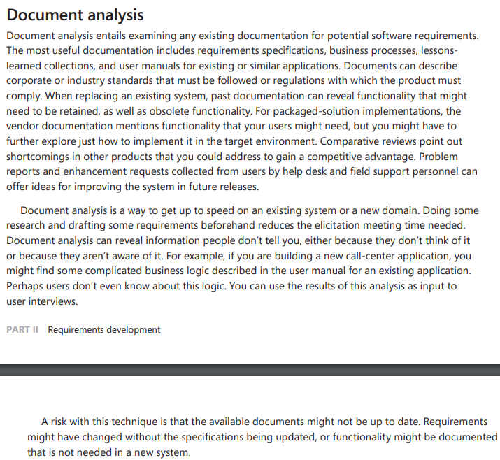

**Fonte:** Adaptado de Requirements Elicitation. In: WIEGERS, Karl E.; BEATTY, Joy. Software Requirements. 3. ed. [S. l.]: Microsoft Press, 2013. cap. 7, p. 128-129. ISBN 0735679665.

##### Imagem 2: Análise de Documentação

    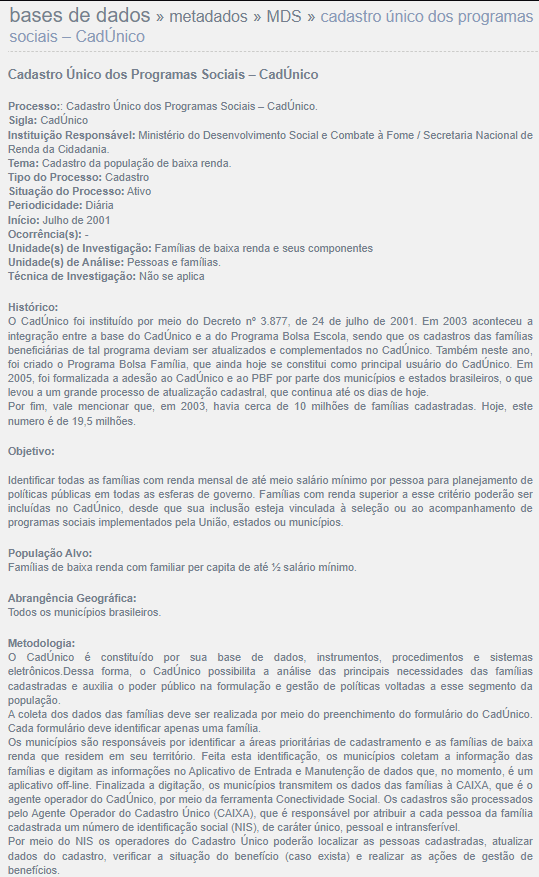

**Fonte:** Adaptado de INSTITUTO BRASILEIRO DE GEOGRAFIA E ESTATÍSTICA (IBGE). Cadastro Único dos Programas Sociais - CadÚnico. Disponível em: <https://ces.ibge.gov.br/base-de-dados/metadados/mds/cadastro-unico-dos-programas-sociais-cadunico.html>.

##### Imagem 3: Análise de Documentação

    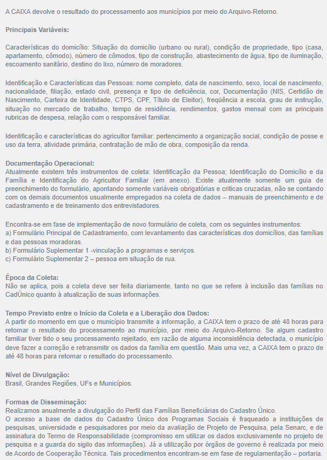

**Fonte:** Adaptado de INSTITUTO BRASILEIRO DE GEOGRAFIA E ESTATÍSTICA (IBGE). Cadastro Único dos Programas Sociais - CadÚnico. Disponível em: <https://ces.ibge.gov.br/base-de-dados/metadados/mds/cadastro-unico-dos-programas-sociais-cadunico.html>.

##### Imagem 4: Análise de Documentação

    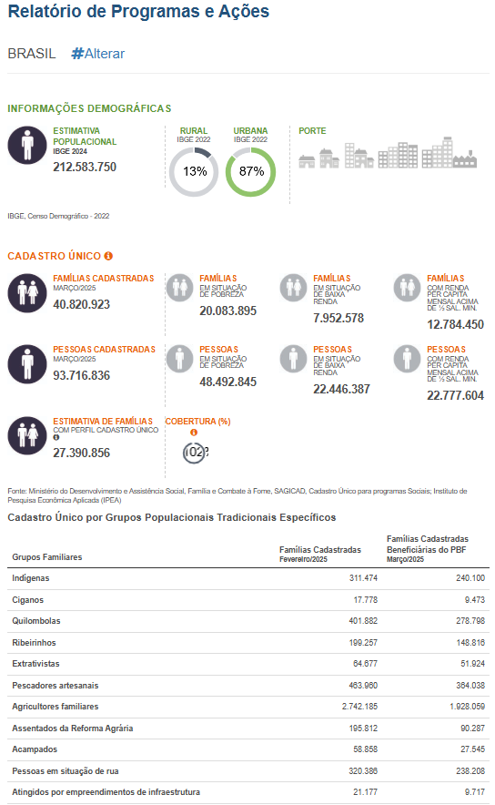

**Fonte:** Adaptado de MINISTÉRIO DO DESENVOLVIMENTO E ASSISTÊNCIA SOCIAL, FAMÍLIA E COMBATE À FOME. Relatório de Programas e Ações. Disponível em: <https://aplicacoes.mds.gov.br/sagi/ri/relatorios/cidadania/>.

##### Imagem 5: Análise de Documentação

    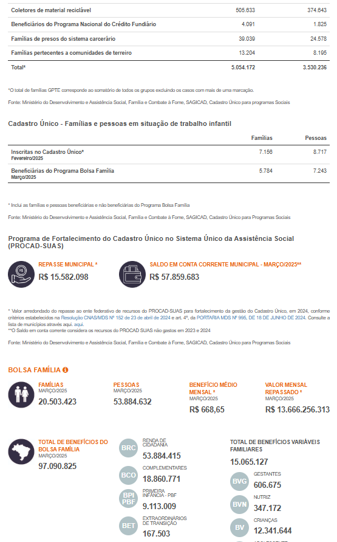

**Fonte:** Adaptado de MINISTÉRIO DO DESENVOLVIMENTO E ASSISTÊNCIA SOCIAL, FAMÍLIA E COMBATE À FOME. Relatório de Programas e Ações. Disponível em: <https://aplicacoes.mds.gov.br/sagi/ri/relatorios/cidadania/>.

##### Imagem 6: Análise de Documentação

    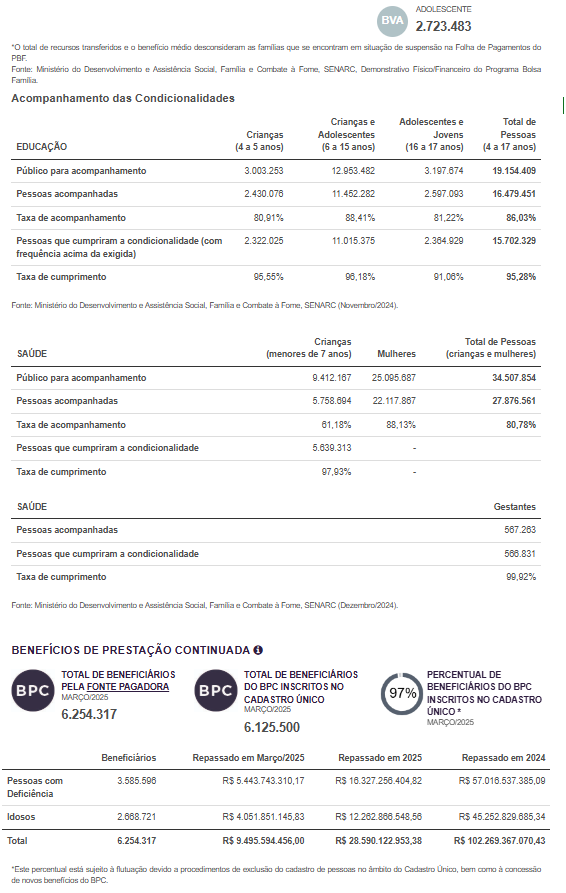

**Fonte:** Adaptado de MINISTÉRIO DO DESENVOLVIMENTO E ASSISTÊNCIA SOCIAL, FAMÍLIA E COMBATE À FOME. Relatório de Programas e Ações. Disponível em: <https://aplicacoes.mds.gov.br/sagi/ri/relatorios/cidadania/>.

##### Imagem 7: Análise de Documentação

    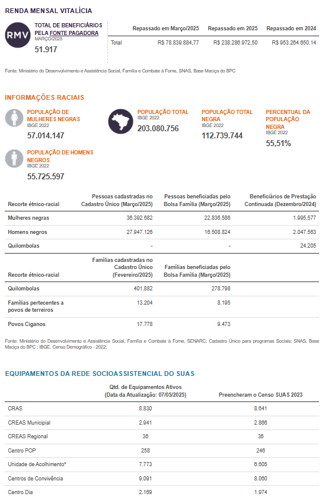

**Fonte:** Adaptado de MINISTÉRIO DO DESENVOLVIMENTO E ASSISTÊNCIA SOCIAL, FAMÍLIA E COMBATE À FOME. Relatório de Programas e Ações. Disponível em: <https://aplicacoes.mds.gov.br/sagi/ri/relatorios/cidadania/>.

##### Imagem 8: Análise de Documentação

    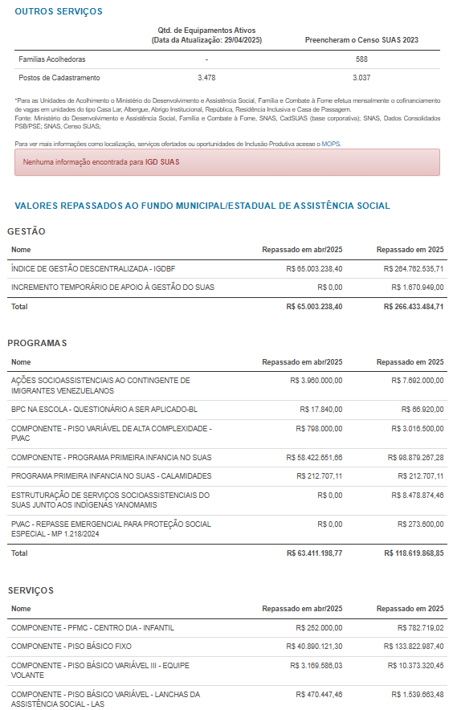

**Fonte:** Adaptado de MINISTÉRIO DO DESENVOLVIMENTO E ASSISTÊNCIA SOCIAL, FAMÍLIA E COMBATE À FOME. Relatório de Programas e Ações. Disponível em: <https://aplicacoes.mds.gov.br/sagi/ri/relatorios/cidadania/>.

##### Imagem 9: Análise de Documentação

    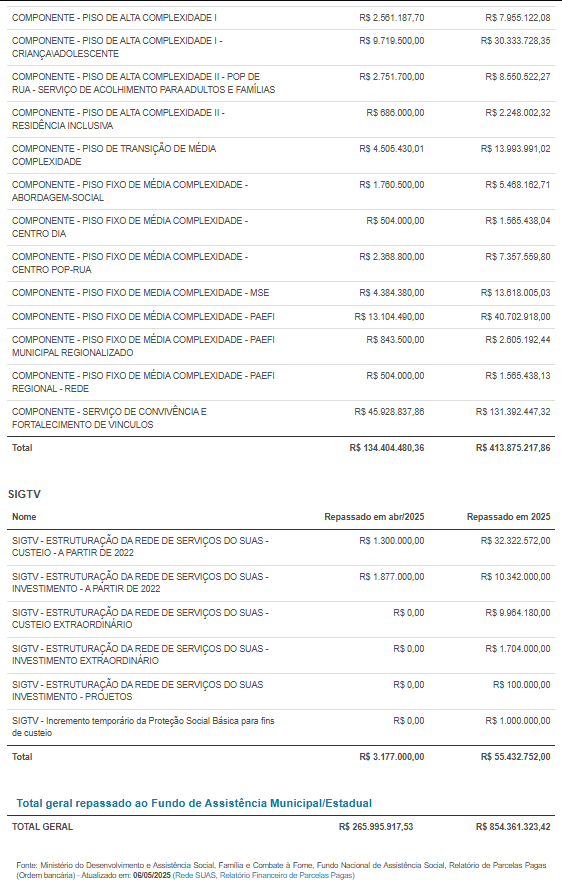

**Fonte:** Adaptado de MINISTÉRIO DO DESENVOLVIMENTO E ASSISTÊNCIA SOCIAL, FAMÍLIA E COMBATE À FOME. Relatório de Programas e Ações. Disponível em: <https://aplicacoes.mds.gov.br/sagi/ri/relatorios/cidadania/>.

##### Imagem 10: Análise de Documentação

    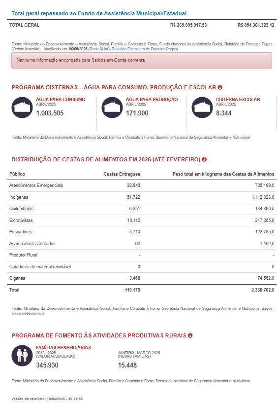

**Fonte:** Adaptado de MINISTÉRIO DO DESENVOLVIMENTO E ASSISTÊNCIA SOCIAL, FAMÍLIA E COMBATE À FOME. Relatório de Programas e Ações. Disponível em: <https://aplicacoes.mds.gov.br/sagi/ri/relatorios/cidadania/>.

##### Imagem 11: Análise de Documentação

    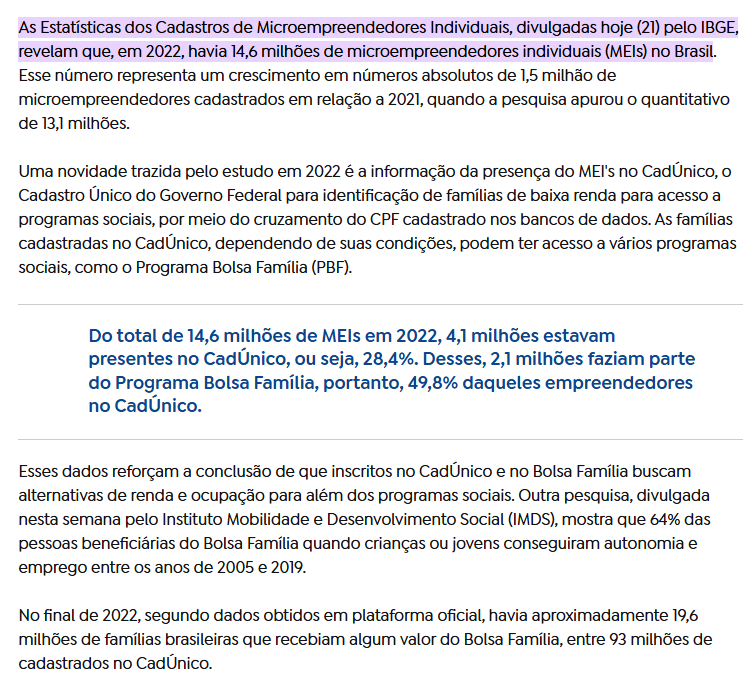

**Fonte:** Adaptado de AGÊNCIA GOV. IBGE: 4 milhões de inscritos no CadÚnico buscaram microempreendedorismo em 2022. Disponível em: <https://agenciagov.ebc.com.br/noticias/202408/ibge-4-milhoes-de-inscritos-no-cadunico-buscaram-microempreendedorismo-em-2022#:~:text=IBGE:%204%20milh%C3%B5es%20de%20inscritos%20no%20Cad%C3%9Anico%20buscaram%20microempreendedorismo%20em%202022,-Dados%20s%C3%A3o%20da&text=As%20Estat%C3%ADsticas%20dos%20Cadastros%20de,individuais%20(MEIs)%20no%20Brasil.>.

##### Imagem 12: Análise de Documentação

    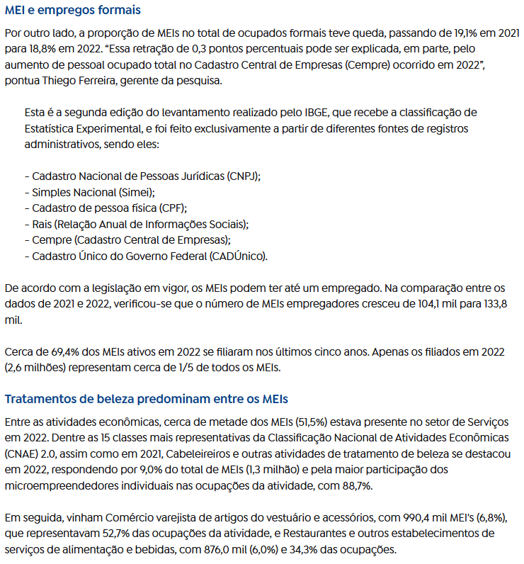

**Fonte:** Adaptado de AGÊNCIA GOV. IBGE: 4 milhões de inscritos no CadÚnico buscaram microempreendedorismo em 2022. Disponível em: <https://agenciagov.ebc.com.br/noticias/202408/ibge-4-milhoes-de-inscritos-no-cadunico-buscaram-microempreendedorismo-em-2022#:~:text=IBGE:%204%20milh%C3%B5es%20de%20inscritos%20no%20Cad%C3%9Anico%20buscaram%20microempreendedorismo%20em%202022,-Dados%20s%C3%A3o%20da&text=As%20Estat%C3%ADsticas%20dos%20Cadastros%20de,individuais%20(MEIs)%20no%20Brasil.>.

##### Imagem 13: Análise de Documentação

    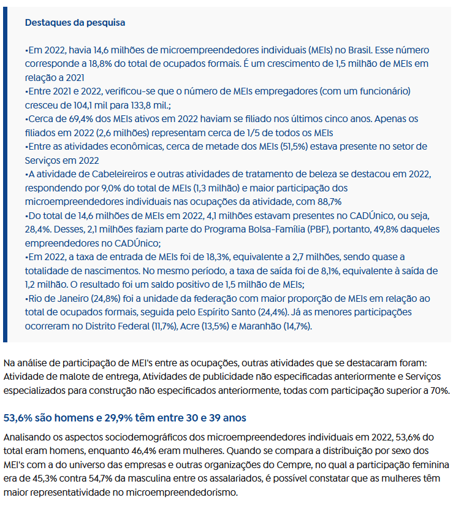

**Fonte:** Adaptado de AGÊNCIA GOV. IBGE: 4 milhões de inscritos no CadÚnico buscaram microempreendedorismo em 2022. Disponível em: <https://agenciagov.ebc.com.br/noticias/202408/ibge-4-milhoes-de-inscritos-no-cadunico-buscaram-microempreendedorismo-em-2022#:~:text=IBGE:%204%20milh%C3%B5es%20de%20inscritos%20no%20Cad%C3%9Anico%20buscaram%20microempreendedorismo%20em%202022,-Dados%20s%C3%A3o%20da&text=As%20Estat%C3%ADsticas%20dos%20Cadastros%20de,individuais%20(MEIs)%20no%20Brasil.>.

##### Imagem 14: Análise de Documentação

    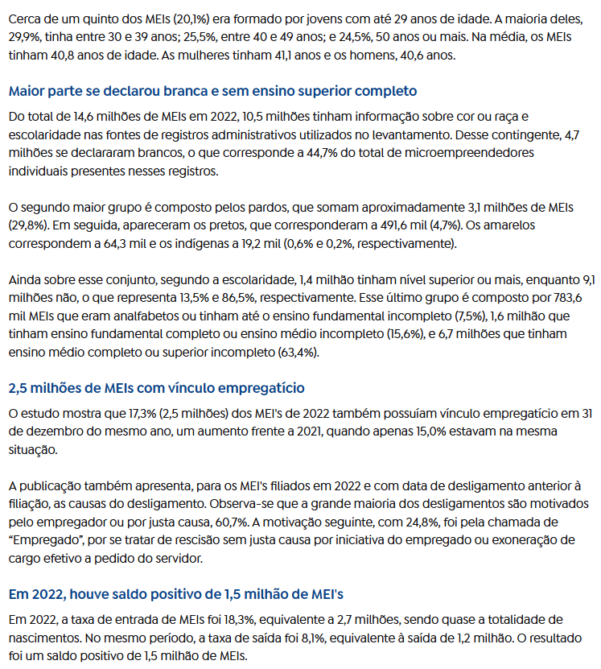

**Fonte:** Adaptado de AGÊNCIA GOV. IBGE: 4 milhões de inscritos no CadÚnico buscaram microempreendedorismo em 2022. Disponível em: <https://agenciagov.ebc.com.br/noticias/202408/ibge-4-milhoes-de-inscritos-no-cadunico-buscaram-microempreendedorismo-em-2022#:~:text=IBGE:%204%20milh%C3%B5es%20de%20inscritos%20no%20Cad%C3%9Anico%20buscaram%20microempreendedorismo%20em%202022,-Dados%20s%C3%A3o%20da&text=As%20Estat%C3%ADsticas%20dos%20Cadastros%20de,individuais%20(MEIs)%20no%20Brasil.>.

##### Imagem 15: Análise de Documentação

    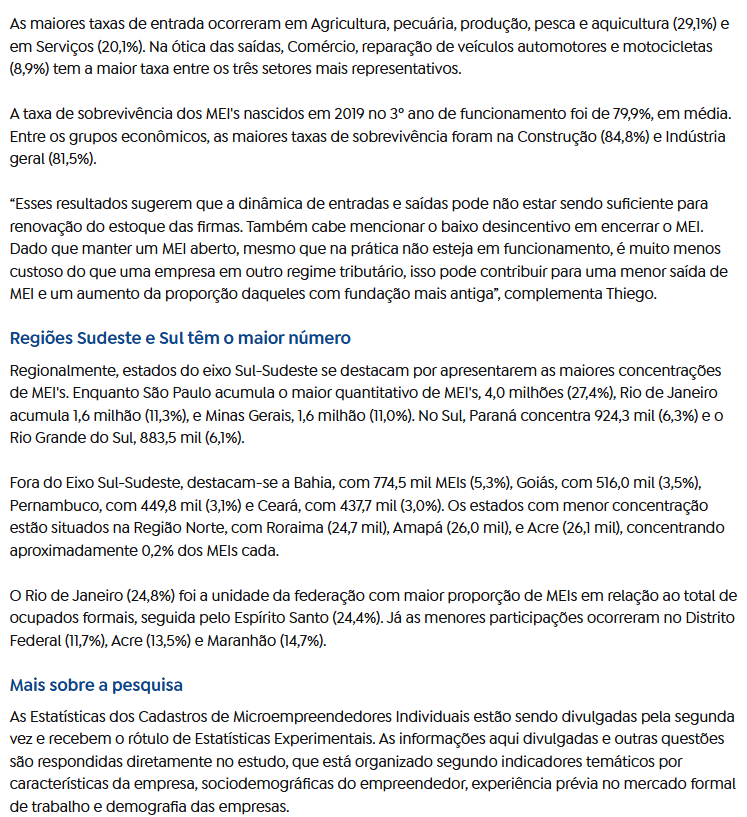

**Fonte:** Adaptado de AGÊNCIA GOV. IBGE: 4 milhões de inscritos no CadÚnico buscaram microempreendedorismo em 2022. Disponível em: <https://agenciagov.ebc.com.br/noticias/202408/ibge-4-milhoes-de-inscritos-no-cadunico-buscaram-microempreendedorismo-em-2022#:~:text=IBGE:%204%20milh%C3%B5es%20de%20inscritos%20no%20Cad%C3%9Anico%20buscaram%20microempreendedorismo%20em%202022,-Dados%20s%C3%A3o%20da&text=As%20Estat%C3%ADsticas%20dos%20Cadastros%20de,individuais%20(MEIs)%20no%20Brasil.>.

# Histórico de Versão

| Versão | Data | Descrição  | Autor(es) | Revisor(es) |
| :-----: | :----: | :----------: | :------------: | :--------: |
| 1.0 | 02/05/2025 | Criação do documento | [João Pedro](https://github.com/johnaopedro), [João Merlin](https://github.com/jvopBR), [Julia Gabriela](https://github.com/JuliaGabP), [Ryan Salles](https://github.com/RA-Salles)| [Gabriel](https://github.com/Gabrielfcoelho) |
| 1.1 | 02/05/2025 | Formatação, Padronização | [Ryan Salles](https://github.com/RA-Salles) | [Gabriel](https://github.com/Gabrielfcoelho) |
| 1.2 | 04/05/2025 | Adicionando links e corrigindo tabelas | [João Pedro Costa](https://github.com/johnaopedro)                   | [Ryan Salles](https://github.com/RA-Salles)                      |
| 1.3 | 07/05/2025 | Adicionando imagens e video | [João Pedro Costa](https://github.com/johnaopedro)                   | [Julia Gabriela](https://github.com/JuliaGabP)                      |
