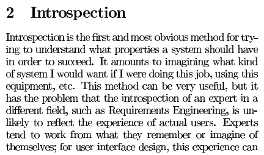
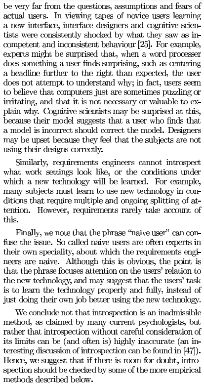

# Introspecção

## Funções dos autores

| Nome                                              | Função                                                                  | 
|---------------------------------------------------|-------------------------------------------------------------------------|
|[João Pedro Costa](https://github.com/johnaopedro) |Criação da página; Desenvolvimento da introspecção; Criação das tabelas. | 
|[Julia Gabriela](https://github.com/JuliaGabP)     |Desenvolvimento da introspecção; Criação das tabelas.                    | 
|[Ryan Salles](https://github.com/RA-Salles)        |Revisão geral.                                                           | 

    Autor(es): 
    <a href="https://github.com/johnaopedro" target="_blank">João Pedro Costa</a>

## Introdução

### Introspecção
A introspecção é uma abordagem utilizada na elicitação de requisitos que busca definir características essenciais de um sistema a partir de uma reflexão aprofundada sobre seu uso ideal. Por meio desse processo, o responsável pela análise imagina cenários hipotéticos nos quais determinadas tarefas seriam executadas, identificando assim os elementos indispensáveis para o funcionamento do software. No entanto, essa técnica apresenta desafios, pois a perspectiva dos especialistas pode não corresponder totalmente às necessidades e experiências dos usuários reais, especialmente no contexto do design de interfaces e da adoção de novas tecnologias.

### Desafios para Especialistas
Designers de interface, cientistas cognitivos e engenheiros de requisitos frequentemente enfrentam dificuldades ao compreender como os usuários aprendem novas tecnologias. Muitas vezes, especialistas ficam surpresos com o comportamento inconsistente dos usuários e têm dificuldade em entender o ambiente de trabalho e as condições para a adoção de novas tecnologias. A confusão em torno do termo "usuário ingênuo" também contribui para essa problemática. Conclui-se que a introspecção, sem considerar cuidadosamente o contexto, torna-se inviável.

## Metodologia

O processo de introspecção foi realizado individualmente pelos alunos **João Pedro** e **Julia Paulino**. Cada um se colocou na posição de usuário do aplicativo **Cadastro Único**, imaginando funcionalidades essenciais e desejáveis. Os requisitos elicitados por Julia Paulino estão descritos a seguir.

### Cronograma

| Nome          | Data       | Hora  |
|---------------|------------|-------|
| João Pedro    | 23/04/2025 | 12:30 |
| Julia Paulino | 23/04/2025 | 14:00 |

Fonte: João Pedro e Julia Paulino.

---

## João Pedro

João Pedro realizou a introspecção se colocando na posição de um usuário do aplicativo Cadastro Único. A partir dessa simulação, foram elicitados requisitos. Abaixo estão as tabelas 1 e 2, que apresentam os requisitos funcionais e não funcionais, respectivamente.

Legenda - Tabela 1:
 
- RFx: Requisitos Funcionais nºx.

<b>Tabela 1:</b> Requisitos Funcionais

| RF    | Nome do RF                                | Descrição                                                                                                                                  | Implementado |
|-------|-------------------------------------------|--------------------------------------------------------------------------------------------------------------------------------------------|--------------|
| RF01  | Cadastro de Usuário                       | O sistema deve permitir o cadastro de novos usuários, coletando informações pessoais como nome, CPF, endereço, e outros dados necessários. | Sim          |
| RF02  | Atualização de Dados                      | O sistema deve possibilitar ao usuário atualizar seus dados cadastrais a qualquer momento.                                                 | Sim          |
| RF03  | Consultar Situação Cadastral              | O sistema deve permitir que o usuário consulte o status de seu cadastro e a situação atual do benefício.                                   | Sim          |
| RF04  | Emissão de Comprovante de Cadastro        | O sistema deve possibilitar que o usuário gere e imprima um comprovante de cadastro atualizado.                                            | Sim          |
| RF05  | Filtragem de Benefícios                   | O sistema deve permitir ao usuário visualizar os benefícios aos quais ele pode ter direito com base nos dados cadastrados.                 | Sim          |
| RF06  | Upload de documentos                      | Permite ao usuário fazer upload de documentos para o sistema.                                                                              | Não          |

    Autor(es): <a href="https://github.com/johnaopedro" target="_blank">João Pedro</a>

Legenda - Tabela 2:

- RNFx: Requisitos Não-Funcionais nºx.

<b>Tabela 2:</b> Requisitos Não Funcionais

| RNF   | Nome do RNF                                        | Descrição                                                                                                                              | Implementado |
|-------|----------------------------------------------------|----------------------------------------------------------------------------------------------------------------------------------------|--------------|
| RNF01 | Usabilidade                                        | O aplicativo deve ser de fácil navegação, intuitivo, e acessível para todos os usuários, incluindo pessoas com deficiência.            | Sim          |
| RNF02 | Segurança                                          | O sistema deve garantir a segurança dos dados pessoais dos usuários, utilizando criptografia e práticas de segurança adequadas.        | Sim          |
| RNF03 | Performance                                        | O sistema deve ser capaz de processar as informações de cadastro e consultas rapidamente, com tempo de resposta inferior a 3 segundos. | Não          |
| RNF04 | Compatibilidade com Dispositivos                   | O aplicativo deve ser compatível com as principais plataformas móveis (Android e iOS).                                                 | Sim          |
| RNF05 | Disponibilidade                                    | O sistema deve garantir 99% de disponibilidade para os usuários, com tempo de inatividade mínimo.                                      | Não          |
| RNF06 | Acessibilidade para pessoas com deficiência visual | O aplicativo oferece recursos de acessibilidade para deficientes visuais, como leitores de tela.                                       | Não          |
| RNF07 | Backup e restauração de sessão                     | O aplicativo deve permitir backup e restauração das sessões do usuário, caso haja interrupção ou falha.                                | Não          |

    Autor(es): <a href="https://github.com/johnaopedro" target="_blank">João Pedro</a>

## Julia Paulino

Julia Paulino realizou a introspecção se colocando na posição de uma usuária do aplicativo Cadastro Único. A partir dessa simulação, foram elicitados requisitos. Abaixo estão as tabelas 3 e 4, que apresentam os requisitos funcionais e não funcionais, respectivamente.

Legenda - Tabela 3:
 
- RFx: Requisitos Funcionais nºx.

<b>Tabela 3:</b> Requisitos Funcionais

| RF    | Nome do RF                                | Descrição                                                                                                        | Implementado |
|-------|-------------------------------------------|------------------------------------------------------------------------------------------------------------------|--------------|
| RF01  | Consultar dados cadastrais                | Permite ao usuário visualizar seus dados no Cadastro Único.                                                      | Sim          |
| RF02  | Pré-cadastrar família                     | Possibilita iniciar um pré-cadastro para uma nova unidade familiar.                                              | Sim          |
| RF03  | Localizar postos de atendimento           | Mostra os CRAS mais próximos com base na localização do usuário.                                                 | Sim          |
| RF04  | Enviar notificações                       | Permite o envio de mensagens importantes ao usuário por meio do app.                                             | Sim          |
| RF05  | Integrar com o CNIS                       | Traz dados de vínculos e contribuições automaticamente do CNIS.                                                  | Sim          |
| RF06  | Chatbot de atendimento automatizado       | Implementa um chatbot para atendimento automatizado ao usuário.                                                  | Não          |
| RF07  | Notificação de pendências ou atualizações | Envia notificações sobre pendências ou atualizações necessárias ao usuário.                                      | Sim          |
| RF08  | Simulador de benefícios sociais           | Permite ao usuário simular quais benefícios sociais poderia receber.                                             | Não          |
| RF09  | Modo escuro                               | O aplicativo oferece uma opção de modo escuro para melhorar a experiência do usuário em ambientes com pouca luz. | Sim          |
| RF10  | Possibilidade de outros idiomas           | O aplicativo deve estar disponível em vários idiomas, permitindo maior acessibilidade.                           | Não          |

 
    Autor(es): <a href="https://github.com/JuliaGabP" target="_blank">Julia Gabriela</a>

Legenda - Tabela 4:

- RNFx: Requisitos Não-Funcionais nºx.

<b>Tabela 4:</b> Requisitos Não Funcionais

| RNF   | Nome do RNF                              | Descrição                                                                 | Implementado |
|-------|------------------------------------------|---------------------------------------------------------------------------|--------------|
| RNF01 | Interface intuitiva e amigável           | O design do aplicativo é simples e fácil de navegar para o usuário.       | Sim |
| RNF02 | Capacidade de atender grande base de usuários | O aplicativo suporta muitos usuários acessando simultaneamente.           | Sim |
| RNF03 | Integração com sistemas oficiais do governo | O aplicativo está integrado com sistemas oficiais, como o CNIS.           | Sim |
| RNF04 | Alta disponibilidade e recuperação de desastres | O aplicativo deve ter mecanismos de recuperação de dados e funcionamento em caso de falhas ou desastres. | Não |

    Autor(es): <a href="https://github.com/JuliaGabP" target="_blank">Julia Gabriela</a>

## Requisitos Elicitados (Finais)
Abaixo estão os requisitos finais, que foram elicitados a partir da introspecção realizada por João Pedro e Julia Paulino. Os requisitos foram unificados, removendo os requisitos desejáveis e mantendo apenas os já existentes no aplicativo. Abaixo estão as tabelas 5 e 6, que apresentam os requisitos funcionais e não funcionais, respectivamente.

Legenda - Tabela 5:
 
- RFx: Requisitos Funcionais nºx.
- ISx: Requisito nºx elicitado pela introspecção.

<b>Tabela 5:</b> Requisitos Funcionais

| ID   | RF    | Nome do RF                                | Descrição                                                                                                        | Implementado |
|------|-------|-------------------------------------------|------------------------------------------------------------------------------------------------------------------|--------------|
| IS1  | RF14  | Consultar dados cadastrais                | Permite ao usuário visualizar seus dados no Cadastro Único.                                                      | Sim          |
| IS2  | RF15  | Pré-cadastrar família                     | Possibilita iniciar um pré-cadastro para uma nova unidade familiar.                                              | Sim          |
| IS3  | RF16  | Localizar postos de atendimento           | Mostra os CRAS mais próximos com base na localização do usuário.                                                 | Sim          |
| IS4  | RF17  | Enviar notificações                       | Permite o envio de mensagens importantes ao usuário por meio do app.                                             | Sim          |
| IS5  | RF18  | Integrar com o CNIS                       | Traz dados de vínculos e contribuições automaticamente do CNIS.                                                  | Sim          |
| IS6  | RF19  | Cadastro de Usuário                       | O sistema deve permitir o cadastro de novos usuários, coletando informações pessoais.                            | Sim          |
| IS7  | RF20  | Atualização de Dados                      | O sistema deve possibilitar ao usuário atualizar seus dados cadastrais.                                          | Sim          |
| IS8  | RF21  | Consultar Situação Cadastral              | Permite verificar o status do cadastro e da situação dos benefícios.                                             | Sim          |
| IS9  | RF22  | Emissão de Comprovante de Cadastro        | Gera um comprovante de cadastro atualizado para o usuário.                                                       | Sim          |
| IS10 | RF23  | Filtragem de Benefícios                   | Permite visualizar benefícios disponíveis com base nos dados cadastrados.                                        | Sim          |
| IS11 | RF29  | Upload de documentos                      | Permite ao usuário fazer upload de documentos para o sistema.                                                    | Não          |
| IS12 | RF26  | Chatbot de atendimento automatizado       | Implementa um chatbot para atendimento automatizado ao usuário.                                                  | Não          |
| IS13 | RF27  | Notificação de pendências ou atualizações | Envia notificações sobre pendências ou atualizações necessárias ao usuário.                                      | Sim          |
| IS14 | RF28  | Simulador de benefícios sociais           | Permite ao usuário simular quais benefícios sociais poderia receber.                                             | Não          |
| IS15 | RF38  | Modo escuro                               | O aplicativo oferece uma opção de modo escuro para melhorar a experiência do usuário em ambientes com pouca luz. | Não          |
| IS16 | RF39  | Possibilidade de outros idiomas           | O aplicativo deve estar disponível em vários idiomas, permitindo maior acessibilidade.                           | Não          |

    Autor(es): <a href="https://github.com/johnaopedro" target="_blank">João Pedro</a>, <a href="https://github.com/JuliaGabP" target="_blank">Julia Gabriela</a>

---
Legenda - Tabela 6:

- RNFx: Requisitos Não-Funcionais nºx.
- ISx: Requisito nºx elicitado pela introspecção.

<b>Tabela 6:</b> Requisitos Não Funcionais

| ID   | RNF   | Nome do RNF                                        | Descrição                                                                                                | Implementado |
|------|-------|----------------------------------------------------|----------------------------------------------------------------------------------------------------------|--------------|
| IS17 | RNF10 | Interface intuitiva e amigável                     | O design do aplicativo é simples e de fácil navegação.                                                   | Sim          |
| IS18 | RNF11 | Capacidade de atender grande base de usuários      | Suporta um grande número de acessos simultâneos.                                                         | Sim          |
| IS19 | RNF12 | Integração com sistemas oficiais do governo        | Integrado com sistemas como o CNIS.                                                                      | Sim          |
| IS20 | RNF13 | Usabilidade                                        | Navegação intuitiva e acessibilidade geral.                                                              | Sim          |
| IS21 | RNF02 | Segurança                                          | Uso de criptografia e proteção de dados sensíveis.                                                       | Sim          |
| IS22 | RNF01 | Performance                                        | Resposta rápida nas interações do usuário (até 3 segundos).                                              | Não          |
| IS23 | RNF14 | Compatibilidade com Dispositivos                   | Compatível com Android e iOS.                                                                            | Sim          |
| IS24 | RNF06 | Disponibilidade                                    | Garantia de 99% de disponibilidade com mínimas interrupções.                                             | Sim          |
| IS25 | RNF17 | Alta disponibilidade e recuperação de desastres    | O aplicativo deve ter mecanismos de recuperação de dados e funcionamento em caso de falhas ou desastres. | Não          |
| IS26 | RNF15 | Acessibilidade para pessoas com deficiência visual | O aplicativo oferece recursos de acessibilidade para deficientes visuais, como leitores de tela.         | Sim          |
| IS27 | RNF16 | Backup e restauração de sessão                     | O aplicativo deve permitir backup e restauração das sessões do usuário, caso haja interrupção ou falha.  | Não          |

    Autor(es): <a href="https://github.com/johnaopedro" target="_blank">João Pedro</a>, <a href="https://github.com/JuliaGabP" target="_blank">Julia Gabriela</a>

---

## Conclusão

Os requisitos elicitados por essa técnica podem divergir dos demais, tendo em vista que é uma técnica aplicada por participantes do projeto, de maneira subjetiva e com base em percepções individuais.

---

## Video
O vídeo abaixo refere-se à introspecção descrita neste artefato, realizada no **Microsoft Teams**:

<iframe width="560" height="315" src="https://www.youtube.com/embed/wHObTZEY-_U?si=iRPZL2cwhnsewNyE" title="YouTube video player" frameborder="0" allow="accelerometer; autoplay; clipboard-write; encrypted-media; gyroscope; picture-in-picture; web-share" referrerpolicy="strict-origin-when-cross-origin" allowfullscreen></iframe>

## Validação

Uma entrevista presencial com um usuário foi realizada para fins de validação. As informações sobre a entrevista são apresentadas por meio da Tabela 7 e 8. 

    <b> Tabela 7:</b> Informações da Entrevista

| Campo   | Informação                                               |
| :-----: | :------------------------------------------------------: |
| Local   | [UnB - FCTE](https://maps.app.goo.gl/f8bxb23JLZJpw7REA)  |
| Data    | 05/06/2025                                               |
| Horário | 09:20                                                    |
| Duração | Cerca de 15 minutos                                      |

    <b>Autor(es)</b><a href="https://github.com/RA-Salles" target="_blank">Ryan Salles</a>

    <b> Tabela 8:</b> Participantes da Entrevista

| Nome                                         | Função                   |
| :------------------------------------------: | :----------------------: |
| Lucas                                        | Usuário/ Project Owner   |
| [João Pedro](https://github.com/johnaopedro) | Entrevistador            |
| [Ryan Salles](https://github.com/RA-Salles)  | Secretário/Desenvolvedor |

    <b>Autor(es)</b><a href="https://github.com/RA-Salles" target="_blank">Ryan Salles</a>

<iframe width="560" height="315" src="https://www.youtube.com/embed/MilbSATgUrU?si=7MT7yWhMW_BiFMZq" title="YouTube video player" frameborder="0" allow="accelerometer; autoplay; clipboard-write; encrypted-media; gyroscope; picture-in-picture; web-share" referrerpolicy="strict-origin-when-cross-origin" allowfullscreen></iframe>

## Referências

> GOGUEN, Joseph A.; LINDE, Charlotte. Techniques for Requirements Elicitation. In: IEEE International Symposium on Requirements Engineering, 1993. p. 152-164. Acesso em: 23/04/2025.

##### Imagem 1: Introspecção

    

**Fonte:** Adaptado de GOGUEN, Joseph A.; LINDE, Charlotte. *Techniques for requirements elicitation*. In: IEEE INTERNATIONAL SYMPOSIUM ON REQUIREMENTS ENGINEERING, 1993. p. 152–164.

##### Imagem 2: Introspecção

    

**Fonte:** Adaptado de GOGUEN, Joseph A.; LINDE, Charlotte. *Techniques for requirements elicitation*. In: IEEE INTERNATIONAL SYMPOSIUM ON REQUIREMENTS ENGINEERING, 1993. p. 152–164.

## Histórico de Versões

| Versão  | Data       | Descrição                                                                        | Autor(es)                                                                                                           | Revisor                                                             |
| :-----: | :----:     | :------------------------------------------------------------------------------: | :-----------------------------------------------------------------------------------------------------------------: | :-----------------------------------------------------------------: |
| 1.0     | 23/04/2025 | Introdução e requisitos iniciais                                                 | [João Pedro Costa](https://github.com/johnaopedro) [Julia Gabriela](https://github.com/JuliaGabP)                   | [Ryan Salles](https://github.com/RA-Salles)                         |
| 1.1     | 03/05/2025 | Correções de ortográfia                                                          | [João Pedro Costa](https://github.com/johnaopedro)                                                                  | [Ryan Salles](https://github.com/RA-Salles)                         |
| 1.2     | 04/05/2025 | Removendo requisitos desejáveis                                                  | [João Pedro Costa](https://github.com/johnaopedro)                                                                  | [Ryan Salles](https://github.com/RA-Salles)                         |
| 1.3     | 04/05/2025 | Adicionando links e corrigindo tabelas                                           | [João Pedro Costa](https://github.com/johnaopedro)                                                                  | [Ryan Salles](https://github.com/RA-Salles)                         |
| 1.4     | 07/05/2025 | Adicionando imagens, o video e referências                                       | [João Pedro Costa](https://github.com/johnaopedro)                                                                  | [Julia Gabriela](https://github.com/JuliaGabP)                      |
| 1.5     | 23/05/2025 | Adicionando coluna indicando implementação, adicionando dados de IS e desejados  | [João Pedro Costa](https://github.com/johnaopedro)                                                                  | [Julia Gabriela](https://github.com/JuliaGabP)                      |