# Questionário
## Introdução
Esse documento tem o propósito de apresentar os resultados do questionário realizado pelo grupo 4 para a matéria de Requisitos de Software lecionada durante o período de 2025.1 pelo docente André Barros de Sales. O questionário é uma técnica estruturada usada para coletar informações de um conjunto de stakeholders (usuários, clientes, especialistas, etc.). Ele é composto por uma série de perguntas (fechadas, abertas ou mistas) que podem ser aplicadas presencialmente, por e-mail ou online.  

O presente questionário foi elaborado com o propósito de conhecer mais sobre os usuários do aplicativo Cadastro Único para compreender por quê ele existe, quais suas principais funcionalidades e quais dificuldades os usuários possivelmente poderiam ter ao utilizar o aplicativo. Todos os dados foram coletados com o consentimento dos usuários e nenhum dado sensível (tais como nome, cpf, telefones, e-mails). 40 respostas válidas foram contabilizadas, no total.

## Gráficos dos resultados
Essa seção apresentará os resultados em formato de gráficos para facilitar a visualização dos dados
Gráfico sobre o consentimento de compartilhar as respostas a seguir  
**Gráfico 1: Aprova do termo de consentimento**  
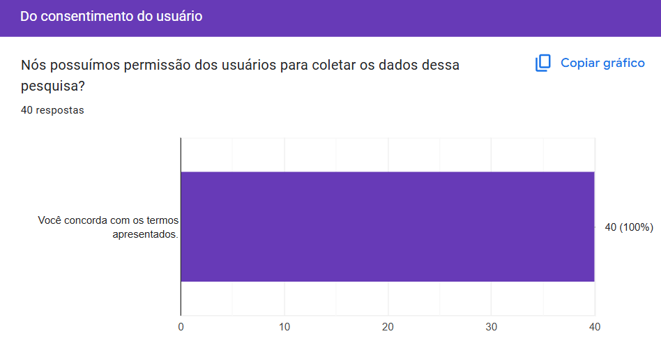

 Autor(a): <a href="https://github.com/JuliaGabP" target = "_blank">Julia Gabriela</a></h6>

Gráfico sobre o uso do aplicativo a seguir  
**Gráfico 2: Sobre já ter feito uso do aplicativo**  
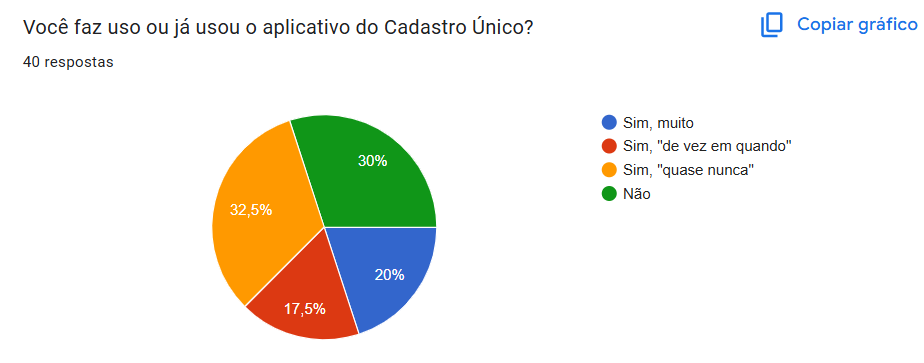

 Autor(a): <a href="https://github.com/JuliaGabP" target = "_blank">Julia Gabriela</a></h6>

Gráfico sobre o gênero dos participantes a seguir  
**Gráfico 3: Gênero**  

 Autor(a): <a href="https://github.com/JuliaGabP" target = "_blank">Julia Gabriela</a></h6>

Gráfico sobre a idade dos participantes a seguir  
**Gráfico 4: Idade**  
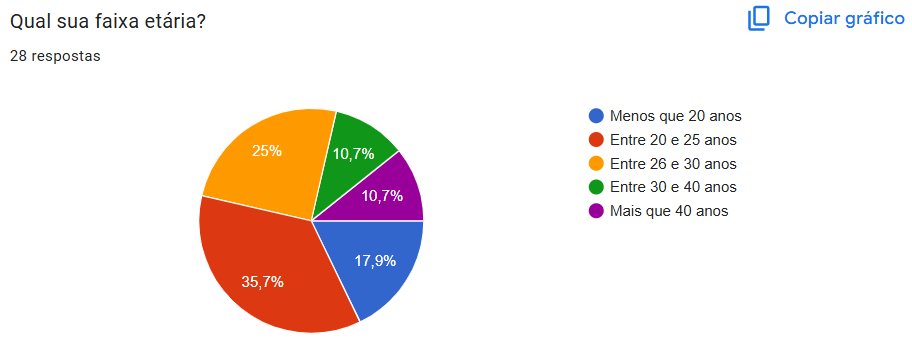

 Autor(a): <a href="https://github.com/JuliaGabP" target = "_blank">Julia Gabriela</a></h6>

Gráfico sobre a escolaridade dos participantes a seguir  
**Gráfico 5: Escolaridade**  
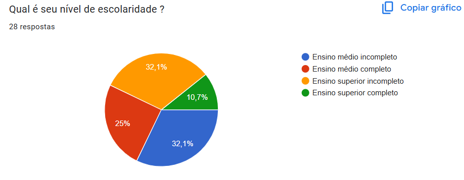

 Autor(a): <a href="https://github.com/JuliaGabP" target = "_blank">Julia Gabriela</a></h6>

Gráfico sobre o estado de residência dos participantes a seguir  
**Gráfico 6: Estado o qual reside**  
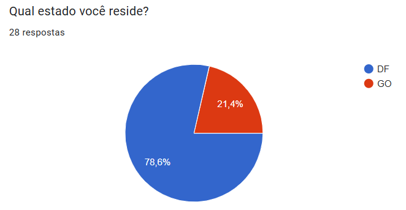

 Autor(a): <a href="https://github.com/JuliaGabP" target = "_blank">Julia Gabriela</a></h6>

Gráfico sobre a quantidade de moradores na residência do participante a seguir  
**Gráfico 7: Quantidade de moradores em casa**  
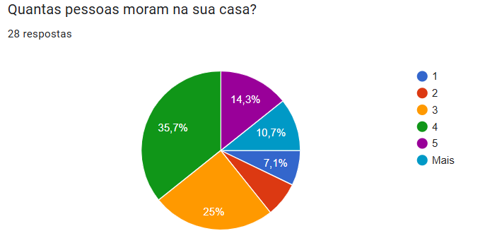

 Autor(a): <a href="https://github.com/JuliaGabP" target = "_blank">Julia Gabriela</a></h6>

Gráfico sobre  inscrição no Cadastro Único a seguir  
**Gráfico 8: Inscrição no Cadastro Único**  
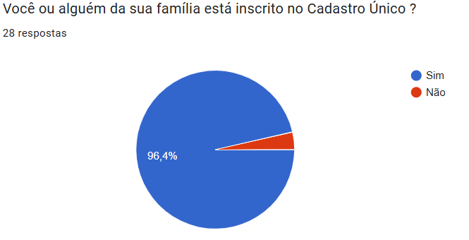

 Autor(a): <a href="https://github.com/JuliaGabP" target = "_blank">Julia Gabriela</a></h6>

Gráfico sobre o uso do CRAS a seguir  
**Gráfico 9: CRAS**  
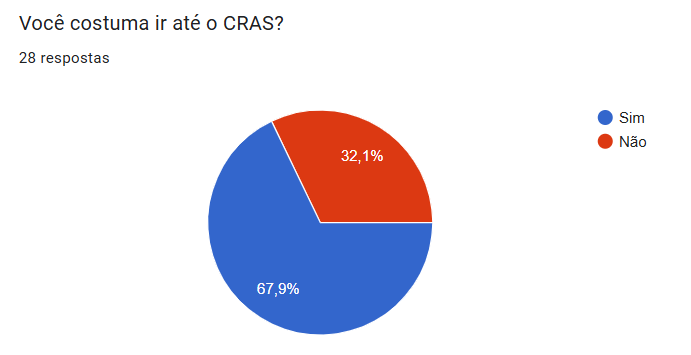

 Autor(a): <a href="https://github.com/JuliaGabP" target = "_blank">Julia Gabriela</a></h6>

Gráfico sobre o emprego do participante a seguir  
**Gráfico 10: Emprego**  
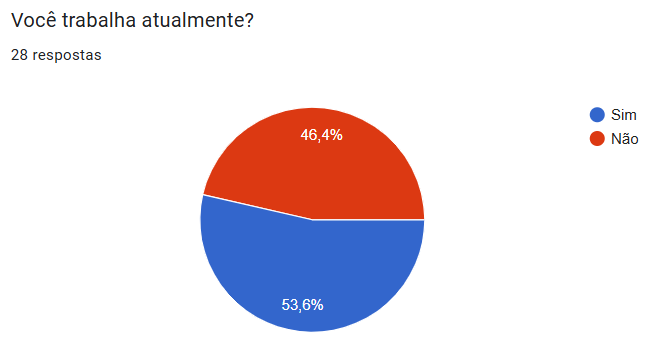

 Autor(a): <a href="https://github.com/JuliaGabP" target = "_blank">Julia Gabriela</a></h6>

Gráfico sobre o acesso a smartphone a seguir  
**Gráfico 11: Acesso a smartphone**   
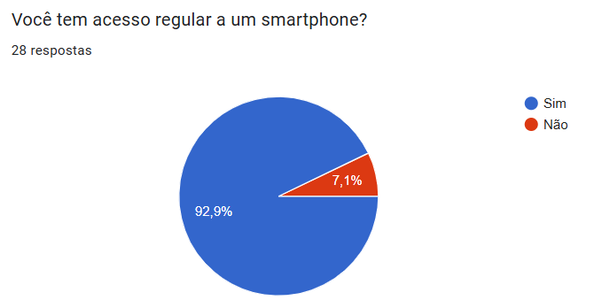

 Autor(a): <a href="https://github.com/JuliaGabP" target = "_blank">Julia Gabriela</a></h6>

Gráfico sobre a qualidade de conexão a seguir  
**Gráfico 12: Qualidade de conexão**  
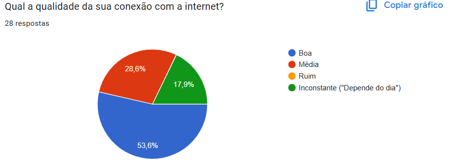

 Autor(a): <a href="https://github.com/JuliaGabP" target = "_blank">Julia Gabriela</a></h6>

Gráfico sobre o uso de aplicativos por parte do participante a seguir  
**Gráfico 13: Uso de aplicativos**  
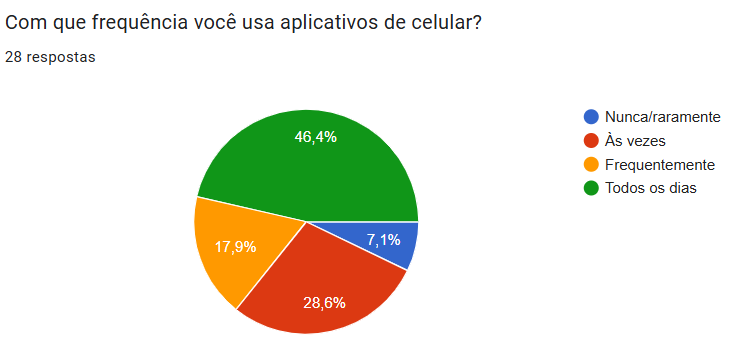

 Autor(a): <a href="https://github.com/JuliaGabP" target = "_blank">Julia Gabriela</a></h6>

Gráfico sobre a motivação do uso do app a seguir  
**Gráfico 14: Motivação do uso**  
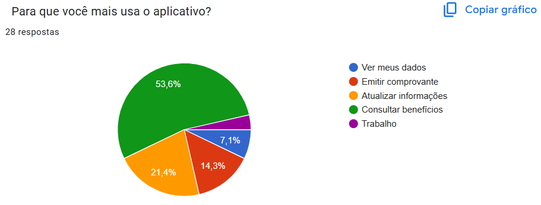

 Autor(a): <a href="https://github.com/JuliaGabP" target = "_blank">Julia Gabriela</a></h6>

Gráfico sobre a realização das necessidades por meio do app a seguir  
**Gráfico 15: Realização de necessidade**  

 Autor(a): <a href="https://github.com/JuliaGabP" target = "_blank">Julia Gabriela</a></h6>

Gráfico sobre a necessidade de auxílio a seguir  
**Gráfico 16: Auxílio para uso do aplicativo**  

 Autor(a): <a href="https://github.com/JuliaGabP" target = "_blank">Julia Gabriela</a></h6>

## Requisitos elicitados
Essa seção tratará dos requisitos elicitados a partir do questionário, apresentados por meio das Tabelas 1 e 2 como requisitos funcionais e não funcionais, respectivamente.

A fim de manter a rastreabilidade dos requisitos, a legenda utilizada será:
- RFX : Requisito de tipo Funcional n° X
- RNFX : Requisito de tipo Não Funcional n° X
- QSTX : Número de identificação de Requisito do Questionário n° X

O estado de um requisito poderá ser **implementado**, **não implementado** ou **desconhecido**.

Abaixo temos a tabela 1 com os requisitos funcionais e a tabela 2 com os requisitos não funcionais.

Legenda - Tabela 1:
 
- RFx: Requisitos Funcionais nºx.
- RNFx: Requisitos Não-Funcionais nºx.

<b>Tabela 1:</b> Requisitos Funcionais

| Tipo | Nome | Descrição | ID | Estado |
|:----:| :--: | :-------: |:--:|:------:|
| RF01   | Cadastro de Famílias    | Permitir o cadastro de famílias com renda mensal de até meio salário mínimo por pessoa ou vinculadas a programas sociais| QST01 | Implementado |
| RF02   | Cadastro de Pessoas     | Registrar informações pessoais, como dados de identificação, documentação, frequência escolar, grau de instrução, entre outros.    | QST02 | Implementado |
| RF03   | Cadastro de Domicílios  | Registrar características do domicílio, como tipo de construção, abastecimento de água, iluminação, escoamento sanitário, entre outros.   | QST03 | Implementado |
| RF04   | Cadastro de Agricultores Familiares | Registrar informações sobre posse de terra, atividade primária, contratação de mão de obra e composição da renda. | QST04 | Implementado |
| RF05   | Atualização de Dados | Permitir a atualização dos dados das famílias cadastradas. | QST05 | Desconhecido |
| RF06   | Processamento de Dados | Transmitir os dados coletados para a CAIXA, processá-los e atribuir um Número de Identificação Social (NIS) único para cada pessoa cadastrada.| QST06 | Implementado |
| RF08   | Consulta de Dados | Permitir a consulta de dados cadastrais, situação de benefícios e ações de gestão de benefícios por meio do NIS. | QST07 | Implementado |

    <b> Autor(es):</b> 
    <a href="https://github.com/JuliaGabP" target="_blank">Julia Gabriela</a>,
    <a href="https://github.com/RA-Salles" target="_blank">Ryan Salles</a>.

Legenda - Tabela 2:
 
- RFx: Requisitos Funcionais nºx.
- RNFx: Requisitos Não-Funcionais nºx.

<b>Tabela 2:</b> Requisitos Não Funcionais

| **Tipo** | **Nome** | **Descrição** | **ID** | **Estado** |
|:----:| :--: | :-------: |:--:|:------:|
| RNF02  | Segurança  | Garantir a confidencialidade dos dados por meio de termos de responsabilidade e acordos de cooperação técnica, além de implementar mecanismos de autenticação para acesso aos dados. | QST08 | Implementado |  
| RNF03  | Escalabilidade | Suportar o cadastro e atualização de dados de até 19,5 milhões de famílias. | QST09 | Desconhecido |
| RNF04  | Conformidade Legal | Atender às regulamentações definidas pela Senarc e portarias relacionadas. | QST10 | Implementado |
| RNF05  | Acessibilidade | Garantir que o sistema seja acessível para operadores municipais e estaduais. | QST11 | Implementado |
| RNF06  | Disponibilidade | Garantir que o sistema esteja disponível para uso diário. | QST12 | Implementado |
| RNF07  | Funcionalidades Off-line  | O sistema deve ser compatível com o aplicativo off-line utilizado pelos municípios para coleta e digitação de dados.  | QST13 | Não Implementado |

    <b> Autor(es):</b> 
    <a href="https://github.com/JuliaGabP" target="_blank">Julia Gabriela</a>,
    <a href="https://github.com/RA-Salles" target="_blank">Ryan Salles</a>.

## Referências Bibliográficas
- SOMMERVILLE, Ian. *Engenharia de Software*. 10. ed. São Paulo: Pearson, 2019.
- PRESSMAN, Roger S. *Engenharia de Software: Uma Abordagem Profissional*. 7. ed. Porto Alegre: AMGH, 2016.
- PAULA FILHO, Wilson de Pádua. *Engenharia de Software: Fundamentos, Métodos e Padrões*. Rio de Janeiro: LTC, 2003.

## Histórico de Versões
| Versão | Data | Descrição  | Autor        | Revisor |
| :-----: | :----: | :----------: | :------------: | :--------: |
| 1.0    | 27/04/2025 | Criação do questionário             | [Julia Gabriela](https://github.com/JuliaGabP)                   | [Ryan Salles](https://github.com/RA-Salles)  |
| 1.1    | 28/04/2025 | Melhora na organização do documento | [Julia Gabriela](https://github.com/JuliaGabP)       | [Ryan Salles](https://github.com/RA-Salles)  |
| 1.2    | 30/04/2025 | Conserto de imagens quebradas       | [Ryan Salles](https://github.com/RA-Salles)          | [João Pedro](https://github.com/johnaopedro), [João Merlin](https://github.com/jvopBR), [Julia Gabriela](https://github.com/JuliaGabP) |
| 1.3     | 03/05/2025 | Adicionando requisitos elicitados   | [Ryan Salles](https://github.com/RA-Salles)          | [João Pedro](https://github.com/johnaopedro) |
| 1.4 | 04/05/2025 | Adicionando links e corrigindo tabelas | [João Pedro Costa](https://github.com/johnaopedro)                   | [Ryan Salles](https://github.com/RA-Salles)                      |
