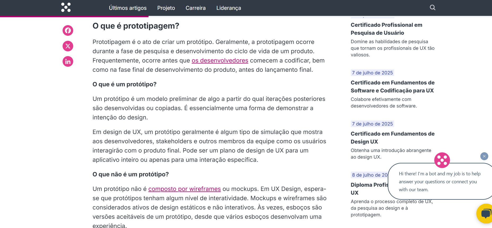

# Inspeção - Lista de Verificação 4

## Introdução

Este documento apresenta o resultado da **inspeção** realizada pelo [Grupo 4](https://github.com/Requisitos-de-Software/2025.1-Cadastro-Unico) sobre a [Lista de Verificação](../../verificacao/checklist_4.md) referente ao [Grupo 5](https://github.com/Requisitos-de-Software/2025.1-IBGE), cujo foco de trabalho está o aplicativo do IBGE, para a **Entrega 4** do projeto. A inspeção tem como objetivo avaliar a completude, clareza e aplicabilidade dos itens verificados, conforme os critérios e orientações estabelecidos na disciplina.

## Funções dos autores

| Nome                                              | Função                                                                  | 
|---------------------------------------------------|-------------------------------------------------------------------------|
| [RA-Salles](https://github.com/RA-Salles)         | Criação da página; Adição de tabelas; Preenchimento da conformidade dos itens | 

    Autor(es): 
    <a href="https://github.com/mandicrz" target="_blank">Amanda Cruz</a>

## Metodologia

A técnica utilizada para avaliação foi a Inspeção, que consiste em uma revisão detalhada do documento de checklist. Cada artefato foi analisado um por um pelo(a) grupo, e por fim, revisada por [Ryan Salles](https://github.com/RA-Salles) e [Amanda Cruz](https://github.com/mandicrz), buscando identificar:

- Itens faltando ou inconscistências;
- Clareza e precisão das descrições;
- Conformidade com o Plano de Ensino e diretrizes do professor.

Durante a análise, as respostas serão preenchidas de acordo com a conformidade (Conforme, Não Conforme ou Incompleto) dos itens. Logo após, serão feitas observações a respeito dos ID's relacionados que não estão de acordo (não conformes), que podem ser melhorados (incompletos) e que forem relevantes.

## Inspeção dos Itens

As Tabelas de 1 e 2, representadas a seguir, contêm os itens inspecionados dos elementos de Desenvolvimento do Projeto e Conteúdo da Disciplina, já as Tabelas 3 a 5 possuem a inspeção das historias de usuário, o backlog e a NFR.

---

### Desenvolvimento do Projeto

<strong>Tabela 1:</strong> Checklist de Desenvolvimento do Projeto

| **ID** |                       **Item**                       | **Conformidade** |
| :----: | :--------------------------------------------------: | :----------: |
|  DS01  |         Padronização do Histórico de Versão          |  Conforme   |
|  DS02  |          Autor e revisor para cada artefato          |  Conforme   |
|  DS03  | Referências e/ou bibliografia em todos os artefatos  |  Conforme   |
|  DS04  |    Legenda e fonte em todas as imagens e tabelas     |  Conforme   |
|  DS05  |          Introdução do texto dos artefatos           |  Conforme   |
|  DS06  | Cronograma executado além do inicialmente planejado  |  Conforme   |
|  DS07  |                  Atas das reuniões                   |  Conforme   |
|  DS08  |                Gravação das reuniões                 |  Conforme   |
|  DS09  | Upload de apresentação no YouTube como não "listado" |  Conforme   |

    Autor(es): <a href="https://github.com/mandicrz" target="_blank">Amanda Cruz</a>, <a href="https://github.com/johnaopedro" target="_blank">João Pedro Costa</a>

---

### Conteúdo da Disciplina

<strong>Tabela 3:</strong> Checklist de Conteúdo da Disciplina - Modelagem de Requisitos - Ágil

| **ID** |                       **Item**                                                         | **Conformidade** |
| :----: | :------------------------------------------------------------------------------------: | :------:         |
| CD01	 | O objetivo do protótipo está claramente definido                                       | Conforme         |   
| CD02	 | O protótipo apresenta a fonte com base em requisitos funcionais e não funcionais       | Conforme         | 
| CD03	 | O protótipo foi construído com base nas necessidades e perfil dos usuários finais      |	Conforme         |
| CD04	 | O nível de fidelidade do protótipo (baixa, média, alta) é adequado à fase do projeto   |	Conforme         |  
| CD05   | O protótipo foi validado com usuários, clientes ou stakeholders                        | Não Conforme     |
| CD06   | A verificação dos artefatos do projeto seguiu uma metodologia padronizada              | Conforme         |
| CD07   | Os novos componentes seguem os padrões                                                 | Conforme         |

    
    <a href="https://github.com/RA-Salles" target="_blank">Ryan Salles</a>

## Observações

A partir da inspeção realizada, as seguintes observações foram feitas:

- Tabela de verificação do grupo, na seção de referências, possui um item avulso. Isso pode ser facilmente consertado.

## Gravação da Inspeção

O vídeo abaixo refere-se à inspeção descrita neste artefato, realizada no **Microsoft Teams**, conforme a data e horário da reunião mencionados na Tabela 6.

<strong>Tabela 6:</strong> Data e duração da gravação

|    Data    | Início | Término |
| :--------: | :----: | :-----: |
| 23/06/2025 |  21:42 |  22:02  |

<strong>Autor(es):</strong><a href="https://github.com/mandicrz" target="_blank">Amanda Cruz</a>

<iframe width="560" height="315" src="https://www.youtube.com/embed/M_tugjyus-4?si=APLDnhkPp6qHp3fT" title="YouTube video player" frameborder="0" allow="accelerometer; autoplay; clipboard-write; encrypted-media; gyroscope; picture-in-picture; web-share" referrerpolicy="strict-origin-when-cross-origin" allowfullscreen></iframe>

## Conclusão

O grupo 5 apresentou uma boa performance para essa entrega, com um protótipo excepcional e uma boa apresentação dos artefatos elaborados, pecando apenas ao falhar em validar o protótipo com o cliente. 

O grupo 4 expressa grandes esperanças que isso será facilmente consertado, contribuindo para a entrega final.

## Referências

> BARROS, André. Plano de Ensino, RE-012025, Turma 3. Disponível em: <https://aprender3.unb.br/pluginfile.php/3106711/mod_resource/content/55/Lista%20de%20Verifificac%CC%A7a%CC%83o%20-%20Plano_de_Ensino%20RE%20012025%20Turma%2003%20v1.pdf>. Acesso em: 01 junho 2025.

A figura 1 apresenta a lista de vericação de desenvolvimento do projeto.

<strong>Figura 1:</strong> Lista de Verificação - Desenvolvimento (DS01 - DS09)

<strong>Fonte:</strong> André Barros, 2025

> SOMMERVILLE, Ian. Engenharia de Software. 9. ed. São Paulo: Pearson, 2011, p. 74-75. Disponível em: https://www.facom.ufu.br/~william/Disciplinas%202018-2/BSI-GSI030-EngenhariaSoftware/Livro/engenhariaSoftwareSommerville.pdf

> PRESSMAN, Roger S.; MAXIM, Bruce R. Software Engineering: A practitioner's approach. Nova Iórque: McGraw-Hill Education, 2020. 

>BRUTON, L. A complete guide to prototyping - UX Design Institute. Disponível em: <https://www.uxdesigninstitute.com/blog/prototyping-guide/>.

<strong>Figura 2:</strong> O que é prototipagem

    

<strong>Fonte:</strong> BRUTON (2025)

>BOICHEVA, S. What is Prototype Design? [Guide 2024]. Disponível em: <https://htmlburger.com/blog/prototype-design/>.

<strong>Figura 3:</strong> O que é prototipagem

    

<strong>Fonte:</strong> BOICHEVA (2025) 

> SIQUEIRA, Fábio Levy. Gerência e Qualidade de Software - Aula 06 - Técnica de revisão. 2018. Disponível em: < https://youtu.be/nA1BVDd9GUE >. Acesso em: 20/06/2025.

## Histórico de Versão

| Versão |    Data    |        Descrição         |                   Autor                    |                   Revisor                   |
| :----: | :--------: | :----------------------: | :----------------------------------------: | :-----------------------------------------: |
|  1.0   | 02/06/2025 | Criação e elaboração do documento    | [Amanda Cruz](https://github.com/mandicrz)| [Ryan Salles](https://github.com/RA-Salles) |
|  2.0   | 23/06/2025 | Adequação do modelo para a entrega 5    | [Ryan Salles](https://github.com/RA-Salles) | [João Pedro](https://github.com/johnaopedro)  |
