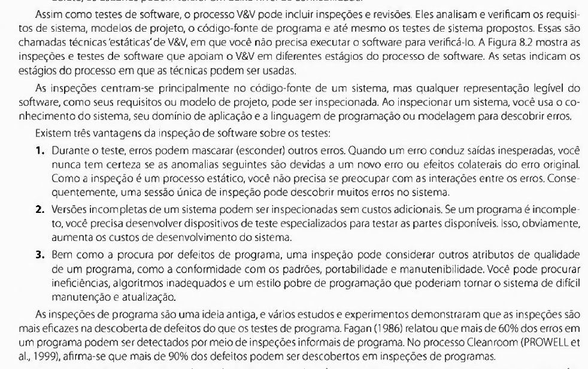
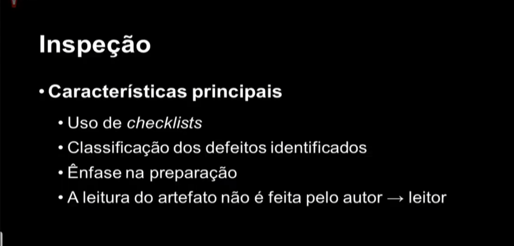

# Inspeção Fagan – Etapa 4

## Funções dos autores

    <b>Tabela 1</b>:
    Funções dos autores no artefato

| Nome                                              | Função                                                                   | 
|---------------------------------------------------|------------------------------------------------------------------------- |
|[João Pedro Costa](https://github.com/johnaopedro) | Criação da página; Desenvolvimento da introdução; Criação das tabelas; Criação do template da inspeção pelo metodo de Fagan | 
|[Ryan Salles](https://github.com/RA-Salles)        | Revisão geral; Manutenção de tabelas; Refatoração; Adição de informações | 
|[Amanda Cruz](https://github.com/RA-Salles)        | Correção e formatação do documento; Adição de tabelas; Desenvolvimento da inspeção | 

    Autor(es): 
    <a href="https://github.com/johnaopedro" target="_blank">João Pedro Costa</a>

## Introdução

A inspeção Fagan é uma técnica formal de revisão de artefatos desenvolvida por M. E. Fagan na IBM em 1976. É um processo estruturado que pode identificar e eliminar aproximadamente 80% dos defeitos durante o desenvolvimento de software, além de reduzir custos e prazos em cerca de 30%. O processo é composto por seis etapas fundamentais: Planejamento, Visão Geral, Preparação (com checklist), Reunião de Inspeção, Retrabalho e Follow-up.

Pela sua natureza como uma forma de verificação, o propósito de realização de uma inspeção é obter uma visualização clara dos defeitos encontrados nos artefatos inspecionados para que seja possível consertar os defeitos e melhor atender as partes interessadas.

### Benefícios da Inspeção

- Redução significativa de defeitos reportados pelos usuários
- Aumento da satisfação do cliente
- Maior produtividade no desenvolvimento
- Melhor cumprimento de cronogramas
- Treinamento cruzado rápido de desenvolvedores e mantenedores
- Melhoria contínua do processo através da remoção de defeitos sistêmicos
- Aprendizado rápido dos autores para evitar criar defeitos
- Construção de equipe mais coesa

## Metodologia

O processo de inspeção Fagan segue uma estrutura rigorosa que visa maximizar a detecção e correção de defeitos. Esta metodologia requer uma definição clara do estado do produto de trabalho a ser inspecionado, com participantes assumindo papéis bem definidos durante todo o processo. É essencial que seja dedicado tempo adequado para a preparação dos inspetores, que utilizam checklists específicos para guiar sua análise. O processo estabelece critérios claros de entrada e saída, garantindo que cada etapa seja concluída adequadamente antes de prosseguir. Toda a inspeção é devidamente documentada, incluindo a coleta de dados relevantes, e são estabelecidos procedimentos claros para o retrabalho e sua verificação.

Para os artefatos de planejamento, nossa inspeção terá um foco especial na verificação da completude e consistência do cronograma, na adequação das ferramentas escolhidas, na clareza da metodologia definida e na viabilidade do planejamento como um todo. Aspectos como a distribuição equilibrada de tarefas, a definição clara de responsabilidades e a adequação dos prazos estabelecidos serão cuidadosamente analisados. Também será dada atenção especial à integração entre diferentes elementos do planejamento, como a relação entre o cronograma e o heatmap de disponibilidade da equipe.

### Processo de Inspeção

O processo de inspeção Fagan é rigorosamente estruturado e requer:

1. Definição clara do estado do produto de trabalho a ser inspecionado
2. Participantes com papéis bem definidos
3. Tempo adequado de preparação para os inspetores
4. Checklists específicos para guiar a inspeção
5. Critérios de entrada e saída bem estabelecidos
6. Documentação apropriada e coleta de dados
7. Procedimentos claros para retrabalho e verificação

### Resultados da inspeção

Os artefatos resultantes da inspeção serão utilizados durante o processo de análise de resultados, retrabalho e "follow-up" e são:

1. Relatório do estado do documento;
2. Registro dos defeitos encontrados.

Esses artefatos serão utilizados para localizar e corrigir os defeitos encontrados. 

### Follow-up
Após a correção dos defeitos encontrados, o moderador deverá ser notificado pelo responsável e deverá verificar se tais correções foram aceitas. Caso 
necessário, uma nova inspeção será realizada.

---

# Inspeção

Essa seção descreve como se deu a inspeção realizada para a **Etapa 4**.

## 1. Planejamento da Inspeção

Essa seção apresentará todos os planejamentos para inspeções elaborados.

Como alvo geral, cada inspeção deverá possuir como alvo artefatos ou subartefatos da Entrega 3. Com isso, cada nova inspeção deverá ter como alvo documentos **não inspecionados** ou **inspecionados parcialmente**.

A Tabela 2 abaixo apresenta os artefatos da Entrega 4:

    <b>Tabela 2</b>:
    Artefatos da Entrega 4

|               Artefato                |      Situação    |
| :----------------------------------:  | :--------------: | 
| NFR Framework                         | Não Inspecionado |
| Histórias de Usuário                  | Não Inspecionado |
| Backlog de Desenvolvimento do Produto | Não Inspecionado |

    Autor(es): 
    <a href="https://github.com/mandicrz" target="_blank">Amanda Cruz</a>

### 1.1. Planejamento para Inspeção I para a etapa 4

A Tabela 3 a seguir descreve o planejamento para a Inspeçao I referente a Etapa 4 do projeto.

    <b>Tabela 3</b>:
    Planejamento da Inspeção I

| Item                         | Detalhes                                                                    |
|------------------------------|-----------------------------------------------------------------------------|
| **Artefatos Alvo**           | NFR Framework; Histórias de Usuário; Backlog de Desenvolvimento do Produto  |
| **Objetivo dos Artefatos**   | Modelar os requisitos elicitados durante a etapa 2 utilizando métodos ágeis |
| **Moderador/Inspetor**       | Amanda Cruz                                                                 |
| **Autor/Leitor**             | João Igor                                                                   |
| **Data da Inspeção**         | 30/06/2025                                                                  |
| **Horário**                  | 18:30 - 18:45                                                               |
| **Pauta da Reunião**         | Revisão formal dos artefatos da quarta etapa elaborados pelo grupo 4        |

    Autor(es): 
    <a href="https://github.com/mandicrz" target="_blank">Amanda Cruz</a>

## 2. Preparação

Ao contrário do planejamento, que exigiu o detalhamento do planejamento de cada inspeção realizada para essa etapa, a preparação
foi e deve ser unificada para permitir uma lista coesa de defeitos e menos ou nenhuma incoerência entre os defeitos observados 
entre as inspeções dessa etapa.

Cada participante da reunião foi encarregado de verificar o documento por conta própria antes da reunião de inspeção utilizando as listas de inspeção.

Para verificar a conformidade dos artefatos, foram utilizadas as listas de verificação presentes na Tabela 4, a mesma pode ser lida de acordo com a seguinte legenda:

- **ET4_LSTX        :** ID da lista utilizada para a verificação dessa etapa
- **Título          :** Título da lista de verificação
- **Disponível em   :** Local onde a lista pode ser encontrada 

    <b>Tabela 4:</b> Listas de verificação utilizadas

| ID         | Título                                                            | Disponível em                                                             |
|------------|-------------------------------------------------------------------|---------------------------------------------------------------------------|
| ET4_LST1   | Lista de verificação para a quarta etapa elaborada pelo grupo 4   | [Link](../../verificacao/checklist_4.md)                                  |
| ET4_LST2   | Lista de verificação - Etapa 4                                    | [Link](https://aprender3.unb.br/mod/resource/view.php?id=1399913)         |

    <b>Autor(es):</b> <a href="https://github.com/RA-Salles" target="_blank">Ryan Salles</a>

## 3. Reuniões de Inspeção

Essa seção descreve quais reuniões foram realizadas para o fim de inspecionar a etapa 4. As reuniões contém gravações realizadas via **Microsoft Teams**.

### 3.1. Inspeção I
Seguindo o planejamento realizado, a inspeção I foi realizada como segue a ata e o vídeo:

* **Ata da Reunião de Inspeção I da etapa 4**
    *   **Data:** 30/06/2025
    *   **Horário:** XX:YY - XX:YY
    *   **Participantes:** Amanda Cruz, João Igor
    *   **Local:** Remoto

<!-- Colocar o link aqui -->

## 4. Resultados das Inspeções

Nessa seção, serão apresentados os defeitos que cada inspeção identificou.

### 4.1 Resultados da Inspeção I

A Tabela 5 apresenta os defeitos encontrados durante a inspeção I e pode ser lida de acordo com a seguinte legenda: 

- **DEFX:** Identificador único de defeito encontrado
- **Defeito:** Descrição do defeito
- **Artefato:** Local onde o defeito foi encontrado

    <b>Tabela 5:</b> Listas de Defeitos encontrados na Inspeção I.

| ID    | Defeito                                                               | Artefato                                          |
|------ |-------------------                                                    |-------------------------------                    |
| DEFX  | AQUI A DESCRIÇÃO DO DEFEITO ENCONTRADO                                | [AQUI O ARTEFATO ONDE O DEFEITO FOI ENCONTRADO]() |

<!--
[Cenários](../../modelagem/cenarios.md)
[Casos de Uso](../../modelagem/caso_de_uso.md)
[Especifição suplementar](../../modelagem/especificacao_suplementar.md)
[Léxicos](../../modelagem/lexico.md)

-->

    <b>Autor(es):</b> <a href="https://github.com/RA-Salles" target="_blank">Ryan Salles</a>

---

## Bibliografia

> BARHATE, B. H. Software Inspection Improves Quality of Software Product. *International Journal of Computer Science & Informatics*, Vol.- II, Issue-1, 2. 2013. [Link para o artigo](../../assets/referencias/inspecao_fagan/Software_Inspection_Improves_Quality_of_Software_P.pdf)

> Sommerville, Ian. Engenharia de software. 08. ed. São Paulo: Pearson Addison Wesley, 2011

> SIQUEIRA, Fábio Levy. Gerência e Qualidade de Software - Aula 06 - Técnica de revisão. 2018. Disponível em: < https://youtu.be/nA1BVDd9GUE >. Acesso em: 20/06/2025.

As Figuras 1 a 3 apresentam imagens que representam a bibliografia utilizada para elaboração desse documento.

    <b>Figura 1:</b> Apresentação de Fábio L. Siqueira sobre técnicas de inspeção

    

    <b>Fonte:</b> Adaptado de SOMMERVILLE (2011).</a>

    <b>Figura 2:</b> Apresentação de Fábio L. Siqueira sobre técnicas de inspeção

    

    <b>Fonte:</b> Adaptado de SIQUEIRA (2025).</a>

    <b>Figura 2:</b> Diagrama de Barhate sobre inspeções

    

    <b>Fonte:</b> Adaptado de BARHATE (2013).</a>

---

## Histórico de Versão

| Versão |    Data    | Descrição  |   Autor  |  Revisor  |
| :----: | :--------: | :---------:| :-------:| :-------: |
|  1.0   | 21/06/2025 | Criação do Documento                                                             | [João Pedro Costa](https://github.com/johnaopedro) | [Ryan Salles](https://github.com/RA-Salles)        |
|  1.1   | 21/06/2025 | Desenvolvimento da introdução                                                    | [João Pedro Costa](https://github.com/johnaopedro) | [Ryan Salles](https://github.com/RA-Salles)        |
|  1.2   | 21/06/2025 | Criação do template da inspeção pelo metodo de Fagan e Criação das tabelas       | [João Pedro Costa](https://github.com/johnaopedro) | [Ryan Salles](https://github.com/RA-Salles)        |
|  1.3   | 22/06/2025 | Refatoração do documento em preparo para a inspeção a ser realizada              | [Ryan Salles](https://github.com/RA-Salles)        | [João Pedro Costa](https://github.com/johnaopedro) |
|  1.3   | 22/06/2025 | Desenvolvimento da inspeção da etapa 4                                           | [Ryan Salles](https://github.com/RA-Salles)        | [João Pedro Costa](https://github.com/johnaopedro) |