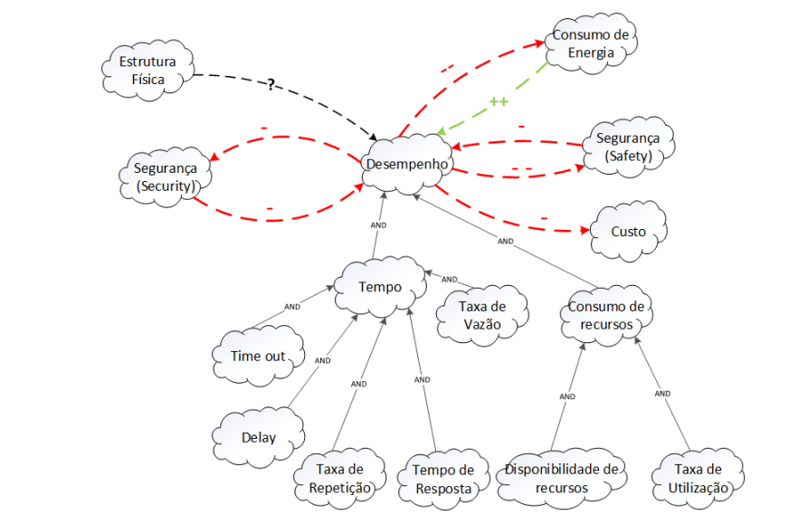
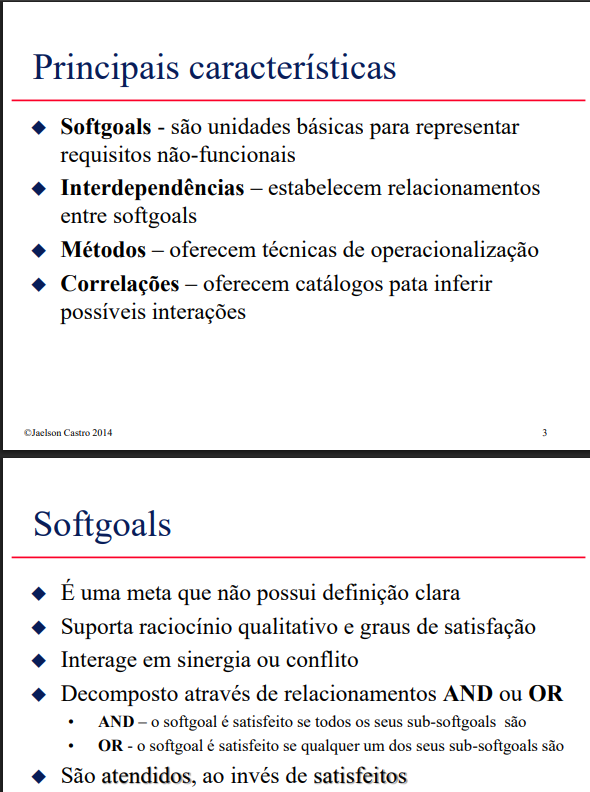

# NFR Framework

## Funções dos autores

| Nome                 | Função                                                            | 
|----------------------|----------------------------------------------------------------   |
|[Amanda Cruz](https://github.com/mandicrz)|-| 
|[Gabriel Flores](https://github.com/Gabrielfcoelho)| Adaptação de Figura e criação das tabelas da NFR 03| 
|[João Igor](https://github.com/JoaoPC10)|-| 
|[João Pedro Costa](https://github.com/johnaopedro)|-| 
|[Julia Gabriela](https://github.com/JuliaGabP)|Criação do documento; Preenchimento da parte teórica; Explicação do requisito 07| 
|[Ryan Salles](https://github.com/RA-Salles)|-| 

    Autor(es): 
    <a href="https://github.com/JuliaGabP" target="_blank">Julia Gabriela</a>

## Introdução
O desenvolvimento de sistemas de software não depende apenas da implementação de requisitos funcionais, mas também da garantia de que esses sistemas cumpram atributos de qualidade, como desempenho, segurança, usabilidade e confiabilidade. Esses atributos são descritos por meio dos requisitos não funcionais (Non-Functional Requirements – NFRs), que exercem papel importante na aceitação, desempenho e manutenção do sistema ao longo do tempo. O NFR Framework, surge como uma abordagem sistemática para representar, analisar e decompor requisitos não funcionais desde as fases iniciais da engenharia de requisitos. O framework utiliza uma estrutura baseada em metas e refinamentos para tratar a natureza muitas vezes ambígua e subjetiva dos NFRs, permitindo que diferentes alternativas de design sejam avaliadas e conciliadas com os objetivos de qualidade do sistema.

## Softgoal Interdependency Graph
O Softgoal Interdependency Graph (SIG) é um grafo orientado usado para modelar os requisitos não funcionais (softgoals) e como eles se reforçam, conflitam ou dependem entre si. Ele permite visualizar:
- Quais atributos de qualidade são desejados;
- Como esses atributos se relacionam;
- Quais decisões de design podem contribuir ou prejudicar certos softgoals.

## Tipos de representações Metas Flexíveis(Softgoal)
### Metas Flexíveis Refinamentos (Softgoal Refinements)
**Decomposições**  
A decomposição consiste em quebrar um softgoal genérico em sub-softgoals mais específicos, geralmente da mesma natureza. Isso facilita a análise, priorização e implementação desses objetivos de qualidade.
Softgoal geral: Alta Usabilidade
Decomposição:
- Interface Intuitiva
- Tempo de aprendizado reduzido
- Consistência na navegação

**Operacionalização**  
A operacionalização transforma um softgoal abstrato em ações ou decisões técnicas concretas que podem ser implementadas para alcançar esse objetivo.
Softgoal: Alta Segurança
Operacionalizações:
- Criptografar dados em trânsito
- Autenticação por dois fatores
- Limitar tentativas de login

**AND e OR**  
Esses refinamentos indicam se todas as ações ou sub-softgoals são necessárias (AND) ou se qualquer uma delas já contribui para alcançar o objetivo (OR).
**AND: Todos os sub-softgoals precisam ser satisfeitos.**  
Exemplo: Para Alta Confiabilidade, é necessário AND:
- Alta disponibilidade
- Monitoramento contínuo
- Backup automático

**OR: Uma entre várias alternativas pode ser suficiente.**  
Exemplo: Para Interface Responsiva, pode-se usar OR:
- Framework mobile-first
- Design adaptativo com CSS media queries

### Metas Flexíveis Contribuições (Softgoal Contribuitions)  
**Contibuições positivas**  
Indicam que um softgoal ou uma decisão de design contribui de forma benéfica para outro softgoal. Podem ser fracas (+) ou fortes (++).  
Exemplo: Autenticação por biometria → (++ ) → Segurança de acesso

**Contibuições negativas**  
Indicam que um softgoal ou uma decisão interfere negativamente em outro softgoal, mostrando trade-offs. Podem ser fracas (-) ou fortes (--).  
Exemplo: Autenticação por biometria → (--) → Facilidade de acesso

### Metas Flexíveis Operações e afirmações (Softgoal Operations and Claims)
**Operacionalizações**  
São ações específicas ou decisões de projeto que tornam possível o atendimento de um softgoal. Elas representam a implementação concreta de uma meta de qualidade.
Softgoal: Desempenho elevado
Operacionalizações:
- Uso de cache em consultas frequentes
- Balanceamento de carga entre servidores

**Afirmações**  
São critérios de avaliação ou indicadores que mostram se um softgoal foi atendido. Elas ajudam na validação e verificação de requisitos não funcionais.
Softgoal: Alta Disponibilidade
Afirmações:
- “O sistema deve estar disponível 99,9% do tempo mensal.”
- “Nenhum downtime superior a 5 minutos será tolerado por semana.”

## Metodologia
Os frameworks foram separados por temas, esses temas foram divididos em três para limitar o escopo aqui trabalhado. Após isso, fez-se uma introspecção para a construção do SIG a partir dos tópicos gerais definidos, a fim de fazer relações com os requisitos não funcionais, após isso, fez-se o uma revisão na literatura e foi feita a validação do SIG confeccionado. A plataforma utilizada para a elaboração foi o X.

## Cartões de Especificação
Cartões de especificação (ou specification cards) são documentos concisos e padronizados usados para registrar e comunicar requisitos de um sistema, especialmente em projetos de software. Eles funcionam como pequenos resumos informativos que descrevem um requisito por vez.

### Requisito Nº: 07 [RNF07](https://github.com/Requisitos-de-Software/2025.1-Cadastro-Unico/blob/main/docs/elicitacao/requisitos_elicitados.md)  
**Classificação:** Compatibilidade  
**Descrição:** Compatibilidade com Aplicativo Off-line.  
**Justificativa:** O sistema deve permitir funcionalidades básicas mesmo sem conexão com a internet.  
**Origem do Requisito:** Análise de documentos  
**Critério de Aceitação:** O sistema deve armazenar em cache dados essenciais para uso off-line.  
**Dependências:** Nenhuma  
**Prioridade:** X  
**Conflitos:** Nenhum  
**Histórico:** 22/05/2025

---

### Requisito Nº: 16 [RNF16](https://github.com/Requisitos-de-Software/2025.1-Cadastro-Unico/blob/main/docs/elicitacao/requisitos_elicitados.md)  
**Classificação:** Acessibilidade  
**Descrição:** Acessibilidade para pessoas com deficiência visual.  
**Justificativa:** O sistema deve ser utilizável por pessoas com deficiência visual, promovendo inclusão digital.  
**Origem do Requisito:** Introspecção  
**Critério de Aceitação:** O sistema deve permitir navegação por leitores de tela e possuir alternativas textuais para conteúdos visuais.  
**Dependências:** Nenhuma  
**Prioridade:** X  
**Conflitos:** Nenhum  
**Histórico:** 22/05/2025  

---

### Requisito Nº: 17 [RNF17](https://github.com/Requisitos-de-Software/2025.1-Cadastro-Unico/blob/main/docs/elicitacao/requisitos_elicitados.md)  
**Classificação:** Desempenho  
**Descrição:** Desempenho otimizado para internet limitada.  
**Justificativa:** Usuários em regiões com baixa conectividade devem conseguir utilizar o sistema sem grandes prejuízos.  
**Origem do Requisito:** Introspecção  
**Critério de Aceitação:** O sistema deve funcionar de forma responsiva com conexões de até 1 Mbps.  
**Dependências:** Nenhuma  
**Prioridade:** X  
**Conflitos:** Nenhum  
**Histórico:** 22/05/2025  

---

### Requisito Nº: 18 [RNF18](https://github.com/Requisitos-de-Software/2025.1-Cadastro-Unico/blob/main/docs/elicitacao/requisitos_elicitados.md)  
**Classificação:** Internacionalização  
**Descrição:** Possibilidade de outros idiomas.  
**Justificativa:** O sistema deve ser acessível a usuários que falam diferentes idiomas, ampliando o público-alvo.  
**Origem do Requisito:** Introspecção  
**Critério de Aceitação:** O sistema deve permitir alterar o idioma da interface entre pelo menos três opções.  
**Dependências:** Nenhuma  
**Prioridade:** X  
**Conflitos:** Nenhum  
**Histórico:** 22/05/2025  

---

### Requisito Nº: 19 [RNF19](https://github.com/Requisitos-de-Software/2025.1-Cadastro-Unico/blob/main/docs/elicitacao/requisitos_elicitados.md)  
**Classificação:** Confiabilidade  
**Descrição:** Backup e restauração de sessão.  
**Justificativa:** Evita perda de informações em caso de falhas, melhorando a experiência do usuário.  
**Origem do Requisito:** Introspecção  
**Critério de Aceitação:** O sistema deve recuperar automaticamente a última sessão ativa do usuário em caso de falha.  
**Dependências:** Nenhuma  
**Prioridade:** X  
**Conflitos:** Nenhum  
**Histórico:** 22/05/2025  

---

### Requisito Nº: 20 [RNF20](https://github.com/Requisitos-de-Software/2025.1-Cadastro-Unico/blob/main/docs/elicitacao/requisitos_elicitados.md)  
**Classificação:** Confiabilidade  
**Descrição:** Alta disponibilidade e recuperação de desastres.  
**Justificativa:** O sistema deve estar disponível continuamente e ser capaz de se recuperar rapidamente de falhas.  
**Origem do Requisito:** Introspecção  
**Critério de Aceitação:** O sistema deve possuir infraestrutura redundante e testes regulares de recuperação.  
**Dependências:** Nenhuma  
**Prioridade:** X  
**Conflitos:** Nenhum  
**Histórico:** 22/05/2025  

---

## NFR 00 - Geral

## NFR 01 - Usabilidade
**RNF 07 - Julia Gabriela**  
O sistema deve permitir funcionalidades básicas mesmo sem conexão com a internet. 
**RNF 16 - João Pedro**
**RNF 18 - Amanda**

### Requisitos não funcionais - usabilidade  
Na Tabela X, estão listados os RNF presentes no NFR Famework de Usabilidade :
**Tabela X - Requisitos Não-Funcionais Usabilidade**
|RNF(Fonte)|Descrição|Classificação|Origem|
|----------|---------|-------------|------|
|[RNF07](../../elicitacao/requisitos_elicitados.md)|Compatibilidade com Aplicativo Off-line|Compatibilidade|Análise de documentos|
|[RNF16](../../elicitacao/requisitos_elicitados.md)|Acessibilidade para deficientes visuais|Acessibilidade|Introspecção|
|[RNF18](../../elicitacao/requisitos_elicitados.md)|Possibilidade de outros idioma|Internacionalização|Introspecção|

### Propagação dos impactos - usabilidade
A seguir, na Tabela X, temos a avaliação da propagação dos impactos relativa à Figura X.

## NFR 02 - Eficiência
**RNF 19 - João Igor**
**RNF 20 - Ryan**

### Requisitos não funcionais - eficiência

### Propagação dos impactos - eficiência

## NFR 03 - Desempenho

### Diagrama de Desempenho(SIG)

**Figura 03 : Diagram de Desempenho(SIG)**

**Fonte**: Adaptado Figura 27 SILVA, Reinaldo Antônio da. NFR4ES: Um Catálogo de Requisitos Não-Funcionais para Sistemas Embarcados. UFPE, 2019.

### Requisitos não funcionais - desempenho
Na Tabela X, estão listados os RNF presentes no NFR Famework de Desempenho :

**Tabela X - Requisitos Não Funcionais de Desempenho**

| RNF | Descrição                                 | Classificação | Origem        |
|-----|-------------------------------------------|---------------|---------------|
| RNF17 | Desempenho otimizado para internet limitada | Desempenho    | Introspecção  |

**Autor**: [Gabriel Flores](https://github.com/Gabrielfcoelho)

### Propagação dos impactos - desempenho

A seguir, na Tabela X, temos a avaliação da propagação dos impactos relativa à Figura 03.

**Tabela X - Propagação dos impactos**

| Requisito Origem     | Requisito Alvo           | Tipo de Impacto           | Símbolo | Descrição                                                                 |
|----------------------|--------------------------|---------------------------|--------|---------------------------------------------------------------------------|
| Desempenho           | Segurança (Safety)       | Fortemente Negativo       | --     | Melhoria no desempenho pode comprometer diretamente a segurança física    |
| Desempenho           | Segurança (Security)     | Parcialmente Negativo     | -      | Otimizações de desempenho podem abrir brechas na segurança lógica         |
| Desempenho           | Consumo de Energia       | Fortemente Negativo       | --     | Mais desempenho costuma requerer mais energia                             |
| Desempenho           | Custo                    | Parcialmente Negativo     | -      | Melhor desempenho tende a aumentar o custo do sistema                     |
| Consumo de Energia   | Desempenho               | Fortemente Positivo       | ++     | Reduzir o consumo de energia melhora o desempenho geral                   |
| Estrutura Física     | Desempenho               | Impacto Desconhecido      | ?      | A relação entre estrutura física e desempenho não é bem definida          |
| Segurança (Safety)   | Desempenho               | Parcialmente Negativo     | -      | Requisitos de segurança podem limitar o desempenho                        |
| Segurança (Security) | Desempenho               | Parcialmente Negativo     | -      | Medidas de segurança podem introduzir atrasos ou limitações               |

**Autor**: [Gabriel Flores](https://github.com/Gabrielfcoelho)

## Rastreabilidade

## Vídeo

## Referências
- Página 1 à 26; Requisitos Não-Funcionais. [s.l: s.n.]. Disponível em: <https://www.cin.ufpe.br/~if716/arquivos20152/experimentoBruno/Aula2/Aula2-Parte2-NFR%20Framework.pdf>. Acesso em: 22 maio. 2025.
- Página 1 à 19; NFR Framework Engenharia de Software. [s.l: s.n.]. Disponível em: <http://jaejaneiro.orgfree.com/engsofnfr.pdf>. Acesso em: 22 maio. 2025.
- SILVA, Reinaldo Antônio da. NFR4ES: Um Catálogo de Requisitos Não-Funcionais para Sistemas Embarcados. UFPE, 2019.

##### Imagem 1: NFR

    

##### Imagem 2: NFR

    

## Histórico de Versão
| Versão |    Data    |        Descrição         |                   Autor                    |                   Revisor                   |
| :----: | :--------: | :----------------------: | :----------------------------------------: | :-----------------------------------------: |
|  1.0   | 22/05/2025 |   Criação do Documento; estruturação e início do preenchimento de dados | [Julia Paulino](https://github.com/JuliaGabP) | [João Pedro Costa](https://github.com/johnaopedro) |
|  1.1   | 22/05/2025 |   Preenchimento softgoal e criação dos cartões de especificação | [Julia Paulino](https://github.com/JuliaGabP) | [João Pedro Costa](https://github.com/johnaopedro)|
|  1.2   | 27/05/2025 |   Complementação do documento | [Julia Paulino](https://github.com/JuliaGabP) | [João Pedro Costa](https://github.com/johnaopedro)|
|  1.3  | 30/05/2025  |  Adaptação de Figura e criação das tabelas da NFR 03 | [Gabriel Flores](https://github.com/Gabrielfcoelho) | [Julia Paulino](https://github.com/JuliaGabP) |

