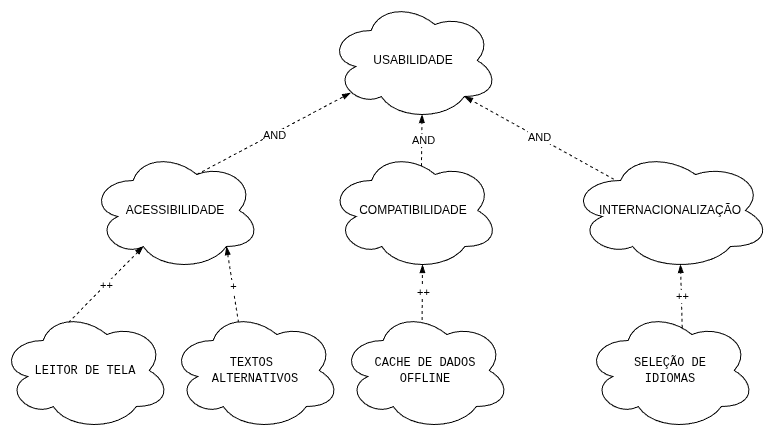
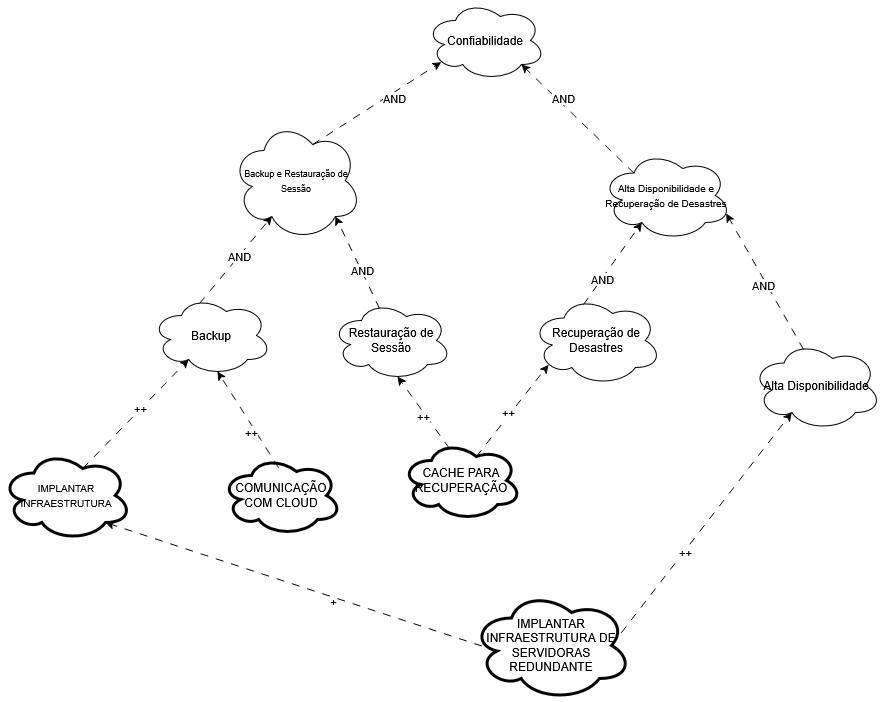
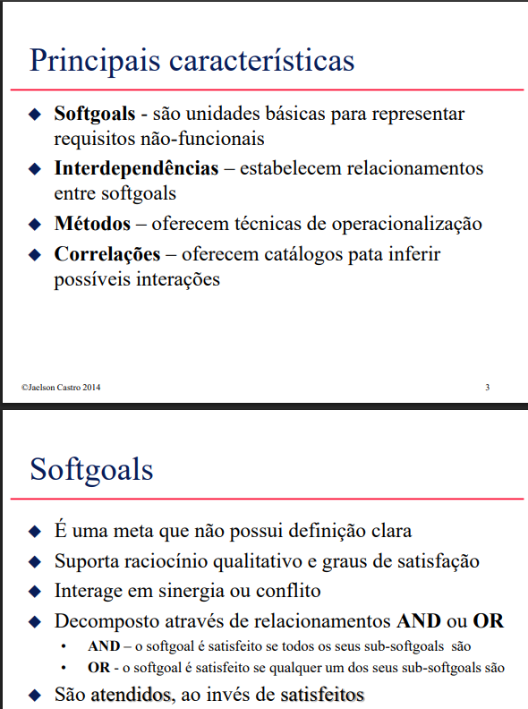
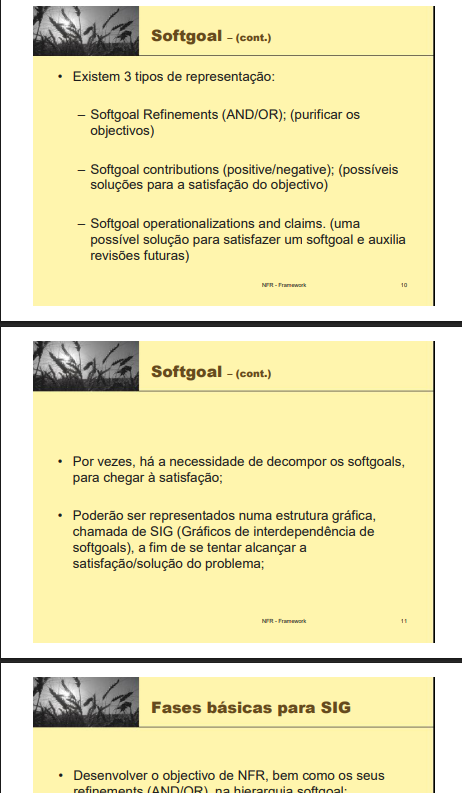

# NFR Framework

## Introdução
O desenvolvimento de sistemas de software não depende apenas da implementação de requisitos funcionais, mas também da garantia de que esses sistemas cumpram atributos de qualidade, como desempenho, segurança, usabilidade e confiabilidade. Esses atributos são descritos por meio dos requisitos não funcionais (Non-Functional Requirements – NFRs), que exercem papel importante na aceitação, desempenho e manutenção do sistema ao longo do tempo. O NFR Framework, surge como uma abordagem sistemática para representar, analisar e decompor requisitos não funcionais desde as fases iniciais da engenharia de requisitos. O framework utiliza uma estrutura baseada em metas e refinamentos para tratar a natureza muitas vezes ambígua e subjetiva dos NFRs, permitindo que diferentes alternativas de design sejam avaliadas e conciliadas com os objetivos de qualidade do sistema.

## Funções dos autores
A descrição das funções dos autores na criação e no desenvolvimento do artefato estão representadas na Tabela 1 abaixo.

    <b>Tabela 1:</b> Funções dos autores no artefato

| Nome                 | Função                                                            | 
|----------------------|----------------------------------------------------------------   |
|[Amanda Cruz](https://github.com/mandicrz)| Correção de texto; Preenchimento da parte teórica e figuras; Explicação e SIG do NFR00; SIG e propagação de impactos do NFR01; | 
|[Gabriel Flores](https://github.com/Gabrielfcoelho)| Criação da figura e das tabelas da NFR 03 | 
|[João Igor](https://github.com/JoaoPC10)| Criação de tabelas e desenvolvimento do RNF19 no NFR | 
|[João Pedro Costa](https://github.com/johnaopedro)| Desenvolvimento do RNF16 no NFR; SIG e propagação de impactos do NFR01 | 
|[Julia Gabriela](https://github.com/JuliaGabP)|Criação do documento; Preenchimento da parte teórica; Explicação do requisito 07; Referências| 
|[Ryan Salles](https://github.com/RA-Salles)| Elaboração da Tabela 4, Figura 5 e Descrição do RNF17, itens de desenvolvimento do NFR 02| 

    Autor(es): 
    <a href="https://github.com/JuliaGabP" target="_blank">Julia Gabriela</a>

## Softgoal Interdependency Graph
O Softgoal Interdependency Graph (SIG) é um grafo orientado usado para modelar os requisitos não funcionais (softgoals) e como eles se reforçam, conflitam ou dependem entre si. Ele permite visualizar:

- Quais atributos de qualidade são desejados;
- Como esses atributos se relacionam;
- Quais decisões de design podem contribuir ou prejudicar certos softgoals.

## Tipos de representações de Metas Flexíveis (Softgoals)

De acordo com Silva, existem três tipos de softgoals: Softgoals NFR, Softgoals de Operacionalização e Softgoals
de Afirmação. (SILVA, 2019). Os mesmos estão citados abaixo, complementados pela Figura 1.

- Softgoals NFR
- Softgoals de Operacionalização
- Softgoals de Afirmação.

    <b>Figura 1:</b> Tipos de Softgoals

    Fonte: CHUNG et al., 2000

### Refinamentos de Metas Flexíveis (Softgoal Refinements)

**Decomposições**  
A decomposição consiste em quebrar um softgoal genérico em sub-softgoals mais específicos, geralmente da mesma natureza. Isso facilita a análise, priorização e implementação desses objetivos de qualidade.

Softgoal geral: Alta Usabilidade

Decomposição:

- Interface Intuitiva
- Tempo de aprendizado reduzido
- Consistência na navegação

**Operacionalização**  

A operacionalização transforma um softgoal abstrato em ações ou decisões técnicas concretas que podem ser implementadas para alcançar esse objetivo.

Softgoal: Alta Segurança

Operacionalizações:

- Criptografar dados em trânsito
- Autenticação por dois fatores
- Limitar tentativas de login

**AND e OR**  
Esses refinamentos indicam se todas as ações ou sub-softgoals são **necessárias** (AND) ou se qualquer uma delas **já contribui** para alcançar o objetivo (OR).

**AND: Todos os sub-softgoals precisam ser satisfeitos.**  
Exemplo: Para Alta Confiabilidade, é necessário AND:

- Alta disponibilidade
- Monitoramento contínuo
- Backup automático

**OR: Uma entre várias alternativas pode ser suficiente.**  
Exemplo: Para Interface Responsiva, pode-se usar OR:

- Framework mobile-first
- Design adaptativo com CSS media queries

### Contribuições de Metas Flexíveis (Softgoal Contribuitions)  
**Contibuições positivas**  
Indicam que um softgoal ou uma decisão de design contribui de forma benéfica para outro softgoal. Podem ser fracas (+) ou fortes (++).  
Exemplo: Autenticação por biometria → (++ ) → Segurança de acesso

**Contibuições negativas**  
Indicam que um softgoal ou uma decisão interfere negativamente em outro softgoal, mostrando trade-offs. Podem ser fracas (-) ou fortes (--).  
Exemplo: Autenticação por biometria → (--) → Facilidade de acesso

### Operações e Afirmações de Metas Flexíveis (Softgoal Operations and Claims)
**Operacionalizações**  
São ações específicas ou decisões de projeto que tornam possível o atendimento de um softgoal. Elas representam a implementação concreta de uma meta de qualidade.

Softgoal: Desempenho elevado

Operacionalizações:

- Uso de cache em consultas frequentes
- Balanceamento de carga entre servidores

**Afirmações**  
São critérios de avaliação ou indicadores que mostram se um softgoal foi atendido. Elas ajudam na validação e verificação de requisitos não funcionais.

Softgoal: Alta Disponibilidade

Afirmações:

- “O sistema deve estar disponível 99,9% do tempo mensal.”
- “Nenhum downtime superior a 5 minutos será tolerado por semana.”

## Propagação de Impactos

No NFR Framework, a propagação de impactos é a análise de como as escolhas de design e as relações entre os softgoals (as metas de qualidade) afetam o atendimento geral dos Requisitos Não Funcionais (RNFs). Basicamente, busca-se entender e mostrar o nível de satisfação de um softgoal, olhando como seus "filhos" (sejam eles decomposições ou operacionalizações mais específicas) estão contribuindo para ele.

Essa análise costuma ser feita de baixo para cima no Softgoal Interdependency Graph (SIG). Ou seja, primeiro se avalia o efeito das operacionalizações (as soluções técnicas concretas) e, depois, esse efeito é "espalhado" para os softgoals de nível mais alto. Para isso, é fundamental observar o tipo de cada contribuição – se ela ajuda, atrapalha, ou se várias contribuições precisam acontecer juntas (lógica E/AND) ou se apenas uma já é o bastante (lógica OU/OR).

Para documentar o resultado dessa análise, são utilizados rótulos que indicam o estado de satisfação de cada softgoal, ilustrados pela Figura 1. As notações comuns incluem:

- **✓ (Satisfeito):** Mostra que este item ajuda de forma positiva a realizar ou atender outro softgoal.
- **𝒲+ (Fracamente Satisfeito):** Sugere que o softgoal é atendido, mas de forma parcial ou com algumas ressalvas menores, a contribuição positiva existe, mas não é total.
- **✗ (Negado):** Indica que este requisito atrapalha diretamente ou vai contra o que outro softgoal precisa para ser alcançado.
- **𝒲 (Fracamente Negado):** Similar ao "Negado", mas o impacto negativo é menos severa.
- **c (Conflitante):** Sinaliza uma situação onde existem tanto influências positivas quanto negativas significativas sobre o softgoal, impedindo uma conclusão clara sobre sua satisfação ou negação.
- **u (Indeterminado):** Utilizado quando não há informação suficiente para julgar o estado de satisfação do softgoal.

    <b>Figura 1:</b> Rótulos da Propagação de Impactos

    Fonte: Silva, 2019. Baseado em CHUNG et al., 2000

## Metodologia
Os frameworks foram separados por temas, esses temas foram divididos em três para limitar o escopo aqui trabalhado. Após isso, fez-se uma introspecção para a construção do SIG a partir dos tópicos gerais definidos, a fim de fazer relações com os requisitos não funcionais, após isso, fez-se o uma revisão na literatura e foi feita a validação do SIG confeccionado. A plataforma utilizada para a elaboração foi o [Draw.io](https://www.drawio.com/).

## Cartões de Especificação
Cartões de especificação (ou specification cards) são documentos concisos e padronizados usados para registrar e comunicar requisitos de um sistema, especialmente em projetos de software. Eles funcionam como pequenos resumos informativos que descrevem um requisito por vez.

### Requisito Nº: 07 [RNF07](https://github.com/Requisitos-de-Software/2025.1-Cadastro-Unico/blob/main/docs/elicitacao/requisitos_elicitados.md)  
**Classificação:** Compatibilidade  
**Descrição:** Compatibilidade com Aplicativo Off-line.  
**Justificativa:** O sistema deve permitir funcionalidades básicas mesmo sem conexão com a internet.  
**Origem do Requisito:** Análise de documentos  
**Critério de Aceitação:** O sistema deve armazenar em cache dados essenciais para uso off-line.  
**Dependências:** Nenhuma  
**Prioridade:** Média  
**Conflitos:** Nenhum  
**Histórico:** 22/05/2025

---

### Requisito Nº: 15 [RNF15](https://github.com/Requisitos-de-Software/2025.1-Cadastro-Unico/blob/main/docs/elicitacao/requisitos_elicitados.md)  
**Classificação:** Acessibilidade  
**Descrição:** Acessibilidade para pessoas com deficiência visual.  
**Justificativa:** O sistema deve ser utilizável por pessoas com deficiência visual, promovendo inclusão digital.  
**Origem do Requisito:** Introspecção  
**Critério de Aceitação:** O sistema deve permitir navegação por leitores de tela e possuir alternativas textuais para conteúdos visuais.  
**Dependências:** Nenhuma  
**Prioridade:** Alta 
**Conflitos:** Nenhum  
**Histórico:** 22/05/2025  

---

### Requisito Nº: 17 [RNF17](https://github.com/Requisitos-de-Software/2025.1-Cadastro-Unico/blob/main/docs/elicitacao/requisitos_elicitados.md)  
**Classificação:** Desempenho  
**Descrição:** Desempenho otimizado para internet limitada.  
**Justificativa:** Usuários em regiões com baixa conectividade devem conseguir utilizar o sistema sem grandes prejuízos.  
**Origem do Requisito:** Introspecção  
**Critério de Aceitação:** O sistema deve funcionar de forma responsiva com conexões de até 1 Mbps.  
**Dependências:** Nenhuma  
**Prioridade:** Alta  
**Conflitos:** Nenhum  
**Histórico:** 22/05/2025  

---

### Requisito Nº: 18 [RNF18](https://github.com/Requisitos-de-Software/2025.1-Cadastro-Unico/blob/main/docs/elicitacao/requisitos_elicitados.md)  
**Classificação:** Internacionalização  
**Descrição:** Possibilidade de outros idiomas.  
**Justificativa:** O sistema deve ser acessível a usuários que falam diferentes idiomas, ampliando o público-alvo.  
**Origem do Requisito:** Introspecção  
**Critério de Aceitação:** O sistema deve permitir alterar o idioma da interface entre pelo menos três opções.  
**Dependências:** Nenhuma  
**Prioridade:** Baixa  
**Conflitos:** Nenhum  
**Histórico:** 22/05/2025  

---

### Requisito Nº: 16 [RNF16](https://github.com/Requisitos-de-Software/2025.1-Cadastro-Unico/blob/main/docs/elicitacao/requisitos_elicitados.md)  
**Classificação:** Confiabilidade  
**Descrição:** Backup e restauração de sessão.  
**Justificativa:** Evita perda de informações em caso de falhas, melhorando a experiência do usuário.  
**Origem do Requisito:** Introspecção  
**Critério de Aceitação:** O sistema deve recuperar automaticamente a última sessão ativa do usuário em caso de falha.  
**Dependências:** Nenhuma  
**Prioridade:** Média  
**Conflitos:** Nenhum  
**Histórico:** 22/05/2025  

---

### Requisito Nº: 17 [RNF17](https://github.com/Requisitos-de-Software/2025.1-Cadastro-Unico/blob/main/docs/elicitacao/requisitos_elicitados.md)  
**Classificação:** Confiabilidade  
**Descrição:** Alta disponibilidade e recuperação de desastres.  
**Justificativa:** O sistema deve estar disponível continuamente e ser capaz de se recuperar rapidamente de falhas.  
**Origem do Requisito:** Introspecção  
**Critério de Aceitação:** O sistema deve possuir infraestrutura redundante e testes regulares de recuperação.  
**Dependências:** Nenhuma  
**Prioridade:** Alta  
**Conflitos:** Nenhum  
**Histórico:** 22/05/2025  

---

## NFR 00 - Geral

A Figura 2 apresenta o Softgoal Interdependency Graph (SIG) elaborado para o sistema Cadastro Único. Este diagrama foca nos Requisitos Não Funcionais (RNFs) chave que orientam a abordagem dos requisitos ainda não implementados pelo aplicativo.

    <b>Figura 2:</b> SIG - Visão Geral

.png)

    Autor(es):
    <a href="https://github.com/mandicrz" target="_blank">Amanda Cruz</a>

O diagrama modela Usabilidade, Desempenho e Confiabilidade como os pilares centrais de qualidade para o Cadastro Único. Ele ilustra suas interdependências, como as contribuições positivas do Desempenho para a Confiabilidade, e de ambos para uma Usabilidade eficaz. Adicionalmente, a Figura 2 evidencia um trade-off importante: a busca por uma Usabilidade mais elaborada pode impactar negativamente o Desempenho.

Essa visão geral fundamenta a análise detalhada dos NFRs específicos e, também, não implementados, explorada nas seções seguintes.

## NFR 01 - Usabilidade
Os requisitos, representados abaixo, foram utilizados para realizar o diagrama da Figura 3:

- **RNF 07 - Julia Gabriela:** O sistema deve permitir funcionalidades básicas mesmo sem conexão com a internet. 
- **RNF 15 - João Pedro:** O sistema deve ser utilizável por pessoas com deficiência visual, promovendo inclusão digital.
- **RNF 18 - Amanda:** O sistema deve ser acessível a usuários que falam diferentes idiomas, ampliando o público-alvo.

    <b>Figura 3:</b> SIG - Usabilidade

    Autor(es):
    <a href="https://github.com/mandicrz" target="_blank">Amanda Cruz</a>

### Requisitos Não Funcionais - Usabilidade  
Na Tabela 2, estão listados os RNF presentes no NFR Framework de Usabilidade :

    <b>Tabela 2:</b> Requisitos Não-Funcionais de Usabilidade

|RNF(Fonte)|Descrição|Classificação|Origem|
|----------|---------|-------------|------|
|[RNF07](../../elicitacao/requisitos_elicitados.md)|Compatibilidade com Aplicativo Off-line|Compatibilidade|Análise de documentos|
|[RNF16](../../elicitacao/requisitos_elicitados.md)|Acessibilidade para deficientes visuais|Acessibilidade|Introspecção|
|[RNF18](../../elicitacao/requisitos_elicitados.md)|Possibilidade de outros idiomas|Internacionalização|Introspecção|

    Autor(es): 
    <a href="https://github.com/JuliaGabP" target="_blank">Julia Gabriela</a>

### Propagação de Impactos - Usabilidade
A seguir, na Tabela 3, temos a avaliação da propagação dos impactos relativa à Figura 3.

    <b>Tabela 3:</b> Propagação de Impactos de Usabilidade

| Requisito Origem     | Requisito Alvo           | Tipo de Impacto           | Símbolo | Descrição                                                                 |
|----------------------|--------------------------|---------------------------|--------|---------------------------------------------------------------------------|
| Leitor de Tela,   Textos Alternativos | Acessibilidade      | Satisfeito  | ✓ | Satisfeito via Leitor de Tela (++✓) e Textos Alternativos (+✓). |
| Cache de Dados Offline  | Compatibilidade | Satisfeito  | ✓ | Satisfeito via Cache de Dados Offline (++✓). |
| Seleção de Idiomas | Internacionalização | Satisfeito   | ✓ | Satisfeito via Seleção de Idiomas (++✓).                              |
| Acessibilidade,  Compatibilidade, Internacionalização | Usabilidade         | Satisfeito                       | ✓                 | Satisfeito por decomposição AND de filhos |

    Autor(es): 
    <a href="https://github.com/mandicrz" target="_blank">Amanda Cruz</a>

## NFR 02 - Eficiência

Os requisitos, representados abaixo, foram utilizados para realizar o diagrama da Figura 4:

-**RNF 16 - João Igor:** Evita perda de informações em caso de falhas, melhorando a experiência do usuário.

-**RNF 17 - Ryan:** Prepara o sistema para responder à falhas catastróficas no lado do cliente, permitindo que dados sejam recuperados via servidor, melhorando a confiabilidade do aplicativo.
 

    <b>Figura 4:</b> SIG - Eficiência

    Autor(es): 
    <a href="https://github.com/RA-Salles" target="_blank"> Ryan Salles </a>

### Requisitos Não Funcionais - Confiabilidade
Na Tabela 4, estão listados os RNF presentes no NFR Framework de Confiabilidade:

    <b>Tabela 4:</b> Requisitos Não-Funcionais de Confiabilidade

|RNF(Fonte)|Descrição|Classificação|Origem|
|----------|---------|-------------|------|
|[RNF16](../../elicitacao/requisitos_elicitados.md)|Backup e restauração de sessão                 | Confiabilidade|Análise de documentos|
|[RNF17](../../elicitacao/requisitos_elicitados.md)|Alta disponibilidade e recuperação de desastres| Confiabilidade|Introspecção         |

    Autor(es): 
    <a href="https://github.com/JoaoPC10" target="_blank"> João Igor </a>,
    <a href="https://github.com/RA-Salles" target="_blank"> Ryan Salles </a>

### Propagação de Impactos - Confiabilidade
A seguir, na Tabela 5, temos a avaliação da propagação dos impactos relativa à Figura 5.

    <b>Tabela 5:</b> Propagação de Impactos de Confiabilidade

| Requisito Origem                                                                    | Requisito Alvo                                    | Tipo de Impacto           | Símbolo | Descrição                                                                                                                               |
|----------------------                                                               |----------------------                             |---------------------------|---------|----------------------------------------------------------------------------                                                             |
| Implantar Infraestrutura de Servidoras Redundante                                   | Alta Disponibilidade                              |  Satisfeito               | ✓       | Satisfeito mediante implantação de infraestrutura redundante (++✓)                                                                     |
| Cache para Recuperação                                                              | Recuperação de Desastres                          |  Satisfeito               | ✓       | Satisfeito mediante implantação de Cache para recuperação    (++✓)                                                                     |
| Cache para Recuperação                                                              | Restauração de Sessão                             |  Satisfeito               | ✓       | Satisfeito mediante implantação de Cache para recuperação    (++✓)                                                                     |
| Comunicação com Cloud,  Implantar Infraestrutura                                 | Backup                                            |  Satisfeito               | ✓       | Satisfeito mediante implantação de Capacidade de comunicação com cloud(++✓) e Implantação de Infraestrutura para guardar backups (++✓) |
| Backup,   Restauração de Sessão                                                  | Backup e Restauração de Sessão                    |  Satisfeito               | ✓       | Satisfeito mediante implantação de Backup(+✓) e Restauração de Sessão(++✓)                                                             |
| Alta Disponibilidade,  Recuperação de Desastres                                  | Alta Disponibilidade e Recuperação de Desastres   |  Satisfeito               | ✓       | Satisfeito mediante implantação de Alta Disponibilidade(+✓) e Recuperação de Desastres(++✓)                                            |
| Backup e Restauração de Sessão,  Alta Disponibilidade e Recuperação de Desastres | Confiabilidade                                    |  Satisfeito               | ✓       | Satisfeito mediante implantação de Backup e Restauração de Sessão(++✓) e Alta Disponibilidade e Recuperaçõ de Desastres(++✓)           |

    Autor(es): 
    <a href="https://github.com/RA-Salles" target="_blank"> Ryan Salles </a>

## NFR 03 - Desempenho
O requisito, representado abaixo, foi utilizado para realizar o diagrama da Figura 5:

- **RNF17 - Gabriel Flores:** Desempenho otimizado para internet limitada.

    <b>Figura 5:</b> SIG - Desempenho

    Autor(es): 
    <a href="https://github.com/Gabrielfcoelho" target="_blank">Gabriel Flores</a>

### Requisitos Não Funcionais - Desempenho
Na Tabela 6, estão listados os RNF presentes no NFR Framework de Desempenho:

    <b>Tabela 6:</b> Requisitos Não-Funcionais de Desempenho

| RNF | Descrição                                 | Classificação | Origem        |
|-----|-------------------------------------------|---------------|---------------|
| [RNF17](../../elicitacao/requisitos_elicitados.md) | Desempenho otimizado para internet limitada | Desempenho    | Introspecção  |

    Autor(es): 
    <a href="https://github.com/Gabrielfcoelho" target="_blank">Gabriel Flores</a>

### Propagação de Impactos - Desempenho

A seguir, na Tabela 7, temos a avaliação da propagação dos impactos relativa à Figura 5.

    <b>Tabela 5:</b> Propagação de Impactos de Desempenho

| Requisito Origem                   | Requisito Alvo           | Tipo de Impacto           | Símbolo | Descrição                                                               |
|------------------------------------|--------------------------|---------------------------|--------|--------------------------------------------------------------------------|
| Funcionar em conexões de até 1Mbps | Tempo de Resposta        | Contribuição Positiva     | +      | Requisitos de leveza melhoram tempo de resposta                          |
| Tempo de Resposta                  | Tempo                    | Contribuição Positiva     | +      | Redução no tempo de resposta melhora o tempo total                       |
| Tempo                              | Desempenho               | Refinamento AND           | AND    | É necessário bom controle de tempo para garantir desempenho              |
| Consumo de Recursos                | Desempenho               | Refinamento AND           | AND    | Requisitos de eficiência de recursos contribuem para o desempenho        |
| Tempo de Atraso                    | Tempo                    | Refinamento AND           | AND    | O tempo de atraso influencia diretamente o tempo                         |
| Disponibilidade de Recursos        | Consumo de Recursos      | Refinamento AND           | AND    | Melhor disponibilidade reduz gargalos                                    |
| Taxa de Utilização                 | Consumo de Recursos      | Refinamento AND           | AND    | Alta taxa de uso impacta o uso total de recursos                         |
| Taxa de Vazão                      | Tempo                    | Refinamento AND           | AND    | Influencia o tempo de processamento das tarefas                          |
| Desempenho                         | Custo                    | Contribuição Negativa     | -      | Maior desempenho pode aumentar o custo do sistema                        |
| Desempenho                         | Consumo de Energia       | Contribuição Negativa     | -      | Melhor desempenho pode demandar mais energia                             |
| Consumo de Energia                 | Desempenho               | Contribuição Positiva     | ++     | Eficiência energética favorece o desempenho global                       |

    Autor(es): 
    <a href="https://github.com/Gabrielfcoelho" target="_blank">Gabriel Flores</a>

## Referências

> Página 1 à 26; Requisitos Não-Funcionais. [s.l: s.n.]. Disponível em: <https://www.cin.ufpe.br/~if716/arquivos20152/experimentoBruno/Aula2/Aula2-Parte2-NFR%20Framework.pdf>. Acesso em: 22 maio. 2025.

> Página 1 à 19; NFR Framework Engenharia de Software. [s.l: s.n.]. Disponível em: <http://jaejaneiro.orgfree.com/engsofnfr.pdf>. Acesso em: 22 maio. 2025.

> SILVA, Reinaldo Antônio da. NFR4ES: Um Catálogo de Requisitos Não-Funcionais para Sistemas Embarcados. UFPE, 2019.

##### Imagem 1: NFR

    

    <b>Fonte:</b> Requisitos Não-Funcionais. Jaelson Castro, 2014.

##### Imagem 2: NFR

    

    <b>Fonte:</b> NFR Framework Engenharia de Software.

## Histórico de Versão
| Versão |    Data    |        Descrição         |                   Autor                    |                   Revisor                   |
| :----: | :--------: | :----------------------: | :----------------------------------------: | :-----------------------------------------: |
|  1.0   | 22/05/2025 |   Criação do Documento; estruturação e início do preenchimento de dados | [Julia Paulino](https://github.com/JuliaGabP) | [João Pedro Costa](https://github.com/johnaopedro) |
|  1.1   | 22/05/2025 |   Preenchimento softgoal e criação dos cartões de especificação | [Julia Paulino](https://github.com/JuliaGabP) | [João Pedro Costa](https://github.com/johnaopedro)|
|  1.2   | 27/05/2025 |   Complementação do documento | [Julia Paulino](https://github.com/JuliaGabP) | [João Pedro Costa](https://github.com/johnaopedro)|
|  1.3  | 30/05/2025  |  Adaptação de Figura e criação das tabelas da NFR 03 | [Gabriel Flores](https://github.com/Gabrielfcoelho) | [Julia Paulino](https://github.com/JuliaGabP) |
|  1.4  | 30/05/2025  |  Adições referentes ao RNF16 | [João Pedro Costa](https://github.com/johnaopedro)| [Julia Paulino](https://github.com/JuliaGabP) |
|  1.5  | 30/05/2025  |  Correções de formatação para markdown | [Amanda Cruz](https://github.com/mandicrz)| [Julia Paulino](https://github.com/JuliaGabP) |
|  1.6  | 30/05/2025  | Complemento da parte teórica | [Amanda Cruz](https://github.com/mandicrz)| [Julia Paulino](https://github.com/JuliaGabP) |
|  1.7  | 30/05/2025  | Adição e complementos do NFR00 | [Amanda Cruz](https://github.com/mandicrz)| [Julia Paulino](https://github.com/JuliaGabP) |
|  1.8  | 31/05/2025  | Adição e complementos do NFR01 | [Amanda Cruz](https://github.com/mandicrz)| [Julia Paulino](https://github.com/JuliaGabP) |
|  1.9  | 01/06/2025  | Enumerando corretamente as tabelas | [Amanda Cruz](https://github.com/mandicrz)| [Gabriel Flores](https://github.com/Gabrielfcoelho) |
|  2.0  | 01/06/2025 |   Inserção da priodade dos requisitos | [Julia Paulino](https://github.com/JuliaGabP) | [João Pedro Costa](https://github.com/johnaopedro)|

