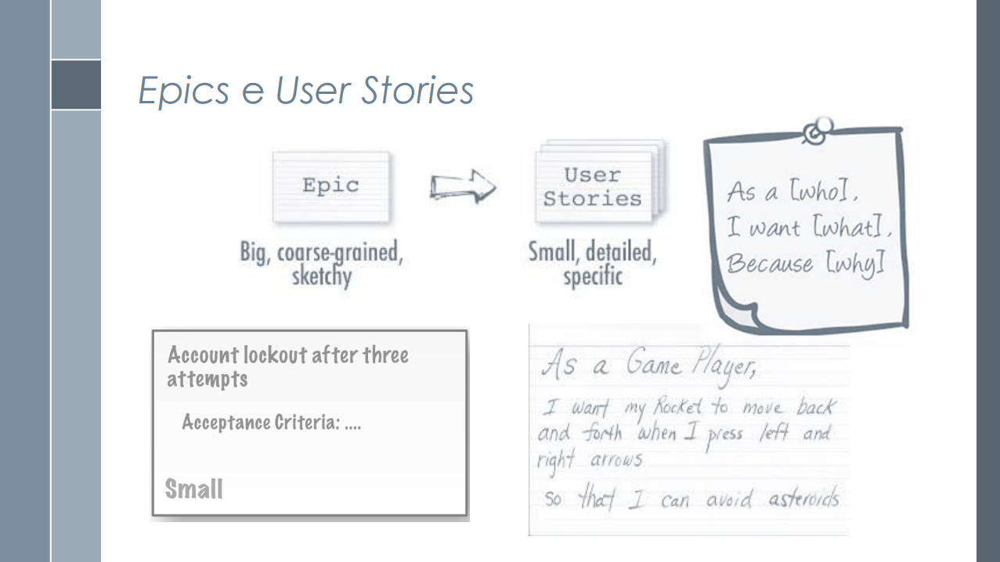
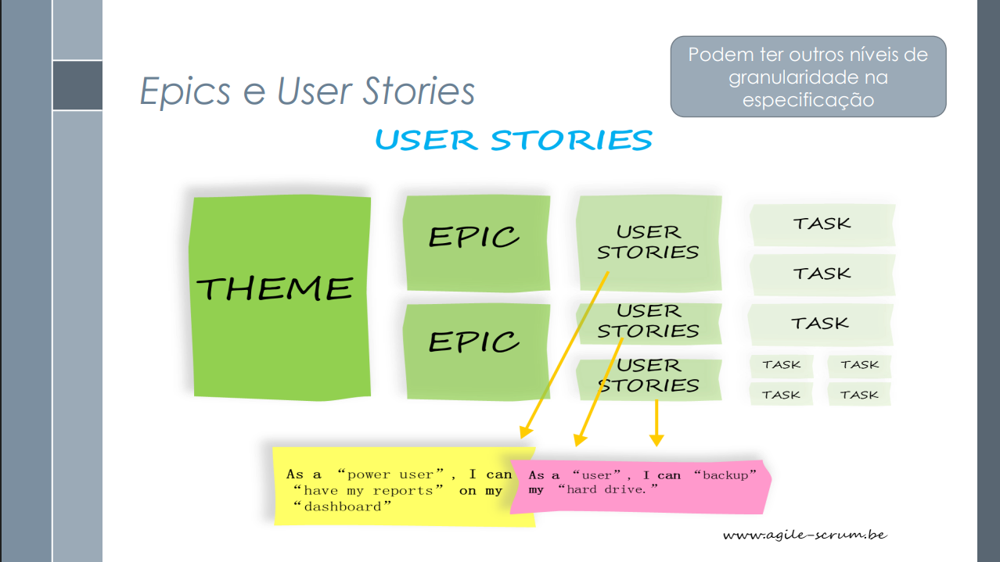

# Estórias de Usuário

## Introdução

Este documento tem como finalidade apresentar as Histórias de Usuário (User Stories) desenvolvidas para o sistema, seguindo as diretrizes estabelecidas pela Coordenação Geral de Tecnologia da Informação (CGTI). As histórias de usuário são uma técnica ágil utilizada para capturar requisitos de software de forma simples e centrada no usuário, descrevendo funcionalidades do ponto de vista de quem irá utilizá-las.

O presente documento serve como base para a validação das funcionalidades do sistema, garantindo que as necessidades dos usuários sejam atendidas de forma eficaz e que os critérios de aceite sejam claramente definidos.

## Funções dos autores
A descrição das funções dos autores na criação e no desenvolvimento do artefato estão representadas na Tabela 1 abaixo.

    <b>Tabela 1:</b> Funções dos autores no artefato

| Nome                                                | Função                                                            | 
|----------------------                               |----------------------------------------------------------------   |
| [Amanda Cruz](https://github.com/mandicrz)          | Criação das Histórias de Usuário: 32 até 37; Enumeração de tabelas e padronização; Adição das fontes exigidas pelo professor                 |          
| [João Pedro Costa](https://github.com/johnaopedro)  | Criação do documento; Adaptação do template das historias no md; Adição das histórias de usuário de 19 a 25; Adição das referências | 
| [João Igor](https://github.com/JoaoPC10)            | Criação das Histórias de Usuário: 1 à 6                                                                                 |
| [Julia Gabriela](https://github.com/JuliaGabP)      | Revisão geral; Criação de 6 histórias de usuário                                                                                    | 
| [Gabriel Flores](https://github.com/Gabrielfcoelho) | Criação das histórias de usuário 20 até a 25                                                                                        |
| [Ryan Salles](https://github.com/RA-Salles)         | Elaboração das Histórias de Usuário 26 à 31, Entrevista com o PO para validação, Elaboração inicial da Tabela X para rastreabilidade, Revisão   |

    <b>Autor(es):</b>
    <a href= "https://github.com/mandicrz" target="_blank"> Amanda Cruz </a>, <a href= "" target="_blank"> Julia Paulino </a>, <a href= "https://github.com/Gabrielfcoelho" target="_blank"> Gabriel Flores </a>, <a href= "https://github.com/johnaopedro" target="_blank"> João Pedro </a>, <a href= "https://github.com/JoaoPC10" target="_blank"> João Igor </a>, <a href= "https://github.com/RA-Salles" target="_blank"> Ryan Salles </a> 

## Metodologia

A elaboração das histórias de usuário seguiu as seguintes diretrizes metodológicas:

- Linguagem do usuário: Utilização de terminologia familiar aos usuários finais, evitando jargões técnicos
- Estrutura direta: Emprego de ordem direta nas frases para maior clareza
- Objetividade: Evitar redundâncias e frases negativas no texto
- Colaboração: Desenvolvimento conjunto com o Product Owner e desenvolvedores
- Critérios mensuráveis: Definição de critérios de aceite claros e testáveis

As estórias foram validadas com a presença de um usuário, que ajudou a definir as prioridades e necessidade de implementação no aplicativo. Os participantes das entrevistas são apresentados por meio da Tabela 2 e 3.

    <b>Tabela 2:</b> Participantes da reunião 

| Participante      | Função                          |
| :--------:        | :-----------------------------: |
| Davi G. A. Pierre | Usuário/ Project Owner          |
| João Pedro Costa  | Desenvolvedor/Secretário        |
| Julia Paulino     | Desenvolvedora                  |
| Ryan Salles       | Desenvolvedor/Entrevistador     |

    <b>Autor(es):</b> 
    <a href= "https://github.com/RA-Salles" target="_blank">Ryan Salles</a>

    <b>Tabela 3:</b> Participantes da reunião 

| Participante      | Função                          |
| :--------:        | :-----------------------------: |
| Lucas M. Arruda   | Usuário/ Project Owner          |
| João Pedro Costa  | Desenvolvedora/Secretário       |
| Ryan Salles       | Desenvolvedor/Entrevistador     |

    <b>Autor(es):</b> 
    <a href= "https://github.com/RA-Salles" target="_blank">Ryan Salles</a>

A primeira reunião de validação, disponibilizada a seguir, foi realizada e gravada via **Microsoft Teams** no dia 30/05/2025.

<iframe width="560" height="315" src="https://www.youtube.com/embed/mSUJdqnPAb4?si=2k0uWOnWp9peWcgL" title="YouTube video player" frameborder="0" allow="accelerometer; autoplay; clipboard-write; encrypted-media; gyroscope; picture-in-picture; web-share" referrerpolicy="strict-origin-when-cross-origin" allowfullscreen></iframe>

A segunda reunião, que conteve um trecho sobre validação, disponibilizada a seguir, foi realizada e gravada via **Microsoft Teams** no dia 01/06/2025.

<iframe width="560" height="315" src="https://www.youtube.com/embed/T9YJ_fNqxn4?si=XW0fHgTrpbb4Jtso" title="YouTube video player" frameborder="0" allow="accelerometer; autoplay; clipboard-write; encrypted-media; gyroscope; picture-in-picture; web-share" referrerpolicy="strict-origin-when-cross-origin" allowfullscreen></iframe>

## Objetivo

O objetivo deste documento é:

- Documentar de forma estruturada as necessidades dos usuários do sistema
- Estabelecer critérios claros de aceite para cada funcionalidade
- Facilitar a comunicação entre equipes de desenvolvimento e stakeholders
- Garantir rastreabilidade dos requisitos ao longo do ciclo de desenvolvimento
- Padronizar a especificação de funcionalidades seguindo boas práticas ágeis

## Modelo de Estória de Usuário
O modelo de estrutura a ser seguido na criação das Estórias de Usuário pode ser visualizado através da Tabela 3.

    <b>Tabela 4</b>: Modelo de Estória de Usuário

| Campo | Descrição | Obrigatório |
|-------|-----------|-------------|
| **ID** | Identificador único da história (formato: EU_XXX) | Sim |
| **Título** | Nome descritivo da funcionalidade | Sim |
| **Objetivo** | Descrição clara do propósito da história do ponto de vista do usuário | Sim |
| **Perfil(s)** | Usuários que utilizarão a funcionalidade | Sim |
| **Critérios de Aceite** | - xxx - xxx| Sim |
| **Prioridade** | Alta, Média ou Baixa | Sim |
| **Rastreabilidade** | Rastreabilidade do requisito | Sim |
| **Implementado** | Se está implementado ou não | Sim |

    Autor(es): 
    <a href="https://github.com/johnaopedro" target="_blank">João Pedro Costa</a>

## Estórias de Usuário
As Estórias (EU) de Usuário desenvolvidas para o projeto do Cadastro Único estão definidas, segundo o modelo explicado anteriormente, na Tabela 4 a 39.

---

### EU_01 – Filtrar informações sobre benefícios sociais

    <b>Tabela 5:</b> EU_01 - Filtrar informações sobre benefícios sociais

| Campo | Descrição | 
|-------|-----------|
| **ID** | EU_01 | 
| **Título** | Filtrar informações sobre benefícios socias | 
| **Objetivo** | Eu, como usuário, gostaria de filtrar os serviços prestados, auxiliando minha busca | 
| **Perfil(s)** | Pessoas que desejam se cadastrar ou já são cadastradas no CadÚnico|
|**Critérios de Aceite**| - O sistema deve exibir uma opção para selecionar os itens que o usuário desejar ver.|
|**Prioridade**|Média|
|**Rastreabilidade**|[RF24](../../elicitacao/requisitos_elicitados.md)|
|**Implementado**|Não|

    Autor(es): 
    <a href="https://github.com/JoaoPC10" target="_blank">João Igor</a>

---

### EU_02 – Alteração de dados cadastrais

    <b>Tabela 6:</b> EU_02 - Alteração de dados cadastrais

| Campo | Descrição | 
|-------|-----------|
| **ID** | EU_02 | 
| **Título** | Alteração de dados cadastrais | 
| **Objetivo** | Eu, como usuário, gostaria de alterar meus dados pessoais durante o uso do aplicativo | 
| **Perfil(s)** | Pessoas cadastradas no CadÚnico|
|**Critérios de Aceite**|O sistema deve ter uma área de alteração, que permita a troca dos dados do usuário.|
|**Prioridade**|Média|
|**Rastreabilidade**|[RF20](../../elicitacao/requisitos_elicitados.md)|
|**Implementado**|Não|

    Autor(es): 
    <a href="https://github.com/JoaoPC10" target="_blank">João Igor</a>

---

### EU_03 – Enviar notificações

    <b>Tabela 7:</b> EU_03 - Enviar notificações

| Campo | Descrição | 
|-------|-----------|
| **ID** | EU_03 | 
| **Título** | Enviar notificações | 
| **Objetivo** | Eu, como usuário, gostaria de receber notificações relacionadas ao meu cadastro. | 
| **Perfil(s)** | Pessoas que já são cadastradas no CadÚnico |
|**Critérios de Aceite**|- O sistema deve enviar notificações de alerta acerca da situação cadastral do usuário.|
|**Prioridade**|Média|
|**Rastreabilidade**|[RF17](../../elicitacao/requisitos_elicitados.md)|
|**Implementado**|Sim|

    Autor(es): 
    <a href="https://github.com/JoaoPC10" target="_blank">João Igor</a>

---

### EU_04 – Cadastro de usuário

    <b>Tabela 8:</b> EU_04 - Cadastro de usuário

| Campo | Descrição | 
|-------|-----------|
| **ID** | EU_04 | 
| **Título** | Cadastro de usuário  | 
| **Objetivo** |Eu, como usuário, gostaria de me cadastrar no CadÚnico. | 
| **Perfil(s)** | Pessoas que já são cadastradas no CadÚnico|
|**Critérios de Aceite**|- O sistema deve permitir o cadastro de novos usuários, coletando informações pessoais como nome, CPF, endereço etc|
|**Prioridade**|Média|
|**Rastreabilidade**|[RF19](../../elicitacao/requisitos_elicitados.md)|
|**Implementado**|Sim|

    Autor(es): 
    <a href="https://github.com/JoaoPC10" target="_blank">João Igor</a>

---

### EU_05 – Pré-cadastrar Família 

    <b>Tabela 9:</b> EU_05 - Pré-cadastrar Família

| Campo | Descrição | 
|-------|-----------|
| **ID** | EU_05 | 
| **Título** | Pré-cadastrar família | 
| **Objetivo** | Eu, como usuário, gostaria de realizar um pré-cadastro da minha família para ter acesso aos benefícios. | 
| **Perfil(s)** | Pessoas que não cadastradas no CadÚnico|
|**Critérios de Aceite**|- O sistema deve permitir que uma pessoa não cadastrada no CadÚnico inicie um pré-cadastro para sua família.|
|**Prioridade**|Média|
|**Rastreabilidade**|[RF15](../../elicitacao/requisitos_elicitados.md)|
|**Implementado**|Sim|

    Autor(es): 
    <a href="https://github.com/JoaoPC10" target="_blank">João Igor</a>

---

### EU_06 –  Consultar dados cadastrais 

    <b>Tabela 10:</b> EU_06 - Consultar dados cadastrais

| Campo | Descrição | 
|-------|-----------|
| **ID** | EU_06 | 
| **Título** | Consultar dados cadastrais | 
| **Objetivo** |Eu, como usuário, gostaria de visualizar os dados que estão na plataforma. | 
| **Perfil(s)** | Pessoas que já são cadastradas no CadÚnico|
|**Critérios de Aceite**|- O sistema deve exibir as informações de cadastro do usuário.|
|**Prioridade**|Média|
|**Rastreabilidade**|[RF14](../../elicitacao/requisitos_elicitados.md)|
|**Implementado**|Sim|

    Autor(es): 
    <a href="https://github.com/JoaoPC10" target="_blank">João Igor</a>

---

### História EU_07 – Possibilidade de outros idiomas

    <b>Tabela 11:</b> EU_07 - Possibilidade de outros idiomas

|Campo|Descrição|
|------|---------|
|**ID**|EU_07|
|**Título**|Possibilidade de outros idiomas|
|**Objetivo**|Eu, como usuário desejo poder acessar o aplicativo em outro idioma.|
|**Perfil(s)**|Usuários gerais do CadÚnico|
|**Critérios de Aceite**|- Qualquer usuário deve ser capaz de alterar o idioma do aplicativo, de forma que ele fique conciso   Para mais detalhes cheque a introspecção: [IS16](../../modelagem/introspecção.md)|
|**Prioridade**|Baixa|
|**Rastreabilidade**|[RF39](../../elicitacao/requisitos_elicitados.md)|
|**Implementado**|Não|

    Autor(es): 
    <a href="https://github.com/JuliaGabP" target="_blank">Julia Gabriela</a>

---

### História EU_08 – Modo escuro

    <b>Tabela 12:</b> EU_08 - Modo escuro

|Campo|Descrição|
|------|---------|
|**ID**|EU_08|
|**Título**|Modo escuro|
|**Objetivo**|Eu, como usuário desejo poder acessar o aplicativo na forma escura.|
|**Perfil(s)**|Usuários gerais do CadÚnico|
|**Critérios de Aceite**|- Qualquer usuário deve ser capaz de configurar para seu aplicativo ficar no modo escuro, de forma que o constraste de cores continue com qualidade   Para mais detalhes cheque a introspecção: [IS15](../../modelagem/introspecção.md)|
|**Prioridade**|Média|
|**Rastreabilidade**|[RF38](../../elicitacao/requisitos_elicitados.md)|
|**Implementado**|Não|

    Autor(es): 
    <a href="https://github.com/JuliaGabP" target="_blank">Julia Gabriela</a>

---

### História EU_09– Visualização de informações cadastrais

    <b>Tabela 13:</b> EU_09 - Visualização de informações cadastrais

|Campo|Descrição|
|------|---------|
|**ID**|EU_09|
|**Título**|Visualização de informações cadastrais|
|**Objetivo**|Eu, como usuário desejo poder visualizar minhas informações cadastrais|
|**Perfil(s)**|Usuários cadastrados no CadÚnico|
|**Critérios de Aceite**|- Qualquer usuário deve ser capaz de visualizar suas informações cadastrais   Para mais detalhes cheque a entrevista: [ENT2](../../modelagem/entrevista.md)|
|**Prioridade**|Alta|
|**Rastreabilidade**|[RF25](../../elicitacao/requisitos_elicitados.md)|
|**Implementado**|Sim|

    Autor(es): 
    <a href="https://github.com/JuliaGabP" target="_blank">Julia Gabriela</a>

---

### História EU_10 – Consulta de benefícios

    <b>Tabela 14:</b> EU_10 - Consulta de benefícios

|Campo|Descrição|
|------|---------|
|**ID**|EU_10|
|**Título**|Consulta de benefícios|
|**Objetivo**|Eu, como usuário desejo consultar a situação do meu benefício|
|**Perfil(s)**|Usuários com benefícios no CadÚnico|
|**Critérios de Aceite**|- Qualquer usuário deve ser capaz de visualizar as situações de seus benefícios.   Para mais detalhes cheque a entrevista: [ENT1](../../modelagem/entrevista.md)|
|**Prioridade**|Alta|
|**Rastreabilidade**|[RF24](../../elicitacao/requisitos_elicitados.md)|
|**Implementado**|Sim|

    Autor(es): 
    <a href="https://github.com/JuliaGabP" target="_blank">Julia Gabriela</a>

---

### História EU_11– Emissão de comprovante de cadastro

    <b>Tabela 15:</b> EU_11 - Emissão de comprovante de cadastro

|Campo|Descrição|
|------|---------|
|**ID**|EU_11|
|**Título**|Emissão de comprovante de cadastro|
|**Objetivo**|Eu, como usuário desejo poder emitir um comprovante de cadastro no sistema|
|**Perfil(s)**|Usuários cadastrados no CadÚnico|
|**Critérios de Aceite**|- Qualquer usuário cadastrado deve ser capaz de emitir um comprovante de cadastro no sistema.   Para mais detalhes cheque a introspecção: [IS9](../../modelagem/introspecção.md)|
|**Prioridade**|Média|
|**Rastreabilidade**|[RF22](../../elicitacao/requisitos_elicitados.md)|
|**Implementado**|Sim|

    Autor(es): 
    <a href="https://github.com/JuliaGabP" target="_blank">Julia Gabriela</a>

---

### História EU_12– Atualização de dados

    <b>Tabela 16:</b> EU_12 - Atualização de dados

|Campo|Descrição|
|------|---------|
|**ID**|EU_12|
|**Título**|Atualização de dados|
|**Objetivo**|Eu, como usuário desejo poder atualizar os meus dados no sistema|
|**Perfil(s)**|Usuários cadastrados no CadÚnico|
|**Critérios de Aceite**|- Qualquer usuário cadastrado deve ser capaz atualizar seus dados pelo sistema.   Para mais detalhes cheque a introspecção: [IS7](../../modelagem/introspecção.md)|
|**Prioridade**|Alta|
|**Rastreabilidade**|[RF20](../../elicitacao/requisitos_elicitados.md)|
|**Implementado**|Sim|

    Autor(es): 
    <a href="https://github.com/JuliaGabP" target="_blank">Julia Gabriela</a>

---

### História EU_13 – Cadastro MEI

    <b>Tabela 17:</b> EU_13 - Cadastro MEI

|Campo|Descrição|
|------|---------|
|**ID**|EU_13|
|**Título**|Registro da condição de MEI no cadastro do usuário|
|**Objetivo**|Eu, como usuário em processo de cadastro no CadÚnico, quero informar que sou Microempreendedor Individual para receber conteúdos e serviços direcionados.|
|**Perfil(s)**|Usuário em processo de cadastro no CadÚnico|
|**Critérios de Aceite**|- Exibir opção "Sou MEI" durante o cadastro. - Permitir marcação da opção. - Armazenar a informação no perfil. - Caso não marque, seguir fluxo normalmente. - Se selecionar "Sou MEI" sem CNPJ válido, solicitar verificação adicional.   Para mais detalhes cheque o cenário: [CN10](../../modelagem/cenarios.md)|
|**Prioridade**|Alta|
|**Rastreabilidade**|[RF11](../../elicitacao/requisitos_elicitados.md)|
|**Implementado**|Não|

    Autor(es): 
    <a href="https://github.com/johnaopedro" target="_blank">João Pedro Costa</a>

---

### História EU_14 – Acesso a conteúdos informativos sobre MEI

    <b>Tabela 18:</b> EU_14 - Acesso a conteúdos informativos sobre MEI

|Campo|Descrição|
|------|---------|
|**ID**|EU_14|
|**Título**|Acesso a conteúdos informativos sobre microempreendedorismo|
|**Objetivo**|Eu, como usuário MEI autenticado no CadÚnico, quero acessar informações sobre obrigações, direitos e oportunidades para me informar melhor.|
|**Perfil(s)**|Usuário MEI autenticado no CadÚnico|
|**Critérios de Aceite**|- Permitir acesso à seção “MEI”. - Exibir conteúdos organizados por temas. - Navegar entre temas. - Exibir aviso para usuários não MEI. - Informar necessidade de conexão quando offline.  Para mais detalhes cheque o cenário: [CN11](../../modelagem/cenarios.md)|
|**Prioridade**|Média|
|**Rastreabilidade**|[RF12](../../elicitacao/requisitos_elicitados.md)|
|**Implementado**|Não|

    Autor(es): 
    <a href="https://github.com/johnaopedro" target="_blank">João Pedro Costa</a>

---

### História EU_15 – Chat de Atendimento

    <b>Tabela 19:</b> EU_15 - Chat de atendimento

|Campo|Descrição|
|------|---------|
|**ID**|EU_15|
|**Título**|Chat de Atendimento|
|**Objetivo**|Eu, como usuário, quero utilizar um chat de atendimento para receber suporte rápido e tirar dúvidas.|
|**Perfil(s)**|Usuário|
|**Critérios de Aceite**|- O sistema deve disponibilizar um chat para atendimento. - Permitir troca de mensagens em tempo real. - Notificar usuário sobre respostas. - Registrar histórico das conversas. - Disponível em todas as telas do aplicativo.  Para mais detalhes cheque o cenário: [CN08](../../modelagem/cenarios.md)|
|**Prioridade**|Média|
|**Rastreabilidade**|[RF26](../../elicitacao/requisitos_elicitados.md)|
|**Implementado**|Não|

    Autor(es): 
    <a href="https://github.com/johnaopedro" target="_blank">João Pedro Costa</a>

---

### História EU_16 – Agendamento no CRAS

    <b>Tabela 20:</b> EU_16 - Agendamento no CRAS

|Campo|Descrição|
|------|---------|
|**ID**|EU_16|
|**Título**|Agendamento no CRAS|
|**Objetivo**|Eu, como usuário do CadÚnico, quero realizar o agendamento de atendimento no CRAS para evitar filas e facilitar o processo.|
|**Perfil(s)**|Usuário do CadÚnico|
|**Critérios de Aceite**|- O usuário acessa a opção "Agendamento de Atendimento" dentro do CadÚnico. - O sistema exibe calendário com horários disponíveis. - Usuário escolhe data, horário e local. - Sistema verifica disponibilidade no CRAS. - Confirma agendamento e envia notificação. - Atualiza status do agendamento no perfil do usuário. - Caso horário indisponível, sistema sugere outras opções. - Se sistema do CRAS estiver fora do ar, armazena tentativa para nova sincronização.  Para mais detalhes cheque o cenário: [CN14](../../modelagem/cenarios.md)|
|**Prioridade**|Alta|
|**Rastreabilidade**|[RF30](../../elicitacao/requisitos_elicitados.md)|
|**Implementado**|Não|

    Autor(es): 
    <a href="https://github.com/johnaopedro" target="_blank">João Pedro Costa</a>

---

### História EU_17 – Cadastro de Famílias

    <b>Tabela 21:</b> EU_17 - Cadastro de famílias

|Campo|Descrição|
|------|---------|
|**ID**|EU_17|
|**Título**|Cadastro de Famílias|
|**Objetivo**|Eu, como usuário do CadÚnico, quero cadastrar famílias com renda mensal de até meio salário mínimo por pessoa ou vinculadas a programas sociais para garantir o acesso aos benefícios.|
|**Perfil(s)**|Usuário do CadÚnico|
|**Critérios de Aceite**|- O sistema permite cadastro de famílias com renda mensal até meio salário mínimo por pessoa. - Permite cadastro vinculado a programas sociais. - Valida dados obrigatórios de renda e vínculos. - Confirma registro com mensagem de sucesso. - Possibilita consulta e edição posterior do cadastro.|
|**Prioridade**|Alta|
|**Rastreabilidade**|[RF01](../../elicitacao/requisitos_elicitados.md)|
|**Implementado**|Não|

    Autor(es): 
    <a href="https://github.com/johnaopedro" target="_blank">João Pedro Costa</a>

---

### História EU_18 – Cadastro de Pessoas

    <b>Tabela 22:</b> EU_18 - Cadastro de pessoas

|Campo|Descrição|
|------|---------|
|**ID**|EU_18|
| **Título**          | Cadastro de Pessoas  |
| **Objetivo**        | Eu, como usuário do CadÚnico, quero registrar informações pessoais, como dados de identificação, documentação, frequência escolar e grau de instrução para compor corretamente o cadastro familiar. |
| **Perfil(s)**       | Usuário do CadÚnico  |
| **Critérios de Aceite** | - Permitir registro dos dados pessoais essenciais. - Validar campos obrigatórios. - Garantir integridade dos dados cadastrados. - Confirmar o cadastro com mensagem de sucesso. - Permitir consulta e edição dos dados pessoais.|
| **Prioridade**      | Alta  |
|**Rastreabilidade**|[RF02](../../elicitacao/requisitos_elicitados.md)|
|**Implementado**|Não|

    Autor(es): 
    <a href="https://github.com/johnaopedro" target="_blank">João Pedro Costa</a>

---

### História EU_19 – Cadastro de Domicílios

    <b>Tabela 23:</b> EU_19 - Cadastro de domicílios

|Campo|Descrição|
|------|---------|
|**ID**|EU_19|
|**Título**|Cadastro de Domicílios|
|**Objetivo**|Eu, como usuário, quero registrar características do meu domicílio para que meu perfil tenha informações completas sobre minha residência.|
|**Perfil(s)**|Usuário do CadÚnico|
|**Critérios de Aceite**|- O sistema deve permitir o registro do tipo de construção. - Registrar informações sobre abastecimento de água. - Registrar tipo de iluminação. - Registrar escoamento sanitário. - Validar os dados informados e salvar no perfil.  Para mais detalhes cheque o cenário: [CN](../../modelagem/cenarios.md)|
|**Prioridade**|Média|
|**Rastreabilidade**|[RF03](../../elicitacao/requisitos_elicitados.md)|
|**Implementado**|Não|

    Autor(es): 
    <a href="https://github.com/johnaopedro" target="_blank">João Pedro Costa</a>

---

### História EU_20 – Cadastro de Agricultores Familiares

    <b>Tabela 24:</b> EU_20 - Cadastro de agricultores familiares

|Campo|Descrição|
|------|---------|
|**ID**|EU_20|
|**Título**|Cadastro de Agricultores Familiares|
|**Objetivo**|Eu, como agricultor familiar, desejo cadastrar minhas informações no sistema para acessar benefícios específicos e garantir minha inclusão em programas sociais.|
|**Perfil(s)**|Agricultores familiares|
|**Critérios de Aceite**|- O sistema deve permitir o cadastro de agricultores familiares. - Deve validar os dados obrigatórios do agricultor. - O usuário deve receber confirmação do cadastro.|
|**Prioridade**|Alta|
|**Rastreabilidade**|[RF04](../../elicitacao/requisitos_elicitados.md)|
|**Implementado**|Sim|

    Autor(es): 
    <a href="https://github.com/Gabrielfcoelho" target="_blank">Gabriel Flores</a>

---

### História EU_21 – Processamento de Dados

    <b>Tabela 25:</b> EU_21 - Processamento de Dados

|Campo|Descrição|
|------|---------|
|**ID**|EU_21|
|**Título**|Processamento de Dados|
|**Objetivo**|Eu, como usuário, desejo que meus dados sejam processados corretamente para garantir a atualização e integridade das informações no sistema.|
|**Perfil(s)**|Usuários do CadÚnico|
|**Critérios de Aceite**|- O sistema deve processar os dados inseridos de forma automática. - Garantir a integridade e atualização das informações. - Notificar o usuário em caso de erro no processamento.|
|**Prioridade**|Alta|
|**Rastreabilidade**|[RF06](../../elicitacao/requisitos_elicitados.md)|
|**Implementado**|Sim|

    Autor(es): 
    <a href="https://github.com/Gabrielfcoelho" target="_blank">Gabriel Flores</a>

---

### História EU_22 – Correção de Inconsistências

    <b>Tabela 26:</b> EU_22 - Correção de Inconscistências

|Campo|Descrição|
|------|---------|
|**ID**|EU_22|
|**Título**|Correção de Inconsistências|
|**Objetivo**|Eu, como usuário, desejo corrigir inconsistências nos meus dados para garantir que meu cadastro esteja correto e atualizado.|
|**Perfil(s)**|Usuários do CadÚnico|
|**Critérios de Aceite**|- O sistema deve identificar e informar inconsistências nos dados. - Permitir ao usuário corrigir as informações. - Confirmar a correção e atualizar o cadastro.|
|**Prioridade**|Alta|
|**Rastreabilidade**|[RF07](../../elicitacao/requisitos_elicitados.md)|
|**Implementado**|Sim|

    Autor(es): 
    <a href="https://github.com/Gabrielfcoelho" target="_blank">Gabriel Flores</a>

---

### História EU_23 – Localizar Postos de Atendimento

    <b>Tabela 27:</b> EU_23 - Localizar postos de atendimento

|Campo|Descrição|
|------|---------|
|**ID**|EU_23|
|**Título**|Localizar Postos de Atendimento|
|**Objetivo**|Eu, como usuário, desejo localizar os postos de atendimento mais próximos para facilitar meu acesso aos serviços do CadÚnico.|
|**Perfil(s)**|Usuários do CadÚnico|
|**Critérios de Aceite**|- O sistema deve exibir postos de atendimento próximos com base na localização do usuário. - Permitir busca por município ou endereço. - Exibir informações de contato e horários de funcionamento.|
|**Prioridade**|Média|
|**Rastreabilidade**|[RF16](../../elicitacao/requisitos_elicitados.md)|
|**Implementado**|Sim|

    Autor(es): 
    <a href="https://github.com/Gabrielfcoelho" target="_blank">Gabriel Flores</a>

---

### História EU_24 – Notificação de Pendências ou Atualizações

    <b>Tabela 28:</b> EU_24 - Notificação de pendências ou atualizações

|Campo|Descrição|
|------|---------|
|**ID**|EU_24|
|**Título**|Notificação de Pendências ou Atualizações|
|**Objetivo**|Eu, como usuário, desejo ser notificado sobre pendências ou atualizações no meu cadastro para manter meus dados sempre regulares.|
|**Perfil(s)**|Usuários do CadÚnico|
|**Critérios de Aceite**|- O sistema deve notificar o usuário sobre pendências ou atualizações necessárias. - Permitir visualização detalhada da pendência. - Orientar o usuário sobre como regularizar a situação.|
|**Prioridade**|Alta|
|**Rastreabilidade**|[RF27](../../elicitacao/requisitos_elicitados.md)|
|**Implementado**|Não|

    Autor(es): 
    <a href="https://github.com/Gabrielfcoelho" target="_blank">Gabriel Flores</a>

---

### História EU_25 – Upload de Documentos

    <b>Tabela 29:</b> EU_25 - Upload de documentos

|Campo|Descrição|
|------|---------|
|**ID**|EU_25|
|**Título**|Upload de Documentos|
|**Objetivo**|Eu, como usuário, desejo enviar documentos digitalizados pelo aplicativo para complementar ou atualizar meu cadastro sem precisar ir presencialmente ao posto de atendimento.|
|**Perfil(s)**|Usuários do CadÚnico|
|**Critérios de Aceite**|- O sistema deve permitir upload de documentos em formatos aceitos. - Validar tipo e tamanho dos arquivos. - Confirmar o envio e associar ao cadastro do usuário.|
|**Prioridade**|Alta|
|**Rastreabilidade**|[RF29](../../elicitacao/requisitos_elicitados.md)|
|**Implementado**|Não|

    Autor(es): 
    <a href="https://github.com/Gabrielfcoelho" target="_blank">Gabriel Flores</a>

---

### História EU_26 - Chatbot

    <b>Tabela 30:</b> EU_26 - Chatbot

|Campo                  |Descrição|
|------                 |---------|
|**ID**                 | EU_26|
|**Título**             | Chatbot|
|**Objetivo**           | "Eu, como usuário, gostaria de acessar um chatbot para responder dúvidas frequentes de forma rápida e efetiva" |
|**Perfil(s)**          | Usuário do CadÚnico |
|**Critérios de Aceite**| - O usuário consegue acessar o sistema; - O chatbot é capaz de entender perguntas em linguagem natural; - O chatbot é capaz de responder as dúvidas mais frequentes dos usuários |
|**Prioridade**         | Baixa |
|**Rastreabilidade**    |[RF26](../../elicitacao/requisitos_elicitados.md)|
|**Implementado**       | Não |

    Autor(es): 
    <a href="https://github.com/RA-Salles" target="_blank">Ryan Salles</a>

---

### História EU_27 - Chat de Atendimento

    <b>Tabela 31:</b> EU_27 - Chat de atendimento

|Campo                  |Descrição|
|------                 |---------|
|**ID**                 | EU_27                                                                                                                                                                                                                        |
|**Título**             | Chat de atendimento                                                                                                                                                                                                          |
|**Objetivo**           | "Eu, como usuário, gostaria de uma linha de acesso direto a um atendente cuja experiência e capacidades técnicas para resolver rapidamente problemas, requisições, dúvidas e dificuldades sem a necessidade de ir a um CRAS" |
|**Perfil(s)**          | Usuário do CádÚnico                                                                                                                                                                                                          |
|**Critérios de Aceite**| - O usuário consegue acessar o sistema   - O atendente é capaz de receber e enviar mensagens em tempo real   - O usuário é capaz de receber e enviar mensagens em tempo real                                           |
|**Prioridade**         | Alta                                                                                                                                                                                                                    |
|**Rastreabilidade**    |[RF34](../../elicitacao/requisitos_elicitados.md)                                                                                                                                                                             |
|**Implementado**       | Não                                                                                                                                                                                                                          |

    Autor(es): 
    <a href="https://github.com/RA-Salles" target="_blank">Ryan Salles</a>

---

### História EU_28 - Tutoriais Interativos

    <b>Tabela 32:</b> EU_28 - Tutoriais interativos

|Campo                    |Descrição|
|------                   |---------|
| **ID**                  | EU_ 28 |
|**Título**               | Tutoriais Interativos |
| **Objetivo**            | "Eu, como usuário novo, gostaria de ser guiado pelo aplicativo de forma automática na forma de um tutorial interativo para conhecer as funções e operações disponíveis no aplicativo e facilitar meu aprendizado e uso da ferramenta" | 
| **Perfil(s)**           | Usuário novo do CadÚnico |
| **Critérios de Aceite** | - O tutorial é oferecido ao usuário quando ele entra no aplicativo pela primeira vez   - O tutorial explica e exemplifica o uso das principais funcionalidades e operações do aplicativo |
|**Prioridade**           | Média |
|**Rastreabilidade**      |[RF35](../../elicitacao/requisitos_elicitados.md) |
|**Implementado**         | Não  |

    Autor(es): 
    <a href="https://github.com/RA-Salles" target="_blank">Ryan Salles</a>

---

### História EU_29 - Assistência por voz

    <b>Tabela 33:</b> EU_29 - Assistência por voz

|Campo                  |Descrição|
|------                 |---------|
|**ID**                 | EU_29 |
|**Título**             | Assistência por voz |
|**Objetivo**           | "Eu, como usuário, gostaria de ser capaz de controlar o aplicativo por voz para que possa acessar as funcionalidades sem a necessidade de ver a tela" |
|**Perfil(s)**          | Usuário com baixa ou nenhuma visibilidade|
|**Critérios de Aceite**| - O aplicativo deve ser capaz de reconhecer a voz do usuário   - O aplicativo deve ser capaz de realizar operações a partir de comandos por voz   - O aplicativo, mediante boa pronúncia e um microfone funcionando segundo especificação do fabricante do dispositivo, possuir taxa de acerto do comando pronunciado de no mínimo 95% |
|**Prioridade**         | Alta |
|**Rastreabilidade**    |[RF37](../../elicitacao/requisitos_elicitados.md)|
|**Implementado**       | Não |

    Autor(es): 
    <a href="https://github.com/RA-Salles" target="_blank">Ryan Salles</a>

---

### História EU_30 - Simular benefícios

    <b>Tabela 34:</b> EU_30 - Simular benefícios

|Campo                  |Descrição|
|------                 |---------|
|**ID**                 |EU_30|
|**Título**             |Simular benefícios|
|**Objetivo**           |Eu, como usuário, gostaria de simular os benefícios segundo meus dados cadastrados para que possa garantir acesso aos meus direitos de forma mais fácil e informada. |
|**Perfil(s)**          |Usuário do CadÚnico|
|**Critérios de Aceite**|- O usuário é capaz de simular os benefícios possíveis   - O aplicativo deve ser capaz de gerar um pré-relatório com validade para uso em um CRAS   - O aplicativo deve simular os benefícios utilizando os dados do usuário cadastrado de forma correta   - O relatório gerado deve ser enviado ao sistema para que possa estar disponível para atendentes |
|**Prioridade**         |Alta|
|**Rastreabilidade**    |[RF33](../../elicitacao/requisitos_elicitados.md)|
|**Implementado**       | Não |

    Autor(es): 
    <a href="https://github.com/RA-Salles" target="_blank">Ryan Salles</a>

---

### História EU_31 - Notificações Personalizadas

    <b>Tabela 35:</b> EU_31 - Notificações personalizadas

|Campo                  |Descrição|
|------                 |---------|
|**ID**                 | EU_31 |
|**Título**             | Notificações personalizadas |
|**Objetivo**           | "Eu, como usuário, gostaria de receber notificações personalizadas segundo meu perfil de usuário para me manter atualizado sobre minha situação específica "|
|**Perfil(s)**          | Usuário |
|**Critérios de Aceite**| - O aplicativo deve ser capaz de enviar notificações   - O aplicativo deve possuir forma de configuração de notificações   - O sistema de notificação deve ser capaz de ser desativado|
|**Prioridade**         | Baixa |
|**Rastreabilidade**    |[RF09](../../elicitacao/requisitos_elicitados.md)|
|**Implementado**       | Não |

    Autor(es): 
    <a href="https://github.com/RA-Salles" target="_blank">Ryan Salles</a>

---

### História EU_32 - Coleta de Dados via Formulários

    <b>Figura 36:</b> EU_32 - Coleta de Dados via Formulários

|Campo|Descrição|
|------|---------|
|**ID**                 | EU_32 |
|**Título**             | Coleta de Dados via Formulários |
|**Objetivo**           | "Eu, como Usuário, quero usar formulários no aplicativo para conseguir registrar facilmente todos os dados importantes sobre domicílios, famílias, pessoas, suas ligações com programas sociais e informações de quem vive na rua, para que o aplicativo tenha dados sempre corretos e atualizados." |
|**Perfil(s)**          | Usuário |
|**Critérios de Aceite**| - O aplicativo deve oferecer formulários principais e suplementares para o cadastro. - O sistema deve permitir o registro completo de informações de domicílios, famílias e indivíduos.  - O sistema deve permitir o registro da vinculação a programas sociais e de dados específicos sobre pessoas em situação de rua. |
|**Prioridade**         | Alta |
|**Rastreabilidade**    |[RF10](../../elicitacao/requisitos_elicitados.md)|
|**Implementado**       | Sim |

    <b>Autor(es):</b>
    <a href="https://github.com/mandicrz" target="_blank">Amanda Cruz</a>

---

### História EU_33 - Atualização dos Dados Familiares

    <b>Figura 37:</b> EU_33 - Atualização dos Dados Familiares

|Campo|Descrição|
|------|---------|
|**ID**                 | EU_33 |
|**Título**             | Atualização dos Dados Familiares |
|**Objetivo**           | "Eu, como Usuário, quero poder atualizar facilmente os dados cadastrais da minha família para que estejam de acordo e possamos manter o nosso acesso a programas e benefícios sociais." |
|**Perfil(s)**          | Usuário responsável da família |
|**Critérios de Aceite**| - O sistema deve permitir a edição das informações pessoais dos membros da família. - O sistema deve permitir a alteração dos dados de endereço e renda da família. - O sistema deve salvar as modificações e confirmar que os dados da família foram atualizados. |
|**Prioridade**         | Alta |
|**Rastreabilidade**    |[RF05](../../elicitacao/requisitos_elicitados.md)|
|**Implementado**       | Sim |

    <b>Autor(es):</b>
    <a href="https://github.com/mandicrz" target="_blank">Amanda Cruz</a>

---

### História EU_34 - Importação Automática de Dados do CNIS

    <b>Figura 38:</b> EU_34 - Importação Automática de Dados do CNIS

|Campo|Descrição|
|------|---------|
|**ID**                 | EU_34 |
|**Título**             | Importação Automática de Dados do CNIS |
|**Objetivo**           | "Eu, como Usuário, quero que o sistema busque e importe automaticamente os dados de vínculos empregatícios e contribuições diretamente do CNIS, para que o processo de cadastro seja mais rápido, com informações mais precisas e menos sujeito a erros de digitação." |
|**Perfil(s)**          | Usuário |
|**Critérios de Aceite**| - O sistema deve ter a capacidade de se conectar ao CNIS para consultar dados de um cidadão (com as devidas autorizações).  - O sistema deve importar e exibir de forma clara para os dados retornados pelo CNIS.  - O sistema deve permitir que o usuário utilize os dados importados do CNIS para preencher ou validar as informações. | 
|**Prioridade**         | Média |
|**Rastreabilidade**    |[RF18](../../elicitacao/requisitos_elicitados.md)|
|**Implementado**       | Sim |

    <b>Autor(es):</b>
    <a href="https://github.com/mandicrz" target="_blank">Amanda Cruz</a>

---

### História EU_35 - Suporte com Vídeos Explicativos

    <b>Figura 39:</b> EU_35 - Suporte com Vídeos Explicativos

|Campo|Descrição|
|------|---------|
|**ID**                 | EU_35 |
|**Título**             | Suporte com Vídeos Explicativos |
|**Objetivo**           | "Eu, como Usuário, quero poder assistir a vídeos dentro do aplicativo que expliquem as principais funcionalidades e processos, para que eu consiga entender melhor como usar o sistema e ganhar mais confiança." |
|**Perfil(s)**          | Usuário novo ou com dificuldades digitais |
|**Critérios de Aceite**| - O aplicativo deve possuir uma área ou links contextuais para acesso a vídeos explicativos.  - Os vídeos devem abordar o uso das funcionalidades mais importantes ou que geram mais dúvidas.  - Os vídeos devem ter linguagem simples, ser curtos e de fácil compreensão.|
|**Prioridade**         | Média |
|**Rastreabilidade**    |[RF36](../../elicitacao/requisitos_elicitados.md)|
|**Implementado**       | Não |

    <b>Autor(es):</b>
    <a href="https://github.com/mandicrz" target="_blank">Amanda Cruz</a>

---

### História EU_36 - Conteúdo MEI Personalizado por Setor e Região

    <b>Figura 40:</b> EU_36 - Conteúdo MEI Personalizado por Setor e Região

|Campo|Descrição|
|------|---------|
|**ID**                 | EU_36 |
|**Título**             | Conteúdo MEI Personalizado por Setor e Região |
|**Objetivo**           | "Eu, como Usuário MEI, quero que os conteúdos e informações da seção MEI do sistema sejam adaptados ao meu setor de atividade e à minha região, para que eu possa encontrar facilmente orientações e recursos que sejam verdadeiramente relevantes para o meu negócio." |
|**Perfil(s)**          | Usuário MEI |
|**Critérios de Aceite**| - O sistema deve identificar o setor de atuação e a região do Usuário MEI a partir dos seus dados cadastrais. - O sistema deve exibir conteúdos na seção MEI que sejam especificamente relevantes para o setor de atuação e região geográfica do usuário." | 
|**Prioridade**         | Alta |
|**Rastreabilidade**    |[RF13](../../elicitacao/requisitos_elicitados.md)|
|**Implementado**       | Não |

    <b>Autor(es):</b>
    <a href="https://github.com/mandicrz" target="_blank">Amanda Cruz</a>

---

### História EU_37 - Integração com Sistemas MEI

    <b>Figura 41:</b> EU_37 - Integração com Sistemas MEI

|Campo|Descrição|
|------|---------|
|**ID**                 | EU_37 |
|**Título**             | Integração com Sistemas MEI |
|**Objetivo**           | "Eu, como Usuário MEI, quero que o sistema possa trocar informações de forma segura e padronizada com outros sistemas relevantes para Microempreendedores Individuais, para simplificar meus processos, evitar redigitação e manter minhas informações consistentes entre as plataformas." |
|**Perfil(s)**          | Usuário MEI |
|**Critérios de Aceite**| - O sistema deve ser capaz de se comunicar com sistemas externos designados para MEIs.  - O sistema deve permitir o envio e/ou recebimento de dados específicos de MEIs de/para esses sistemas externos.  - A troca de dados com os sistemas MEI deve ser realizada de forma segura. | 
|**Prioridade**         | Alta |
|**Rastreabilidade**    |[RF40](../../elicitacao/requisitos_elicitados.md)|
|**Implementado**       | Não |

    <b>Autor(es):</b>
    <a href="https://github.com/mandicrz" target="_blank">Amanda Cruz</a>

---

## Rastreabilidade

A Tabela 42 apresenta a rastreabilidade geral das histórias de usuário para os requisitos elicitados e cenários utilizados para elaboração e compreensão dos critérios de aceitação.

    <b>Tabela 42:</b> Rastreabilidade de relacionamento EU-REQ-CN

| Estória de Usuário  | Requisito | Cenário      |
| :-----------------: | :-------: | :-----:      |          
| EU_01               | RF24      | CN07         |
| EU_02               | RF20      | CN14         |
| EU_03               | RF17      | CN03         |
| EU_04               | RF19      | CN03         |
| EU_05               | RF15      | CN06         |
| EU_06               | RF14      | -            |
| EU_07               | RF39      | -            |
| **EU_08**           | RF38      | CN09         |
| EU_09               | RF25      | -            |
| EU_10               | RF24      | CN01         |
| EU_11               | RF22      | -            |
| **EU_12**           | RF20      | -            |
| EU_13               | RF11      | CN13, CN10   |
| EU_14               | RF12      | CN11         |
| EU_15               | RF26      | CN08         |
| EU_16               | RF30      | CN14         |
| EU_17               | RF01      | -            |
| **EU_18**           | RF02      | CN03         |
| EU_19               | RF03      | -            |
| EU_20               | RF04      | -            |
| EU_21               | RF06      | CN06         |
| EU_22               | RF07      | -            |
| **EU_23**           | RF16      | CN05         |
| EU_24               | RF27      | -            |
| EU_25               | RF29      | CN16         |
| EU_26               | RF26      | CN08         |
| EU_27               | RF34      | -            |
| EU_28               | RF35      | CN15         |
| EU_29               | RF37      | -            |
| EU_30               | RF33      | CN07         |
| EU_31               | RF09      | -            |
| EU_32               | RF10      | -            |
| EU_33               | RF05      | -            |
| EU_34               | RF18      | -            |
| EU_35               | RF36      | -            |
| EU_36               | RF13      | CN12         |
| EU_37               | RF40      | CN13         |

<!--

UTILIZADAS: 01, 02, 03, 04, 05, 06, 07, 09, 10, 11, 12, 13, 16, 18, 20, 23, 24, 25, 26, 27, 29, 30, 33, 34, 35, 36, 37, 38, 39, 40

DUPLICATAS:
- 01-30
- 02-12
- 03-18
- 05-23
- 06-08

MELHORAR: 
- 01 a 06 -> inserir criterios de aceite mais específicos, inserir prioridade.
- 07 a 12 -> inserir objetivo de realizar operação na estória, 

-->

    <b>Autor(es):</b>
    <a href= "https://github.com/mandicrz" target="_blank"> Amanda Cruz </a>, <a href= "" target="_blank"> Julia Paulino </a>, <a href= "https://github.com/Gabrielfcoelho" target="_blank"> Gabriel Flores </a>, <a href= "https://github.com/johnaopedro" target="_blank"> João Pedro </a>, <a href= "https://github.com/JoaoPC10" target="_blank"> João Igor </a>, <a href= "https://github.com/RA-Salles" target="_blank"> Ryan Salles </a> 

## Referências

> COORDENAÇÃO GERAL DE TECNOLOGIA DA INFORMAÇÃO - CGTI. EU_xxx_Titulo_da_Estoria_de_Usuario: template para especificação de histórias de usuário. [S.l.]: CGTI, 2018. 5 p. Disponível em: <a href="../../../assets/modelagem/US/template_historia_de_usuario.pdf" target="_blank">História de Usuário</a>. Acesso em: 22 de maio 2025.

> PRESSMAN, Roger S.; MAXIM, Bruce R.. Engenharia de software: uma abordagem profissional. 8 Porto Alegre: AMGH, 2016, p. 73. Acesso em: 28 de maio 2025.

> SERRANO, Milene; SERRANO, Maurício. Requisitos – Aula 15a [slide em PDF], P. 12 - 14. Aprender3, Universidade de Brasília, 2025. Disponível em: <https://aprender3.unb.br/pluginfile.php/3096144/mod_resource/content/1/Requisitos%20-%20Aula%2015a.pdf>. Acesso em: 01 jun. 2025.

#### O que é História de Usuário? (User Story)
As Figuras 1 a 3 a seguir explicam o que são as histórias de usuário, também exemplificando os critérios de aceitação, e foram responsáveis por auxiliar o processo de criação do artefato.

    <b>Figura 1:</b> User Story - Parte 1

    <b>Fonte:</b>
    SERRANO, Milene; SERRANO, Maurício. 

    <b>Figura 2:</b> User Story - Parte 2

    <b>Fonte:</b>
    SERRANO, Milene; SERRANO, Maurício.

    <b>Figura 3:</b> User Story - Parte 3

    <b>Fonte:</b>
    SERRANO, Milene; SERRANO, Maurício. 

## Histórico de Versão

| Versão |    Data    |        Descrição                                                                                             |                   Autor                             |                   Revisor                          |
| :----: | :--------: | :----------------------:                                                                                     | :----------------------------------------:          | :-----------------------------------------:        |
|  1.0   | 22/05/2025 | Criação do Documento                                                                                         | [João Pedro Costa](https://github.com/johnaopedro)  | [Julia Gabriela](https://github.com/JuliaGabP)     |
|  1.1   | 22/05/2025 | Adaptação do template das histórias de usuário e adição de referências                                       | [João Pedro Costa](https://github.com/johnaopedro)  | [Julia Gabriela](https://github.com/JuliaGabP)     |
|  1.2   | 26/05/2025 | Adição das minhas Histórias de Usuário                                                                       | [João Igor](https://github.com/JoaoPC10)            | [Julia Gabriela](https://github.com/JuliaGabP)     |
|  1.3   | 28/05/2025 | Adição de Historias de Usuário de 19 a 25                                                                    | [João Pedro Costa](https://github.com/johnaopedro)  | [Julia Gabriela](https://github.com/JuliaGabP)     |
|  1.4   | 29/05/2025 | Adição de 6 Histórias de Usuário, correção dos IDs                                                           | [Julia Gabriela](https://github.com/JuliaGabP)      | [João Pedro Costa](https://github.com/johnaopedro) |
|  1.5   | 29/05/2025 | Adição da histórias de usuário 20 até 25                                                                     | [Gabriel Flores](https://github.com/Gabrielfcoelho) | [João Pedro Costa](https://github.com/johnaopedro) |
|  1.6   | 01/06/2025 | Adição da histórias de usuário 32 a 37                                                                       | [Amanda Cruz](https://github.com/mandicrz)          | [Ryan Salles](https://github.com/RA-Salles)        |
|  1.7   | 01/06/2025 | Padronização do  documento e enumeração de tabelas                                                           | [Amanda Cruz](https://github.com/mandicrz)          | [Ryan Salles](https://github.com/RA-Salles)        |
|  1.8   | 01/06/2025 | Atualização da numeração de tabelas, inserção de entrevista, tabela de rastreabilidade e estórias de 26 a 31 | [Ryan Salles](https://github.com/RA-Salles)         | [Amanda Cruz](https://github.com/mandicrz)         |
|  1.9   | 01/06/2025 | Adição de imagens das referências | [Amanda Cruz](https://github.com/mandicrz)          | [Ryan Salles](https://github.com/RA-Salles) |