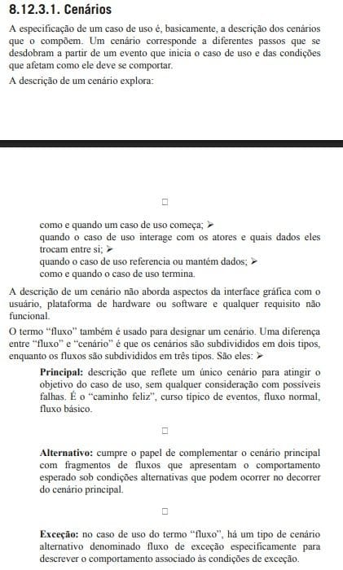

# Cenários

## Funções dos autores

| Nome                 | Função                                                            | 
|----------------------|----------------------------------------------------------------   |
|[Amanda Cruz](https://github.com/mandicrz)|Criação dos cenários 14 e 15| 
|[Gabriel Flores](https://github.com/Gabrielfcoelho)| Criação dos cenários 16 e 17| 
|[João Igor](https://github.com/JoaoPC10)|Criação do cenário 16| 
|[João Pedro Costa](https://github.com/johnaopedro)|Revisão geral; Criação dos cenários 10 à 13; Correção pelo metodo de Fagan| 
|[Julia Gabriela](https://github.com/JuliaGabP)|Adição do vídeo de explicação e referências; Criação dos cenários 1, 2, 3, 6 e 7| 
|[Ryan Salles](https://github.com/RA-Salles)|Criação da documentação com introduções, criação dos cenários 4, 5, 8 e 9| 

    Autor(es): 
    <a href="https://github.com/JuliaGabP" target="_blank">Julia Gabriela</a>

## Introdução

Este documento apresenta uma série de cenários desenvolvidos como parte do processo de engenharia de requisitos do aplicativo Cadastro Único (CadÚnico). Os cenários são descrições estruturadas de possíveis interações entre usuários e o sistema, com o objetivo de capturar comportamentos esperados, identificar requisitos e apoiar a validação das funcionalidades. Cada cenário contém informações sobre os atores envolvidos, o contexto da interação, pré-condições, fluxo principal de ações, pós-condições e exceções possíveis.

## Cenários

Essa seção contém os cenários elaborados, apresentados nas Tabelas 2 a 17, com base nos requisitos elicitados e observações realizadas durante a etapa de elicitação. Abaixo, ilustrado na Tabela 1, tem-se o modelo utilizado na construção dos mesmos.

| Cenário X                | Título do Cenário                                                                                              |
| :----------------------: | -------------------------------------------------------------------------------------------------------------- |
| **Nome do Cenário**      | Nome do cenário criado                                                                                         |
| **Ator Principal**       | Participante principal do cenário                                                                              |
| **Contexto**             | Descreve a situação ou necessidade do usuário que motiva o cenário, explicando o objetivo da ação no sistema   |
| **Pré-condições**        | Lista as condições que devem ser verdadeiras antes que o cenário possa ser executado                           |
| **Fluxo Principal**      | Enumera os passos principais da interação entre o usuário e o sistema para alcançar o objetivo do cenário      |
| **Pós-condições**        | Descreve o estado do sistema ou o resultado para o usuário após a conclusão bem-sucedida do cenário            |
| **Exceções**             | Lista os possíveis erros ou situações excepcionais que podem impedir a conclusão do cenário                    |

### Cenário 1: Visualizar Benefícios

    Tabela 2: Cenário de visualização de benefícios ativos

| Cenário 1                | Visualizar Benefícios ativos                                                   |
|--------------------------|-------------------------------------------------------------------------------|
| **Nome do Cenário**      | Visualização de benefícios ativos                                             |
| **Ator Principal**       | Usuário cadastrado                                                            |
| **Contexto**             | O usuário deseja verificar se há algum benefício ativo vinculado ao seu cadastro no CadÚnico, como Bolsa Família. |
| **Pré-condições**        | O usuário já possui cadastro validado no CadÚnico e está autenticado no aplicativo. |
| **Fluxo Principal**      | **1.** O usuário acessa o aplicativo do CadÚnico. 2. Seleciona a opção “Meus Benefícios”. 3. O sistema busca as informações junto à base do governo. 4. É exibida uma lista de benefícios ativos, com nome do programa, status (ativo/suspenso), valor recebido e data da última atualização. |
| **Pós-condições**        | O usuário visualiza seus benefícios ativos de forma clara e atualizada.       |
| **Exceções**             | - Caso o usuário não possua benefícios ativos, o sistema exibe uma mensagem informativa. - Se ocorrer falha de comunicação com o banco de dados, o sistema exibe uma mensagem de erro. |

    Autor(es): 
    <a href="https://github.com/JuliaGabP" target="_blank">Julia Gabriela</a>

### Cenário 2: Alteração de Dados Cadastrais

    Tabela 3: Cenário de alteração de dados cadastrais

| Cenário 2                | Alteração de Dados Cadastrais                                                 |
|--------------------------|-------------------------------------------------------------------------------|
| **Nome do Cenário**      | Atualização de dados pessoais e residenciais                                  |
| **Ator Principal**       | Usuário cadastrado                                                            |
| **Contexto**             | O usuário mudou de endereço e precisa atualizar suas informações no CadÚnico. |
| **Pré-condições**        | O usuário está logado e seu cadastro já existe no sistema.                    |
| **Fluxo Principal**      | 1. O usuário acessa o aplicativo e entra na seção “Atualizar Cadastro”. 2. Informa que deseja alterar dados residenciais. 3. Atualiza endereço, telefone e informações de contato. 4. Confirma os dados e envia para análise. 5. O sistema notifica que a atualização será verificada por um agente público. |
| **Pós-condições**        | Os dados atualizados são enviados para análise, e o usuário recebe uma notificação de que a atualização está em processo. |
| **Exceções**             | - Se o CPF estiver em inconsistência, o sistema bloqueia a alteração e exibe mensagem. - Se o endereço informado for inválido (CEP inexistente), o sistema solicita correção. |

    Autor(es): 
    <a href="https://github.com/JuliaGabP" target="_blank">Julia Gabriela</a>

### Cenário 3: Realizar Cadastro no Aplicativo

    Tabela 4: Cenário de cadastro no aplicativo

| Cenário 3                | Realizar Cadastro no Aplicativo                                               |
|--------------------------|-------------------------------------------------------------------------------|
| **Nome do Cenário**      | Primeiro cadastro no CadÚnico                                                 |
| **Ator Principal**       | Novo usuário                                                                  |
| **Contexto**             | O usuário nunca utilizou o CadÚnico e quer se cadastrar pelo aplicativo.      |
| **Pré-condições**        | O usuário possui documentos válidos e acesso à internet.                      |
| **Fluxo Principal**      | 1. O usuário instala e abre o aplicativo. 2. Seleciona “Fazer Primeiro Cadastro”. 3. Preenche os dados pessoais (nome, CPF, data de nascimento, endereço, composição familiar). 4. Envia a solicitação. 5. O sistema gera um protocolo e informa que o usuário será contactado para validação. |
| **Pós-condições**        | Um cadastro preliminar é criado e enviado para avaliação por um agente social. |
| **Exceções**             | - Se o CPF já existir no sistema, o cadastro é bloqueado e o sistema sugere login. - Caso falte algum dado obrigatório, o app impede o envio e destaca os campos incompletos. |

    Autor(es): 
    <a href="https://github.com/JuliaGabP" target="_blank">Julia Gabriela</a>

### Cenário 4: Conferir Informações sobre Benefícios

    Tabela 5: Cenário de conferir informações sobre benefícios

| Cenário 4                | Conferir Informações sobre Benefícios                                         |
|--------------------------|-------------------------------------------------------------------------------|
| **Nome do Cenário**      | Conferir Informações sobre benefícios                                         |
| **Ator Principal**       | Usuário com ou sem autenticação                                               |
| **Ator Secundário**      | Aplicativo CadÚnico                                                           |
| **Contexto**             | O usuário gostaria de verificar o funcionamento de demais benefícios disponíveis e descobrir se são aplicáveis para sua condição. |
| **Pré-condições**        | Um celular smartphone ou computador funcional compatível com o aplicativo.    |
| **Fluxo Principal**      | 1. O usuário abre o aplicativo. 2. O usuário acessa a tela de informações. 3. O aplicativo acessa sua base de dados local e apresenta os benefícios disponíveis. 4. O usuário acessa a tela específica sobre o benefício que gostaria de saber mais sobre. 5. O usuário lê as informações. |
| **Pós-condições**        | O usuário obtém as informações.                                               |
| **Exceções**             | - Navegador do computador e/ou celular estão desatualizados. - O computador não possui internet. |

    Autor(es): 
    <a href="https://github.com/RA-Salles" target="_blank">Ryan Salles</a>

### Cenário 5: Verificar Postos de Atendimento

    Tabela 6: Cenário de verificar postos de atendimento

| Cenário 5                | Verificar Postos de Atendimento                                               |
|--------------------------|-------------------------------------------------------------------------------|
| **Nome do Cenário**      | Verificar postos de atendimento                                               |
| **Ator Principal**       | Usuário com ou sem autenticação                                               |
| **Ator Secundário**      | Sistema CadÚnico, Aplicativo CadÚnico                                         |
| **Contexto**             | O usuário gostaria de verificar o local e horário de postos de atendimento para poder ser atendido pessoalmente. |
| **Pré-condições**        | Um celular smartphone ou computador funcional compatível com o aplicativo com acesso à internet. |
| **Fluxo Principal**      | 1. O usuário abre o aplicativo. 2. O usuário acessa a tela de informações sobre postos de atendimento. 3. O usuário insere estado, município e tipo de posto. 4. O sistema verifica as informações mais recentes e envia para o aplicativo. 5. O aplicativo apresenta as informações recebidas pelo sistema. 6. O usuário verifica os postos de atendimento. |
| **Pós-condições**        | O usuário obtém as informações desejadas.                                      |
| **Exceções**             | - Navegador do computador e/ou celular estão desatualizados. - O usuário não possui acesso à internet. - O usuário obtém um erro de interface e necessita resetar o aplicativo. |

    Autor(es): 
    <a href="https://github.com/RA-Salles" target="_blank">Ryan Salles</a>

### Cenário 6: Cadastro de Família

    Tabela 7: Cenário de cadastro familiar

| Cenário 6                | Cadastro de Família                                                           |
|--------------------------|-------------------------------------------------------------------------------|
| **Nome do Cenário**      | Cadastrar nova família no sistema                                             |
| **Ator Principal**       | Responsável familiar                                                          |
| **Ator Secundário**      | Sistema CadÚnico, Aplicativo CadÚnico                                         |
| **Contexto**             | O responsável familiar deseja cadastrar sua família no Cadastro Único para acessar benefícios sociais. |
| **Pré-condições**        | Um celular smartphone ou computador funcional compatível com o aplicativo com acesso à internet; documentos dos membros da família. |
| **Fluxo Principal**      | 1. O usuário acessa o aplicativo. 2. O usuário seleciona a opção “Cadastrar Família”. 3. O sistema solicita dados pessoais do responsável (nome, CPF, nascimento, endereço, telefone). 4. O usuário insere os dados dos demais членов da família (nome, parentesco, CPF/RG, data de nascimento, escolaridade, renda). 5. O sistema valida os dados e verifica duplicidades. 6. O usuário revisa e confirma o cadastro. 7. O sistema emite um protocolo e registra o envio para análise. |
| **Pós-condições**        | A família é registrada como novo grupo familiar no sistema, com cadastro pendente de validação. |
| **Exceções**             | - CPF do responsável já cadastrado em outro grupo familiar. - Dados de algum membro incompletos ou inválidos. - Falha na comunicação com o sistema durante o envio do formulário. |

    Autor(es): 
    <a href="https://github.com/JuliaGabP" target="_blank">Julia Gabriela</a>

### Cenário 7: Filtrar Benefícios Sociais

    Tabela 8: Cenário de filtrar benefícios sociais

| Cenário 7                | Filtrar Benefícios Sociais                                                    |
|--------------------------|-------------------------------------------------------------------------------|
| **Nome do Cenário**      | Filtrar informações sobre benefícios sociais                                  |
| **Ator Principal**       | Usuário (autenticado ou não)                                                  |
| **Ator Secundário**      | Sistema CadÚnico, Aplicativo CadÚnico                                         |
| **Contexto**             | O usuário deseja visualizar apenas os benefícios sociais que sejam relevantes ao seu perfil ou interesse, utilizando filtros para facilitar a busca. |
| **Pré-condições**        | Um celular smartphone ou computador funcional compatível com o aplicativo com acesso à internet. |
| **Fluxo Principal**      | 1. O usuário abre o aplicativo. 2. O usuário acessa a seção “Benefícios Disponíveis”. 3. O sistema apresenta a lista completa de benefícios. 4. O usuário seleciona filtros como: tipo de benefício, público-alvo, localização, faixa de renda, entre outros. 5. O sistema processa os filtros aplicados. 6. O sistema exibe os benefícios que correspondem aos critérios selecionados. 7. O usuário visualiza os detalhes dos benefícios listados. |
| **Pós-condições**        | O usuário acessa apenas os benefícios que correspondem aos filtros aplicados.  |
| **Exceções**             | - Nenhum benefício corresponde aos filtros utilizados. - Campos de filtro mal preenchidos ou inválidos. - Falha de conexão impede a exibição dos resultados. |

    Autor(es): 
    <a href="https://github.com/JuliaGabP" target="_blank">Julia Gabriela</a>

### Cenário 8: Chatbot

    Tabela 9: Cenário de chatbot

| Cenário 8                | Chatbot                                                                       |
|--------------------------|-------------------------------------------------------------------------------|
| **Nome do Cenário**      | Uso de chatbot "Assistente Virtual" para auxílio e resolução de dúvidas       |
| **Ator Principal**       | Usuário cadastrado com dúvidas                                                |
| **Ator Secundário**      | Sistema de chatbot hipotético Assistente Virtual, Aplicativo CadÚnico         |
| **Contexto**             | Um usuário possui alguma dúvida relacionada a realização de uma operação ou benefício. |
| **Pré-condições**        | Um celular smartphone ou computador funcional compatível com o aplicativo com acesso à internet. |
| **Fluxo Principal**      | 1. O usuário abre o aplicativo. 2. O usuário aperta no botão de login. 3. O usuário é autenticado pelo Gov.br. 4. O usuário acessa a opção "conversar com o assistente virtual". 5. O usuário é movido à tela de interface do assistente virtual. 6. O usuário realiza uma pergunta relacionada a benefícios ou operações no aplicativo. 7. O sistema virtual responde a dúvida. |
| **Pós-condições**        | O usuário tem sua dúvida sanada.                                              |
| **Exceções**             | - Usuário não está cadastrado e falha na parte de autenticação. - Usuário não possui conexão com a internet em seu aparelho. - O Assistente Virtual não possui a informação necessária, frustrando a tentativa de uso. - O Assistente Virtual está em manutenção, frustrando a tentativa de uso. |

    Autor(es): 
    <a href="https://github.com/RA-Salles" target="_blank">Ryan Salles</a>

### Cenário 9: Modo Escuro

    Tabela 10: Cenário de modo escuro do aplicativo

| Cenário 9                | Modo Escuro                                                                   |
|--------------------------|-------------------------------------------------------------------------------|
| **Nome do Cenário**      | Modo Escuro                                                                   |
| **Ator Principal**       | Usuário                                                                       |
| **Ator Secundário**      | Aplicativo CadÚnico                                                           |
| **Contexto**             | Um usuário está tentando utilizar o aplicativo em um ambiente de baixa luminosidade e a interface padrão é muito clara. |
| **Pré-condições**        | Um celular smartphone ou computador funcional compatível com o aplicativo com acesso à internet. |
| **Fluxo Principal**      | 1. O usuário abre o aplicativo. 2. O usuário se incomoda com a luminosidade. 3. O usuário aperta em um botão descrito como "Modo Escuro". 4. O aplicativo atualiza a interface para utilizar cores mais frias. |
| **Pós-condições**        | O usuário se sente mais confortável com o esquema de cores redefinido.        |
| **Exceções**             | - O esquema de cores redefinido torna o usuário mais desconfortável no momento. - O usuário não consegue encontrar o botão "Modo Escuro". |

    Autor(es): 
    <a href="https://github.com/RA-Salles" target="_blank">Ryan Salles</a>

### Cenário 10: Cadastro MEI

    Tabela 11: Cenário de cadastro MEI

| Cenário 10               | Cadastro MEI                                                                  |
|--------------------------|-------------------------------------------------------------------------------|
| **Nome do Cenário**      | Registro da condição de MEI no cadastro do usuário                                |
| **Ator Principal**       | Usuário em processo de cadastro no CadÚnico                                 |
| **Contexto**             | Ao se cadastrar no aplicativo, o usuário deve poder informar que é um Microempreendedor Individual (MEI) para receber conteúdos e serviços direcionados. |
| **Pré-condições**        | O usuário está na etapa de preenchimento do cadastro no aplicativo CadÚnico. |
| **Fluxo Principal**      | 1. O usuário acessa o aplicativo e inicia o processo de cadastro. 2. Durante o preenchimento de dados pessoais, encontra a opção “Sou MEI”. 3. Marca a opção para indicar sua condição de Microempreendedor Individual. 4. Finaliza o processo de cadastro. 5. O sistema armazena essa informação no perfil do usuário. |
| **Pós-condições**        | O perfil do usuário é registrado com o status de MEI, permitindo personalização e integração futura com dados do microempreendedor. |
| **Exceções**             | - Se o usuário não marcar a opção, o sistema continua o fluxo normalmente, sem definir o status como MEI. - Caso o usuário selecione "Sou MEI", mas não tenha um CNPJ válido posteriormente, o sistema pode solicitar verificação adicional. |

    Autor(es): 
    <a href="https://github.com/johnaopedro" target="_blank">João Pedro Costa</a>

### Cenário 11: Informações MEI

    Tabela 12: Cenário de informações MEI

| Cenário 11               | Informações MEI                                                               |
|--------------------------|-------------------------------------------------------------------------------|
| **Nome do Cenário**      | Acesso a conteúdos informativos sobre microempreendedorismo                                |
| **Ator Principal**       | Usuário MEI autenticado no CadÚnico                                               |
| **Contexto**             | O usuário deseja se informar sobre obrigações, direitos e oportunidades relacionadas ao MEI diretamente no aplicativo. |
| **Pré-condições**        | O usuário está autenticado no aplicativo e possui perfil MEI ativo.              |
| **Fluxo Principal**      | 1. O usuário acessa a seção “MEI” no menu do aplicativo. 2. Visualiza conteúdos informativos organizados por temas, como: Formalização e CNPJ, Obrigações Fiscais e Contábeis. 3. O sistema permite navegação entre os temas e acesso a links úteis.|
| **Pós-condições**        | O usuário compreende melhor suas responsabilidades como MEI e sabe onde buscar serviços públicos e suporte. |
| **Exceções**             | - Se o usuário não estiver identificado como MEI, o sistema exibe convite para formalização com link de orientação. - Caso os conteúdos não estejam disponíveis offline, o sistema informa a necessidade de conexão. |

    Autor(es): 
    <a href="https://github.com/johnaopedro" target="_blank">João Pedro Costa</a>

### Cenário 12: Personalização MEI

    Tabela 13: Cenário de personalização MEI

| Cenário 12               | Personalização MEI                                                            |
|--------------------------|-------------------------------------------------------------------------------|
| **Nome do Cenário**      | Exibição de conteúdos personalizados da seção MEI                        |
| **Ator Principal**       | Usuário MEI cadastrado no CadÚnico                                            |
| **Contexto**             | O usuário acessa a seção MEI do aplicativo e espera visualizar informações relacionadas ao seu setor de atuação e localização. |
| **Pré-condições**        | O usuário está autenticado e possui setor de atuação e município informados no cadastro. |
| **Fluxo Principal**      | 1. O usuário acessa a seção “MEI” do aplicativo. 2. O sistema identifica o setor econômico registrado no perfil do usuário. 3. O sistema verifica a região (com base na localização ou município cadastrado). 4.Exibe conteúdos personalizados, como: Editais e cursos regionais, notícias específicas do setor (ex: agricultura, comércio).  5. Permite ao usuário interagir com os conteúdos (favoritar, compartilhar, acessar links externos). |
| **Pós-condições**        | O usuário visualiza conteúdos relevantes e adaptados ao seu perfil profissional e territorial. |
| **Exceções**             | - Se o setor de atuação estiver vazio, o sistema solicita preenchimento antes da personalização. - Se a localização estiver desativada, utiliza o município do cadastro como referência. |

    Autor(es): 
    <a href="https://github.com/johnaopedro" target="_blank">João Pedro Costa</a>

### Cenário 13: Integração MEI

    Tabela 14: Cenário de integração MEI

| Cenário 13               | Integração MEI                                                                |
|--------------------------|-------------------------------------------------------------------------------|
| **Nome do Cenário**      | Consulta e sincronização automática com a base de dados do MEI                |
| **Ator Principal**       | Sistema do CadÚnico, Sistema MEI.    |
| **Contexto**             | O CadÚnico precisa acessar e manter atualizadas as informações do MEI vinculadas ao CPF do usuário, sem necessidade de inserção manual de dados. |
| **Pré-condições**        | O usuário possui cadastro ativo no CadÚnico e tem um CNPJ MEI registrado na Receita Federal. |
| **Fluxo Principal**      | 1. O sistema do CadÚnico realiza integração periódica com a base da Receita Federal. 2. Identifica usuários com CNPJ MEI associado ao CPF no cadastro. 3. Recupera informações como: data de formalização, atividade principal, situação cadastral, pendências e débitos. 4. Atualiza automaticamente os dados no perfil do usuário no app CadÚnico. 5. Exibe aviso ou status atualizado ao usuário, caso ele acesse a área “MEI”. |
| **Pós-condições**        | O perfil do usuário no CadÚnico reflete corretamente sua situação como MEI, com base em dados oficiais e atualizados. |
| **Exceções**             | - Se a conexão com a Receita Federal estiver instável, o sistema armazena tentativa e realiza nova sincronização posteriormente. - Em caso de dados inconsistentes entre CPF e CNPJ, o sistema bloqueia a integração e emite alerta técnico para revisão manual. |

    Autor(es): 
    <a href="https://github.com/johnaopedro" target="_blank">João Pedro Costa</a>

### Cenário 14: Agendamento no CRAS

    Tabela 15: Cenário de agendamento no CRAS

| Cenário 14               | Agendamento no CRAS                                                               |
|--------------------------|-------------------------------------------------------------------------------|
| **Nome do Cenário**      | Agendamento de Atendimento no CRAS                                            |
| **Ator Principal**       | Usuário                                                                       |
| **Ator Secundário**      | Sistema do CadÚnico                                                           |
| **Contexto**             | O usuário precisa realizar o agendamento de atendimento no CRAS de maneira simples e sem burocracia, evitando longas filas e otimizar o processo de agendamento. |
| **Pré-condições**        | O usuário possui cadastro ativo no CadÚnico e o sistema do CRAS está integrado ao aplicativo, oferecendo vagas de atendimento. |
| **Fluxo Principal**      | 1. O usuário acessa a opção de "Agendamento de Atendimento". 2. Sistema exibe um calendário com os horários disponíveis para o atendimento no CRAS. 3. Escolhe a data, horário e local desejado. 4. Verifica a disponibilidade no CRAS para o posto escolhido. 5. Agendamento é confirmado pelo sistema e o usuário recebe uma notificação com os detalhes do atendimento agendado (data, horário, local e tipo de serviço). 6. Atualiza automaticamente o perfil do usuário com o status do agendamento. |
| **Pós-condições**        | O agendamento do usuário no CRAS é registrado corretamente no sistema do CadÚnico, refletindo os detalhes do atendimento agendado. |
| **Exceções**             | - Se o horário escolhido pelo usuário estiver indisponível, o sistema sugere outras opções de horário. - Se o sistema do CRAS estiver fora do ar, o sistema do CadÚnico armazena a tentativa e solicita que o usuário tente novamente mais tarde. |

    Autor(es): 
    <a href="https://github.com/mandicrz" target="_blank">Amanda Cruz Lima</a>

### Cenário 15: Tutoriais Interativos

    Tabela 16: Cenário de tutoriais interativos

| Cenário 15               | Tutoriais Interativos                                                                |
|--------------------------|-------------------------------------------------------------------------------|
| **Nome do Cenário**      | Acesso a Tutoriais Interativos sobre Programas Sociais                        |
| **Ator Principal**       | Sistema do CadÚnico                                                           |
| **Ator Secundário**      | Usuário                                                                       |
| **Contexto**             | O usuário precisa acessar vídeos e tutoriais explicativos para entender melhor os programas sociais disponíveis e como utilizá-los. |
| **Pré-condições**        | O sistema possui vídeos e tutoriais explicativos sobre os programas sociais disponíveis. |
| **Fluxo Principal**      | 1. Acessa a seção “Tutoriais e Dicas” no aplicativo CadÚnico.  2. O sistema exibe uma lista de tutoriais. 3. Escolhe um tutorial para visualizar. 4. Sistema exibe o tutorial escolhido. 5. Interage com o conteúdo, podendo clicar nas etapas ou assistir. 6. O aplicativo registra a visualização do tutorial e sugere outros conteúdos conforme o perfil do usuário. |
| **Pós-condições**        | O usuário visualizou os tutoriais e vídeos, compreendeu os programas sociais disponíveis e está apto a utilizar o aplicativo de forma objetiva. |
| **Exceções**             | - Se o vídeo ou tutorial não carregar corretamente, o sistema tenta novamente ou oferece uma opção alternativa para visualização. - Caso o usuário tenha dificuldades em entender o conteúdo, o CadÚnico sugere um atendimento assistido por chat ou suporte técnico. |

    Autor(es): 
    <a href="https://github.com/mandicrz" target="_blank">Amanda Cruz Lima</a>

### Cenário 16: Upload de documentos

    Tabela 17: Cenário de upload de documentos

| Cenário 16               | Upload de documentos obrigatórios pelo usuário                                  |
|--------------------------|----------------------------------------------------------------------------------|
| **Nome do Cenário**      | Upload de documentos obrigatórios pelo usuário                                  |
| **Ator Principal**       | Usuário                                                                          |
| **Ator Secundário**      | Sistema do CadÚnico                                                              |
| **Contexto**             | O CadÚnico precisa oferecer ao usuário a possibilidade de enviar documentos obrigatórios de forma digital, sem necessidade de comparecimento presencial. |
| **Pré-condições**        | O usuário possui login válido no aplicativo do CadÚnico e acessa a área do aplicativo responsável por receber e enviar para análise os documentos. |
| **Fluxo Principal**      | 1. O usuário acessa a funcionalidade de upload de documentos no aplicativo do CadÚnico. 2. O sistema exibe lista de documentos exigidos conforme o serviço requisitado. 3. O usuário seleciona os arquivos desejados. 4. O sistema valida o tipo e o tamanho dos arquivos. 5. Os documentos são enviados. 6. O sistema exibe confirmação de envio. |
| **Pós-condições**        | Os documentos ficam vinculados à solicitação do usuário e disponíveis para análise dos atendentes do CadÚnico. |
| **Exceções**             | - Documento enviado em formato inválido → sistema exibe mensagem de erro solicitando novo envio. - Arquivo corrompido → sistema solicita novo envio ao usuário. |

    Autor(es):
    <a href="https://github.com/JoaoPC10">João Igor</a>, 
    <a href="https://github.com/Gabrielfcoelho" target="_blank">Gabriel Flores</a>

### Cenário 17: Notificação de Pendências ou Atualizações

    Tabela 18: Cenário de notificação de pendências ou atualizações

| Cenário 17                | Notificação de Pendências ou Atualizações                                      |
|--------------------------|-------------------------------------------------------------------------------|
| **Nome do Cenário**      | Notificação de pendências ou atualizações                                     |
| **Ator Principal**       | Usuário cadastrado                                                            |
| **Ator Secundário**      | Sistema CadÚnico                                                              |
| **Contexto**             | O usuário deseja ser informado sempre que houver alguma pendência ou atualização necessária em seu cadastro, para manter seus dados regulares e garantir acesso aos benefícios. |
| **Pré-condições**        | O usuário possui cadastro ativo no CadÚnico e notificações habilitadas no aplicativo. |
| **Fluxo Principal**      | 1. O sistema identifica uma pendência ou atualização necessária no cadastro do usuário. 2. O sistema gera uma notificação automática. 3. O usuário recebe a notificação em seu dispositivo. 4. O usuário acessa o aplicativo e visualiza detalhes da pendência ou atualização. 5. O sistema orienta o usuário sobre como regularizar a situação. |
| **Pós-condições**        | O usuário está ciente da pendência ou atualização e pode tomar as ações necessárias para regularizar seu cadastro. |
| **Exceções**             | - O usuário não recebe a notificação devido a problemas de conexão ou permissões desativadas. - O sistema identifica uma pendência, mas não consegue detalhar a ação necessária, solicitando contato com o suporte. |

    Autor(es):   
    <a href="https://github.com/Gabrielfcoelho" target="_blank">Gabriel Flores</a>

## Rastreabilidade 

Essa seção apresenta a rastreabilidade Cenário-Requisito. A legenda utilizada será a seguinte:

- CNX: Cenário número X. 
- RXY: Requisito de tipo X número y.

Cada dupla na Tabela 18 apresenta qual requisito funcional não-implementado o cenário busca modelar. 

    <b> Tabela 18:</b> Rastreabilidade Cenário-Requisito  

| Cenário  | Requisito                                                     |
| :------: | :--------------:                                              |
| CN01     | [RF24](../elicitacao/requisitos_elicitados.md)             |
| CN02     | [RF20](../elicitacao/requisitos_elicitados.md)             |
| CN03     | [RF02](../elicitacao/requisitos_elicitados.md)             |
| CN04     | [RF24](../elicitacao/requisitos_elicitados.md)             |
| CN05     | [RF16](../elicitacao/requisitos_elicitados.md)             |
| CN06     | [RF06](../elicitacao/requisitos_elicitados.md)             |
| CN07     | [RF23](../elicitacao/requisitos_elicitados.md)             |
| CN08     | [RF26](../elicitacao/requisitos_elicitados.md)             |
| CN09     | [RF38](../elicitacao/requisitos_elicitados.md)             |
| CN10     | [RF11](../elicitacao/requisitos_elicitados.md)             |
| CN11     | [RF12](../elicitacao/requisitos_elicitados.md)             |
| CN12     | [RF13](../elicitacao/requisitos_elicitados.md)             |
| CN13     | [RF11, RF13, RF40](../elicitacao/requisitos_elicitados.md) |
| CN14     | [RF30](../elicitacao/requisitos_elicitados.md)             |
| CN15     | [RF35](../elicitacao/requisitos_elicitados.md)             |
| CN16     | [RF29](../elicitacao/requisitos_elicitados.md)             |
| CN17     | [RF27](../elicitacao/requisitos_elicitados.md)             |

    Autor(es): 
    <a href="https://github.com/RA-Salles" target="_blank">Ryan Salles</a>

## Vídeo
O vídeo abaixo refere-se ao cenário, descrito neste artefato, realizada no **Microsoft Teams**:

<iframe width="560" height="315" src="https://www.youtube.com/embed/DohE9Bf-ppg?si=w5koy8vx1bkrT6M8" title="YouTube video player" frameborder="0" allow="accelerometer; autoplay; clipboard-write; encrypted-media; gyroscope; picture-in-picture; web-share" referrerpolicy="strict-origin-when-cross-origin" allowfullscreen></iframe>

<iframe width="560" height="315" src="https://www.youtube.com/embed/2XD85MKcj9k?si=P60ufthC229R1Yfn" title="YouTube video player" frameborder="0" allow="accelerometer; autoplay; clipboard-write; encrypted-media; gyroscope; picture-in-picture; web-share" referrerpolicy="strict-origin-when-cross-origin" allowfullscreen></iframe>

## Bibliografia

> CARLOS EDUARDO VAZQUEZ; GUILHERME SIQUEIRA SIMÕES. Engenharia de Requisitos. [s.l.] Brasport, 2016.

    

## Histórico de Versão
| Versão |    Data    |    Descrição     |         Autor         |       Revisor      |
| :----: | :--------: | :--------------: | :-------------------: | :----------------: |
|  1.0   | 08/05/2025 | Criando a pagina e adicionando a introdução de cada tema | [Ryan Salles](https://github.com/RA-Salles), [Julia Gabriela](https://github.com/JuliaGabP) | [João Pedro](https://github.com/johnaopedro) |
|  1.1   | 12/05/2025 | Criação de cenários e referências        | [Julia Gabriela](https://github.com/JuliaGabP) | [João Pedro](https://github.com/johnaopedro) |
|  1.2   | 12/05/2025 | Inserindo vídeo e atualizando formatação | [Julia Gabriela](https://github.com/JuliaGabP) | [João Pedro](https://github.com/johnaopedro) |
|  1.3   | 12/05/2025 | Inserindo 2 novos cenários.              | [Ryan Salles](https://github.com/RA-Salles)    | [João Pedro](https://github.com/johnaopedro) |
|  1.4   | 13/05/2025 | Inserindo 2 novos cenários.              | [Julia Gabriela](https://github.com/JuliaGabP) | [João Pedro](https://github.com/johnaopedro) |
|  1.5   | 13/05/2025 | Adicionando introdução                   | [Julia Gabriela](https://github.com/JuliaGabP) | [João Pedro](https://github.com/johnaopedro) |
|  1.6   | 13/05/2025 | Inserindo 2 novos cenários.              | [Ryan Salles](https://github.com/RA-Salles)    | [João Pedro](https://github.com/johnaopedro) |
|  1.7   | 14/05/2025 | Adição de autores a cada cenário         | [Ryan Salles](https://github.com/RA-Salles)    | [João Pedro](https://github.com/johnaopedro) |
|  1.8   | 16/05/2025 | Adição de 4 novos cenários               | [João Pedro](https://github.com/johnaopedro), [Ryan Salles](https://github.com/RA-Salles) | [Julia Gabriela](https://github.com/JuliaGabP) |
|  1.9   | 16/05/2025 | Corrigindo formatação e erros de digitação | [João Pedro](https://github.com/johnaopedro) | [Ryan Salles](https://github.com/RA-Salles) |
|  2.0   | 18/05/2025 | Adição de 2 cenários e formatação        | [Amanda Cruz](https://github.com/mandicrz) | [Ryan Salles](https://github.com/RA-Salles) |
|  2.1   | 18/05/2025 | Corrigindo conflitos e erros       | [Amanda Cruz](https://github.com/mandicrz) | [Ryan Salles](https://github.com/RA-Salles) |
|  2.2   | 18/05/2025 | Adicionando 1 cenário novo      | [João Igor](https://github.com/JoaoPC10) | [Gabriel Flores](https://github.com/Gabrielfcoelho) |
| 2.3    | 18/05/2025 | Correções mínimas | [Ryan Salles](https://github.com/RA-Salles)    | [João Pedro](https://github.com/johnaopedro) |
|  2.4   | 20/05/2025 | Criando tabela de funções | [Julia Gabriela](https://github.com/JuliaGabP) | [João Pedro](https://github.com/johnaopedro) |
|  2.5   | 20/05/2025 | Adicionando 1 cenário novo      | [Gabriel Flores](https://github.com/Gabrielfcoelho) | [João Igor](https://github.com/JoaoPC10) |
| 2.6 | 22/06/2025 | Correção pelo metodo de inspeção de Fagan | [João Pedro](https://github.com/johnaopedro) | [Ryan Salles](https://github.com/RA-Salles) |
