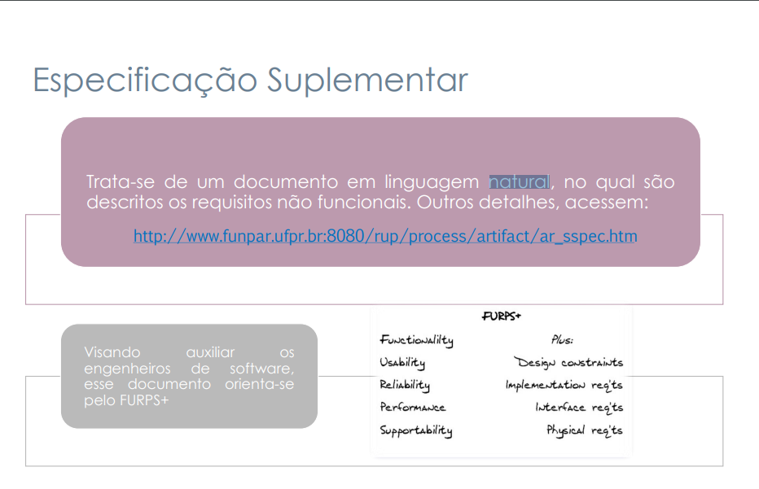
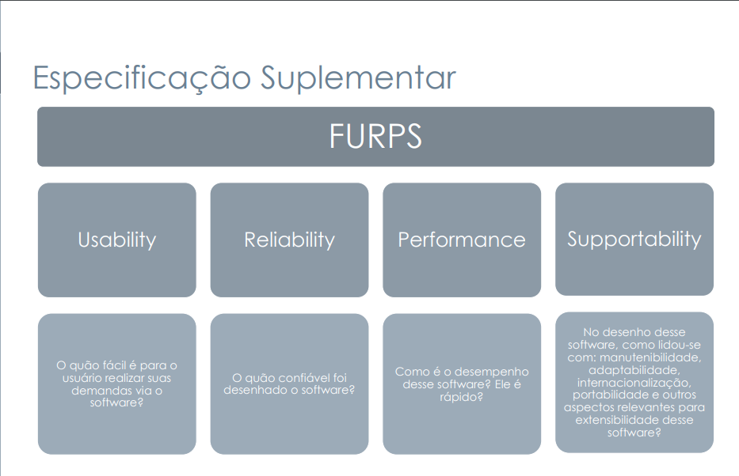

# Introdução
A Especificação Suplementar é um documento em linguagem natural, cujo objetivo principal é descrever de forma detalhada os requisitos não funcionais de um sistema. Diferentemente dos casos de uso, que focam em funcionalidades e fluxos de interação, a Especificação Suplementar captura aspectos de qualidade, restrições e características que o software deve atender, mas que não são expressos nos diagramas comportamentais.

# Metodologia
Para elaborar a Especificação Suplementar, utiliza-se como guia o modelo FURPS+, que organiza os requisitos não funcionais nas seguintes categorias:

- Usability (Usabilidade): facilidade de uso pelo usuário.

- Reliability (Confiabilidade): previsão de falhas e capacidade de recuperação.

- Performance (Desempenho): tempo de resposta e throughput do sistema.

- Supportability (Suportabilidade): manutenibilidade, portabilidade, internacionalização, entre outros

Cada requisito não funcional é descrito em linguagem natural e classificado conforme essas categorias, permitindo aos engenheiros de software entenderem claramente as expectativas de qualidade e as restrições do projeto. Essa especificação serve como complemento aos casos de uso, garantindo que aspectos críticos de usabilidade, confiabilidade, desempenho e manutenção sejam considerados desde as primeiras fases de desenvolvimento.

# Especificação Suplementar

---

## Histórico de Revisões

| Versão | Data | Descrição | Autor |
|--------|------|-----------|-------|
|        |      |           |       |

---

## 1. Introdução

Este documento apresenta a Especificação Suplementar do aplicativo Cadastro Único, detalhando os requisitos que não foram completamente descritos nos casos de uso. O objetivo é registrar requisitos legais, de qualidade (como usabilidade, desempenho, confiabilidade e suportabilidade), além de outros aspectos técnicos e operacionais do sistema.

Abrange também restrições de projeto, interfaces e componentes adquiridos, com o intuito de fornecer um suporte completo à equipe de desenvolvimento.

### Finalidade

Este documento tem por finalidade especificar os requisitos suplementares não implementados no sistema, para que possam ser planejados, desenvolvidos e integrados às versões futuras do aplicativo Cadastro Único.

### Escopo

Abrange os requisitos funcionais e não funcionais elicitados por técnicas formais, porém ainda não implementados na versão atual do sistema. Estes requisitos são cruciais para a ampliação das funcionalidades voltadas ao público MEI, acessibilidade e suporte técnico.

### Definições, Acrônimos e Abreviações

| Termo | Definição |
|-------|-----------|
| **RF** | Requisito Funcional |
| **RNF** | Requisito Não Funcional |
| **MEI** | Microempreendedor Individual |
| **LGPD** | Lei Geral de Proteção de Dados |
| **MTBF** | Mean Time Between Failures |
| **MTTR** | Mean Time To Repair |

### Visão Geral

Esta especificação apresenta:
- Os requisitos funcionais não implementados (Seção 3);  
- Os requisitos de usabilidade relacionados (Seção 4);  
- Os requisitos de confiabilidade, desempenho e suportabilidade ainda não presentes (Seções 5 a 7);  
- As restrições de projeto (Seção 8);  
- Os requisitos técnicos e de ambiente (Seção 9);  
- As interfaces previstas, requisitos de licenciamento, anexos e aprovações.

## 2. Identificação do Projeto

| Campo               | Informação                      |
|---------------------|----------------------------------|
| Projeto             | Cadúnico – Cadastro Único |
| Requisitante        | Prof. Andre Barros de Sales            |
| Gerente de Projetos | [Ryan Salles](https://github.com/RA-Salles)     |

## 3. Funcionalidade  

### 3.1. RNF01 – Desempenho  
Definir parâmetros de tempo de resposta e carga suportada, com foco em picos de acesso, para garantir estabilidade nas funcionalidades futuras relacionadas ao MEI e filtragem de benefícios.

### 3.2. RNF05 – Acessibilidade  
Garantir que as novas funcionalidades sejam compatíveis com tecnologias assistivas (leitores de tela, alto contraste, navegação por teclado).

### 3.3. RNF07 – Compatibilidade com Aplicativo Off-line  
As novas funcionalidades devem funcionar também no modo offline, sincronizando os dados automaticamente quando houver conexão.

### 3.4. RNF08 – Transmissão via Conectividade Social  
A transmissão de informações do cadastro MEI e dados filtrados de benefícios deverá ser realizada pela ferramenta Conectividade Social da CAIXA.

### 3.5. RNF10 – Integração MEI  
O sistema deverá permitir integração com a base de dados da Receita Federal e sistemas da Redesim para validação e consulta de CNPJ MEI.

### 3.6. RNF14 – Usabilidade  
As novas funcionalidades devem respeitar princípios de usabilidade, como consistência, feedback ao usuário e baixa curva de aprendizagem.

## 4. Usabilidade  
### 4.1. Requisito de Usabilidade Um

## 5. Confiabilidade  
### 5.1. Requisito de Confiabilidade Um

## 6. Desempenho  
### 6.1. Requisito de Desempenho Um

## 7. Suportabilidade  
### 7.1. Requisito de Suportabilidade Um

## 8. Restrições de Projeto  
### 8.1. Restrição de Projeto Um

## 9. Outros Requisitos do Produto  
### 9.1. Padrões Aplicáveis  
### 9.2. Requisitos do Sistema  
### 9.3. Requisitos Ambientais

## 10. Componentes Comprados

## 11. Interfaces  
### 11.1. Interfaces de Usuário  
### 11.2. Interfaces de Hardware  
### 11.3. Interfaces de Software  
### 11.4. Interfaces de Comunicações

## 12. Requisitos de Licenciamento

## 13. Anexos

## 14. Referências

1. IEEE Std 830-1998 – *Recommended Practice for Software Requirements Specifications*  
2. LGPD – Lei nº 13.709/2018  
3. Portarias Senarc nº 123/2020 e 456/2021  
4. WIEGERS, Karl E.; BEATTY, Joy. *Software Requirements*. Microsoft Press, 3ª ed., 2013.

## 15. Aprovações

| Participante | Assinatura | Data |
|--------------|------------|------|
|              |            |      |

## Referências
> SERRANO, Milene; SERRANO, Maurício. Requisitos – Aula 13a [slide em PDF]. Aprender³, Universidade de Brasília, 2025. Disponível em: <https://aprender3.unb.br/pluginfile.php/3096118/mod_resource/content/1/Requisitos%20-%20Aula%20013a.pdf>. Acesso em: 16 maio 2025.

> REPOSITÓRIO DA DISCIPLINA – Aprender 3. Template da Especificação Suplementar. Disponível em: <https://aprender3.unb.br/mod/resource/view.php?id=1390972>. Acesso em: 16 maio 2025.

### Imagem 1: 

    

### Imagem 2: 

    

## Histórico de Versão

| Versão |    Data    |        Descrição         |                   Autor                    |                   Revisor                   |
| :----: | :--------: | :----------------------: | :----------------------------------------: | :-----------------------------------------: |
|  1.0   | 16/05/2025 |   Criação do Documento   | [João Pedro Costa](https://github.com/johnaopedro) e [Julia Paulino](https://github.com/JuliaGabP) | [Ryan Salles](https://github.com/RA-Salles) |
|  1.1   | 16/05/2025 |   Criação da introdução e metodologia   | [João Pedro Costa](https://github.com/johnaopedro) | [Ryan Salles](https://github.com/RA-Salles) |
|  1.2   | 16/05/2025 |   Criação da estrutura de especificação suplementar   | [João Pedro Costa](https://github.com/johnaopedro) e [Julia Paulino](https://github.com/JuliaGabP) | [Ryan Salles](https://github.com/RA-Salles) |
|  1.3   | 16/05/2025 |   Preenchimento de cinco seções da especificação   | [João Pedro Costa](https://github.com/johnaopedro) | [Ryan Salles](https://github.com/RA-Salles) |