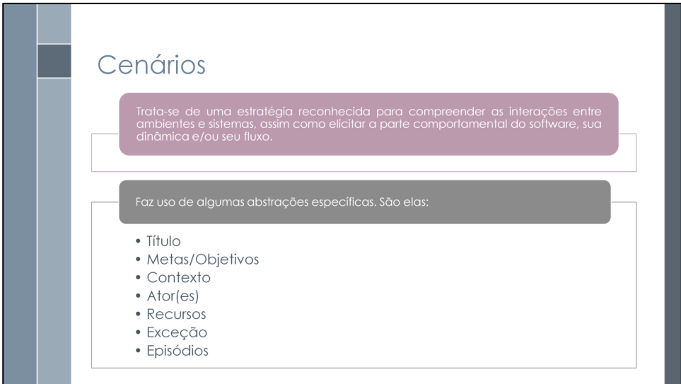
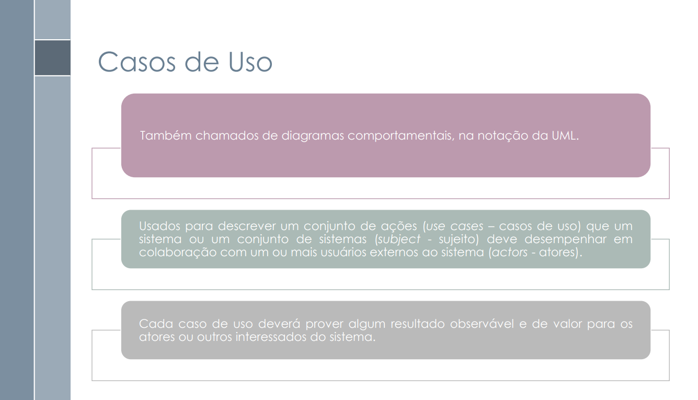

# Técnicas de Modelagem

## Introdução à Modelagem

Modelagem é o processo de criar representações abstratas ou técnicas que descrevem os fluxos e comportamentos de um software. Essas representações geralmente possuem apelo visual, e, por isso, devem ser simples e fáceis de entender. Um exemplo disso é o Rich Picture, já abordado anteriormente. É importante destacar que, dependendo da proposta da modelagem, o nível de abstração e complexidade pode variar.

# Técnicas de Modelagem Tradicionais

## Casos de Uso

Casos de Uso são utilizados para descrever um conjunto de ações que um sistema (ou um conjunto de sistemas) deve realizar em colaboração com um ou mais usuários externos. Essas ações devem fornecer um resultado observável e valioso para as partes interessadas. Na notação UML, os Casos de Uso são representados por diagramas comportamentais.

## Especificação Suplementar

A Especificação Suplementar é um documento em linguagem natural que visa explicitar os requisitos não funcionais do sistema a ser desenvolvido. Seu objetivo é manter as partes interessadas e a equipe de desenvolvimento informadas sobre atributos como qualidade, usabilidade, confiabilidade, desempenho e suportabilidade.

#  Técnicas de Modelagem Ágeis

## Cenário

Cenários são técnicas visuais utilizadas para compreender as relações entre ambientes e sistemas. Para ilustrar essas relações, os cenários fazem uso de elementos como: Título, Objetivo, Contexto, Recurso, Atores e Episódios. Além disso, cenários possuem caráter evolutivo, ou seja, não têm uma versão definitiva desde o início. Isso exige um gerenciamento contínuo, com mecanismos para garantir a rastreabilidade, o controle de versões e a eliminação de inconsistências e desatualizações.

## Léxico

Léxico é uma técnica que tem como objetivo descrever os símbolos de uma linguagem. Um exemplo é o LAL (Léxico Ampliado da Linguagem). O léxico possui algumas características: cada símbolo é descrito por sua noção (denotação do símbolo) e por seu impacto (efeito causado na aplicação). Algumas regras gerais devem ser seguidas: cada símbolo pode ter zero ou mais sinônimos, uma ou mais noções, e um ou mais impactos.

## Referências
> SERRANO, Milene; SERRANO, Maurício. Requisitos – Aula 10. Gama: Universidade de Brasília (UnB). Slide de apresentação. Acesso em: 7 maio 2025.

> SERRANO, Milene; SERRANO, Maurício. Requisitos – Aula 13. Gama: Universidade de Brasília (UnB). Slide de apresentação. Acesso em: 7 maio 2025.

## Histórico de Versões

| Versão | Data | Descrição  | Autor        | Revisor |
| :-----: | :----: | :----------: | :------------: | :--------: |
| 1.0    | 07/05/2025 | Criação da página de análise das técnicas de modelagem  | [João Igor](https://github.com/JoaoPC10) e [Gabriel Flores](https://github.com/Gabrielfcoelho) | [Ryan Salles](https://github.com/RA-Salles) |
| 1.1    | 07/05/2025 | Adição das definições das técnicas  | [João Igor](https://github.com/JoaoPC10)  e [Gabriel Flores](https://github.com/Gabrielfcoelho) | [Ryan Salles](https://github.com/RA-Salles) |
| 1.2 | 09/05/2025 | Alterações e correçõestextuais | [Gabriel Flores](https://github.com/Gabrielfcoelho) e [João Igor](https://github.com/JoaoPC10) |  [Ryan Salles](https://github.com/RA-Salles) |