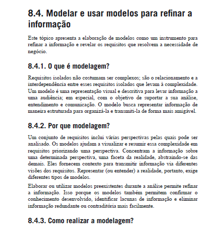
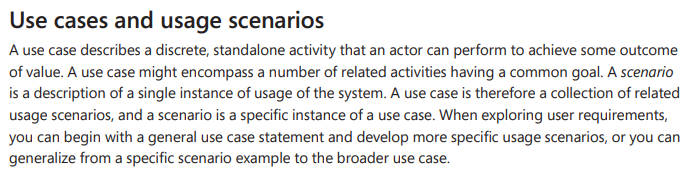
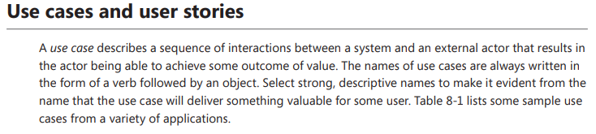
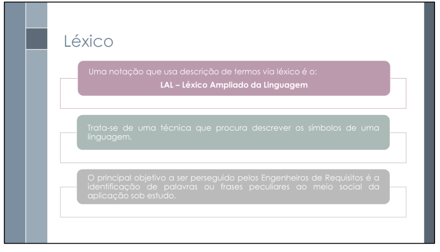

# Introdução

Modelagem é o ato de criar modelos, ou seja, padrões para construção de demais artefatos. Segundo VAZQUES & SIMÕES (2016), a modelagem é o ato de criar representações visuais e/ou descritivas para facilitar o acesso à informação de sua audiência. Possui o objetivo de sustentar análises, entedimentos e comunicação de uma forma amigável e intuitiva. Tendo isso em mente, deve-se modelar para atingir um nível mais elevado no que se diz a compreensão dos requisitos e, portanto, os desejos e necessidades dos clientes e usuários. 

## Cenários

Os cenários são uma técnica de modelagem que descrevem instâncias específicas de uso do sistema, ilustrando atividades discretas e independentes que um ator pode realizar para alcançar um resultado de valor. Cada cenário reflete uma única ocorrência de interação, sendo parte de um caso de uso mais amplo. Um caso de uso, por sua vez, é uma coleção de cenários de uso relacionados, que compartilham um objetivo comum. Durante a exploração dos requisitos do usuário, é possível iniciar com uma declaração geral de caso de uso e, a partir dela, desenvolver cenários mais específicos. Alternativamente, pode-se partir de um exemplo de cenário específico e generalizá-lo para um caso de uso mais abrangente.

## Casos de Uso

Os casos de uso são uma técnica de modelagem que representa uma sequência de interações entre um sistema e um ator(es) externo, culminando em um resultado valioso para o ator. Os nomes dos casos de uso devem ser sempre estruturados como um verbo seguido de um objeto. É importante selecionar nomes fortes e descritivos para deixar evidente, pelo nome, que o caso de uso entregará algo valioso para algum usuário.

## Léxico

Léxico é uma técnica que tem como objetivo descrever os símbolos de uma linguagem. Um exemplo é o LAL (Léxico Ampliado da Linguagem). O léxico possui algumas características: cada símbolo é descrito por sua noção (denotação do símbolo) e por seu impacto (efeito causado na aplicação). Algumas regras gerais devem ser seguidas: cada símbolo pode ter zero ou mais sinônimos, uma ou mais noções, e um ou mais impactos.

## Especificação Suplementar

A Especificação Suplementar é um documento em linguagem natural que visa explicitar os requisitos não funcionais do sistema a ser desenvolvido. Seu objetivo é manter as partes interessadas e a equipe de desenvolvimento informadas sobre atributos como qualidade, usabilidade, confiabilidade, desempenho e suportabilidade.

## Referências

> WIEGERS, Karl E.; BEATTY, Joy. Software Requirements. 3. ed. Redmond: Microsoft Press, 2013, p. 144-145.

> VAZQUEZ, C. E.; SIMÕES, G. S. Engenharia de Requisitos: Software Orientado ao Negócio. 1 ed. Rio de Janeiro: Brasport, 2016. p. 279.

#### Imagem 1: Modelagem

    

  

**Fonte:** Adaptado de VAZQUEZ, C. E.; SIMÕES, G. S. Engenharia de Requisitos: Software Orientado ao Negócio. 1 ed. Rio de Janeiro: Brasport, 2016. p. 279.

##### Imagem 2: Cenário

    

**Fonte:** Adaptado de WIEGERS, Karl E.; BEATTY, Joy. Software Requirements. 3. ed. Redmond: Microsoft Press, 2013, p. 144-145.

##### Imagem 3: Casos de Uso

    

  

**Fonte:** Adaptado de WIEGERS, Karl E.; BEATTY, Joy. Software Requirements. 3. ed. Redmond: Microsoft Press, 2013, p. 144-145.

> SERRANO, Milene; SERRANO, Maurício. Requisitos – Aula 10. Gama: Universidade de Brasília (UnB). Slide de apresentação. Acesso em: 7 maio 2025.

> WIEGERS, Karl E.; BEATTY, Joy. Software Requirements. 3. ed. Redmond: Microsoft Press, 2013, p. 144-145.

  

## Histórico de Versão

| Versão |    Data    |    Descrição     |         Autor         |       Revisor      |
| :----: | :--------: | :--------------: | :-------------------: | :----------------: |
|  1.0   | 08/05/2025 | Criando a pagina e adicionando a introdução de cada tema  | [João Pedro Costa](https://github.com/johnaopedro) | [Julia Gabriela](https://github.com/JuliaGabP) |
|  1.1   | 08/05/2025 | Adição das técnicas Casos de Uso e Cenários  | [João Pedro Costa](https://github.com/johnaopedro) | [Julia Gabriela](https://github.com/JuliaGabP)                      
|  1.2   | 09/05/2025 | Adição das Técnicas de Léxico e Especificação suplementar  | [João Igor](https://github.com/JoaoPC10) e [Gabriel Flores](https://github.com/Gabrielfcoelho) | [Ryan Salles](https://github.com/RA-Salles) |
|  1.3   | 09/05/2025 | Alterações e correções textuais | [Gabriel Flores](https://github.com/Gabrielfcoelho) e [João Igor](https://github.com/JoaoPC10) |  [Ryan Salles](https://github.com/RA-Salles) |
|  1.4   | 11/05/2025 | Adicionando uma introdução mais robusta                   | [Ryan Salles](https://github.com/RA-Salles)      | [João Pedro Costa](https://github.com/joaopedro) |