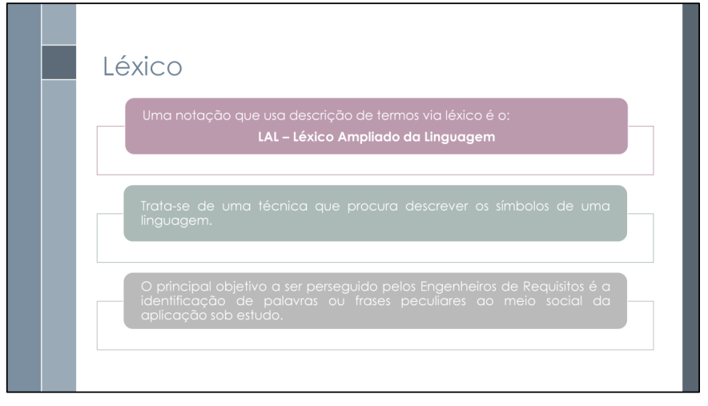
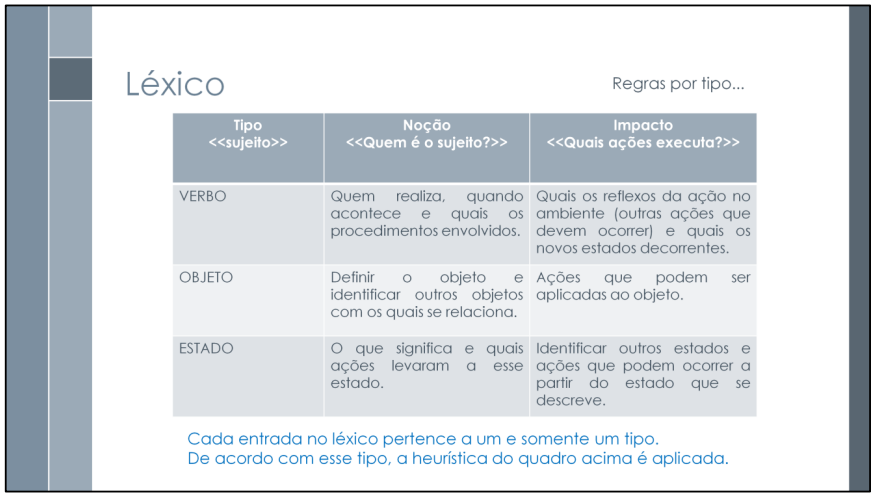

# Léxico

## Funções dos autores

| Nome                 | Função                                                            | 
|----------------------|----------------------------------------------------------------   |
|[Gabriel Flores](https://github.com/Gabrielfcoelho) | Criação do documento; Composição do documento | 
|[João Igor](https://github.com/JoaoPC10)            | Criação do documento; Composição do documento| 
|[João Pedro Costa](https://github.com/johnaopedro)  | Complementação de léxicos relacionados a UC10, UC11 e UC12| 
|[Julia Gabriela](https://github.com/JuliaGabP)      | Criação da tabela de funções| 
|[Ryan Salles](https://github.com/RA-Salles)         | Revisão geral, manutenção e criação de ids únicos | 

    Autor(es): 
    <a href="https://github.com/JuliaGabP" target="_blank">Julia Gabriela</a>

## Introdução

O principal objetivo do léxico, a ser executado pelos Engenheiros de requisitos, é a identificação de palavras ou frases peculiares ao meio social da aplicação sob estudo. Cada símbolo é descrito com noção, significado do símbolo, e impacto, descrição do efeito/uso/ocorrência do símbolo na aplicação.

## Modelo de Tabela de Léxicos

 
    <b>Tabela 1:</b> Modelo de Tabela 

  

| Léxico         |  Classificação      | Sinônimos                                   | Noção             | Impacto                     |
| :----------:   | :-----------:       | :----------:                                |:----------:       |:-------:                    |
| Nome do Léxico | Verbo/Objeto/Estado | Palavras ou expressões com sentido parecido | Quem é o sujeito? | Quais ações executa ou sofre|

    Autor(es): 
    <a href="https://github.com/Gabrielfcoelho" target="_blank">Gabriel Flores</a>, 
    <a href="https://github.com/JoaoPC10" target="_blank">João Igor</a>

## Tabela de Léxicos Adições por Gabriel Flores e João Igor

| ID   | Léxico                                                                                              |  Classificação | Sinônimos                                                                                 | Noção                                                                                                                                                                    | Impacto |
| :--: |:----------:                                                                                         |:-----------:   |:----------:                                                                               |:----------:                                                                                                                                                              |-------|
| L01  | [Cadastrar Família](#cadastrar-família)                                                             | Verbo          | [Registrar família](#cadastrar-família), [inserir família](#cadastrar-família)            | Ação de incluir uma nova [família](#família) no [Cadastro](#cadastro) Único, informando dados pessoais, endereço, composição [familiar](#família) e renda.               | Permite que a [família](#família) seja avaliada para inclusão em [programas sociais](#programa-social).     |
| L02  | [Atualizar Cadastro](#atualizar-cadastro)                                                           | Verbo          | [Modificar dados](#atualizar-cadastro), [Revisar informações](#atualizar-cadastro)        | Alteração dos dados de uma [família](#família) já cadastrada, geralmente por mudanças na renda, endereço ou composição [familiar](#família).                             | Mantém o [cadastro](#cadastro) vigente e evita suspensão de benefícios.                                     |
| L03  | [Consultar Cadastro](#consultar-cadastro)                                                           | Verbo          | [Visualizar cadastro](#consultar-cadastro), [Ver dados](#consultar-cadastro)              | Ação de visualizar as informações de um [cadastro](#cadastro) já existente. Pode ser feita por operadores ou pelo próprio [responsável familiar](#responsável-familiar). | Facilita o acompanhamento e validação dos dados registrados.                                                |
| L04  | [Emitir Comprovante](#emitir-comprovante)                                                           | Verbo          | [Gerar comprovante](#emitir-comprovante), [Baixar documento](#emitir-comprovante)         | Geração de um [documento](#documentos-pessoais) que comprova o registro ou a atualização no [Cadastro Único](#cadastro).                                                 | Permite ao cidadão comprovar situação cadastral perante órgãos públicos.                                    |
| L05  | [Validar Informações](#validar-informações)                                                         | Verbo          | [Verificar dados](#validar-informações), [Confirmar cadastro](#validar-informações)       | Confirmação da veracidade dos dados informados por [famílias](#família).                                                                                                 | Impede fraudes e garante qualidade nas decisões sobre benefícios.                                           |
| L06  | [Realizar Entrevista](#realizar-entrevista)                                                         | Verbo          | [Coletar informações](#realizar-entrevista), [Aplicar questionário](#realizar-entrevista) | Atividade conduzida por [entrevistador social](#entrevistador-social) para coletar dados das [famílias](#família).                                                       | Essencial para preenchimento correto do [cadastro](#cadastro).                                              |
| L07  | [Agendar Atendimento](#agendar-atendimento)                                                         | Verbo          | [Marcar atendimento](#agendar-atendimento), [Definir horário](#agendar-atendimento)       | Reserva de data e hora para que a [família](#família) compareça ao [CRAS](#centro-de-referência-de-assistência-socialcras).                                              | Organiza o fluxo de cadastramentos, evitando sobrecarga.                                                    |
| L08  | [Família](#família)                                                                                 | Objeto         | [Unidade familiar](#família)                                                              | Conjunto de pessoas que residem sob o mesmo teto e compartilham renda.                                                                                                   | Unidade principal de análise e [cadastro](#cadastro).                                                       |
| L09  | [Pessoa](#pessoa)                                                                                   | Objeto         | [Membro familiar](#pessoa)                                                                | Indivíduo que compõe uma [família](#família) registrada.                                                                                                                 | Seus dados alimentam o sistema e definem o perfil da [família](#família).                                   |
| L10  | [Responsável Familiar](#responsável-familiar)                                                       | Objeto         | [Representante familiar](#responsável-familiar)                                           | Pessoa que representa o grupo [familiar](#família) perante o [Cadastro Único](#cadastro)                                                                                 | Seu [NIS](#número-de-identificação-socialnis) referencia todo o [cadastro](#cadastro) [familiar](#família). |
| L11  | [Número de Identificação Social(NIS)](#número-de-identificação-socialnis)                           | Objeto         | [Código de identificação](#número-de-identificação-socialnis)                             | Código único que identifica cada [pessoa](#pessoa) cadastrada.                                                                                                           | Usado em diversos sistemas para concessão de benefícios.                                                    |
| L12  | [Cadastro](#cadastro)                                                                               | Objeto         | [Registro](#cadastro)                                                                     | Conjunto de informações organizadas sobre [famílias](#família) e [pessoas](#pessoa).                                                                                     | Elemento fundamental para a gestão de políticas sociais.                                                    |
| L13  | [Programa Social](#programa-social)                                                                 | Objeto         | [Benefício Social](#programa-social)                                                      | Políticas de transferência de renda ou assistência baseadas no [Cadastro Único](#cadastro).                                                                              | O [cadastro](#cadastro) determina a elegibilidade.                                                          |
| L14  | [Centro de Referência de Assistência Social(CRAS)](#centro-de-referência-de-assistência-socialcras) | Objeto         | [Unidade de atendimento](#centro-de-referência-de-assistência-socialcras)                 | Local onde ocorrem os atendimentos para cadastramento e atualização de dados.                                                                                            | Ponto de entrada do cidadão no sistema.                                                                     |
| L15  | [Entrevistador Social](#entrevistador-social)                                                       | Objeto         | [Agente social](#entrevistador-social)                                                    | Profissional que conduz as [entrevistas](#realizar-entrevista) e insere os dados no sistema.                                                                             | Responsável direto pela qualidade dos dados inseridos.                                                      |
| L16  | [Documentos Pessoais](#documentos-pessoais)                                                         | Objeto         | [Identificação](#documentos-pessoais)                                                     | Documentos necessários para comprovação dos dados informados no [cadastro](#cadastro).                                                                                   | Sem eles, o [cadastro](#cadastro) pode ser considerado inválido ou incompleto.                              |
| L17  | [Cadastro Ativo](#cadastro-ativo)                                                                   | Estado         | [Cadastro Válido](#cadastro-ativo)                                                        | Situação do [cadastro](#cadastro) que está atualizado e dentro do prazo exigido.                                                                                         | Permite recebimento de benefícios sem restrições.                                                           |
| L18  | [Cadastro Inativo](#cadastro-inativo)                                                               | Estado         | [Cadastro vencido](#cadastro-inativo)                                                     | [Cadastro](#cadastro) fora do prazo de validade, exigindo atualização.                                                                                                   | Pode bloquear o acesso a [programas sociais](#programa-social).                                             |
| L19  | [Família Elegível](#família-elegível)                                                               | Estado         | [Apta ao benefício](#família-elegível)                                                    | [Família](#família) que atende aos critérios de um ou mais [programas sociais](#programa-social).                                                                        | Pode receber os benefícios previstos.                                                                       |
| L20  | [Família Inelegível](#família-inelegível)                                                           | Estado         | [Não apta ao benefício](#família-inelegível)                                              | [Família](#família) que não atende aos critérios exigidos.                                                                                                               | Não pode receber os benefícios.                                                                             |
| L21  | [Cadastro Pendente](#cadastro-pendente)                                                             | Estado         | [Cadastro incompleto](#cadastro-pendente)                                                 | [Cadastro](#cadastro) em processo de validação ou com dados faltantes.                                                                                                   |  Pode atrasar a concessão de benefícios.                                                                    |

    Autor(es): 
    <a href="https://github.com/Gabrielfcoelho" target="_blank">Gabriel Flores</a>, 
    <a href="https://github.com/JoaoPC10" target="_blank">João Igor</a>

## Léxicos – Adições por João Pedro Costa

Esta seção apresenta os léxicos adicionais criados para os casos de uso UC10, UC11 e UC12, específicos para o contexto do Microempreendedor Individual no sistema CadÚnico. Estes léxicos têm como objetivo fornecer uma compreensão aprofundada dos termos utilizados, garantindo uniformidade conceitual e facilitando a comunicação.

As tabelas seguem o seguinte padrão estrutural:

- ID: identificador único do termo.
- Noção: significado literal que o termo denota
- Impacto: conotação ou efeito prático que sua aplicação produz no sistema.
- Classificação: categoria do símbolo (Sujeito, Verbo, Objeto ou Estado).
- Dicionário: sinônimos e expressões equivalentes.
- Rastreabilidade: Código Caso de Uso/Cenário
 

 
    <b>Tabela 3:</b> Léxico para UC10

  

| ID                              | Noção                         | Impacto                                                           | Classificação | Dicionário | Rastreabilidade |
|--------                         |-----------                    |-------------                                                      |------------------|----------------|------------------|
| L-UC10-01 | [MEI](#l-uc10-01)             | Microempreendedor Individual - categoria empresarial simplificada | Permite identificação do perfil empresarial do [usuário](#l-uc10-04) no sistema | Objeto | UC10 |
| L-UC10-02 | [Indicar MEI](#l-uc10-02)     | Ação de informar a condição de [MEI](#l-uc10-01) durante o [cadastro](#l-uc10-03) | Registra o perfil empresarial no sistema CadÚnico | Verbo | UC10 |
| L-UC10-03 | [Cadastro](#l-uc10-03)        | Processo de criação de conta no app CadÚnico | Estabelece o perfil do [usuário](#l-uc10-04) no sistema | Estado | UC10 |
| L-UC10-04 | [Usuário](#l-uc10-04)         | Pessoa física que utiliza o app CadÚnico | Interage com o sistema para realizar [cadastro](#l-uc10-03) | Sujeito | UC10 |
| L-UC10-05 | [Opção "Sou MEI"](#l-uc10-05) | Campo de seleção para [indicar](#l-uc10-02) condição de [MEI](#l-uc10-01) | Permite ao sistema categorizar o [usuário](#l-uc10-04) como [MEI](#l-uc10-01) | Objeto | UC10 |

Autor(es): <a href="https://github.com/johnaopedro" target="_blank">João Pedro</a>

 

 
    <b>Tabela 4:</b> Léxico para UC11

  

| ID | Noção | Impacto | Classificação | Dicionário | Rastreabilidade |
|--------|-----------|-------------|------------------|----------------|------------------|
| L-UC11-01 | [Seção MEI](#l-uc11-01) | Área específica do app dedicada a conteúdos sobre [MEI](#l-uc10-01) | Centraliza informações relevantes para microempreendedores | Objeto | UC11 |
| L-UC11-02 | [Consultar informações](#l-uc11-02) | Ação de acessar conteúdos informativos sobre [MEI](#l-uc10-01) | Proporciona conhecimento sobre direitos e deveres do [MEI](#l-uc10-01) | Verbo | UC11 |
| L-UC11-03 | [Usuário MEI](#l-uc11-03) | [Usuário](#l-uc10-04) com perfil registrado como Microempreendedor Individual | Tem acesso a conteúdos específicos para sua categoria | Sujeito | UC11 |
| L-UC11-04 | [Obrigações MEI](#l-uc11-04) | Deveres legais e fiscais do Microempreendedor Individual | Informa responsabilidades que o [MEI](#l-uc10-01) deve cumprir | Objeto | UC11 |
| L-UC11-05 | [Benefícios MEI](#l-uc11-05) | Vantagens e direitos do Microempreendedor Individual | Esclarece privilégios da categoria empresarial | Objeto | UC11 |
| L-UC11-06 | [Formalização](#l-uc11-06) | Processo de regularização como [MEI](#l-uc10-01) | Orienta sobre como se tornar [MEI](#l-uc10-01) legalmente | Estado | UC11 |
| L-UC11-07 | [Linhas de crédito](#l-uc11-07) | Opções de financiamento disponíveis para [MEI](#l-uc10-01) | Facilita acesso a recursos financeiros | Objeto | UC11 |

Autor(es): <a href="https://github.com/johnaopedro" target="_blank">João Pedro</a>

 

    <b>Tabela 5:</b> Léxico para UC12

 

| ID | Noção | Impacto | Classificação | Dicionário | Rastreabilidade |
|--------|-----------|-------------|------------------|----------------|------------------|
| L-UC12-01 | [Personalização](#l-uc12-01) | Adaptação de conteúdos baseada no perfil do [usuário](#l-uc10-04) | Torna a experiência mais relevante e direcionada | Estado | UC12 |
| L-UC12-02 | [Setor de atuação](#l-uc12-02) | Área de atividade econômica do [MEI](#l-uc10-01) | Permite segmentação de [conteúdos](#l-uc12-04) específicos | Objeto | UC12 |
| L-UC12-03 | [Localização](#l-uc12-03) | Município e região onde o [MEI](#l-uc10-01) atua | Filtra [conteúdos](#l-uc12-04) regionais relevantes | Objeto | UC12 |
| L-UC12-04 | [Conteúdos segmentados](#l-uc12-04) | Informações filtradas por [setor](#l-uc12-02) e [região](#l-uc12-03) | Apresenta informações mais precisas ao [usuário](#l-uc10-04) | Objeto | UC12 |
| L-UC12-05 | [Editais](#l-uc12-05) | Chamadas públicas para [MEI](#l-uc10-01) por região/setor | Oferece oportunidades específicas do perfil | Objeto | UC12 |
| L-UC12-06 | [Sistema identifica](#l-uc12-06) | Ação automática de reconhecimento do perfil | Automatiza a [personalização](#l-uc12-01) sem intervenção manual | Verbo | UC12 |
| L-UC12-07 | [Interação com conteúdos](#l-uc12-07) | Ação do [usuário](#l-uc10-04) de engajar com as informações | Permite aproveitamento efetivo dos [conteúdos](#l-uc12-04) | Verbo | UC12 |

Autor(es): <a href="https://github.com/johnaopedro" target="_blank">João Pedro</a>

## Referências

> SERRANO, Milene; SERRANO, Maurício. Requisitos – Aula 10. Gama: Universidade de Brasília (UnB). Slide de apresentação. Acesso em: 8 maio 2025.

 

## Histórico de Versões

| Versão | Data       | Descrição                                                      | Autor                                                                                           | Revisor                                            |
| :----: | :----:     | :----------:                                                   | :------------:                                                                                  | :--------:                                         |
| 1.0    | 07/05/2025 | Criação da página de análise das técnicas de modelagem         | [João Igor](https://github.com/JoaoPC10) e [Gabriel Flores](https://github.com/Gabrielfcoelho)  | [Ryan Salles](https://github.com/RA-Salles)        |
| 1.1    | 08/05/2025 | Adição das Informações                                         | [João Igor](https://github.com/JoaoPC10) e  [Gabriel Flores](https://github.com/Gabrielfcoelho) | [Ryan Salles](https://github.com/RA-Salles)        |
| 1.2    | 09/05/2025 | Criação da tabela de léxicos                                   | [Gabriel Flores](https://github.com/Gabrielfcoelho) e [João Igor](https://github.com/JoaoPC10)  | [Ryan Salles](https://github.com/RA-Salles)        |
| 1.3    | 14/05/2025 | Criação de hiper links na tabela de léxicos                    | [Gabriel Flores](https://github.com/Gabrielfcoelho)                                             | [Ryan Salles](https://github.com/RA-Salles)        |
| 1.4    | 16/05/2025 | Criação de outros lexicos relacionados ao conteúdo             | [João Pedro Costa](https://github.com/johnaopedro)                                              | [Ryan Salles](https://github.com/RA-Salles)        |
| 1.5    | 16/05/2025 | Corrigindo imagens                                             | [João Pedro Costa](https://github.com/johnaopedro)                                              | [Ryan Salles](https://github.com/RA-Salles)        |
| 1.6    | 20/05/2025 | Criação da tabela de funções                                   | [Julia Gabriela](https://github.com/JuliaGabP)]                                                 | [João Pedro Costa](https://github.com/johnaopedro) |
| 1.7    | 22/05/2025 | Corrigindo conteúdo das tabelas de léxico de UC10, UC11 e UC12 | [João Pedro Costa](https://github.com/johnaopedro)                                              | [Julia Gabriela](https://github.com/JuliaGabP)     |