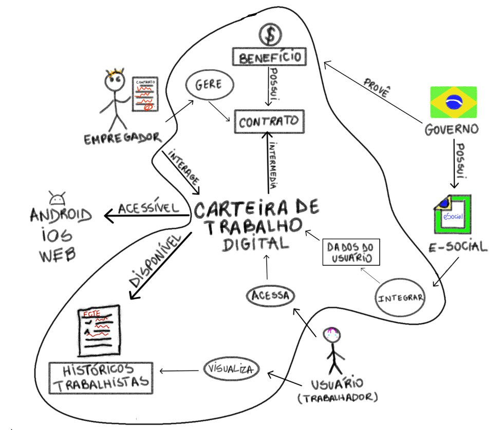

# Aplicativos analisados 

&emsp;&emsp;Lista dos aplicativos analisados pelos membros da equipe, para cada aplicativo foi desenvolvido um Rich Picture descrevendo seu fluxo de informações.

## 1. Aplicativos:

### 1.1 BleachBit

&emsp;&emsp; O BleachBit é um aplicativo de código aberto desenvolvido para Linux e Windows para fazer a limpeza do disco rígido e liberar espaço no seu sistema.

<figcaption align="center">Figura 1 - Rich Picture BleachBit</figcaption>

   **Autor:** Ryan Salles  
   **Descrição:** RichPicture do Fluxo Geral  
   **Data:** 13/04/2025  
   **Versão:** 1.0

### 1.2 Cadastro Único

&emsp;&emsp;O aplicativo do Cadastro Único é um dos canais de atendimentos do Cadasto Único para programas sociais do Governo Federal, por meio do qual é possível emitir comprovante de cadastramento, ver quais são os integrantes da família e o NIS de cada um, ver se o cadastro está atualizado e consultar os benefícios que a família recebe.

<figcaption align="center">Figura 2 - Rich Picture Cadastro Único</figcaption>

   **Autor:** João Igor  
   **Descrição:** RichPicture do Fluxo Geral  
   **Data:** 13/04/2025  
   **Versão:** 1.0

### 1.3 Carteira Digital de Trânsito

&emsp;&emsp; O aplicativo Carteira Digital de Trânsito permite ter acesso à uma versão digitalizada da sua CNH e do CLRV do seu veículo, além de ser possível também verificar infrações e pagar multas com 40% de desconto.

<figcaption align="center">Figura 3 - Rich Picture Carteira Digital de Trânsito</figcaption>

   **Autor:** Gabriel Flores  
   **Descrição:** RichPicture do Fluxo Geral  
   **Data:** 13/04/2025  
   **Versão:** 1.0

### 1.4 Carteira de Trabalho Digital

&emsp;&emsp; O aplicativo da Carteira de Trabalho Digital é um meio que facilita o acompanhamento da vida profissional, por ele é possível ter acesso a dados pessoais e contratos de trabalhos.

<figcaption align="center">Figura 4 - Rich Picture Carteira de Trabalho Digital</figcaption>

   **Autor:** Amanda Cruz  
   **Descrição:** RichPicture do Fluxo Geral  
   **Data:** 13/04/2025  
   **Versão:** 1.0
   
### 1.5 Duolingo

&emsp;&emsp; O aplicativo do Duolingo foi feito para auxiliar no aprendizado de uma língua extrangeira de maneira gamificada.

<figcaption align="center">Figura 5 - Rich Picture Duolingo</figcaption>

   **Autor:** João Pedro  
   **Descrição:** RichPicture do Fluxo Geral  
   **Data:** 13/04/2025  
   **Versão:** 1.0

## 1.6 E-título 

&emsp;&emsp; O aplicativo permite a obtenção do título de eleitor digital e também rápido à informações junto à Justiça Eleitoral.

<figcaption align="center">Figura 6 - Rich Picture E-título</figcaption>

   **Autor:** Julia Gabriela  
   **Descrição:** RichPicture do Fluxo Geral  
   **Data:** 13/04/2025  
   **Versão:** 1.0

## 1.7 Gov.br 

&emsp;&emsp; O aplicativo permite o acesso e compartilhamento de dados e documentos de maneira fácil e também facilita o acesso a outros serviços do governo no quais é possível entrar com a conta do Gov.br.

<figcaption align="center">Figura 6 - Rich Picture Gov.br</figcaption>

   **Autor:** Joao Vitor  
   **Descrição:** RichPicture do Fluxo Geral  
   **Data:** 13/04/2025  
   **Versão:** 1.0

## 2. Conclusão  

&emsp;&emsp; Cada membro da equipe instalou e utilizou os aplicativos desta lista. Depois de uma análise guiada pela criação dos Rich Pictures de cada aplicativo foi decidido pela equipe que a Carteira de Trabalho Digital seria o aplicativo escolhido pelos seguintes aspectos:

   - O aplicativo possui diversas funcionalidades, com interface intuitiva.
   - Tem um escopo que não é tão grande.
   - Não tem documentação já existente.
   - Possui uma grande quantidade de usuários.
   
## 3. Referências Bibligráficas

> - Clean Your System and Free Disk Space | BleachBit. Disponível em: <https://www.bleachbit.org>. Acesso em: 13 abr. 2025
> - App Cadastro Único. Disponível em: <https://www.gov.br/mds/pt-br/acoes-e-programas/cadastro-unico/paginas/app-cadunico>. Acesso em: 13 abr. 2025.
> - Carteira Digital de Trânsito. Disponível em: <https://www.gov.br/pt-br/apps/carteira-digital-de-transito-1>. Acesso em: 13 abr. 2025.
> - Carteira de Trabalho Digital. Disponível em: <https://www.gov.br/pt-br/temas/carteira-de-trabalho-digital>. Acesso em: 13 abr. 2025.
> - Duolingo. Disponível em: <https://pt.duolingo.com>. Acesso em: 13 abr. 2025.
> - e-Título. Disponível em: <https://www.tse.jus.br/eleicoes/eleicoes-2018/aplicativos-da-justica-eleitoral/e-titulo>. Acesso em: 13 abr. 2025.
> - Governo Federal - Governo do Brasil. Disponível em: <https://www.gov.br/pt-br>. Acesso em: 13 abr. 2025.

## 4. Histórico de Versão

| Versão | Data | Descrição  | Autor        | Revisor |
| :-----: | :----: | :----------: | :------------: | :--------: |
| 1.0 | 13/04/2025 | Criado arquivo dos aplicativos analisados | Gabriel Flores | João Vitor |