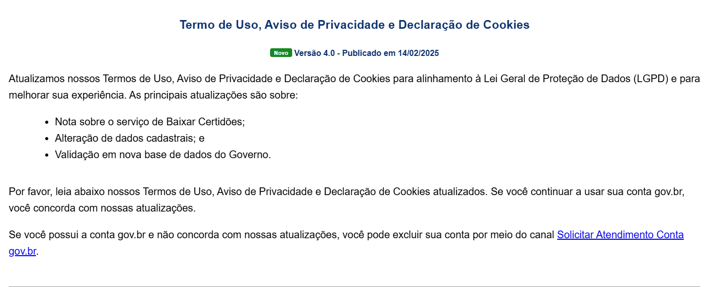
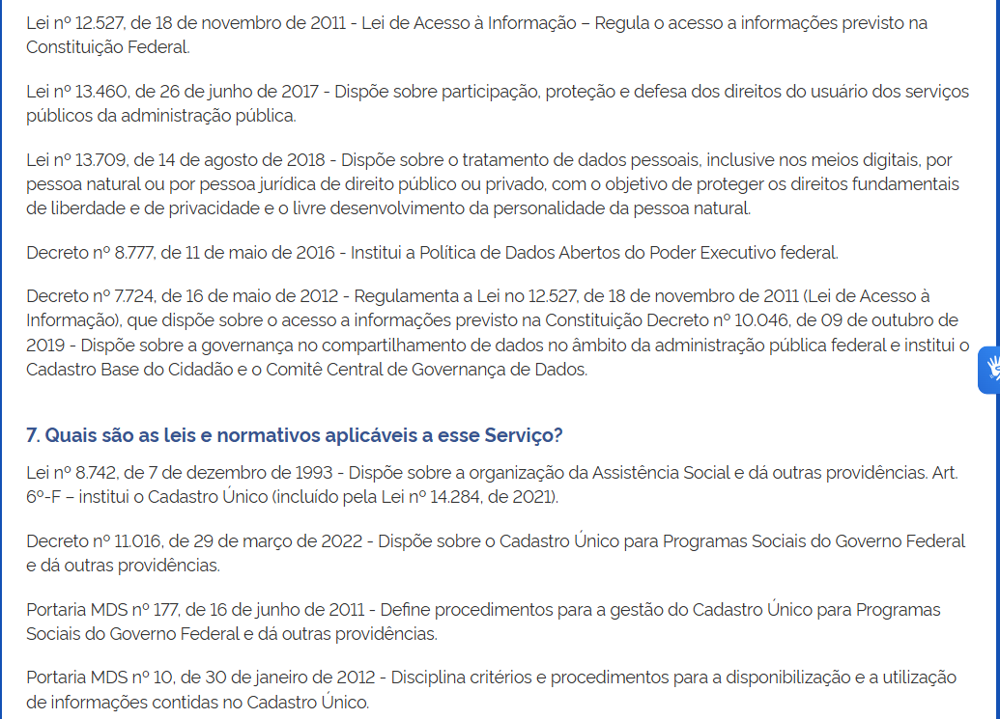
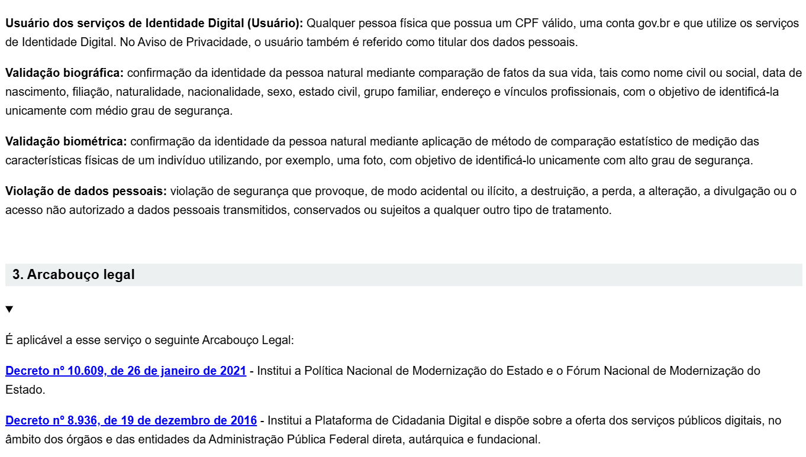
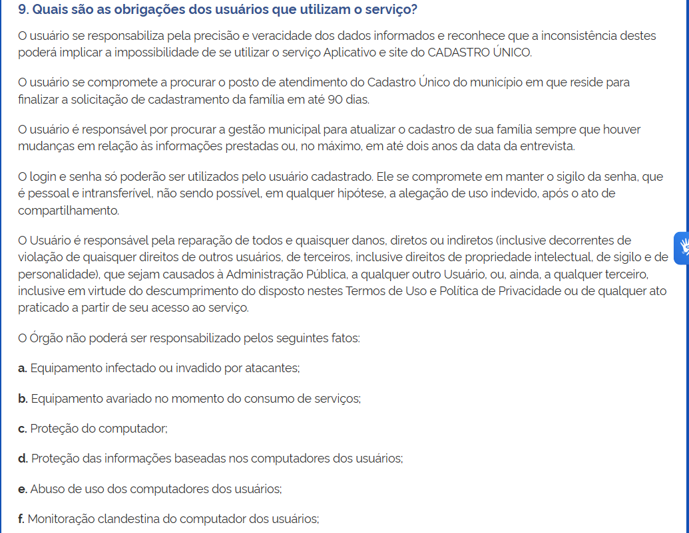
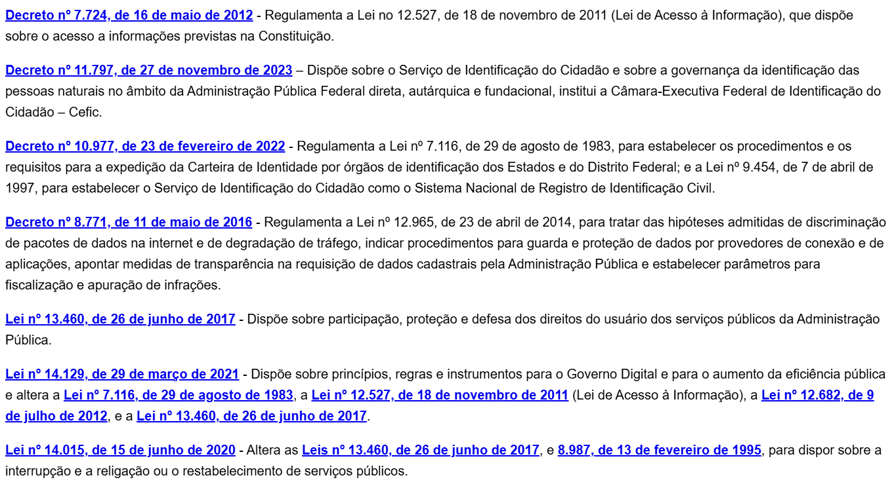
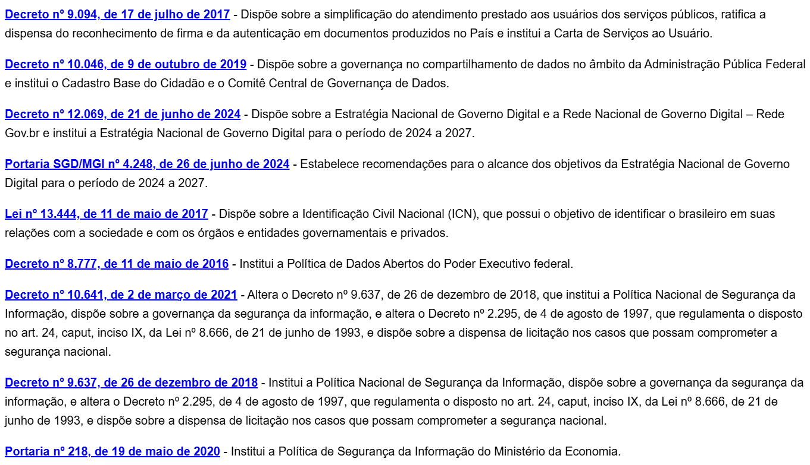
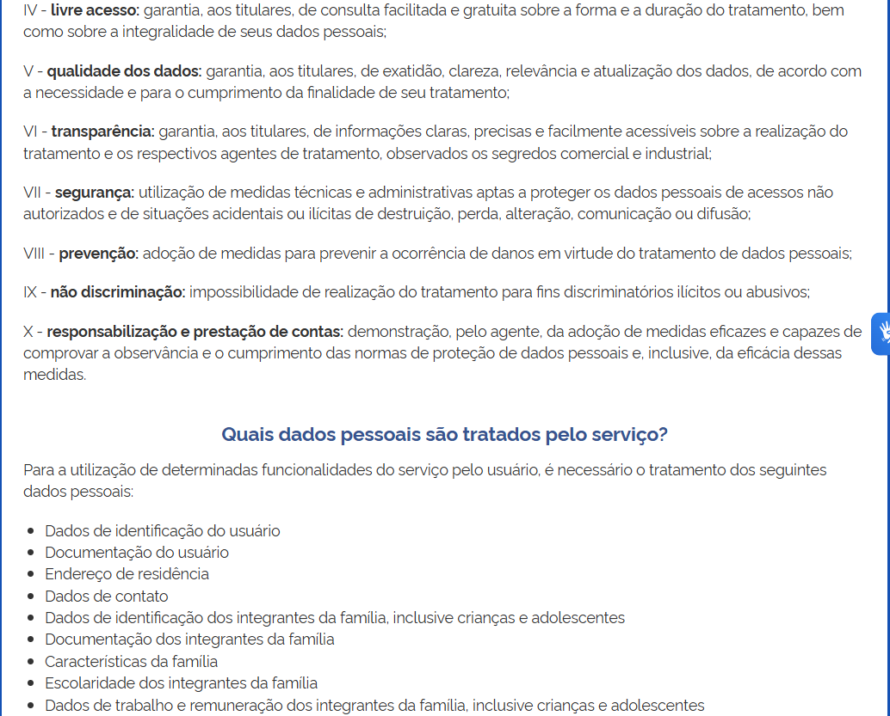
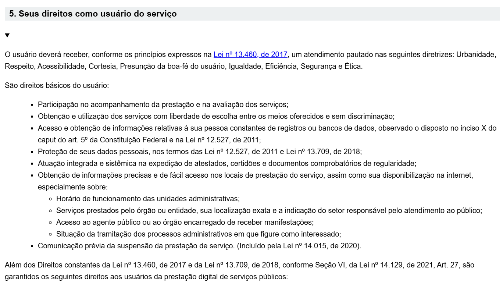
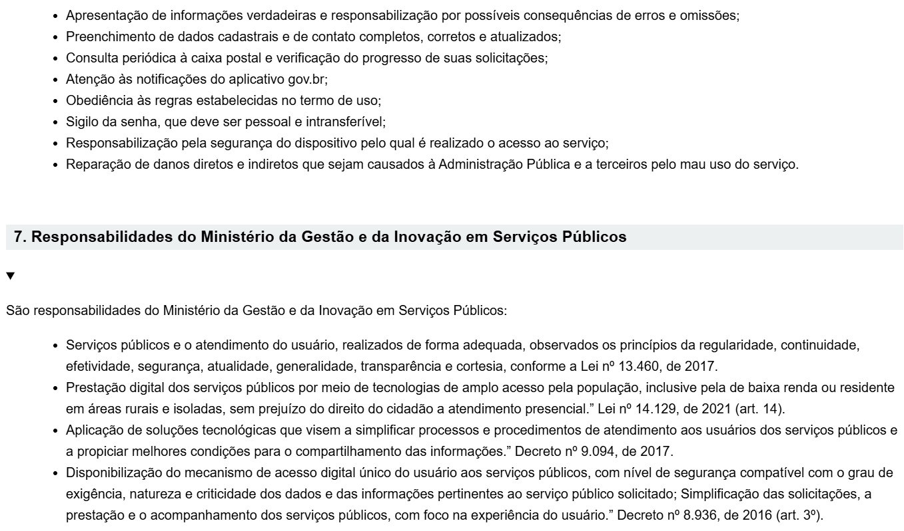

# Termos de Uso

## Funções dos autores

| Nome                 | Função                                                            | 
|----------------------|----------------------------------------------------------------   |
|[João Pedro Costa](https://github.com/johnaopedro) | Desenvolvimento do heatmap; Correção pelo metodo de inspeção de Fagan | 
| [Ryan Salles](https://github.com/RA-Salles) | Revisão |
|[Julia Gabriela](https://github.com/JuliaGabP)| Revisão | 

    Autor(es): 
    <a href="https://github.com/johnaopedro" target="_blank">João Pedro Costa</a>

## Introdução

Este documento apresenta os Termos de Uso do aplicativo em estudo, detalhando as condições e diretrizes para a utilização da plataforma. As imagens a seguir, retiradas do site do [Cadastro Único](https://cadunico.dataprev.gov.br/#/termo-de-uso), foram utilizadas como base para a análise e elaboração deste conteúdo.

Após a análise minuciosa dos termos de uso, verificou-se que não há nenhuma cláusula que proíba ou autorize expressamente o uso do Cadastro Único para finalidades acadêmicas ou educacionais.

## Imagens do Termo de Uso

## Bibliografia
> BRASIL. Ministério da Cidadania. Termo de uso – Cadastro Único. Disponível em: https://cadunico.dataprev.gov.br/#/termo-de-uso. Acesso em: 29 abr. 2025.

## Histórico de Versões

| Versão | Data | Descrição | Autor | Revisor |
| :-----:| :--: | :-------: | :---: | :----:  |
| 1.0    | 08/04/2025 | Criação da página de termos de uso | [João Pedro Costa](https://github.com/johnaopedro) | [Ryan Salles](https://github.com/RA-Salles) |
| 1.1    | 29/04/2025 | Atualização das referências e termos de uso para se adequar ao novo aplicativo | [João Pedro Costa](https://github.com/johnaopedro) | [Ryan Salles](https://github.com/RA-Salles) |
| 1.2    | 22/06/2025 | Correção pelo metodo de inspeção de Fagan | [João Pedro](https://github.com/johnaopedro) | [Ryan Salles](https://github.com/RA-Salles) |