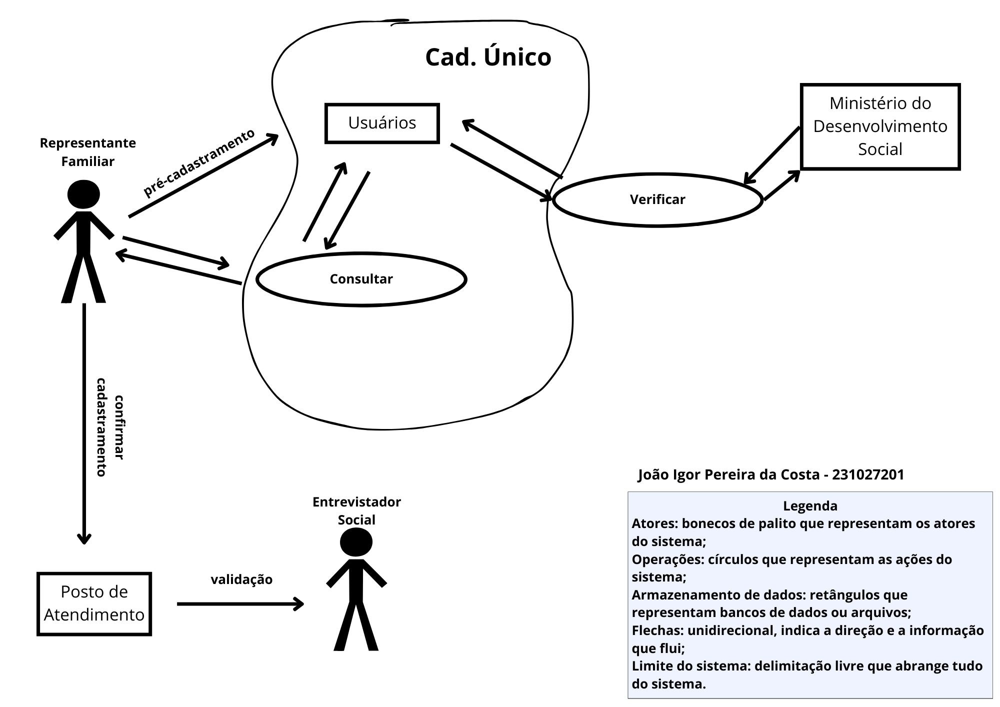

# Aplicativo Escolhido

## Introdução

Este documento descreve o processo realizado pela equipe para escolher o aplicativo **Cadastro Único**, ferramenta que facilita o acesso e o gerenciamento das informações sociais e cadastrais de famílias em situação de vulnerabilidade, para o desenvolvimento do projeto. A decisão foi baseada em critérios estabelecidos pelo time e pelo professor, levando em conta diversos aspectos que são abordados neste texto. Além disso, explica as motivações que justificaram a escolha do software, descrevendo as fases metodológicas utilizadas para a seleção do mesmo, assim como discorre sobre o funcionamento do sistema.

## Porque o Cadastro Único? 
O processo de escolha foi conduzido em duas etapas:

- Primeiramente, em uma reunião na plataforma [Microsoft Teams](https://teams.microsoft.com), foram apresentados os *rich pictures* dos [aplicativos analisados](appsAnalisados.md), permitindo uma discussão sobre suas funcionalidades; 
- Em seguida, uma enquete foi realizada no [Telegram](https://telegram.org/) para coletar as preferências dos participantes, considerando os fatores descritos ao decorrer desta documentação;
- Então escolhemos o Aplicativo do **Carteira de Trabalho Digital**, porém tivemos um problema com a disponibilização das informações, pois já se tinha feito um trablho sobre;
- Por fim, decidimos escolher o Aplicativo do **Cadastro Único**, visto que existia um público-alvo interessante e melhores documentações para se levantar requisitos.

## Critérios
* Não ter sido trabalhado na disciplina de Requisitos de Software anteriormente.
* Precisa ser um software livre ou do governo.
* Nível de complexidade do aplicativo.
* Facilidade de interação com o público-alvo.
* Acessibilidade e disponibilidade de informações.

## Motivações 
Considerando os critérios definidos, o grupo decidiu seguir o projeto com o Cadastro Único, apoiado pelos seguintes fatores:

* A oportunidade de uma análise mais profunda e uma nova abordagem dentro do contexto da matéria.
* A facilidade de comunicação com os usuários, o que facilita a coleta de feedback.
* A diversidade de funcionalidades do aplicativo, que permite um estudo completo, sem ser complexo demais a ponto de exigir muitos requisitos, nem tão simples que limite a análise.
* A estrutura governamental do software, que oferece canais de contato úteis para validação dos requisitos.

## Cadastro Único

<strong>Figura 1:</strong> Aplicativo Cadastro Único

 

  

<strong>Fonte: </strong> Governo Federal do Brasil. Disponível em: <a href="https://www.gov.br/pt-br/apps/cad">gov.br</a>. Acesso em: 13 abr. 2025

O Cadastro Único (Figura 1) tem como objetivo facilitar o acesso do cidadão às principais informações sociais e programas de assistência do governo, oferecendo praticidade e agilidade no acompanhamento de sua situação cadastral. O aplicativo disponibiliza uma série de funcionalidades essenciais, como:

* Consulta aos dados cadastrais da família e de seus membros.
* Verificação de programas socias vinculados.
* Emissão do comprovante de cadastramento no CadÚnico.
* Verificação da elegibilidade a programas sociais.
* Acompanhamento do status de benefícios vinculados ao Cadastro Único.

Ademais, possibilita a realização de diversas operações que anteriormente exigiam comparecimento presencial, como:

* Atualização de dados básicos do cadastro.
* Visualização de pendências cadastrais.
* Acesso a informações sobre atendimento em unidades como o CRAS.
* Consulta aos benefícios ativos e ao histórico de recebimento.  

A página do aplicativo está disponível para download na [Play Store](https://play.google.com/store/apps/details?id=br.gov.dataprev.meucadunico) e na [App Store](https://apps.apple.com/br/app/cadastro-único/id1605659516).

## Rich Picture do Aplicativo
O Rich Picture é uma representação visual que ajuda a entender e comunicar um problema ou sistema de forma simples. Ele mapeia partes envolvidas, como pessoas e processos, e também pode ser utilizado para identificar e representar requisitos, destacando funcionalidades, restrições e interações. Com isso, facilita a interpretação e a comunicação, sendo especialmente útil durante o levantamento dos requisitos. Na Figura 1, é possível visualizar a primeira versão da Rich Picture feita para o nosso aplicativo.

    <strong>Figura 1:</strong> Cadastro Único, Rich Picture.

    <strong>Autor:</strong> João Igor Pereira, 2025

## Conclusão
O **Cadastro Único** foi a aplicação selecionada com base em parâmetros objetivos. Por meio de uma abordagem colaborativa e estruturada, a decisão foi tomada de forma conjunta, garantindo que o aplicativo atendesse às necessidades do projeto e de seus participantes.

## Bibliografia
> - Cadastro Único. Disponível em: <https://www.gov.br/mds/pt-br/acoes-e-programas/cadastro-unico>. Acesso em: 10 abr. 2025.  
> - Introducing Rich Pictures, Rich Picture Drawing Guidelines. CTEC2402 - Software Development Project. Disponível em: <https://aprender3.unb.br/pluginfile.php/3096055/mod_resource/content/2/1_5145791542719414573.pdf>. Acesso em: 10 abr. 2025.

## Histórico de Versão

| Versão | Data | Descrição  | Autor        | Revisor |
| :-----: | :----: | :----------: | :------------: | :--------: |
| 1.0    | 10/04/2025 | Criação do documento        | [Amanda Cruz](https://github.com/mandicrz) |  [Gabriel Flores](https://github.com/Gabrielfcoelho) |
| 1.1    | 13/04/2025 | Correção do histórico de versão        | [Julia Gabriela](https://github.com/JuliaGabP) | [Ryan Salles](https://github.com/RA-Salles) |
| 1.2    | 16/04/2025 | Correção de bibliografia, formatação e adição da legenda do Rich Picture | [Amanda Cruz](https://github.com/mandicrz) | [Ryan Salles](https://github.com/RA-Salles) |
| 2.0    | 30/04/2025 | Atualização do aplicativo                | [João Igor](https://github.com/JoaoPC10) | [Gabriel Flores](https://github.com/Gabrielfcoelho) 
| 2.1 | 01/05/2025 | Correções aa atualização do aplicativo |  [Gabriel Flores](https://github.com/Gabrielfcoelho) | [João Igor](https://github.com/JoaoPC10) |
