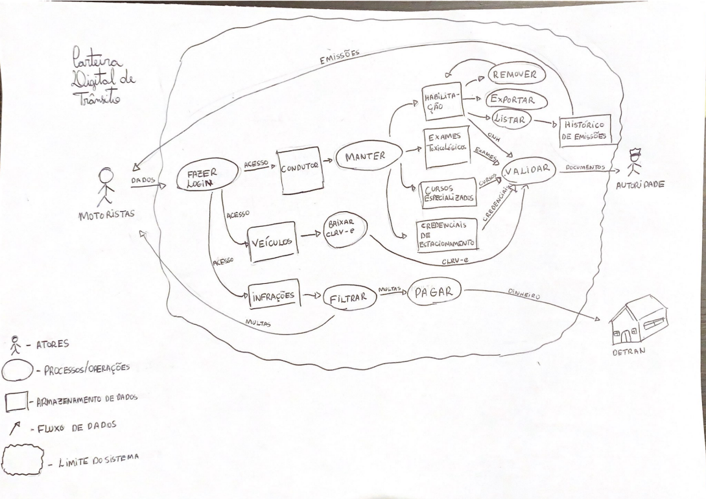
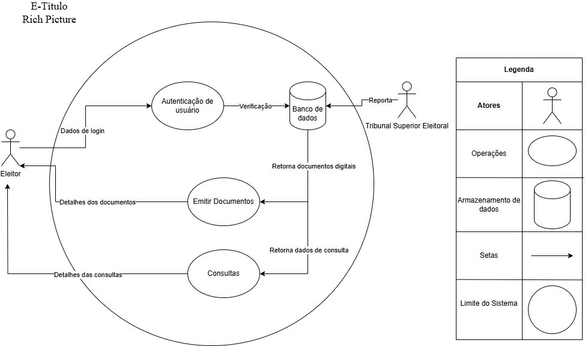

# Aplicativos analisados 

&emsp;&emsp;Este documento faz parte da fase de pré-rastreabilidade do projeto, onde a equipe analisou diversos aplicativos utilizando Rich Pictures para representar seus fluxos de informações e funcionalidades. A análise visual auxiliou na avaliação de cada aplicativo, que servirá de base para a escolha do aplicativo a ser desenvolvido no próximo estágio do projeto.

## 1. Aplicativos:

&emsp;&emsp;A seguir, são apresentados os aplicativos analisados pela equipe. Para cada um, um Rich Picture foi desenvolvido para ilustrar o fluxo de informações e suas principais características.

### 1.1 BleachBit

&emsp;&emsp; O BleachBit é um aplicativo de código aberto desenvolvido para Linux e Windows para fazer a limpeza do disco rígido e liberar espaço no seu sistema.

<strong>Figura 1:</strong> BleachBit, Rich Picture

<strong>Autor:</strong> Ryan Salles, 2025

### 1.2 Cadastro Único

&emsp;&emsp;O aplicativo do Cadastro Único é um dos canais de atendimentos do Cadasto Único para programas sociais do Governo Federal, por meio do qual é possível emitir comprovante de cadastramento, ver quais são os integrantes da família e o NIS de cada um, ver se o cadastro está atualizado e consultar os benefícios que a família recebe.

<strong>Figura 1:</strong> Cadastro Único, Rich Picture

<strong>Autor:</strong> João Igor, 2025

### 1.3 Carteira Digital de Trânsito

&emsp;&emsp; O aplicativo Carteira Digital de Trânsito permite ter acesso à uma versão digitalizada da sua CNH e do CLRV do seu veículo, além de ser possível também verificar infrações e pagar multas com 40% de desconto.

<strong>Figura 3:</strong> Carteira Digital de Trânsito, Rich Picture

<strong>Autor:</strong> Gabriel Flores, 2025

### 1.4 Carteira de Trabalho Digital

&emsp;&emsp; O aplicativo da Carteira de Trabalho Digital é um meio que facilita o acompanhamento da vida profissional, por ele é possível ter acesso a dados pessoais e contratos de trabalhos.

<strong>Figura 4:</strong> Carteira de Trabalho Digital, Rich Picture

<strong>Autora:</strong> Amanda Cruz Lima, 2025

### 1.5 Duolingo

&emsp;&emsp; O aplicativo do Duolingo foi feito para auxiliar no aprendizado de uma língua estrangeira de maneira gamificada.

<strong>Figura 5:</strong> Duolingo, Rich Picture

<strong>Autora:</strong> Julia Gabriela, 2025

### 1.6 E-título 

&emsp;&emsp; O aplicativo permite a obtenção do título de eleitor digital e também rápido à informações junto à Justiça Eleitoral.

<strong>Figura 6:</strong> E-título, Rich Picture

<strong>Autor:</strong> João Pedro, 2025

### 1.7 Gov.br 

&emsp;&emsp; O aplicativo permite o acesso e compartilhamento de dados e documentos de maneira fácil e também facilita o acesso a outros serviços do governo no quais é possível entrar com a conta do Gov.br.

<strong>Figura 7:</strong> Gov.br, Rich Picture

<strong>Autor:</strong> João Vitor, 2025

## 2. Conclusão  
Através da análise de cada aplicativo, conseguimos identificar os aspectos principais de cada um, que foram usados para apoiar a escolha final. O [aplicativo selecionado](aplicativo.md) foi detalhado em outro documento, com a justificativa para sua escolha.

## 3. Referências 

> - Clean Your System and Free Disk Space | BleachBit. Disponível em: <https://www.bleachbit.org>. Acesso em: 13 abr. 2025
> - App Cadastro Único. Disponível em: <https://www.gov.br/mds/pt-br/acoes-e-programas/cadastro-unico/paginas/app-cadunico>. Acesso em: 13 abr. 2025.
> - Carteira Digital de Trânsito. Disponível em: <https://www.gov.br/pt-br/apps/carteira-digital-de-transito-1>. Acesso em: 13 abr. 2025.
> - Carteira de Trabalho Digital. Disponível em: <https://www.gov.br/pt-br/temas/carteira-de-trabalho-digital>. Acesso em: 13 abr. 2025.
> - Duolingo. Disponível em: <https://pt.duolingo.com>. Acesso em: 13 abr. 2025.
> - e-Título. Disponível em: <https://www.tse.jus.br/eleicoes/eleicoes-2018/aplicativos-da-justica-eleitoral/e-titulo>. Acesso em: 13 abr. 2025.
> - Governo Federal - Governo do Brasil. Disponível em: <https://www.gov.br/pt-br>. Acesso em: 13 abr. 2025.

## 4. Histórico de Versão

| Versão | Data | Descrição  | Autor        | Revisor |
| :-----: | :----: | :----------: | :------------: | :--------: |
| 1.0 | 13/04/2025 | Criado arquivo dos aplicativos analisados |[Gabriel Flores](https://github.com/Gabrielfcoelho) | [João Vitor](https://github.com/jvopBR) |
| 1.1 | 13/04/2025 | Correção de ortografia, autoria das imagens e histórico de versão| [Julia Gabriela](https://github.com/JuliaGabP) | [Ryan Salles](https://github.com/RA-Salles) |
| 1.2 | 16/04/2025 | Padronização das fontes, correção do texto e adição da legenda do Rich Picture | [Amanda Cruz](https://github.com/mandicrz) | [Ryan Salles](https://github.com/RA-Salles) | 