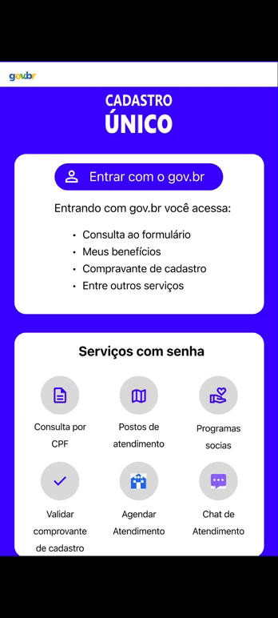

# Protótipo

## Função dos autores
| Nome                 | Função                                                            | 
|----------------------|----------------------------------------------------------------   |
|[Amanda Cruz](https://github.com/mandicrz)| Criação do protótipo 6 | 
|[Gabriel Flores](https://github.com/Gabrielfcoelho)|Criação dos protótipos 4 e 5| 
|[João Igor](https://github.com/JoaoPC10)| Criação do protótipo 02 e 03| 
|[João Pedro Costa](https://github.com/johnaopedro)|Criação dos protótipos 7 (Chat de Atendimento) e 8 (Agendar Atendimento)| 
|[Julia Gabriela](https://github.com/JuliaGabP)|Criação do documento; Inserção da teoria e bibliografia; Protótipo 1| 
|[Ryan Salles](https://github.com/RA-Salles)|| 

    Autor(es): 
    <a href="https://github.com/JuliaGabP" target="_blank">Julia Gabriela</a>

## Introdução
A prototipagem é uma técnica utilizada no processo de engenharia de requisitos e design de sistemas para representar, de forma visual e/ou funcional, aspectos de um sistema antes de sua implementação completa. De acordo com Bruton (UX Design Institute), o protótipo atua como um artefato intermediário entre a especificação de requisitos e o desenvolvimento, permitindo validar funcionalidades, fluxos de interação e regras de negócio com os stakeholders. Já Boicheva (2024) reforça que a prototipagem é essencial para detectar inconsistências, ambiguidade e requisitos incompletos, antecipando problemas que poderiam surgir nas fases posteriores do ciclo de vida do software.

## Tipos
Os principais tipos de protótipos são classificados de acordo com o seu nível de fidelidade e interatividade:  
**Protótipos de baixa fidelidade:** são representações simplificadas, como desenhos em papel, focadas na estrutura e navegação. Não apresentam lógica de negócio nem interações reais, sendo úteis nas etapas iniciais de elicitação e validação de requisitos.  
**Protótipos de média fidelidade:** incluem elementos gráficos mais definidos e alguma interatividade simulada. São usados para revisar a experiência do usuário, fluxo de tarefas e regras básicas de navegação.  
**Protótipos de alta fidelidade:** são quase funcionais, com interfaces próximas da versão final e comportamentos interativos, simulando o funcionamento real do sistema. Servem para validação precisa de requisitos funcionais e não funcionais, testes com usuários e até como referências para desenvolvedores.  
A escolha do tipo de protótipo depende do objetivo da prototipagem, da fase do projeto e do nível de maturidade dos requisitos. Em contextos de engenharia de software, a prototipagem contribui diretamente para a redução de retrabalho, melhora da comunicação entre equipes técnicas e usuários, e aumento da qualidade dos requisitos especificados.  

## Protótipo 1
**Autora:** Julia Gabriela.  
**Funcionalidade:** Modo escuro; Adição de outros idiomas.  
**Rastreabilidade:** [RF38](../../elicitacao/requisitos_elicitados.md) [RF39](../../elicitacao/requisitos_elicitados.md)   
**Ferramentas:** Figma.  
**Tipo:** Alta Fidelidade.  
**Telas da prototipagem**

    

**Link** para acesso [clique aqui](https://www.figma.com/design/UEcxBHjeqzLTmSWEwXQN2T/Sem-t%C3%ADtulo?node-id=0-1&p=f&t=xMxhNQEYE3KTzV0o-0)

## Protótipo 2
**Autor:** João Igor
**Funcionalidade:** Filtragem de benefícios
**Rastreabilidade:**  [RF23](../../elicitacao/requisitos_elicitados.md) 
**Ferramentas:**  Figma e Canva
**Tipo:**  Alta fidelidade  
**Antes da prototipagem** 

    

**Depois da prototipagem**  

    

## Protótipo 3
**Autor:**  João Igor
**Funcionalidade:**   Atualizar dados cadastrais
**Rastreabilidade:**   [RF20](../../elicitacao/requisitos_elicitados.md) 
**Ferramentas:**  Figma e Canva
**Tipo:**   Alta Fidelidade 
**Antes da prototipagem**

    

**Depois da prototipagem**  

    

## Protótipo 4
**Autor:** [Gabriel Flores](https://github.com/Gabrielfcoelho)   
**Funcionalidade:** Upload de documentos    
**Rastreabilidade:** [RF29](../../elicitacao/requisitos_elicitados.md)  
**Ferramentas:** Figma e Canva  
**Tipo:** Alta Fidelidade  
**Antes da prototipagem**

    

**Depois da prototipagem**  

    

## Protótipo 5
**Autor:**  [Gabriel Flores](https://github.com/Gabrielfcoelho)   
**Funcionalidade:**  Notificação de Pendências ou Atualizações   
**Rastreabilidade:**  [RF27](../../elicitacao/requisitos_elicitados.md)   
**Ferramentas:**  Figma e Canva  
**Tipo:** Alta Fidelidade  
**Antes da prototipagem**

    

**Depois da prototipagem**  

    

## Protótipo 6
**Autor:** [Amanda Cruz](https://github.com/mandicrz)   
**Funcionalidade:** Suporte com vídeos explicativos e Integração com sistemas MEI 
**Rastreabilidade:** [RF36](../../elicitacao/requisitos_elicitados.md) e [RF39](../../elicitacao/requisitos_elicitados.md)  
**Ferramentas:** Figma
**Tipo:** Alta fidelidade
**Antes da prototipagem**: 

    

**Depois da prototipagem**:

    

## Protótipo 7
**Autor:** [João Pedro Costa](https://github.com/johnaopedro)  
**Funcionalidade:** Chat de Atendimento  
**Rastreabilidade:** [RF34](../../elicitacao/requisitos_elicitados.md)  
**Ferramentas:** Figma  
**Tipo:** Alta Fidelidade  
**Antes da prototipagem**  

    

**Depois da prototipagem**  

    

## Protótipo 8
**Autor:** [João Pedro Costa](https://github.com/johnaopedro)  
**Funcionalidade:** Agendar Atendimento  
**Rastreabilidade:** [RF30](../../elicitacao/requisitos_elicitados.md)  
**Ferramentas:** Figma  
**Tipo:** Alta Fidelidade  
**Antes da prototipagem**  

    

**Depois da prototipagem**  

    

## Bibliografia
BRUTON, L. A complete guide to prototyping - UX Design Institute. Disponível em: <https://www.uxdesigninstitute.com/blog/prototyping-guide/>.

    

BOICHEVA, S. What is Prototype Design? [Guide 2024]. Disponível em: <https://htmlburger.com/blog/prototype-design/>.

    

## Histórico de versão
| Versão |    Data    |    Descrição     |         Autor         |       Revisor      |
| :----: | :--------: | :--------------: | :-------------------: | :----------------: |
|  1.0   | 12/06/2025 | Criando a pagina e adicionando teoria | [Julia Gabriela](https://github.com/JuliaGabP) | [João Pedro](https://github.com/johnaopedro) |
|  1.1   | 18/06/2025 | Adição dos protótipos 4 e 5 | [Gabriel Flores](https://github.com/Gabrielfcoelho)     | [João Igor](https://github.com/JoaoPC10) |
|  1.2   | 19/06/2025 | Adição dos protótipos 6 | [Amanda Cruz](https://github.com/mandicrz)     | [Gabriel Flores](https://github.com/Gabrielfcoelho) |
|  1.3   | 20/06/2025 | Adição dos protótipos 7 e 8 | [João Pedro Costa](https://github.com/johnaopedro)     | [Ryan Salles](https://github.com/RA-Salles) |