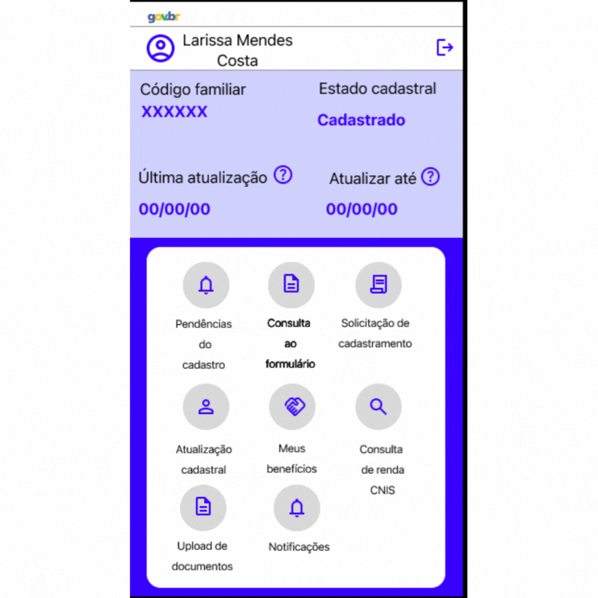
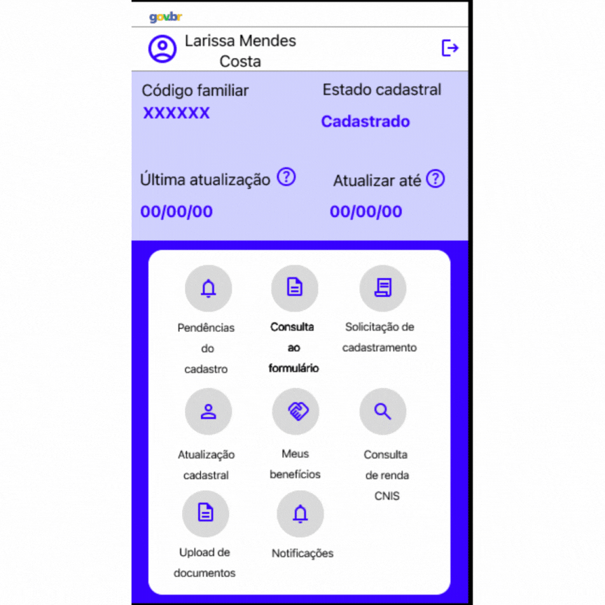
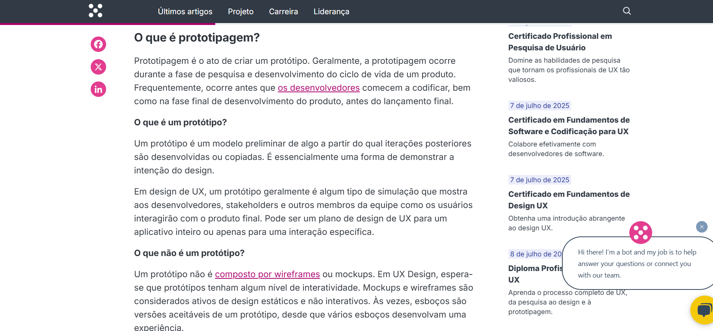

# Protótipo — Upload de documentos e Notificação de pendências ou atualizações

## Função dos autores
| Nome                                               | Função                                                            | 
|----------------------                              |----------------------------------------------------------------   |
|[Gabriel Flores](https://github.com/Gabrielfcoelho)  | Criação dos protótipos Upload de documentos e Notificação de pendências ou atualizações | 
|[João Igor](https://github.com/JoaoPC10)         | Revisão geral| 

    Autor(es): 
    <a href="https://github.com/Gabrielfcoelho" target="_blank">Gabriel Flores</a>

## Introdução

A prototipagem é uma técnica utilizada no processo de engenharia de requisitos e design de sistemas para representar, de forma visual e/ou funcional, aspectos de um sistema antes de sua implementação completa. De acordo com Bruton (UX Design Institute), o protótipo atua como um artefato intermediário entre a especificação de requisitos e o desenvolvimento, permitindo validar funcionalidades, fluxos de interação e regras de negócio com os stakeholders. Já Boicheva (2024) reforça que a prototipagem é essencial para detectar inconsistências, ambiguidade e requisitos incompletos, antecipando problemas que poderiam surgir nas fases posteriores do ciclo de vida do software.

## Tipos

Os principais tipos de protótipos são classificados de acordo com o seu nível de fidelidade e interatividade:  
**Protótipos de baixa fidelidade:** são representações simplificadas, como desenhos em papel, focadas na estrutura e navegação. Não apresentam lógica de negócio nem interações reais, sendo úteis nas etapas iniciais de elicitação e validação de requisitos.  

**Protótipos de média fidelidade:** incluem elementos gráficos mais definidos e alguma interatividade simulada. São usados para revisar a experiência do usuário, fluxo de tarefas e regras básicas de navegação.  

**Protótipos de alta fidelidade:** são quase funcionais, com interfaces próximas da versão final e comportamentos interativos, simulando o funcionamento real do sistema. Servem para validação precisa de requisitos funcionais e não funcionais, testes com usuários e até como referências para desenvolvedores.  
A escolha do tipo de protótipo depende do objetivo da prototipagem, da fase do projeto e do nível de maturidade dos requisitos. Em contextos de engenharia de software, a prototipagem contribui diretamente para a redução de retrabalho, melhora da comunicação entre equipes técnicas e usuários, e aumento da qualidade dos requisitos especificados.

## Telas do Protótipo

### Descrição das Telas

#### 1. Tela Inicial
A tela inicial apresenta ao usuário as principais opções do sistema de forma clara e objetiva.

#### 2. Tela de Agendar Atendimento
Esta tela permite ao usuário selecionar data, horário e tipo de atendimento desejado. Os componentes são:
- **Campo de seleção de data:** calendário para escolha do dia.
- **Campo de seleção de horário:** lista de horários disponíveis.
- **Botão "Voltar":** retorna à tela inicial.

#### 3. Tela de Chat de Atendimento
A tela de chat possibilita a comunicação direta entre usuário e atendente. Os principais componentes são:
- **Área de mensagens:** exibe o histórico da conversa.
- **Campo de texto:** permite digitar novas mensagens.
- **Botão "Enviar":** envia a mensagem digitada.
- **Indicação de status do atendente:** mostra se o atendente está online ou offline.

Essas telas foram projetadas para garantir uma navegação intuitiva e facilitar o acesso às principais funcionalidades do sistema.

---

## Imagens do Protótipo

## Protótipo Upload de documentos
**Autor:** [Gabriel Flores](https://github.com/Gabrielfcoelho)   
**Funcionalidade:** Upload de documentos    
**Rastreabilidade:** [RF29](../../elicitacao/requisitos_elicitados.md)  
**Ferramentas:** Figma e Canva  
**Tipo:** Alta Fidelidade  
**Antes da prototipagem**

    

**Depois da prototipagem**  

    

## Protótipo Notificação de Pendências ou Atualizações
**Autor:**  [Gabriel Flores](https://github.com/Gabrielfcoelho)   
**Funcionalidade:**  Notificação de Pendências ou Atualizações   
**Rastreabilidade:**  [RF27](../../elicitacao/requisitos_elicitados.md)   
**Ferramentas:**  Figma e Canva  
**Tipo:** Alta Fidelidade  
**Antes da prototipagem**

    

**Depois da prototipagem**  

    

---
## Validação

A validação dos protótipos Upload de documentos e Notificação de pendências ou atualizações foi realizada presencialmente. As informações da reunião presencial são apresentadas por meio da tabela 1 e 2.

    <b> Tabela 1:</b> Informações da Entrevista

| Campo   | Informação                                               |
| :-----: | :------------------------------------------------------: |
| Local   | [UnB - FCTE](https://maps.app.goo.gl/f8bxb23JLZJpw7REA)  |
| Data    | 05/06/2025                                               |
| Horário | 12:30                                                    |
| Duração | Cerca de 5 minutos                                       |

    <b>Autor(es)</b><a href="https://github.com/Gabrielfcoelho" target="_blank">Gabriel Flores</a>

    <b> Tabela 2:</b> Participantes da Entrevista

| Nome                                                | Função                      |
| :------------------------------------------:        | :----------------------:    |
| Artur                                               | Usuário/ Project Owner      |
| [Gabriel Flores](https://github.com/Gabrielfcoelho) | Entrevistador/Desenvolvedor |
| [João Igor](https://github.com/JoaoPC10)            | Entrevistador/Desenvolvedor |
| [Ryan Salles](https://github.com/RA-Salles)         | Secretário/Observador       |

    <b>Autor(es)</b><a href="https://github.com/Gabrielfcoelho" target="_blank">Gabriel Flores</a>

<iframe width="560" height="315" src="https://www.youtube.com/embed/3dCmZr0rqgk?si=m8_8wLd_v4odQpLQ" title="YouTube video player" frameborder="0" allow="accelerometer; autoplay; clipboard-write; encrypted-media; gyroscope; picture-in-picture; web-share" referrerpolicy="strict-origin-when-cross-origin" allowfullscreen></iframe>
---

## Bibliografia
BRUTON, L. A complete guide to prototyping - UX Design Institute. Disponível em: <https://www.uxdesigninstitute.com/blog/prototyping-guide/>.

    

BOICHEVA, S. What is Prototype Design? [Guide 2024]. Disponível em: <https://htmlburger.com/blog/prototype-design/>.

    

---

## Histórico de versão
| Versão |    Data    |    Descrição     |         Autor         |       Revisor      |
| :----: | :--------: | :--------------: | :-------------------: | :----------------: |
|  1.0   | 04/07/2025 | Desenvolvimento das informações da pagina | [Gabriel Flores](https://github.com/Gabrielfcoelho)    | [João Igor](https://github.com/JoaoPC10) |