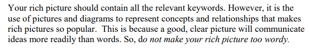
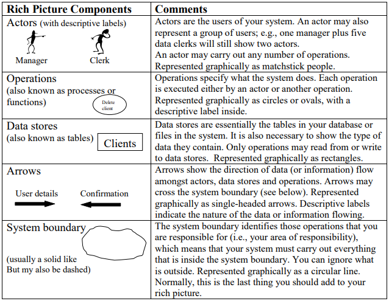

# Checklist de Verificação - Entrega 1

## Introdução 

Este documento apresenta o checklist de verificação para a primeira entrega do projeto, com o objetivo de garantir que as atividades iniciais estejam de acordo com os requisitos e especificações estabelecidas. O checklist foi sugerido pelo professor como uma ferramenta prática para confirmar que todas as etapas estão cumpridas corretamente antes de avançar para as fases seguintes.

## Checklist como Método de Verificação

O checklist é uma técnica importante durante a revisão das etapas do projeto, ajudando a garantir que cada parte esteja em conformidade com os requisitos estabelecidos. Seu principal objetivo é:

* Identificar possíveis erros em qualquer parte do projeto.
* Verificar se o projeto atende aos requisitos especificados.
* Assegurar que o trabalho foi feito conforme os padrões e diretrizes definidas pelo professor.
* Garantir consistência e uniformidade.
* Facilitar o gerenciamento do projeto tornando-o mais organizado e controlado.

## Checklists - Entrega 1

### Planejamento do Projeto
A Tabela 1 exibe o checklist de verificação referente aos elementos de planejamento do projeto presentes no GitPages. Ele serve como uma ferramenta para garantir que todas as etapas iniciais foram contempladas e atendem aos critérios estabelecidos.

<strong>Tabela 1:</strong> Checklist de Planejamento

| Elemento | Status | Autor | Revisor | Versão e Período de Avaliação | Referência |
| :------------------------------: | :-----------------------------: | :----------------------: | :-----------------------: | :---------------------------: |:---------------------------: |
| Página com integrantes (foto e nome, sem matrícula) | <input type="checkbox" checked> Sim | [Gabriel Flores](https://github.com/Gabrielfcoelho)| [Amanda Cruz](https://github.com/mandicrz) | v1.0, 17. abr 2025, 15:23 |BARROS, Andre. Plano de Ensino, RE-012025, Turma 3, p. 1. Aprender3. Acesso em: 17 abr. 2025. |
| Cronograma detalhado com atividades estabelecidas, prazos e revisão dos artefatos | <input type="checkbox"> Incompleto | [Julia Gabriela](https://github.com/JuliaGabP) | [Ryan Salles](https://github.com/RA-Salles) | v1.2, 17 abr. 2025, 15:45 | BARROS, Andre. Plano de Ensino, RE-012025, Turma 3, p. 1. Aprender3. Acesso em: 17 abr. 2025. |
| Cronograma inclui datas de gravação das apresentações	| <input type="checkbox"> Incompleto | [Julia Gabriela](https://github.com/JuliaGabP) | [Ryan Salles](https://github.com/RA-Salles) | v1.2, 17 abr. 2025, 15:48 | BARROS, Andre. Plano de Ensino, RE-012025, Turma 3, p. 1. Aprender3. Acesso em: 17 abr. 2025. |
| Cronograma prevê correções pós-feedback dos monitores/professor | <input type="checkbox"> Incompleto | [Julia Gabriela](https://github.com/JuliaGabP) | [Ryan Salles](https://github.com/RA-Salles) |  v1.2, 17 abr. 2025, 15:54| BARROS, Andre. Plano de Ensino, RE-012025, Turma 3, p. 1. Aprender3. Acesso em: 17 abr. 2025. |
| Motivação e critérios para a escolha do aplicativo bem definidos | <input type="checkbox" checked> Sim | [Amanda Cruz](https://github.com/mandicrz) | [Gabriel Flores](https://github.com/Gabrielfcoelho) | v1.1, 17 abr. 2025, 16:06 | BARROS, Andre. Plano de Ensino, RE-012025, Turma 3, p. 1. Aprender3. Acesso em: 17 abr. 2025. |
| Elaboração do Heatmap | <input type="checkbox" checked> Sim | [João Pedro Costa](https://github.com/johnaopedro) | [Julia Gabriela](https://github.com/JuliaGabP) | v1.0, 17 abr. 2025, 16:08 | BARROS, Andre. Plano de Ensino, RE-012025, Turma 3, p. 1. Aprender3. Acesso em: 17 abr. 2025. |
| Descrição da metodologia utilizada | <input type="checkbox" checked> Sim | [João Pedro Costa](https://github.com/johnaopedro) | [Ryan Salles](https://github.com/RA-Salles) | v1.3, 17 abr. 2025, 16:13 | BARROS, Andre. Plano de Ensino, RE-012025, Turma 3, p. 1. Aprender3. Acesso em: 17 abr. 2025. |
| Termo de uso ou autorização para utilizar o aplicativo na disciplina | <input type="checkbox" checked> Sim | [João Pedro Costa](https://github.com/johnaopedro) | [Ryan Salles](https://github.com/RA-Salles) | v1.0, 17 abr. 2025, 16:10 | BARROS, Andre. Plano de Ensino, RE-012025, Turma 3, p. 1. Aprender3. Acesso em: 17 abr. 2025. |
| Ferramentas utilizadas estão listadas | <input type="checkbox"> Incompleto | [João Pedro Costa](https://github.com/johnaopedro) | [Julia Gabriela](https://github.com/JuliaGabP) | v1.0, 17 abr. 2025, 16:16 | BARROS, Andre. Plano de Ensino, RE-012025, Turma 3, p. 1. Aprender3. Acesso em: 17 abr. 2025. |
| GitPages oferece opção de contraste de cores | <input type="checkbox" checked> Sim | [João Vítor](https://github.com/jvopBR) | [Ryan Salles](https://github.com/RA-Salles) | v1.0, 17 abr. 2025, 16:18 | BARROS, Andre. Plano de Ensino, RE-012025, Turma 3, p. 1. Aprender3. Acesso em: 17 abr. 2025. |
| GitPages organizado de fácil uso | <input type="checkbox" checked> Sim | [João Vítor](https://github.com/jvopBR) | [Ryan Salles](https://github.com/RA-Salles) | v1.0, 17 abr. 2025, 16:19 | BARROS, Andre. Plano de Ensino, RE-012025, Turma 3, p. 1. Aprender3. Acesso em: 17 abr. 2025. |

<strong>Autora:</strong> Amanda Cruz

### Desenvolvimento do Projeto
Na Tabela 2, é possível visualizar o checklist de verificação relacionado aos aspectos de desenvolvimento presentes na documentação. Este checklist assegura que os requisitos técnicos sejam atendidos.

<strong>Tabela 2:</strong> Checklist de Desenvolvimento

| Elemento                         | Status                          |  Referência                                           |
| :------------------------------: | :-----------------------------: | :----------------------: | 
| Padronização do Histórico de Versão | <input type="checkbox"> Incompleto | BARROS, Andre. Plano de Ensino, RE-012025, Turma 3, p. 2. Aprender3. Acesso em: 17 abr. 2025. |
| Autor e revisor para cada artefato | <input type="checkbox" checked> Sim | BARROS, Andre. Plano de Ensino, RE-012025, Turma 3, p. 2. Aprender3. Acesso em: 17 abr. 2025. |
| Referências e/ou bibiliografia em todos os artefatos | <input type="checkbox" checked> Sim | BARROS, Andre. Plano de Ensino, RE-012025, Turma 3, p. 2. Aprender3. Acesso em: 17 abr. 2025.|
| Legenda e fonte em todas as imagens e tabelas | <input type="checkbox"> Incompleto | BARROS, Andre. Plano de Ensino, RE-012025, Turma 3, p. 2. Aprender3. Acesso em: 17 abr. 2025.|
| Introdução do texto dos artefatos | <input type="checkbox" checked> Sim | BARROS, Andre. Plano de Ensino, RE-012025, Turma 3, p. 2. Aprender3. Acesso em: 17 abr. 2025.|
| Cronograma executado além do inicialmente planejado | <input type="checkbox" checked> Sim | BARROS, Andre. Plano de Ensino, RE-012025, Turma 3, p. 1. Aprender3. Acesso em: 17 abr. 2025. |
| Atas das reuniões | <input type="checkbox" checked> Sim | BARROS, Andre. Plano de Ensino, RE-012025, Turma 3, p. 2. Aprender3. Acesso em: 17 abr. 2025.|
| Gravação das reuniões | <input type="checkbox" checked> Sim | BARROS, Andre. Plano de Ensino, RE-012025, Turma 3, p. 2. Aprender3. Acesso em: 17 abr. 2025.|
| Upload de apresentação no YouTube como não "listado" | <input type="checkbox" checked> Sim | BARROS, Andre. Plano de Ensino, RE-012025, Turma 3, p. 2. Aprender3. Acesso em: 17 abr. 2025.|
| Upload de apresentação no YouTube como não "listado" | <input type="checkbox" checked> Sim | BARROS, Andre. Plano de Ensino, RE-012025, Turma 3, p. 2. Aprender3. Acesso em: 17 abr. 2025. |

<strong>Autora:</strong> Amanda Cruz Lima

### Conteúdo da Disciplina
A Tabela 3 apresenta o checklist desenvolvido para avaliar os itens relacionados ao conteúdo da disciplina. As imagens 1 e 2 ilustram as fontes utilizadas para a criação deste checklist em específico, fornecendo uma visão clara das referências, além das presentes na Tabela.

<strong>Tabela 3:</strong> Checklist de Conteúdo da Disciplina

| Elemento                         | Status                          |  Referência                                           |
| :------------------------------: | :-----------------------------: | :----------------------: |                           
| Membros realizaram ao menos um Rich Picture | <input type="checkbox" checked> Sim | BARROS, Andre. Plano de Ensino, RE-012025, Turma 3, p. 2. Aprender3. Acesso em: 17 abr. 2025.
| Os 5 componentes do Rich Picture estão presentes nos artefatos de pré-rastrebilidade | <input type="checkbox" checked> Sim | BARROS, Andre. Plano de Ensino, RE-012025, Turma 3, p. 2. Aprender3. Acesso em: 17 abr. 2025.   Introducing Rich Pictures - Rich Picture Drawing Guidelines, p. 4. CTEC2402 - Software Development Project. Acesso em: 17 abr. 2025 |
| Rich Pictures possuem legenda | <input type="checkbox"> Incompleto | BARROS, Andre. Plano de Ensino, RE-012025, Turma 3, p. 2. Aprender3. Acesso em: 17 abr. 2025.   Introducing Rich Pictures - Rich Picture Drawing Guidelines, p. 4. CTEC2402 - Software Development Project. Acesso em: 17 abr. 2025  |
| Uso de palavras-chave nos Rich Pictures | <input type="checkbox" checked> Sim | BARROS, Andre. Plano de Ensino, RE-012025, Turma 3, p. 2. Aprender3. Acesso em: 17 abr. 2025.   Introducing Rich Pictures - Rich Picture Drawing Guidelines, p. 2. CTEC2402 - Software Development Project. Acesso em: 17 abr. 2025 |
| Símbolos adequados para representar conceitos do Rich Picture | <input type="checkbox" checked> Sim | BARROS, Andre. Plano de Ensino, RE-012025, Turma 3, p. 2. Aprender3. Acesso em: 17 abr. 2025.   Introducing Rich Pictures - Rich Picture Drawing Guidelines, p. 4. CTEC2402 - Software Development Project. Acesso em: 17 abr. 2025  |
| Rich Pictures possuem atores bem definidos | <input type="checkbox" checked> Sim | BARROS, Andre. Plano de Ensino, RE-012025, Turma 3, p. 2. Aprender3. Acesso em: 17 abr. 2025.   Introducing Rich Pictures - Rich Picture Drawing Guidelines, p. 4. CTEC2402 - Software Development Project. Acesso em: 17 abr. 2025  |

<strong>Autora:</strong> Amanda Cruz Lima

<strong>Figura 1:</strong> Fonte 1 da Checklist de Conteúdo da Disciplina

<strong>Fonte:</strong> Introducing Rich Pictures - Rich Picture Drawing Guidelines, p. 4. CTEC2402 - Software Development Project. Disponível em: <a href="https://aprender3.unb.br/pluginfile.php/3096055/mod_resource/content/2/1_5145791542719414573.pdf">https://aprender3.unb.br/pluginfile.php/3096055/mod_resource/content/2/1_5145791542719414573.pdf</a>. Acesso em: 17 abr. 2025.

<strong>Figura 2:</strong> Fonte 2 da Checklist de Conteúdo da Disciplina

<strong>Fonte:</strong> Introducing Rich Pictures - Rich Picture Drawing Guidelines, p. 4. CTEC2402 - Software Development Project. Disponível em: <a href="https://aprender3.unb.br/pluginfile.php/3096055/mod_resource/content/2/1_5145791542719414573.pdf">https://aprender3.unb.br/pluginfile.php/3096055/mod_resource/content/2/1_5145791542719414573.pdf</a>. Acesso em: 17 abr. 2025.

## Conclusão
Em resumo, o checklist de verificação foi fundamental para garantir que a entrega inicial do projeto estivesse alinhada aos requisitos estabelecidos. Embora a maior parte das etapas tenha sido concluída com sucesso, algumas correções ainda precisam ser feitas nos artefatos. Essas mudanças serão implementadas em breve, e o checklist será atualizado para refletir essas alterações. Dessa forma, conseguimos manter o projeto dentro dos padrões e garantir que as próximas etapas sigam conforme o planejado.

## Referências

> BARROS, André. Plano de Ensino, RE-012025, Turma 3. Disponível em: <https://aprender3.unb.br/pluginfile.php/3106711/mod_resource/content/55/Lista%20de%20Verifificac%CC%A7a%CC%83o%20-%20Plano_de_Ensino%20RE%20012025%20Turma%2003%20v1.pdf>. Acesso em: 17 abr. 2025.

> Introducing Rich Pictures - Rich Picture Drawing Guidelines. CTEC2402 - Software Development Project. Disponível em: <https://aprender3.unb.br/pluginfile.php/3096055/mod_resource/content/2/1_5145791542719414573.pdf>. Acesso em: 17 abr. 2025.

> OLIVEIRA, Carla. Utilização de checklist para validação de requisitos de software. Disponível em: <https://imasters.com.br/devsecops/utilizacao-de-checklist-para-validacao-de-requisitos-de-software>. Acesso em: 17 abr. 2025.

## Histórico de Versão

| Versão | Data | Descrição  | Autor        | Revisor |
| :-----: | :----: | :----------: | :------------: | :--------: |
| 1.0 | 17/04/2025 | Criação do Documento |[Amanda Cruz](https://github.com/mandicrz) | [Ryan Salles](https://github.com/RA-Salles) |

