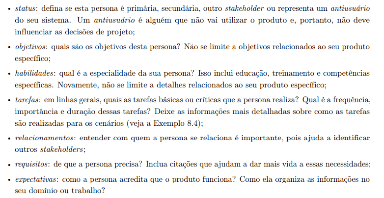
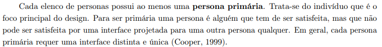

# Lista de Verificação - Entrega 2

## Introdução

Este documento apresenta uma lista de verificação criada para o [Grupo 4](https://github.com/Requisitos-de-Software/2025.1-Cadastro-Unico) e o Grupo+1 ([Grupo 5](https://github.com/Requisitos-de-Software/2025.1-IBGE)) referente a **Etapa 2** do projeto, com o objetivo de garantir que os artefatos iniciais estejam de acordo com os requisitos e especificações estabelecidas. O checklist foi sugerido pelo professor como uma ferramenta prática para confirmar que todas as etapas estão cumpridas corretamente antes de avançar para as fases seguintes.

## Checklist como Método de Verificação

O **checklist**, que significa **Lista de Verificação**, uma técnica importante durante a revisão das etapas do projeto, ajudando a garantir que cada parte esteja em conformidade com os requisitos estabelecidos. Para validar a eficácia e a completude do checklist, utilizaremos a técnica de **inspeção**, que consiste em uma revisão sistemática para verificar a clareza, relevância e aplicabilidade de cada item listado, tanto do nosso grupo quanto do grupo avaliado. Seu principal objetivo é:

- Identificar possíveis erros em qualquer parte do projeto.
- Verificar se o projeto atende aos requisitos especificados.
- Assegurar que o trabalho foi feito conforme os padrões e diretrizes definidas pelo professor.
- Garantir consistência e uniformidade.
- Facilitar o gerenciamento do projeto tornando-o mais organizado e controlado.

## Checklists - Entrega 2

As Tabelas 1 e 2 apresentam checklists para os elementos de desenvolvimento do projeto e conteúdo da disciplina, respectivamente, presentes no GitPages, garantindo que as etapas e os requisitos técnicos sejam atendidos.

--- 

### Desenvolvimento do Projeto

<strong>Tabela 1:</strong> Checklist de Desenvolvimento do Projeto

| **ID** |                       **Item**                       |                                        **Referência**                                         |
| :----: | :--------------------------------------------------: | :-------------------------------------------------------------------------------------------: |
|  DS01  |         Padronização do Histórico de Versão          | BARROS, Andre. Plano de Ensino, RE-012025, Turma 3, p. 2. Aprender3. Acesso em: 17 abr. 2025. |
|  DS02  |          Autor e revisor para cada artefato          | BARROS, Andre. Plano de Ensino, RE-012025, Turma 3, p. 2. Aprender3. Acesso em: 17 abr. 2025. |
|  DS03  | Referências e/ou bibliografia em todos os artefatos  | BARROS, Andre. Plano de Ensino, RE-012025, Turma 3, p. 2. Aprender3. Acesso em: 17 abr. 2025. |
|  DS04  |    Legenda e fonte em todas as imagens e tabelas     | BARROS, Andre. Plano de Ensino, RE-012025, Turma 3, p. 2. Aprender3. Acesso em: 17 abr. 2025. |
|  DS05  |          Introdução do texto dos artefatos           | BARROS, Andre. Plano de Ensino, RE-012025, Turma 3, p. 2. Aprender3. Acesso em: 17 abr. 2025. |
|  DS06  | Cronograma executado além do inicialmente planejado  | BARROS, Andre. Plano de Ensino, RE-012025, Turma 3, p. 1. Aprender3. Acesso em: 17 abr. 2025. |
|  DS07  |                  Atas das reuniões                   | BARROS, Andre. Plano de Ensino, RE-012025, Turma 3, p. 2. Aprender3. Acesso em: 17 abr. 2025. |
|  DS08  |                Gravação das reuniões                 | BARROS, Andre. Plano de Ensino, RE-012025, Turma 3, p. 2. Aprender3. Acesso em: 17 abr. 2025. |
|  DS09  | Upload de apresentação no YouTube como não "listado" | BARROS, Andre. Plano de Ensino, RE-012025, Turma 3, p. 2. Aprender3. Acesso em: 17 abr. 2025. |

<strong>Autora:</strong> Amanda Cruz, 2025

---

### Conteúdo da Disciplina

<strong>Tabela 2:</strong> Checklist de Conteúdo da Disciplina - Elicitação 

| **ID** |                       **Item**                       |                                        **Referência**                                         |
| :----: | :--------------------------------------------------: | :-------------------------------------------------------------------------------------------: |
|  CD01  |  O perfil do usuário inclui dados como idade, experiência, atitudes e principais tarefas? | BARROS, Andre. Plano de Ensino, RE-012025, Turma 3, p. 3. Aprender3. Acesso em: 17 abr. 2025. |
|  CD02  |  Existe um cronograma (com data, horário e local) estabelecido para a realização da elicitação dos requisitos com o cliente e/ou membros do projeto? | BARROS, Andre. Plano de Ensino, RE-012025, Turma 3, p. 3. Aprender3. Acesso em: 17 abr. 2025. |
|  CD03  | Foi especificado quais técnicas de elicitação foram empregadas (quanto mais técnicas, melhor)? | BARROS, Andre. Plano de Ensino, RE-012025, Turma 3, p. 3. Aprender3. Acesso em: 17 abr. 2025. |
|  CD04  | A participação do cliente e/ou persona na elicitação de requisitos? | BARROS, Andre. Plano de Ensino, RE-012025, Turma 3, p. 3. Aprender3. Acesso em: 17 abr. 2025. |
|  CD05  | A gravação e os registros da elicitação dos requisitos estão disponíveis (pré-rastreabilidade)? | BARROS, Andre. Plano de Ensino, RE-012025, Turma 3, p. 3. Aprender3. Acesso em: 17 abr. 2025. |
|  CD06  | Cada requisito tem pelo menos uma fonte de origem identificada? | BARROS, Andre. Plano de Ensino, RE-012025, Turma 3, p. 1. Aprender3. Acesso em: 17 abr. 2025. |
|  CD07  | São apresentados os requisitos implementados e não implementados para a aplicação? | BARROS, Andre. Plano de Ensino, RE-012025, Turma 3, p. 3. Aprender3. Acesso em: 17 abr. 2025. |
|  CD08  | Está sendo apresentado como o requisito pode ser verificado na aplicação (critério de aceitação)? | BARROS, Andre. Plano de Ensino, RE-012025, Turma 3, p. 3. Aprender3. Acesso em: 17 abr. 2025. |
|  CD09  | Existe um cronograma (com data, horário e local) definido para a realização da priorização dos requisitos com o cliente e/ou membros do projeto? | BARROS, Andre. Plano de Ensino, RE-012025, Turma 3, p. 3. Aprender3. Acesso em: 17 abr. 2025. |
|  CD10  | São apresentadas pelo menos quatro técnicas de priorização (quanto mais, melhor)? MoSCoW, 100 $, First Thing First, ROI, QFD, TQM, ou outra técnica? A técnica MoSCoW/100$ deve ser utilizada no projeto somente após a aplicação de outras duas técnicas de priorização. Deve-se adicionar a referência bibliográfica e a imagem do texto da referência para cada uma das técnicas. | BARROS, Andre. Plano de Ensino, RE-012025, Turma 3, p. 3. Aprender3. Acesso em: 17 abr. 2025. |
|  CD11  | A participação do cliente e/ou persona no processo de priorização? | BARROS, Andre. Plano de Ensino, RE-012025, Turma 3, p. 4. Aprender3. Acesso em: 17 abr. 2025. |
|  CD12  | A gravação e os registros da atividade de priorização dos requisitos estão disponíveis? | BARROS, Andre. Plano de Ensino, RE-012025, Turma 3, p. 4. Aprender3. Acesso em: 17 abr. 2025. |
|  CD13  | As personas possuem nome e sobrenome? | Barbosa, S. D. J.; Silva, B. S. da; Silveira, M. S.; Gasparini, I.; Darin, T.; Barbosa, G. D. J. (2021). Interação Humano-Computador e Experiência do usuário, p. 167. |
|  CD14  | As persona possuem uma foto realista? | Barbosa, S. D. J.; Silva, B. S. da; Silveira, M. S.; Gasparini, I.; Darin, T.; Barbosa, G. D. J. (2021). Interação Humano-Computador e Experiência do usuário, p. 168. |
|  CD15  | As personas possuem status (primária/secundária/antipersona)?  | Barbosa, S. D. J.; Silva, B. S. da; Silveira, M. S.; Gasparini, I.; Darin, T.; Barbosa, G. D. J. (2021). Interação Humano-Computador e Experiência do usuário, p. 168. |
|  CD16  | As personas possuem expectativas em relação ao produto? | Barbosa, S. D. J.; Silva, B. S. da; Silveira, M. S.; Gasparini, I.; Darin, T.; Barbosa, G. D. J. (2021). Interação Humano-Computador e Experiência do usuário, p. 168. |
|  CD17  | Elenco de personas possui ao menos uma persona primária? | Barbosa, S. D. J.; Silva, B. S. da; Silveira, M. S.; Gasparini, I.; Darin, T.; Barbosa, G. D. J. (2021). Interação Humano-Computador e Experiência do usuário, p. 169. |
|  CD18  | O perfil de usuário foi construído através de algum estudo (questionário/entrevista)? | Barbosa, S. D. J.; Silva, B. S. da; Silveira, M. S.; Gasparini, I.; Darin, T.; Barbosa, G. D. J. (2021). Interação Humano-Computador e Experiência do usuário, p. 166. |

<strong>Autora:</strong> Amanda Cruz, 2025

---

## Conclusão

O checklist da Etapa 2 garante que os artefatos atendam aos requisitos do plano de ensino, promovendo qualidade e organização. A inspeção poderá identificar inconsistências e assegurar a padronização, facilitando o gerenciamento do nosso grupo e do inspecionado.

## Referências
As referências das Tabelas 1 e 2 tiveram como referência as Figuras 1 a 7.

> BARROS, André. Plano de Ensino, RE-012025, Turma 3. Disponível em: <https://aprender3.unb.br/pluginfile.php/3106711/mod_resource/content/55/Lista%20de%20Verifificac%CC%A7a%CC%83o%20-%20Plano_de_Ensino%20RE%20012025%20Turma%2003%20v1.pdf>. Acesso em: 04 maio 2025.

<strong>Figura 1:</strong> Lista de Verificação - Desenvolvimento (DS01 - DS09)

<strong>Autor:</strong> André Barros, 2025

<strong>Figura 2:</strong> Lista de Verificação - Planejamento (CD01 - CD10)

<strong>Fonte:</strong> André Barros, 2025

<strong>Figura 3:</strong> Lista de Verificação - Planejamento (CD10 - CD12)

<strong>Fonte:</strong> André Barros, 2025

> Barbosa, S. D. J.; Silva, B. S. da; Silveira, M. S.; Gasparini, I.; Darin, T.; Barbosa, G. D. J. (2021). Interação Humano-Computador e Experiência do usuário. Autopublicação. ISBN: 978-65-00-19677-1.

<strong>Figura 4:</strong> Lista de Verificação - Planejamento (CD13 - CD14)

<strong>Fonte:</strong> Interação Humano-Computador e Experiência do usuário. Página 167.

<strong>Figura 5:</strong> Lista de Verificação - Planejamento (CD15 - CD16)

<strong>Fonte:</strong> Interação Humano-Computador e Experiência do usuário. Página 168.

<strong>Figura 6:</strong> Lista de Verificação - Planejamento (CD17)

<strong>Fonte:</strong> Interação Humano-Computador e Experiência do usuário. Página 169.

<strong>Figura 7:</strong> Lista de Verificação - Planejamento (CD18)

<strong>Fonte:</strong> Interação Humano-Computador e Experiência do usuário. Página 166.

## Histórico de Versão

| Versão |    Data    |        Descrição         |                   Autor                    |                   Revisor                   |
| :----: | :--------: | :----------------------: | :----------------------------------------: | :-----------------------------------------: |
|  1.0   | 04/05/2025 |   Criação do Documento   | [Amanda Cruz](https://github.com/mandicrz) | [Ryan Salles](https://github.com/RA-Salles) |
