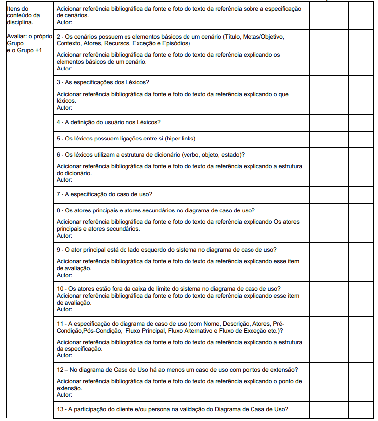
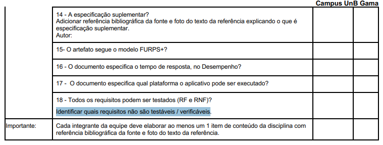

# Lista de Verificação - Entrega 3

## Introdução

Este documento apresenta uma lista de verificação criada para o [Grupo 4](https://github.com/Requisitos-de-Software/2025.1-Cadastro-Unico) e o Grupo+1 ([Grupo 5](https://github.com/Requisitos-de-Software/2025.1-IBGE)) referente a **Etapa 3** do projeto, com o objetivo de garantir que os artefatos iniciais estejam de acordo com os requisitos e especificações estabelecidas. O checklist foi sugerido pelo professor como uma ferramenta prática para confirmar que todas as etapas estão cumpridas corretamente antes de avançar para as fases seguintes.

## Checklist como Método de Verificação

O **checklist**, que significa **Lista de Verificação**, uma técnica importante durante a revisão das etapas do projeto, ajudando a garantir que cada parte esteja em conformidade com os requisitos estabelecidos. Para validar a eficácia e a completude do checklist, utilizaremos a técnica de **inspeção**, que consiste em uma revisão sistemática para verificar a clareza, relevância e aplicabilidade de cada item listado, tanto do nosso grupo quanto do grupo avaliado. Seu principal objetivo é:

- Identificar possíveis erros em qualquer parte do projeto.
- Verificar se o projeto atende aos requisitos especificados.
- Assegurar que o trabalho foi feito conforme os padrões e diretrizes definidas pelo professor.
- Garantir consistência e uniformidade.
- Facilitar o gerenciamento do projeto tornando-o mais organizado e controlado.

## Checklists - Entrega 3

As Tabelas 1 e 2 apresentam checklists para os elementos de desenvolvimento do projeto e conteúdo da disciplina, respectivamente, presentes no GitPages, garantindo que as etapas e os requisitos técnicos sejam atendidos de acordo com o **Plano de Ensino** do professor.

### Desenvolvimento do Projeto

<strong>Tabela 1:</strong> Checklist de Desenvolvimento do Projeto

| **ID** |                       **Item**                       |                                        **Referência**                                         |
| :----: | :--------------------------------------------------: | :-------------------------------------------------------------------------------------------: |
|  DS01  |         Padronização do Histórico de Versão          | BARROS, Andre. Plano de Ensino, RE-012025, Turma 3, p. 2. Aprender3. Acesso em: 18 maio 2025. |
|  DS02  |          Autor e revisor para cada artefato          | BARROS, Andre. Plano de Ensino, RE-012025, Turma 3, p. 2. Aprender3. Acesso em: 18 maio 2025. |
|  DS03  | Referências e/ou bibliografia em todos os artefatos  | BARROS, Andre. Plano de Ensino, RE-012025, Turma 3, p. 2. Aprender3. Acesso em: 18 maio 2025. |
|  DS04  |    Legenda e fonte em todas as imagens e tabelas     | BARROS, Andre. Plano de Ensino, RE-012025, Turma 3, p. 2. Aprender3. Acesso em: 18 maio 2025. |
|  DS05  |          Introdução do texto dos artefatos           | BARROS, Andre. Plano de Ensino, RE-012025, Turma 3, p. 2. Aprender3. Acesso em: 18 maio 2025. |
|  DS06  | Cronograma executado além do inicialmente planejado  | BARROS, Andre. Plano de Ensino, RE-012025, Turma 3, p. 1. Aprender3. Acesso em: 18 maio 2025. |
|  DS07  |                  Atas das reuniões                   | BARROS, Andre. Plano de Ensino, RE-012025, Turma 3, p. 2. Aprender3. Acesso em: 18 maio 2025. |
|  DS08  |                Gravação das reuniões                 | BARROS, Andre. Plano de Ensino, RE-012025, Turma 3, p. 2. Aprender3. Acesso em: 18 maio 2025. |
|  DS09  | Upload de apresentação no YouTube como não "listado" | BARROS, Andre. Plano de Ensino, RE-012025, Turma 3, p. 2. Aprender3. Acesso em: 18 maio 2025. |

<strong>Autora:</strong> Amanda Cruz, 2025

### Conteúdo da Disciplina

<strong>Tabela 2:</strong> Checklist de Conteúdo da Disciplina - Modelagem 

| **ID** |                       **Item**                       |                                        **Referência**                                         |
| :----: | :--------------------------------------------------: | :-------------------------------------------------------------------------------------------: |
|  CD01  |  Possui as especificações dos cenários para o projeto | BARROS, Andre. Plano de Ensino, RE-012025, Turma 3, p. 4. Aprender3. Acesso em: 18 maio 2025. |
|  CD02  |  Os cenários possuem os elementos básicos de um cenário (Título, Metas/Objetivo, Contexto, Atores, Recursos, Exceção e Episódios) | BARROS, Andre. Plano de Ensino, RE-012025, Turma 3, p. 5. Aprender3. Acesso em: 18 maio 2025. |
|  CD03  | Estão presentes as especificações dos Léxicos? | BARROS, Andre. Plano de Ensino, RE-012025, Turma 3, p. 5. Aprender3. Acesso em: 18 maio 2025. |
|  CD04  | Possui a definição do usuário nos Léxicos? | BARROS, Andre. Plano de Ensino, RE-012025, Turma 3, p. 5. Aprender3. Acesso em: 18 maio 2025. |
|  CD05  | Os léxicos possuem ligações entre si (hiperlinks)? | BARROS, Andre. Plano de Ensino, RE-012025, Turma 3, p. 5. Aprender3. Acesso em: 18 maio 2025. |
|  CD06  | Os léxicos utilizam a estrutura de dicionário (verbo, objeto, estado)? | BARROS, Andre. Plano de Ensino, RE-012025, Turma 3, p. 5. Aprender3. Acesso em: 18 maio 2025. |
|  CD07  | É encontrada a especificação do caso de uso? | BARROS, Andre. Plano de Ensino, RE-012025, Turma 3, p. 5. Aprender3. Acesso em: 18 maio 2025. |
|  CD08  | Tem-se os atores principais e atores secundários no diagrama de caso de uso? | BARROS, Andre. Plano de Ensino, RE-012025, Turma 3, p. 5. Aprender3. Acesso em: 18 maio 2025. |
|  CD09  | Tem-se o ator principal presente do lado esquerdo do sistema no diagrama de caso de uso? | BARROS, Andre. Plano de Ensino, RE-012025, Turma 3, p. 5. Aprender3. Acesso em: 18 maio 2025. |
|  CD10  | Os atores estão fora da caixa de limite do sistema no diagrama de caso de uso? | BARROS, Andre. Plano de Ensino, RE-012025, Turma 3, p. 5. Aprender3. Acesso em: 18 maio 2025. |
|  CD11  | Possui a especificação do diagrama de caso de uso (com Nome, Descrição, Atores, PréCondição,Pós-Condição, Fluxo Principal, Fluxo Alternativo e Fluxo de Exceção etc.)? | BARROS, Andre. Plano de Ensino, RE-012025, Turma 3, p. 5. Aprender3. Acesso em: 18 maio 2025. |
|  CD12  | No diagrama de Caso de Uso há ao menos um caso de uso com pontos de extensão? | BARROS, Andre. Plano de Ensino, RE-012025, Turma 3, p. 5. Aprender3. Acesso em: 18 maio 2025. |
|  CD13  | A participação do cliente e/ou persona na validação do Diagrama de Casa de Uso? | BARROS, Andre. Plano de Ensino, RE-012025, Turma 3, p. 5. Aprender3. Acesso em: 18 maio 2025. |
|  CD14  | Contém especificação suplementar? Com referências bibliograficas e foto do texto de referência explicando o que é a especificação suplementar? | BARROS, Andre. Plano de Ensino, RE-012025, Turma 3, p. 6. Aprender3. Acesso em: 18 maio 2025. |
|  CD15  | O artefato segue o modelo FURPS+? | BARROS, Andre. Plano de Ensino, RE-012025, Turma 3, p. 6. Aprender3. Acesso em: 18 maio 2025. |
|  CD16  | O documento especifica o tempo de resposta, no Desempenho? | BARROS, Andre. Plano de Ensino, RE-012025, Turma 3, p. 6. Aprender3. Acesso em: 18 maio 2025. |
|  CD17 | O documento especifica qual plataforma o aplicativo pode ser executado? | BARROS, Andre. Plano de Ensino, RE-012025, Turma 3, p. 6. Aprender3. Acesso em: 18 maio 2025. |
|  CD18  | Todos os requisitos podem ser testados (RF e RNF)? Identificando quais requisitos não são testáveis/verificáveis? | BARROS, Andre. Plano de Ensino, RE-012025, Turma 3, p. 6. Aprender3. Acesso em: 18 maio 2025. |

<strong>Autora:</strong> Amanda Cruz, 2025

---

### Cenários

A Tabela 3 abaixo apresenta uma lista de verificação para os cenários. O objetivo é garantir que os cenários desenvolvidos estejam completos, claros e alinhados com os objetivos do projeto, facilitando a identificação de requisitos e a compreensão das interações entre usuários e sistema.

<strong>Tabela 3:</strong> Checklist - Cenários

| ID | Tópico | Descrição | Resposta (Sim/Não) |
|---|---|---|---|
| 1 | Cenário | O cenário possui um ator principal com objetivos claros? | |
| 2 | Cenário | Descreve um enredo com sequência de ações e eventos concretos? | |
| 3 | Cenário | Inclui contexto ou ambiente que motiva ou explica as ações dos atores? | |
| 4 | Cenário | Apresenta as ações observáveis realizadas pelos atores? | |
| 5 | Cenário | Contempla eventos externos ou reações do sistema/ambiente? | |
| 6 | Cenário | Considera o planejamento mental dos atores? Contém avaliação mental do ator sobre as ações e resultados? | |
| 7 | Cenário | Inclui as características pessoais relevantes dos atores? Caso use personas, os atores são personas previamente elaboradas? | |
| 8 | Cenário | Título que descreve brevemente a situação. Há descrição situação inicial dos atores? | |
| 9 | Cenário | Referência a outros cenários alternativos para atingir os mesmos objetivos? | |
| 10 | Cenário | Ajuda a capturar requisitos e entender atividades? Permite explorar soluções de design? | |
| 11 | Cenário | Apoia a avaliação da adequação do produto aos usuários? | |
| 12 | Cenário | Foi usada a técnica de questionamento sistemático para aprofundar proposições: "Por quê? Como? O que é? X pode ser feito da forma Y? X faz parte de Y?" | |
| 13 | Cenário | Os cenários ajudam a construir a meta-mensagem designer–usuário? | |
| 14 | Cenário | Contêm perguntas do designer para investigar ou confirmar aspectos com os usuários? | |

    Autor(es): 
    <a href="https://github.com/johnaopedro" target="_blank">João Pedro Costa</a>

 

Fonte(s): 
> Barbosa, S. D. J.; Silva, B. S. da; Silveira, M. S.; Gasparini, I.; Darin, T.; Barbosa, G. D. J. (2021) Interação Humano-Computador e Experiência do usuário. Autopublicação. ISBN: 978-65-00-19677-1. https://leanpub.com/ihc-ux

---

### Diagrama de Caso de Uso

A Tabela 4 abaixo apresenta uma lista de verificação para o Diagrama de Caso de Uso. O objetivo é garantir que todos os elementos essenciais estejam presentes e que a representação gráfica siga as diretrizes da UML.

<strong>Tabela 4:</strong> Checklist - Diagrama de Caso de Uso

| ID | Tópico | Descrição | Resposta (Sim/Não) |
|---|---|---|---|
| 1 | Caso de Uso | O caso de uso descreve uma sequência clara de interações entre o sistema e um ator externo? | |
| 2 | Caso de Uso | Existe um ator externo identificado que interage com o sistema? | |
| 3 | Caso de Uso | O resultado do caso de uso tem valor para o ator (usuário)? | |
| 4 | Caso de Uso | O nome do caso de uso está no formato verbo e objeto? | |
| 5 | Caso de Uso | O nome do caso de uso é forte e descritivo? | |
| 6 | Caso de Uso | O nome do caso de uso torna evidente o valor entregue ao usuário? | |
| 7 | Caso de Uso | O caso de uso identifica claramente os atores envolvidos na interação? | |
| 8 | Caso de Uso | O tipo de interação está nomeado de forma clara? | |
| 9 | Caso de Uso | O caso de uso é complementado com descrição textual ou modelos gráficos? | |
| 10 | Caso de Uso | Está documentado em um diagrama de casos de uso de alto nível? | |
| 11 | Caso de Uso | A representação gráfica segue a notação UML? | |
| 12 | Caso de Uso | Existem setas opcionais para indicar direção da interação? | |
| 13 | Caso de Uso | O caso de uso cobre múltiplos cenários, incluindo exceções? | |
| 14 | Caso de Uso | O caso de uso identifica interações com usuários e outros sistemas? | |
| 15 | Caso de Uso | O caso de uso foi utilizado como técnica para elicitar requisitos? | |
| 16 | Caso de Uso | Há consciência de suas limitações quanto a requisitos não funcionais? | |
| 17 | Caso de Uso | Existem relações de include e/ou extend? | |
| 18 | Caso de Uso | O caso de uso tem um cenário? | |
| 19 | Caso de Uso | O caso de uso tem um ator? | |
| 20 | Caso de Uso | O caso de uso tem Use Case? | |
| 21 | Caso de Uso | Existe comunicação no caso de uso? | |

    Autor(es): 
    <a href="https://github.com/johnaopedro" target="_blank">João Pedro Costa</a>

 
Fonte(s): 

> SOMMERVILLE, Ian. Engenharia de Software. 9. ed. São Paulo: Pearson, 2011, p. 74-75. Disponivel em: https://www.facom.ufu.br/~william/Disciplinas%202018-2/BSI-GSI030-EngenhariaSoftware/Livro/engenhariaSoftwareSommerville.pdf

> WIEGERS, Karl E.; BEATTY, Joy. Software Requirements. 3. ed. Redmond: Microsoft Press, 2013, p. 144.

>  DEVMEDIA. O que é UML e diagramas de caso de uso: introdução prática à UML. 2012. Disponível em: https://www.devmedia.com.br/o-que-e-uml-e-diagramas-de-caso-de-uso-introducao-pratica-a-uml/23408. 

---

### Especificação Suplementar

Abaixo está uma lista de verificação para a Especificação Suplementar, apresentada na Tabela 5. O objetivo é garantir que todos os requisitos funcionais e não funcionais estejam claramente definidos e documentados.

<strong>Tabela 5:</strong> Checklist - Especificação Suplementar

| ID | Tópico | Descrição | Resposta (Sim/Não) |
|---|---|---|---|
| 1 | Especificação Suplementar | Os requisitos funcionais (em funcionalidades) estão sendo expressos no estilo de linguagem natural? | |
| 2 | Especificação Suplementar | A identificação do projeto contém projeto, requisitante e gerente de projetos? | |
| 3 | Especificação Suplementar | A especificação suplementar contém a finalidade, o escopo, as definições, os acrônimos, as abreviações, as referências e a visão geral da Especificação Suplementar? | |
| 4 | Especificação Suplementar | A especificação suplementar capturou requisitos não diretamente capturados imediatamente nos casos de uso? | |
| 5 | Especificação Suplementar | A especificação suplementar contém requisitos separados em especificações (como requisitos ambientais e de licenciamento)? | |
| 6 | Especificação Suplementar | Os requisitos estão descritos com critérios mensuráveis, objetivos e verificáveis? | |
| 7 | Especificação Suplementar | A linguagem utilizada evita ambiguidades e subjetividade? | |

    Autor(es): 
    <a href="https://github.com/johnaopedro" target="_blank">João Pedro Costa</a>

 

Fonte(s): 

>  BRASIL. MINISTÉRIO DA CIÊNCIA, TECNOLOGIA, INOVAÇÕES E COMUNICAÇÕES. Secretaria-Executiva. Diretoria de Tecnologia da Informação. Coordenação-Geral de Sistemas. Sigla do Projeto – Nome do Projeto: especificação suplementar. Versão 1.0. [recurso eletrônico]. Brasília, [s.d.]. Disponível em: https://aprender3.unb.br/pluginfile.php/3096129/mod_resource/content/2/SiglaProjeto_EspecificacaoSuplementar.pdf.

## Referências

As referências das Tabelas 1 e 2 tiveram como referência as Figuras 1 a 4.

> BARROS, André. Plano de Ensino, RE-012025, Turma 3. Disponível em: <https://aprender3.unb.br/pluginfile.php/3106711/mod_resource/content/55/Lista%20de%20Verifificac%CC%A7a%CC%83o%20-%20Plano_de_Ensino%20RE%20012025%20Turma%2003%20v1.pdf>. Acesso em: 04 maio 2025.

<strong>Figura 1:</strong> Lista de Verificação - Desenvolvimento (DS01 - DS09)

<strong>Fonte:</strong> André Barros, 2025

<strong>Figura 2:</strong> Lista de Verificação - Planejamento (CD01)

<strong>Fonte:</strong> André Barros, 2025

<strong>Figura 3:</strong> Lista de Verificação - Planejamento (CD02-CD13)

<strong>Fonte:</strong> André Barros, 2025

<strong>Figura 4:</strong> Lista de Verificação - Planejamento (CD14-CD18)

<strong>Fonte:</strong> André Barros, 2025

> BRASIL. MINISTÉRIO DA CIÊNCIA, TECNOLOGIA, INOVAÇÕES E COMUNICAÇÕES. Secretaria-Executiva. Diretoria de Tecnologia da Informação. Coordenação-Geral de Sistemas. Sigla do Projeto – Nome do Projeto: especificação suplementar. Versão 1.0. [recurso eletrônico]. Brasília, [s.d.]. Disponível em: https://aprender3.unb.br/pluginfile.php/3096129/mod_resource/content/2/SiglaProjeto_EspecificacaoSuplementar.pdf.

#### Imagem 1: Especificação Suplementar

    

  

**Fonte:** Adaptado de BRASIL. MINISTÉRIO DA CIÊNCIA, TECNOLOGIA, INOVAÇÕES E COMUNICAÇÕES. Secretaria-Executiva. Diretoria de Tecnologia da Informação. Coordenação-Geral de Sistemas. Sigla do Projeto – Nome do Projeto: especificação suplementar. Versão 1.0. [recurso eletrônico]. Brasília, [s.d.].

> Barbosa, S. D. J.; Silva, B. S. da; Silveira, M. S.; Gasparini, I.; Darin, T.; Barbosa, G. D. J. (2021) Interação Humano-Computador e Experiência do usuário. Autopublicação. ISBN: 978-65-00-19677-1. https://leanpub.com/ihc-ux

> SOMMERVILLE, Ian. Engenharia de Software. 9. ed. São Paulo: Pearson, 2011, p. 74-75. Disponivel em: https://www.facom.ufu.br/~william/Disciplinas%202018-2/BSI-GSI030-EngenhariaSoftware/Livro/engenhariaSoftwareSommerville.pdf

> WIEGERS, Karl E.; BEATTY, Joy. Software Requirements. 3. ed. Redmond: Microsoft Press, 2013, p. 144.

>  DEVMEDIA. O que é UML e diagramas de caso de uso: introdução prática à UML. 2012. Disponível em: https://www.devmedia.com.br/o-que-e-uml-e-diagramas-de-caso-de-uso-introducao-pratica-a-uml/23408. 

## Histórico de Versão

| Versão |    Data    |    Descrição     |         Autor         |       Revisor      |
| :----: | :--------: | :--------------: | :-------------------: | :----------------: |
|  1.0   | 18/05/2025 | Criando a pagina  | [João Pedro Costa](https://github.com/johnaopedro) | [Ryan Salles](https://github.com/RA-Salles)      | 
|  1.1   | 18/05/2025 | Adicionando lista de verificação de casos de uso  | [João Pedro Costa](https://github.com/johnaopedro) | [Amanda Cruz](https://github.com/mandicrz)       | 
|  1.2   | 18/05/2025 | Adicionando lista de verificação de cenários  | [João Pedro Costa](https://github.com/johnaopedro) | [Amanda Cruz](https://github.com/mandicrz)      | 
|  1.3   | 18/05/2025 | Adicionando lista de verificação de especificação suplementar  | [João Pedro Costa](https://github.com/johnaopedro) | [Amanda Cruz](https://github.com/mandicrz)       | 
|  1.4  | 18/05/2025 | Adicionando lista de verificação do professor  | [Amanda Cruz](https://github.com/mandicrz)  | [João Pedro Costa](https://github.com/johnaopedro) | 