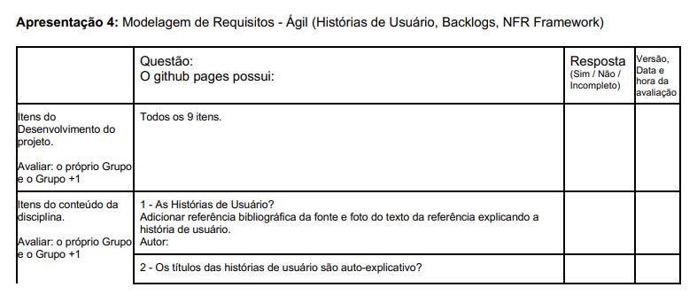
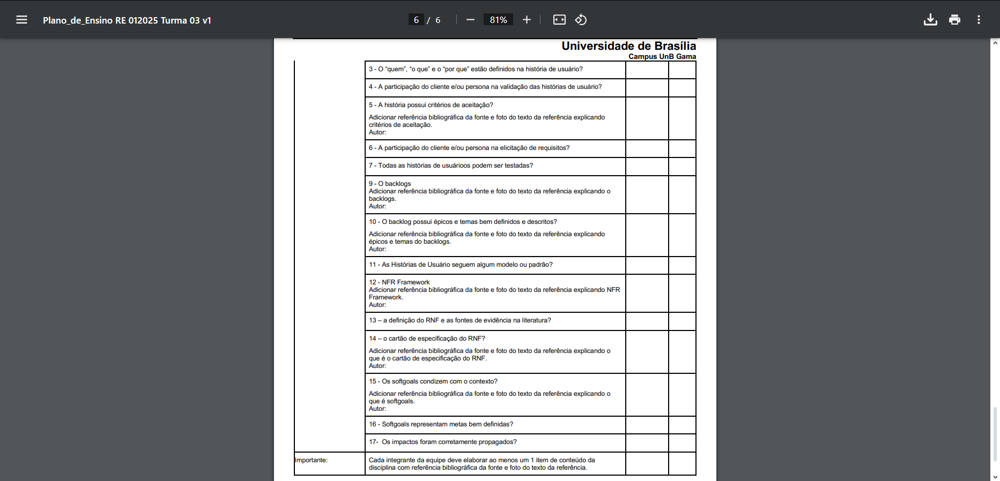

# Lista de Verificação - Entrega 4

## Introdução

Este documento apresenta uma lista de verificação criada para o [Grupo 4](https://github.com/Requisitos-de-Software/2025.1-Cadastro-Unico) e o Grupo+1 ([Grupo 5](https://github.com/Requisitos-de-Software/2025.1-IBGE)) referente a **Etapa 4** do projeto, com o objetivo de garantir que os artefatos iniciais estejam de acordo com os requisitos e especificações estabelecidas. O checklist foi sugerido pelo professor como uma ferramenta prática para confirmar que todas as etapas estão cumpridas corretamente antes de avançar para as fases seguintes.

## Funções dos autores

<strong>Tabela 1:</strong> Funções dos autores no artefato

| Nome                                              | Função                                                                  | 
|---------------------------------------------------|-------------------------------------------------------------------------|
|[Amanda Cruz](https://github.com/mandicrz) | Adição de itens do checklist de NFR Framework e revisão do artefato | 
|[Julia Gabriela](https://github.com/JuliaGabP) | Adição de itens do checklist de NFR Framework e revisão do artefato | 
|[João Pedro Costa](https://github.com/johnaopedro) |Criação da página; Desenvolvimento dos itens 1 a 15 na lista de verificação de historia de usuário; Desenvolvimento dos itens na lista de verificação da lista do professor de desenvolvimento do projeto e Conteudo da disciplina; | 
| [Gabriel Flores](https://github.com/Gabrielfcoelho) | Criação e adição de itens na lista de verificação de Backlog 1 a 12|
| [João Igor](https://github.com/JoaoPC10) | Desenvolvimento dos itens 16 a 26 na lista de verificação de historia de usuário |
| [Ryan Salles](https://github.com/RA-Salles) | Desenvolvimento dos itens 13 a 15 na lista de verificação de Backlog |

    Autor(es): 
    <a href="https://github.com/johnaopedro" target="_blank">João Pedro Costa</a>

## Checklist como Método de Verificação

O **checklist**, que significa **Lista de Verificação**, uma técnica importante durante a revisão das etapas do projeto, ajudando a garantir que cada parte esteja em conformidade com os requisitos estabelecidos. Para validar a eficácia e a completude do checklist, utilizaremos a técnica de **inspeção**, que consiste em uma revisão sistemática para verificar a clareza, relevância e aplicabilidade de cada item listado, tanto do nosso grupo quanto do grupo avaliado. Seu principal objetivo é:

- Identificar possíveis erros em qualquer parte do projeto.
- Verificar se o projeto atende aos requisitos especificados.
- Assegurar que o trabalho foi feito conforme os padrões e diretrizes definidas pelo professor.
- Garantir consistência e uniformidade.
- Facilitar o gerenciamento do projeto tornando-o mais organizado e controlado.

## Checklists - Entrega 4

As Tabelas 2 e 3 apresentam checklists para os elementos de desenvolvimento do projeto e conteúdo da disciplina, respectivamente, presentes no GitPages, garantindo que as etapas e os requisitos técnicos sejam atendidos de acordo com o **Plano de Ensino** do professor.

### Desenvolvimento do Projeto

<strong>Tabela 2:</strong> Checklist de Desenvolvimento do Projeto

| **ID** |                       **Item**                       |                                        **Referência**                                         |
| :----: | :--------------------------------------------------: | :-------------------------------------------------------------------------------------------: |
|  DS01  |         Padronização do Histórico de Versão          | BARROS, Andre. Plano de Ensino, RE-012025, Turma 3, p. 2. Aprender3. Acesso em: 01 de junho 2025. |
|  DS02  |          Autor e revisor para cada artefato          | BARROS, Andre. Plano de Ensino, RE-012025, Turma 3, p. 2. Aprender3. Acesso em: 01 de junho 2025. |
|  DS03  | Referências e/ou bibliografia em todos os artefatos  | BARROS, Andre. Plano de Ensino, RE-012025, Turma 3, p. 2. Aprender3. Acesso em: 01 de junho 2025. |
|  DS04  |    Legenda e fonte em todas as imagens e tabelas     | BARROS, Andre. Plano de Ensino, RE-012025, Turma 3, p. 2. Aprender3. Acesso em: 01 de junho 2025. |
|  DS05  |          Introdução do texto dos artefatos           | BARROS, Andre. Plano de Ensino, RE-012025, Turma 3, p. 2. Aprender3. Acesso em: 01 de junho 2025. |
|  DS06  | Cronograma executado além do inicialmente planejado  | BARROS, Andre. Plano de Ensino, RE-012025, Turma 3, p. 1. Aprender3. Acesso em: 01 de junho 2025. |
|  DS07  |                  Atas das reuniões                   | BARROS, Andre. Plano de Ensino, RE-012025, Turma 3, p. 2. Aprender3. Acesso em: 01 de junho 2025. |
|  DS08  |                Gravação das reuniões                 | BARROS, Andre. Plano de Ensino, RE-012025, Turma 3, p. 2. Aprender3. Acesso em: 01 de junho 2025. |
|  DS09  | Upload de apresentação no YouTube como não "listado" | BARROS, Andre. Plano de Ensino, RE-012025, Turma 3, p. 2. Aprender3. Acesso em: 01 de junho 2025. |

    Autor(es): <a href="https://github.com/mandicrz" target="_blank">Amanda Cruz</a>, <a href="https://github.com/johnaopedro" target="_blank">João Pedro Costa</a>

---

### Conteúdo da Disciplina

<strong>Tabela 3:</strong> Checklist de Conteúdo da Disciplina - Modelagem de Requisitos - Ágil

| **ID** |                       **Item**                       |                                        **Referência**                                         |
| :----: | :--------------------------------------------------: | :-------------------------------------------------------------------------------------------: |
|  CD01  |  Possui as Histórias de Usuário? | BARROS, Andre. Plano de Ensino, RE-012025, Turma 3, p. 4. Aprender3. Acesso em: 01 de junho 2025. |
|  CD02  |  Os títulos das histórias de usuário são auto-explicativo? | BARROS, Andre. Plano de Ensino, RE-012025, Turma 3, p. 5. Aprender3. Acesso em: 01 de junho 2025. |
|  CD03  | O “quem”, “o que” e o “por que” estão definidos na história de usuário? | BARROS, Andre. Plano de Ensino, RE-012025, Turma 3, p. 6. Aprender3. Acesso em: 01 de junho 2025. |
|  CD04  | A participação do cliente e/ou persona na validação das histórias de usuário? | BARROS, Andre. Plano de Ensino, RE-012025, Turma 3, p. 6. Aprender3. Acesso em: 01 de junho 2025. |
|  CD05  | A história possui critérios de aceitação? | BARROS, Andre. Plano de Ensino, RE-012025, Turma 3, p. 6. Aprender3. Acesso em: 01 de junho 2025. |
|  CD06  | A participação do cliente e/ou persona na elicitação de requisitos? | BARROS, Andre. Plano de Ensino, RE-012025, Turma 3, p. 6. Aprender3. Acesso em: 01 de junho 2025. |
|  CD07  | Todas as histórias de usuários podem ser testadas? | BARROS, Andre. Plano de Ensino, RE-012025, Turma 3, p. 6. Aprender3. Acesso em: 01 de junho 2025. |
|  CD08  | Existe o backlog? | BARROS, Andre. Plano de Ensino, RE-012025, Turma 3, p. 6. Aprender3. Acesso em: 01 de junho 2025. |
|  CD09  | O backlog possui épicos e temas bem definidos e descritos? | BARROS, Andre. Plano de Ensino, RE-012025, Turma 3, p. 6. Aprender3. Acesso em: 01 de junho 2025. |
|  CD10  | As Histórias de Usuário seguem algum modelo ou padrão? | BARROS, Andre. Plano de Ensino, RE-012025, Turma 3, p. 6. Aprender3. Acesso em: 01 de junho 2025. |
|  CD11  | Existe NFR Framework? | BARROS, Andre. Plano de Ensino, RE-012025, Turma 3, p. 6. Aprender3. Acesso em: 01 de junho 2025. |
|  CD12  | Existe uma definição do RNF e as fontes de evidência na literatura? | BARROS, Andre. Plano de Ensino, RE-012025, Turma 3, p. 6. Aprender3. Acesso em: 01 de junho 2025. |
|  CD13  | Existe um cartão de especificação do RNF? | BARROS, Andre. Plano de Ensino, RE-012025, Turma 3, p. 6. Aprender3. Acesso em: 01 de junho 2025. |
|  CD14  | Os softgoals condizem com o contexto? | BARROS, Andre. Plano de Ensino, RE-012025, Turma 3, p. 6. Aprender3. Acesso em: 01 de junho 2025. |
|  CD15  | Os softgoals representam metas bem definidas? | BARROS, Andre. Plano de Ensino, RE-012025, Turma 3, p. 6. Aprender3. Acesso em: 01 de junho 2025. |
|  CD16  | Os impactos foram corretamente propagados? | BARROS, Andre. Plano de Ensino, RE-012025, Turma 3, p. 6. Aprender3. Acesso em: 01 de junho 2025. |

    Autor(es): 
    <a href="https://github.com/johnaopedro" target="_blank">João Pedro Costa</a>

---

### Historia de Usuário

A Tabela 4 abaixo apresenta uma lista de verificação para as historias de usuário. O objetivo é garantir que todas as histórias estejam completas, claras e atendam aos critérios estabelecidos.

<strong>Tabela 4:</strong> Checklist - Historia de Usuário

| ID  | Tópico                             | Descrição                                                                 | Resposta (Sim/Não) | Referência | Autor |
|-----|------------------------------------|---------------------------------------------------------------------------|--------------------|------------|-------|
| 01  | Formato da História                | A história de usuário segue o formato “Como persona, quero ação”?         |                    | ATLASSIAN. *How to write user stories*. Disponível em: https://www.atlassian.com/agile/project-management/user-stories. Acesso em: 01 jun. 2025. | [João Pedro Costa](https://github.com/johnaopedro)|
| 02  | Valor ao Usuário                   | Está claro o valor para o usuário?                                        |                    | ATLASSIAN. *How to write user stories*. Disponível em: https://www.atlassian.com/agile/project-management/user-stories. Acesso em: 01 jun. 2025. | [João Pedro Costa](https://github.com/johnaopedro)|
| 03  | Clareza e Concisão                 | A história é curta e concisa?                                             |                    | ATLASSIAN. *How to write user stories*. Disponível em: https://www.atlassian.com/agile/project-management/user-stories. Acesso em: 01 jun. 2025. | [João Pedro Costa](https://github.com/johnaopedro)|
| 04  | Critérios de Aceitação             | Existem critérios de aceitação definidos?                                 |                    | ATLASSIAN. *How to write user stories*. Disponível em: https://www.atlassian.com/agile/project-management/user-stories. Acesso em: 01 jun. 2025. | [João Pedro Costa](https://github.com/johnaopedro)|
| 05  | Independência                      | A história é independente de outras?                                      |                    | SOMMERVILLE, Ian. *Engenharia de Software*. 10. ed. São Paulo: Pearson, 2019. | https://github.com/johnaopedro" t[João Pedro Costa](arget="_blank">João Pedro Cost)a</a> |
| 06  | Negociabilidade                    | A história é negociável, pode ser modificada em conversa?                 |                    | ATLASSIAN. *How to write user stories*. Disponível em: https://www.atlassian.com/agile/project-management/user-stories. Acesso em: 01 jun. 2025. | [João Pedro Costa](https://github.com/johnaopedro)|
| 07  | Testabilidade                      | A história é testável, pode-se verificar se foi completada?               |                    | ATLASSIAN. *How to write user stories*. Disponível em: https://www.atlassian.com/agile/project-management/user-stories. Acesso em: 01 jun. 2025. | [João Pedro Costa](https://github.com/johnaopedro)|
| 08  | Estimabilidade                     | Ela é estimável, é possível estimar tempo e esforço?                      |                    | ATLASSIAN. *How to write user stories*. Disponível em: https://www.atlassian.com/agile/project-management/user-stories. Acesso em: 01 jun. 2025. | [João Pedro Costa](https://github.com/johnaopedro)|
| 09  | Nome Padrão                        | O nome do documento possui nomenclatura padrão? (EU_000_NomeDaEstoria)    |                    | BRASIL. Ministério da Agricultura. *Lista de Verificação da Qualidade de Artefatos*. Disponível em: https://www.gov.br/agricultura/pt-br/acesso-a-informacao/licitacoes-e-contratos/edital/2019/pregao-eletronico-no-05-2018/diretrizes/lista-de-verificacao-da-qualidade-de-artefatos-checklist-agil.xls/view. Acesso em: 01 jun. 2025. | [João Pedro Costa](https://github.com/johnaopedro)|
| 10  | Formatação do Documento            | O documento possui formatação seguindo o template (título, estilo etc.)?   |                    | BRASIL. Ministério da Agricultura. *Lista de Verificação da Qualidade de Artefatos*. Disponível em: https://www.gov.br/agricultura/pt-br/acesso-a-informacao/licitacoes-e-contratos/edital/2019/pregao-eletronico-no-05-2018/diretrizes/lista-de-verificacao-da-qualidade-de-artefatos-checklist-agil.xls/view. Acesso em: 01 jun. 2025. | https://github.com/johnaopedro" ta[João Pedro Costa](rget="_blank">João Pedro Costa)</a> |
| 11  | Contextualização da História       | Existe relação entre as historias de usuário?                             |                    | COORDENAÇÃO GERAL DE TECNOLOGIA DA INFORMAÇÃO - CGTI. EU_xxx_Titulo_da_Estoria_de_Usuario: template para especificação de histórias de usuário. [S.l.]: CGTI, 2018. 5 p. Disponível em: <a href="../../../assets/modelagem/US/template_historia_de_usuario.pdf" target="_blank">História de Usuário</a>. Acesso em: 22 de maio 2025.| [João Pedro Costa](https://github.com/johnaopedro)|
| 12  | Criterio de aceite                 | Os criterios de aceite visão cenários?                                    |                    | COORDENAÇÃO GERAL DE TECNOLOGIA DA INFORMAÇÃO - CGTI. EU_xxx_Titulo_da_Estoria_de_Usuario: template para especificação de histórias de usuário. [S.l.]: CGTI, 2018. 5 p. Disponível em: <a href="../../../assets/modelagem/US/template_historia_de_usuario.pdf" target="_blank">História de Usuário</a>. Acesso em: 01 jun. 2025. | [João Pedro Costa](https://github.com/johnaopedro)|
| 13  | Linguagem do Usuário               | A linguagem utilizada na User Story é alinhada ao vocabulário do usuário, evitando termos técnicos desnecessários? |                    | CWI SOFTWARE. User stories: boas práticas, estruturação e dicas extras. CWI, 2023. Disponível em: https://cwi.com.br/blog/user-stories-estruturacao-e-dicas-extras/. Acesso em: 01 jun. 2025. | [João Pedro Costa](https://github.com/johnaopedro)|
| 14  | Riscos                            | Os riscos podem ser identificados na descrição?                           |                    | LinkedIn, 2023. Disponível em: https://www.linkedin.com/advice/0/how-do-you-estimate-user-story-risk-skills-agile-methodologies. Acesso em: 01 jun. 2025. | [João Pedro Costa](https://github.com/johnaopedro)|
| 15  | Refinamento                        | As historias muito grandes foram refinadas e divididas?                   |                    | LinkedIn, 2023. Disponível em: https://www.linkedin.com/advice/0/how-do-you-estimate-user-story-risk-skills-agile-methodologies. Acesso em: 01 jun. 2025. | [João Pedro Costa](https://github.com/johnaopedro)|
| 16  | Aceitação                          | Foi lida e aprovada por alguém fora da equipe?                            |                    | COHN, Mike. What Level of Detail Should Be Captured in a User Story?. Mountain Goat Software, 2016. Disponível em: https://www.mountaingoatsoftware.com/blog/what-level-of-detail-should-be-captured-in-a-user-story. Acesso em: 01 jun 2025. | João Igor |
| 17  | Linguagem vaga                     | Evita detalhamento em linguagem de usuário final? Ex: “fácil de usar” ou "bem rápido" |                    | COHN, Mike. What Level of Detail Should Be Captured in a User Story?. Mountain Goat Software, 2016. Disponível em: https://www.mountaingoatsoftware.com/blog/what-level-of-detail-should-be-captured-in-a-user-story. Acesso em: 01 jun 2025. | João Igor |
| 18  | Objetivo                           | Tem ligação com objetivo de negócio?                                      |                    | COHN, Mike. What Level of Detail Should Be Captured in a User Story?. Mountain Goat Software, 2016. Disponível em: https://www.mountaingoatsoftware.com/blog/what-level-of-detail-should-be-captured-in-a-user-story. Acesso em: 01 jun 2025. | João Igor |
| 19  | Complexidade                       | Nível de detalhe é proporcional à prioridade?                             |                    | COHN, Mike. What Level of Detail Should Be Captured in a User Story?. Mountain Goat Software, 2016. Disponível em: https://www.mountaingoatsoftware.com/blog/what-level-of-detail-should-be-captured-in-a-user-story. Acesso em: 01 jun 2025. | João Igor |
| 20  | Detalhamento                       | Omite detalhes irrelevantes para a entrega?  Ex: campos ou regras de negócio que não afetam a funcionalidade diretamente|                    | COHN, Mike. What Level of Detail Should Be Captured in a User Story?. Mountain Goat Software, 2016. Disponível em: https://www.mountaingoatsoftware.com/blog/what-level-of-detail-should-be-captured-in-a-user-story. Acesso em: 01 jun 2025. | João Igor |
| 21  | Objetivo                           | Foca na necessidade do usuário e não na solução técnica?                  |                    | COHN, Mike. What Level of Detail Should Be Captured in a User Story?. Mountain Goat Software, 2016. Disponível em: https://www.mountaingoatsoftware.com/blog/what-level-of-detail-should-be-captured-in-a-user-story. Acesso em: 01 jun 2025. | João Igor |
| 22  | Objetivo                           | Pode ser relacionada a uma métrica de sucesso?                            |                    | COHN, Mike. What Level of Detail Should Be Captured in a User Story?. Mountain Goat Software, 2016. Disponível em: https://www.mountaingoatsoftware.com/blog/what-level-of-detail-should-be-captured-in-a-user-story. Acesso em: 01 jun 2025. | João Igor |
| 23  | Aceitação                          | Os elementos internos da história são consistentes entre si?              |                    | COHN, Mike. What Level of Detail Should Be Captured in a User Story?. Mountain Goat Software, 2016. Disponível em: https://www.mountaingoatsoftware.com/blog/what-level-of-detail-should-be-captured-in-a-user-story. Acesso em: 01 jun 2025. | João Igor |
| 24  | Objetivo                           | A história não mistura diferentes objetivos ou ações?                     |                    | EASY AGILE. How to write good user stories in agile software development. Easy Agile Blog, 2022. Disponível em: https://www.easyagile.com/blog/how-to-write-good-user-stories-in-agile-software-development. Acesso em: 01 jun 2025. | João Igor |
| 25  | Objetivo                           | A funcionalidade proposta contribui para o objetivo geral do produto?     |                    | EASY AGILE. How to write good user stories in agile software development. Easy Agile Blog, 2022. Disponível em: https://www.easyagile.com/blog/how-to-write-good-user-stories-in-agile-software-development. Acesso em: 01 jun 2025. | João Igor |
| 26  | Objetivo                           | Foca no que o sistema deve fazer, e não em como a tela será desenhada?    |                    | EASY AGILE. How to write good user stories in agile software development. Easy Agile Blog, 2022. Disponível em: https://www.easyagile.com/blog/how-to-write-good-user-stories-in-agile-software-development. Acesso em: 01 jun 2025. | João Igor |

    Autor(es): 
    <a href="https://github.com/johnaopedro" target="_blank">João Pedro Costa</a>,
    <a href="https://github.com/JoaoPC10" target="_blank">João Igor</a>

---

### Backlog

A Tabela 5 abaixo apresenta uma lista de verificação para o Backlog. O objetivo é garantir que o Backlog esteja completo, claro e atenda aos critérios estabelecidos.

<strong>Tabela 5:</strong> Checklist - Backlog

| Item | Item de Verificação | Verificação | Referência |
|------|------------------------------------------------------------------------------------------------------|-------------|------------------------------------------------------------------------------------------------------------------------------------------|
| 1    | O Product Backlog está definido como uma lista de todas as funcionalidades desejadas para o produto?  |             | SERRANO, Milene; SERRANO, Maurício. Requisitos – Aula 15. Gama: Universidade de Brasília (UnB). Slide de apresentação.                  |
| 2    | Foi indicado que o Product Owner é o responsável por definir e priorizar o conteúdo do backlog?       |             | SERRANO, Milene; SERRANO, Maurício. Requisitos – Aula 15. Gama: Universidade de Brasília (UnB). Slide de apresentação.                  |
| 3    | Está claro que o Product Backlog não precisa estar completo no início do projeto?                     |             | SERRANO, Milene; SERRANO, Maurício. Requisitos – Aula 15. Gama: Universidade de Brasília (UnB). Slide de apresentação.                  |
| 4    | O documento indica que o backlog cresce e muda com o tempo, conforme o conhecimento do produto evolui?|             | SERRANO, Milene; SERRANO, Maurício. Requisitos – Aula 15. Gama: Universidade de Brasília (UnB). Slide de apresentação.                  |
| 5    | Os itens do Product Backlog são especificados utilizando as histórias de usuário?                     |             | SERRANO, Milene; SERRANO, Maurício. Requisitos – Aula 15. Gama: Universidade de Brasília (UnB). Slide de apresentação.                  |
| 6    | Os itens focam no "o que" deve ser feito, e não no "como"?                                            |             | SERRANO, Milene; SERRANO, Maurício. Requisitos – Aula 15. Gama: Universidade de Brasília (UnB). Slide de apresentação.                  |
| 7    | Está indicado que os itens podem ter critérios de aceitação?                                          |             | SERRANO, Milene; SERRANO, Maurício. Requisitos – Aula 15. Gama: Universidade de Brasília (UnB). Slide de apresentação.                  |
| 8    | A prioridade de execução está bem definida?                                                           |             | SERRANO, Milene; SERRANO, Maurício. Requisitos – Aula 15. Gama: Universidade de Brasília (UnB). Slide de apresentação.                  |
| 9    | O backlog utiliza Épicos?                                                                             |             | SERRANO, Milene; SERRANO, Maurício. Requisitos – Aula 15. Gama: Universidade de Brasília (UnB). Slide de apresentação.                  |
| 10   | Os épicos são divididos em histórias de usuários mais detalhadas?                                     |             | SERRANO, Milene; SERRANO, Maurício. Requisitos – Aula 15. Gama: Universidade de Brasília (UnB). Slide de apresentação.                  |
| 11   | Há exemplos ou explicações de como Epics e User Stories são utilizados?                               |             | SERRANO, Milene; SERRANO, Maurício. Requisitos – Aula 15. Gama: Universidade de Brasília (UnB). Slide de apresentação.                  |
| 12   | O Product Backlog está conectado à modelagem de requisitos de maneira iterativa e incremental?        |             | SERRANO, Milene; SERRANO, Maurício. Requisitos – Aula 15. Gama: Universidade de Brasília (UnB). Slide de apresentação.                  |
| 13     | Os épicos possuem features relacionadas?                                                            |             | JAMES, Michael; WALTER, Luke. SCRUM REFERENCE CARD.                                                                                     |
| 14     | Os épicos são rastreáveis para com as estórias de usuário?                                          |             | JAMES, Michael; WALTER, Luke. SCRUM REFERENCE CARD.                                                                                     |
| 15     | Os itens mais próximos do topo do backlog estão suficientemente granulares para serem passíveis de implementação em apenas uma sprint |    | JAMES, Michael; WALTER, Luke. SCRUM REFERENCE CARD.                                                                 | 

    Autor(es): 
    <a href="https://github.com/Gabrielfcoelho" target="_blank">Gabriel Flores, </a>
    <a href="https://github.com/RA-Salles" target="_blank">Ryan Salles</a>

---

### NFR Framework
A Tabela 6 abaixo apresenta uma lista de verificação para o artefato NFR Framework. O objetivo é garantir que o NFR esteja completo, claro e atenda aos critérios estabelecidos.

<strong>Tabela 6:</strong> Checklist - NFR Framework 

| **ID** |                       **Item**                       |                                        **Referência**                                         |**Autor**|
| :----: | :--------------------------------------------------: | :-------------------------------------------------------------------------------------------: | :-----: |
|   1    | Os três tipos de softgoals (NFR, Operacionalização, Afirmação) foram devidamente identificados e representados no SIG com suas notações gráficas específicas (ex: nuvens claras, grossas, tracejadas)? | SILVA, Reinaldo Antônio da. NFR4ES: Um Catálogo de Requisitos Não-Funcionais para Sistemas Embarcados, P. 31, Seção 2.4.3. UFPE, 2019. | [Amanda Cruz](https://github.com/mandicrz) |
|   2    | Os softgoals foram detalhados através dos tipos de refinamentos apropriados (ex: decomposição, priorização) para derivar sub-softgoals mais específicos? | SILVA, Reinaldo Antônio da. NFR4ES: Um Catálogo de Requisitos Não-Funcionais para Sistemas Embarcados, P. 32 e 33, Seção 2.4.4.1. UFPE, 2019. | [Amanda Cruz](https://github.com/mandicrz) |
|   3    | As relações de impacto entre softgoals (pai-filho) foram modeladas usando os diversos tipos de contribuições (AND, OR, MAKE, etc.)? | SILVA, Reinaldo Antônio da. NFR4ES: Um Catálogo de Requisitos Não-Funcionais para Sistemas Embarcados, P. 34-37, Seção 2.4.4.2. UFPE, 2019. | [Amanda Cruz](https://github.com/mandicrz) |
|   4    | Foram atribuídos rótulos de avaliação (propagação de impactos) aos softgoals para indicar seu status após a análise do SIG? | SILVA, Reinaldo Antônio da. NFR4ES: Um Catálogo de Requisitos Não-Funcionais para Sistemas Embarcados, P. 38, Seção 2.4.5. UFPE, 2019. | [Amanda Cruz](https://github.com/mandicrz) |
|   5    | Os Requisitos Não-Funcionais (RNFs) centrais do projeto foram capturados e representados como softgoals desde o início? | SILVA, Reinaldo Antônio da. NFR4ES: Um Catálogo de Requisitos Não-Funcionais para Sistemas Embarcados, P. 30, Seção 2.4.1. UFPE, 2019. | [Amanda Cruz](https://github.com/mandicrz) |
|   6    | Foi construído o SIG para visualizar os softgoals, suas inter-relações e o racional de design do sistema? | SILVA, Reinaldo Antônio da. NFR4ES: Um Catálogo de Requisitos Não-Funcionais para Sistemas Embarcados, P. 30 e 31, Seção 2.4.1 e 2.4.2. UFPE, 2019. | [Amanda Cruz](https://github.com/mandicrz) |
|   7    | Cada softgoal NFR possui seu "tipo" (a qualidade NFR, ex: Confiabilidade) e "tópico" (o objeto da qualidade) claramente definidos para especificar seu escopo? | SILVA, Reinaldo Antônio da. NFR4ES: Um Catálogo de Requisitos Não-Funcionais para Sistemas Embarcados, P. 32, Seção 2.4.3. UFPE, 2019. | [Amanda Cruz](https://github.com/mandicrz) |
|   8    | O SIG registra explicitamente as decisões de desenvolvimento tomadas, as alternativas consideradas e as justificativas para as escolhas feitas? | SILVA, Reinaldo Antônio da. NFR4ES: Um Catálogo de Requisitos Não-Funcionais para Sistemas Embarcados, P. 30 e 31, Seção 2.4.2. UFPE, 2019. | [Amanda Cruz](https://github.com/mandicrz) |
|   9    | Os softgoals NFR estão organizados de forma hierárquica dentro do SIG? | SILVA, Reinaldo Antônio da. NFR4ES: Um Catálogo de Requisitos Não-Funcionais para Sistemas Embarcados, P. 31, Seção 2.4.3. UFPE, 2019. | [Amanda Cruz](https://github.com/mandicrz) |
|  10    | Para cada softgoal NFR importante, foram identificadas e representadas no SIG uma ou mais soluções de implementação (softgoals de operacionalização) que buscam atendê-lo? | SILVA, Reinaldo Antônio da. NFR4ES: Um Catálogo de Requisitos Não-Funcionais para Sistemas Embarcados, P. 31, Seção 2.4.3. UFPE, 2019. | [Amanda Cruz](https://github.com/mandicrz) |
| 11 | Foram colocadas legendas e rótulos para as contribuições e contribuição dos NFRs? |SILVA, Reinaldo Antônio da. NFR4ES: Um Catálogo de Requisitos Não-Funcionais para Sistemas Embarcados. UFPE, 2019. | [JuliaGabP](https://github.com/JuliaGabP) |
| 12 | Os requisitos utilizados para a criação dos NFRs foram apenas os não funcionais? | SILVA, Reinaldo Antônio da. NFR4ES: Um Catálogo de Requisitos Não-Funcionais para Sistemas Embarcados. UFPE, 2019 | [JuliaGabP](https://github.com/JuliaGabP) |
| 13 | Foram feitas explicações e criação de legendas para os rótulos do NFR? | SILVA, Reinaldo Antônio da. NFR4ES: Um Catálogo de Requisitos Não-Funcionais para Sistemas Embarcados. UFPE, 2019| [JuliaGabP](https://github.com/JuliaGabP) |
| 14 | Cada NFR está claramente associado a pelo menos uma necessidade do sistema ou do usuário? | SILVA, Reinaldo Antônio da. NFR4ES: Um Catálogo de Requisitos Não-Funcionais para Sistemas Embarcados. UFPE, 2019 | [JuliaGabP](https://github.com/JuliaGabP) |
| 15 | Foi utilizada uma taxonomia (ex: desempenho) para classificar os NFRs? |SILVA, Reinaldo Antônio da. NFR4ES: Um Catálogo de Requisitos Não-Funcionais para Sistemas Embarcados. UFPE, 2019 | [JuliaGabP](https://github.com/JuliaGabP) |
| 16 | Os NFRs estão descritos de forma mensurável, evitando termos vagos como "rápido" ou "seguro"? | SILVA, Reinaldo Antônio da. NFR4ES: Um Catálogo de Requisitos Não-Funcionais para Sistemas Embarcados. UFPE, 2019 | [JuliaGabP](https://github.com/JuliaGabP) |
| 17 | Os NFRs foram validados com as partes interessadas? | SILVA, Reinaldo Antônio da. NFR4ES: Um Catálogo de Requisitos Não-Funcionais para Sistemas Embarcados. UFPE, 2019| [JuliaGabP](https://github.com/JuliaGabP) |
| 18 | Os NFRs estão documentados separadamente dos requisitos funcionais, mas com rastreabilidade entre eles? | SILVA, Reinaldo Antônio da. NFR4ES: Um Catálogo de Requisitos Não-Funcionais para Sistemas Embarcados. UFPE, 2019 | [JuliaGabP](https://github.com/JuliaGabP) |
| 19 | Há explicação ou justificativa clara para a priorização de cada NFR? |SILVA, Reinaldo Antônio da. NFR4ES: Um Catálogo de Requisitos Não-Funcionais para Sistemas Embarcados. UFPE, 2019 | [JuliaGabP](https://github.com/JuliaGabP) |
| 20 | Foram identificados e descritos possíveis conflitos entre NFRs e como eles foram resolvidos? | SILVA, Reinaldo Antônio da. NFR4ES: Um Catálogo de Requisitos Não-Funcionais para Sistemas Embarcados. UFPE, 2019| [JuliaGabP](https://github.com/JuliaGabP) |

    Autor(es): <a href="https://github.com/mandicrz" target="_blank">Amanda Cruz</a>,
                <a href="https://github.com/JuliaGabP" target="_blank">Julia Gabriela</a>

## Referências

As referências das Tabelas 2 e 3 tiveram como referência as Figuras 1 a 4.

> BARROS, André. Plano de Ensino, RE-012025, Turma 3. Disponível em: <https://aprender3.unb.br/pluginfile.php/3106711/mod_resource/content/55/Lista%20de%20Verifificac%CC%A7a%CC%83o%20-%20Plano_de_Ensino%20RE%20012025%20Turma%2003%20v1.pdf>. Acesso em: 01 junho 2025.

<strong>Figura 1:</strong> Lista de Verificação - Desenvolvimento (DS01 - DS09)

<strong>Fonte:</strong> André Barros, 2025

<strong>Figura 2:</strong> Lista de Verificação - Planejamento (CD01)

<strong>Fonte:</strong> André Barros, 2025

<strong>Figura 3:</strong> Lista de Verificação - Planejamento (CD01-CD02)

<strong>Fonte:</strong> André Barros, 2025

<strong>Figura 4:</strong> Lista de Verificação - Planejamento (CD03-CD16)

<strong>Fonte:</strong> André Barros, 2025

> ATLASSIAN. How to write user stories. Disponível em: <https://www.atlassian.com/agile/project-management/user-stories>. Acesso em: 01 jun. 2025.  

> SOMMERVILLE, Ian. Engenharia de Software. 9. ed. São Paulo: Pearson, 2011.  

> BRASIL. Ministério da Agricultura. Lista de Verificação da Qualidade de Artefatos. Disponível em: <https://www.gov.br/agricultura/pt-br/assuntos/tecnologia-da-informacao/arquivos/Lista_de_Verificacao_da_Qualidade_de_Artefatos.xls/view>. Acesso em: 01 jun. 2025.  

> SERRANO, Milene; SERRANO, Maurício. Requisitos – Aula 15. Gama: Universidade de Brasília (UnB). Slide de apresentação. Acesso em 01 jun. 2025.

> CWI SOFTWARE. User stories: boas práticas, estruturação e dicas extras. CWI, 2023. Disponível em: <https://cwi.com.br/blog/user-stories-estruturacao-e-dicas-extras/>. Acesso em: 01 jun. 2025.

> COHN, Mike. What Level of Detail Should Be Captured in a User Story?. Mountain Goat Software, 2016. Disponível em: <https://www.mountaingoatsoftware.com/blog/what-level-of-detail-should-be-captured-in-a-user-story>. Acesso em: 01 jun 2025.

> EASY AGILE. How to write good user stories in agile software development. Easy Agile Blog, 2022. Disponível em: <https://www.easyagile.com/blog/how-to-write-good-user-stories-in-agile-software-development>. Acesso em: 01 jun 2025.

> LinkedIn. How do you estimate user story risk skills in agile methodologies?. Disponível em: <https://www.linkedin.com/advice/0/how-do-you-estimate-user-story-risk-skills-agile-methodologies>. Acesso em: 01 jun 2025.

> SILVA, Reinaldo Antônio da. NFR4ES: Um Catálogo de Requisitos Não-Funcionais para Sistemas Embarcados, P. 31, Seção 2.4.3. UFPE, 2019. Disponível em: <https://repositorio.ufpe.br/handle/123456789/34150>. Acesso em: 01 jun.

> COORDENAÇÃO GERAL DE TECNOLOGIA DA INFORMAÇÃO - CGTI. EU_xxx_Titulo_da_Estoria_de_Usuario: template para especificação de histórias de usuário. [S.l.]: CGTI, 2018. 5 p. Disponível em: <a href="../../../assets/modelagem/US/template_historia_de_usuario.pdf" target="_blank">História de Usuário</a>. Acesso em: 22 de maio 2025.

> JAMES, Michael; WALTER, Luke. SCRUM REFERENCE CARD. Disponível em: <https://aprender3.unb.br/pluginfile.php/3096147/mod_resource/content/1/RE%20-%20Aula%2015%20-%20Materiais.zip?forcedownload=1>. Acesso em: 01/06/2025

## Histórico de Versão

| Versão |    Data    |    Descrição     |         Autor         |       Revisor      |
| :----: | :--------: | :--------------: | :-------------------: | :----------------: |
|  1.0   | 01/06/2025 | Criando a pagina  | [João Pedro Costa](https://github.com/johnaopedro) | [Ryan Salles](https://github.com/RA-Salles)      | 
|  1.1   | 01/06/2025 | Adicionando lista de verificação de historia de usuário  | [João Pedro Costa](https://github.com/johnaopedro) | [Amanda Cruz](https://github.com/mandicrz)       | 
|  1.2  | 01/06/2025 | Adicionando lista de verificação do professor  | [João Pedro Costa](https://github.com/johnaopedro) | [Amanda Cruz](https://github.com/mandicrz)       |
| 1.3 | 01/06/2025 |Adicionando itens de verificação de Backlog | [Gabriel Flores](https://github.com/Gabrielfcoelho) | [Ryan Salles](https://github.com/RA-Salles)   |
| 1.4 | 01/06/2025 |Adicionando itens de verificação de NFR Framework | [Amanda Cruz](https://github.com/mandicrz) | [João Pedro Costa](https://github.com/johnaopedro) |
