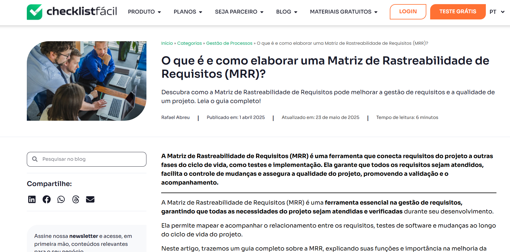

# Lista de Verificação - Entrega 6

## Introdução

Este documento apresenta uma lista de verificação criada para o [Grupo 4](https://github.com/Requisitos-de-Software/2025.1-Cadastro-Unico) e o Grupo+1 ([Grupo 5](https://github.com/Requisitos-de-Software/2025.1-IBGE)) referente a **Etapa 6** do projeto, com o objetivo de garantir que os artefatos iniciais estejam de acordo com os requisitos e especificações estabelecidas. O checklist foi sugerido pelo professor como uma ferramenta prática para confirmar que todas as etapas estão cumpridas corretamente antes de avançar para as fases seguintes.

## Funções dos autores

<strong>Tabela 1:</strong> Funções dos autores no artefato

| Nome                                              | Função                                                                  | 
|---------------------------------------------------|-------------------------------------------------------------------------|
|[Amanda Cruz](https://github.com/mandicrz) || 
| [Gabriel Flores](https://github.com/Gabrielfcoelho) | |
| [João Igor](https://github.com/JoaoPC10) | |
|[João Pedro Costa](https://github.com/johnaopedro) || 
|[Julia Gabriela](https://github.com/JuliaGabP) | Criação da página; Adição de 5 itens para verificação da matriz geral | 
| [Ryan Salles](https://github.com/RA-Salles) | |

    Autor(es): 
    <a href="https://github.com/JuliaGabP" target="_blank">Julia Gabriela</a>

## Checklist como Método de Verificação

O **checklist**, que significa **Lista de Verificação**, uma técnica importante durante a revisão das etapas do projeto, ajudando a garantir que cada parte esteja em conformidade com os requisitos estabelecidos. Para validar a eficácia e a completude do checklist, utilizaremos a técnica de **inspeção**, que consiste em uma revisão sistemática para verificar a clareza, relevância e aplicabilidade de cada item listado, tanto do nosso grupo quanto do grupo avaliado. Seu principal objetivo é:

- Identificar possíveis erros em qualquer parte do projeto.
- Verificar se o projeto atende aos requisitos especificados.
- Assegurar que o trabalho foi feito conforme os padrões e diretrizes definidas pelo professor.
- Garantir consistência e uniformidade.
- Facilitar o gerenciamento do projeto tornando-o mais organizado e controlado.

## Checklists - Entrega 4

A Tabela 2 apresenta p checklist para os elementos de desenvolvimento do projeto e conteúdo da disciplina, respectivamente, presentes no GitPages, garantindo que as etapas e os requisitos técnicos sejam atendidos de acordo com o **Plano de Ensino** do professor.

### Matriz Geral
A Tabela 2, abaixo, apresenta uma lista de verificação para o artefato Matriz Geral. O objetivo é garantir que a Matriz esteja completa, clara e atenda aos critérios estabelecidos.

<strong>Tabela 1:</strong> Checklist - Matriz Geral 

| **ID** |                       **Item**                       |                                        **Referência**                                         |**Autor**|
| :----: | :--------------------------------------------------: | :-------------------------------------------------------------------------------------------: | :-----: |
| 1 | Todos os requisitos estão claramente identificados com um ID único e descrição objetiva? | ASANA. Crie um modelo de matriz de rastreabilidade de requisitos [2022]. | [Julia Gabriela](https://github.com/JuliaGabP) |
| 2 | A matriz estabelece vínculo entre requisitos e artefatos de origem? | ASANA. Crie um modelo de matriz de rastreabilidade de requisitos [2022]. | [Julia Gabriela](https://github.com/JuliaGabP) |
| 3 | Há indicação clara do status de implementação? | SIRE, T. What is Requirements Traceability Matrix (RTM) - A Comprehensive Guide with Examples. | [Julia Gabriela](https://github.com/JuliaGabP) |
| 4 | A matriz permite rastrear os requisitos até suas fontes e/ou até suas implementações? | SIRE, T. What is Requirements Traceability Matrix (RTM) - A Comprehensive Guide with Examples. | [Julia Gabriela](https://github.com/JuliaGabP) |
| 5 | Foram utilizados hiperlinks ou referências funcionais para facilitar a navegação entre os requisitos e os documentos de suporte? | ABREU, R. O que é Matriz de Rastreabilidade de Requisitos (MRR)?> | [Julia Gabriela](https://github.com/JuliaGabP) |

    Autor(es): <a href="https://github.com/JuliaGabP" target="_blank">Julia Gabriela</a>

## Bibliografia
> ASANA. Crie um modelo de matriz de rastreabilidade de requisitos [2022]. Disponível em: <https://asana.com/pt/templates/requirements-traceability-matrix>.

    

> SIRE, T. What is Requirements Traceability Matrix (RTM) - A Comprehensive Guide with Examples. Disponível em: <https://www.requiment.com/requirements-traceability-matrix-rtm-guide/>.

    

> ABREU, R. O que é Matriz de Rastreabilidade de Requisitos (MRR)? Disponível em: <https://checklistfacil.com/blog/matriz-de-rastreabilidade-de-requisitos/>. Acesso em: 5 jun. 2025.

‌

    

## Histórico de Versão

| Versão |    Data    |    Descrição     |         Autor         |       Revisor      |
| :----: | :--------: | :--------------: | :-------------------: | :----------------: |
|  1.0   | 05/06/2025 | Criando a pagina  | [Julia Gabriela](https://github.com/JuliaGabP) |[João Pedro Costa](https://github.com/johnaopedro)     | 
